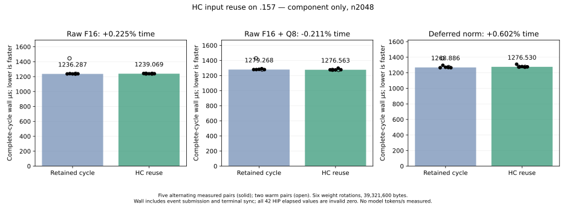

<!-- SPDX-License-Identifier: MIT -->
# HC injection reuse: complete-cycle qualification

The new no-model component completes on `.157` on 2026-10-06. It does not
establish a robust speedup: raw-F16 time changes **+0.224988%**, raw-F16 with
Q8 **−0.211436%**, and deferred norm **+0.602352%**. Preserve the marginal Q8
result and every numerical failure; no production route is adopted.

The unchanged original-model point remains **1585.308983 PP /25.16079073 TG**,
against fixed UD **1685.777092 PP /24.34174251 TG**. Closing the fixed PP gap
requires **76.991736ms** less prefill time, or **6.337447%** more throughput.
This component has no model tokens/s, task-quality result or full-context curve.

## Exact scope and complete timings

The frozen component-only plan has no model arms. It tests the actual retained
raw-F16/raw-Q8/deferred implementations against the private reuse draft,
including producer work, compact-dot write/read, and final injection reduction.
For n2048, six rotating weight sets total39,321,600 bytes, exceeding the32MiB
MALL capacity. Each pair alternates order. Two warmups are excluded from the
five measured medians; all samples remain below and in the CSV.

Durations are **monotonic complete-cycle wall microseconds**. They include HIP
event submission and terminal synchronization. All42 HIP elapsed values are
zero, with raw binary32 bits0; they are invalid and preserved. These wall
durations are neither pure GPU kernel timings nor the fixed model benchmark.

| Pair | Raw retained | Raw reuse | Raw-Q8 retained | Raw-Q8 reuse | Deferred retained | Deferred reuse |
| --- | ---: | ---: | ---: | ---: | ---: | ---: |
| Warm0 |1445.040167|1239.918667|1428.122333|1275.749500|1385.753333|1277.074333|
| Warm1 |1238.920333|1239.273667|1278.879333|1274.812833|1274.442833|1276.714500|
| Measured2 |1236.103833|1242.175333|1279.266000|1276.562833|1265.033167|1310.301833|
| Measured3 |1239.933667|1240.340333|1279.267667|1275.294500|1296.257333|1275.169500|
| Measured4 |1236.287167|1238.635333|1282.406000|1274.854333|1271.159667|1280.219333|
| Measured5 |1235.750500|1239.068667|1290.744000|1297.722333|1268.886333|1273.332833|
| Measured6 |1237.662000|1239.020500|1278.886000|1277.397667|1265.171333|1276.529500|
| Measured median |1236.287167|1239.068667|1279.267667|1276.562833|1268.886333|1276.529500|
| Reuse time change | |+0.224988%| |−0.211436%| |+0.602352%|

[All42 timing records, including actual execution order and invalid HIP values](figures/q2-hc-inject-reuse.csv).

## Whole-output and arithmetic findings

All42 cases and57 replay sets are audited. Of200 output records,140 are exact:
57 mixed-F32,57 half,19 Q8 and seven post-timing records. The other60 records
are57 injection outputs and three post-injection outputs. Every guard,
written-output and finite check is safe. All57 logged scratch checks and19
logged Q8 checks pass; the fixture's additional unlogged post-timing checks
do not introduce a separate failure. All immutable inputs/weights verify.

Full arrays are preserved for all60 differences. Maximum absolute error is
4.76837158203125e−7; maximum relative L2 error is1.0118641799904529e−7. Large
ULP distances near cancellation are not a standalone damage criterion. At
n2048, the raw/raw-Q8 post-injection relative L2 is9.951345371e−8, while the
deferred value is7.596611110e−8. Full-model harmlessness remains unproven.

Inspection of the pinned original raw-injection ISA finds `q.y*v.y` as the
first rounded product, followed by the FMA `q.x*v.x`; the explicit private
draft does `x` then `y`. Consequently, reproducing source loop order does
not reproduce this original fast-math contraction. This is a concrete
arithmetic discrepancy, not a complete causal proof for all60 saved arrays.
The [saved-array and ISA audit](../config/q2-hc-inject-reuse-difference-audit.json)
binds both assemblies/operands and quantifies the full outputs. No tolerance,
oracle, golden array, model weight or quality verdict is changed.

## Unchanged model comparison

These are saved original-model results, not new component rates. The exact2048
input,128 outputs/127 timed decode calls, capacity9216, chunk2048, C1 greedy,
MTP-off, one warmup/three measurements and outside-timer pauses stay fixed.
No previously qualified Q2/UD comparator is rebuilt or rerun.

| Measured sample | Fixed Q2 PP / TG | Saved best PP / TG | Fixed UD PP / TG |
| --- | ---: | ---: | ---: |
|1|1443.398207 /25.10565683|1586.342395 /25.17262901|1686.364042 /24.34621613|
|2|1443.672867 /25.08698337|1584.079076 /25.16079073|1685.777092 /24.34174251|
|3|1443.841794 /25.09595499|1585.308983 /25.15297051|1685.400011 /24.15102104|
|Measured median|1443.672867 /25.09595499|1585.308983 /25.16079073|1685.777092 /24.34174251|

Saved-best warmup:1586.508538 PP /25.13300114 TG. [All original-model values
and exact benchmark contracts](Q2-SSM-FIXED-BOUNDS.md).

## Actual command and ownership closure

Current host checks pass35/35 Debug and35/35 ASan/UBSan on `.157`, with twelve
focused HC regression methods. The original failed whitelist run remains
preserved and is retired separately. The frozen plan binds130 actual tested
fixtures, six manifests and the unchanged1027-file parent.

The GPU component terminates06:14:32.867823UTC with actual configure/build/run
exits **[0,0,1]**. Exit1 is the safe exactness rejection above; it preserves all
timings and120 differing arrays. It is not a build, guard or device fault.
All124 artifacts are collected and hash-verified before release.

Release at **06:15:12.481241UTC**, SHA
`dcb9d12ad196f37fe25b3c8a392735823f028bca953059f2148f0068b708e63e`,
retires1377 identities/1102 groups. KFD is empty, the four original GPU leases
and Core CPU lease remain unchanged/free, seven model stat tuples are unchanged,
and canonical/main/remote mirrors agree. Core receives closure before local
analysis. No job/build/lease/window/waiter/reservation/restart or remote cleanup
remains. Further GPU work requires a fresh coordinated admission from this
release.

Next qualify the independent four-owner RMS finishing step on the complete
ordinary/MoE outputs. Injection reuse remains a marginal experiment; its
proposed borrowed `down_e` workspace is not integrated or lifetime-qualified.
No model arm is implicitly authorized by this component-only plan. Q4, old
control reruns and the full curve stay deferred until the agreed fixed gap closes.

[Component results](../config/q2-hc-inject-reuse-component-results.json),
[frozen plan](../config/q2-hc-inject-reuse-plan.json),
[admission](../config/q2-hc-inject-reuse-window-admission.json),
[release](../config/q2-hc-inject-reuse-window-release.json).
