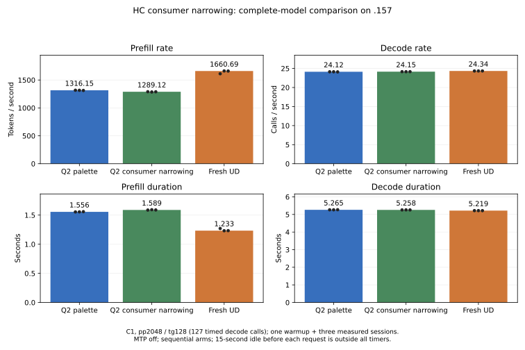

<!-- SPDX-License-Identifier: MIT -->
# HC input narrowing inside the consumer

The `.157` complete-model comparison rejects this candidate: prefill falls
**1316.149 -> 1289.116 tokens/s (-2.05%)**, although all 21 saved reference and
candidate output files are byte-exact. The synthetic complete HC input and
down-projection path improves **1907.280 -> 1786.319 us (-6.34%)**, with every
alternating pair faster, but that gain does not survive model integration.
The selected palette source remains unchanged; fresh UD reaches 1660.690
prefill tokens/s. The Q2/UD parity objective remains open.

All ten new component output pairs are byte-exact and the original 22 controls
are unchanged. One additional FP64 case fails on both identical paths; its
threshold and actual failure remain. No numerical limit is relaxed.

## Mechanism and measured scope

The [current profile](Q2-PREFILL-GAP.md) includes 61.903 ms in 193 F16 narrowing
calls during 2K prefill. An earlier [producer-side norm copy](Q2-HC-NORM-FUSION.md)
removed most of those calls but moved their cost into the following projection,
so its complete-model result regressed. This candidate changes the consumer
instead: the HC down kernel loads the existing F32 norm and performs the same
round-to-nearest F16 conversion before staging each operand in LDS. It avoids
writing and rereading a complete persistent F16 tensor at this boundary.

Original F16 weights, the 64-row/128-token macro-tile, five-row grouping, both
ordered K16 accumulation chains and their final F32 addition remain. The change
applies only to the existing raw-F16 mixer route, M320/K10240, at 96 or more
rows under its existing capacity guards. The F32 norm remains alive for mixing
and injection. Other projections, scalar decode, the later half-input cache
invalidation and the fused HC up producer retain their existing behavior.
No model conversion, new allocation, thread, synchronization policy, public C
ABI or reactive scheduler change is introduced. Existing scratch is still
allocated for its other consumers; no memory-capacity saving is claimed.

Each row-tile block now reads F32 input and repeats narrowing in its load stage.
That additional read/conversion work could offset the removed global pass.
This is why the comparison times **narrowing plus projection** against the
fused consumer, rather than comparing GEMMs with different preparation scopes.

`tests/q2_hc_input.cpp` retains the original 22 independent HC cases and adds
ten input-path comparisons: n96/97/127/128/129/257/2048, tiny and alternating
values, identical repeated rows, F16 halfway values, subnormals and signed zero.
Both input allocations end at the last live element, including partial tiles.
Every output is finite/written and guarded; source input bytes are unchanged.
The separate GPU narrowing is compared with independent host IEEE conversion
over every input. Unsupported n0/1/95 and null storage refuse before launch and
leave completed output unchanged. Full reference/candidate output buffers are
retained. Sampled FP64 dot products use the rounded operands and the original
2e-5 relative-RMS/error-over-peak limits.

All ten complete output pairs agree bit for bit, as do five post-timing replays.
The original 22 sampled-oracle records, complete-output hashes and 44 saved
coordinate/value files reproduce the preceding native control exactly. The
new n129/p1 case has RMS **1.755758e-5** and error/peak **2.172146e-5**: the latter
fails the existing 2e-5 limit. Because both complete outputs are identical,
the same error applies to the separate reference. This is an additional failing
test case, not a newly observed difference between implementations. It remains
a failure, alongside the four unchanged original library-control failures.
The synthetic command retains actual exit 1; no tolerance or expected output
is altered. Identical-input rows remain position invariant.

## Component performance

The benchmark rotates sixteen independent F16 weight matrices over 100 MiB.
Both arms use the same F32 input, 2048 rows and original M320/K10240 projection.
After warming every matrix, five pairs alternate which arm runs first. Each
GPU-event interval includes sixteen projections; the separate arm also includes
each required narrowing launch. Allocation, transfers, FP64 oracle work and
output comparisons are outside timing. The input tensor itself exceeds the
32 MiB cache size used by the inherited benchmark protocol.

| Pair | First arm | Separate us | Consumer conversion us | Fused / separate time |
|---|---|---:|---:|---:|
| 1 | Separate | 1969.424844 | 1859.267950 | 0.944066 |
| 2 | Fused | 1979.076028 | 1757.809520 | 0.888197 |
| 3 | Separate | 1907.280445 | 1786.318779 | 0.936579 |
| 4 | Fused | 1883.031130 | 1815.310478 | 0.964036 |
| 5 | Separate | 1899.970651 | 1726.617932 | 0.908760 |

The unchanged plain HC up control measures 959.029 us median, range
935.267–963.169 us. [The full report](../config/q2-hc-input-results.json)
preserves each timing, complete-output hash and numerical check. This is
component evidence with a same-process reference; it does not establish
request throughput, serving concurrency or a model-quality result.

## Complete-model performance

All three sources receive a full MMQ rebuild. Each arm uses original weights,
MTP off, maximum context 9216, one 2048-token prefill chunk, 128 output tokens
and 127 timed decode calls. One warmup precedes three measured sessions. The
15-second pause before each session, loading and warmup are outside reported
timings. EOS behavior is preserved; no sample terminates early.

| Arm | Prefill tokens/s, median | Decode calls/s, median | Prefill s, median | Decode s, median |
|---|---:|---:|---:|---:|
| Selected Q2 palette | 1316.149464 | 24.12195698 | 1.556054275 | 5.264912797 |
| Q2 consumer narrowing | 1289.116329 | 24.15272232 | 1.588685175 | 5.258206437 |
| Fresh pristine UD | 1660.689879 | 24.33611299 | 1.233222425 | 5.218581950 |

The candidate adds 32.631 ms to median prefill and remains 22.37% below UD's
prefill rate. Decode differs by +0.13% from reference on an unchanged scalar
path; this short sequential comparison does not establish a causal decode
gain. The selected reference remains below UD and is not a parity result.

| Arm | Measured session | Prefill tokens/s | Decode calls/s | Prefill s | Decode s |
|---|---:|---:|---:|---:|---:|
| Palette | 1 | 1317.124474 | 24.12195698 | 1.554902396 | 5.264912797 |
| Palette | 2 | 1316.149464 | 24.12442817 | 1.556054275 | 5.264373484 |
| Palette | 3 | 1313.402914 | 24.09500714 | 1.559308251 | 5.270801509 |
| Consumer narrowing | 1 | 1290.582075 | 24.15272232 | 1.586880865 | 5.258206437 |
| Consumer narrowing | 2 | 1285.566053 | 24.14110924 | 1.593072558 | 5.260735898 |
| Consumer narrowing | 3 | 1289.116329 | 24.15338952 | 1.588685175 | 5.258061188 |
| UD | 1 | 1612.272909 | 24.33205859 | 1.270256412 | 5.219451513 |
| UD | 2 | 1662.420924 | 24.33611299 | 1.231938296 | 5.218581950 |
| UD | 3 | 1660.689879 | 24.34105877 | 1.233222425 | 5.217521605 |



The [full report](../config/q2-hc-input-model-results.json) and
[CSV](figures/q2-hc-input-model.csv) retain all measured values. All 12 saved
logit files and nine token files match between reference and candidate. The
fresh reference also replays all 21 files from the retained palette model.
All nine token files agree with UD, and all 27 within-arm repetition checks
are exact. This is execution consistency, not independent model quality,
long-context performance, HTTP responsiveness or concurrency qualification.
The change introduces no reactive scheduling benefit.

## Diagnostic attribution

Fresh marked pp2048/tg16 profiles use each arm's complete source rebuild and
replay its own unprofiled model: all 14 comparisons per arm are exact. The
[full trace analysis](../config/q2-hc-input-profile.json) includes every kernel,
phase boundary, trace hash and replay check. The new template parameter is
included in classification, so both native and F32-input HC symbols are counted.

| Prefill group | Reference calls | Candidate calls | Reference ms | Candidate ms | Candidate minus reference ms |
|---|---:|---:|---:|---:|---:|
| F16 input narrowing | 193 | 97 | 61.503038 | 1.312521 | -60.190517 |
| HC down projection | 96 | 96 | 130.306061 | 220.980479 | +90.674418 |
| HC up projection/mix | 96 | 96 | 108.603532 | 107.588913 | -1.014619 |
| HC combine | 96 | 96 | 168.678317 | 169.167423 | +0.489106 |
| Routed expert kernels | 96 | 96 | 529.091125 | 528.025843 | -1.065282 |
| Other kernels | 1378 | 1378 | 586.253386 | 586.068031 | -0.185355 |
| Total | 1955 | 1859 | 1584.435459 | 1613.143210 | +28.707751 |

Removing 96 narrowing launches saves 60.191 ms, but the consuming projection
adds 90.674 ms. Their combined cost increases **30.484 ms**; changes elsewhere
are small. Total kernel time increases 28.708 ms, consistent in direction and
scale with the unprofiled median prefill increase of 32.631 ms. Inter-kernel
gaps shrink slightly, 5.204 -> 5.058 ms, and cannot explain the regression.
Decode retains 23,594 dispatches; its kernel sum differs by -0.472 ms.

This locates the lost component benefit in HC down itself. The candidate reads
wider inputs and repeats conversion per row tile, but these traces do not
measure cache hit rates, memory traffic or instruction stalls. They cannot
separate those possible hardware causes. Profile durations are diagnostics,
not substitutes for the unprofiled request timings above. No filesystem or
n-gram change is involved in this experiment.

## Source, host checks and reproduction

The [generator](../tools/prepare-q2-hc-input.py) independently derives the
measured palette source at official Gufo pin
`f783fedb9bea2ec7de941f6da4e02f4a4596b29e`. The isolated
[patch](../experiments/q2-hc-input.patch) changes `kernels.hip.cpp`, its internal
header and the executor dispatch; upstream notices remain. No antirez engine,
DS4 source or sibling-workspace artifact is imported. [Source identities](../config/q2-hc-input-source.json)
and [static checks](../config/q2-hc-input-static.json) record exact reconstruction
of all 1,019 files, changed-file formatting, fixture/executor syntax and
device-only compilation. Both input specializations use 251 VGPR, 22 SGPR,
24 KiB LDS and zero private scratch. These are static facts, not measured
occupancy or performance. The two inherited enumeration warnings remain in
the device-compile receipt.

The updated host capsule passes 12/12 Debug and 12/12 ASan/UBSan on `.157`,
with GPU disabled. All six host commands exit 0. Its exact runner guards,
build definition and fixture match the subsequently measured source capsule.
The GPU diagnostic collects and verifies all 68 artifacts, including failures.

All seven runners and 35 commands finish; **205 artifacts verify**. Thirty-four
commands exit 0, and the synthetic command retains numerical-failure exit 1.
Maximum observed temperatures across the campaign are GPU83 C / CPU94.125 C,
within the admitted limits. The [validation report](../config/q2-hc-input-validation.json)
also verifies source capsules, leases, binary hashes and unchanged model
witnesses. No original model payload is rehashed or modified.

Verified [release](../config/q2-hc-input-window-release.json) at
**2026-10-03 02:02:35 UTC** finds all seven runners and 35 command identities,
groups and sessions absent, empty KFD, four original leases free and five
model stat witnesses unchanged. Independent [observer retirement](../config/q2-hc-input-observer-retired.json)
passes at **02:03:10 UTC**. Both observers exit 0; all closure result hashes
match collected evidence. No Q2 remote job, waiter or automatic retry remains.
The candidate is rejected and the selected palette source is unchanged.

Within an admitted `.157` window, after preparing and qualifying the source:

```sh
python3 tools/q2-remote.py hc-input-bench q2-unique-input --source-variant hc-input
python3 tools/q2-remote.py collect q2-unique-input
python3 tools/analyze-q2-hc-input.py evidence/q2-unique-input \
  --native-reference evidence/q2-hc-library-micro-ref-r1 \
  --output config/INPUT-REPORT.json
```

Use a fresh lowercase label for every run. Each GPU/build arm takes four fresh
leases and retains the owner-authorized 98 C inclusive/lower exposed hardware
bounds. The preparation command refuses to overwrite an existing source tree.
All source and evidence paths are persistent. Full models use `q2-bench2k`
with `--source-variant affine-palette` or `hc-input`, and pristine `ud-bench2k`,
all with `--rebuild-mmq`. Pass their collected paths to the analyzer's
`--models REFERENCE CANDIDATE UD`; loading, idle and warmup remain separate.
Diagnostic profiles use `q2-profile` with the same two source variants and
fresh labels; they always rebuild MMQ. After collection,
`tools/analyze-q2-hc-input-profile.py` takes `--reference`, `--candidate`,
`--reference-model`, `--candidate-model` and `--output`. The model figure uses
`tools/plot-q2-model-screen.py`; its CSV includes every measured value.
