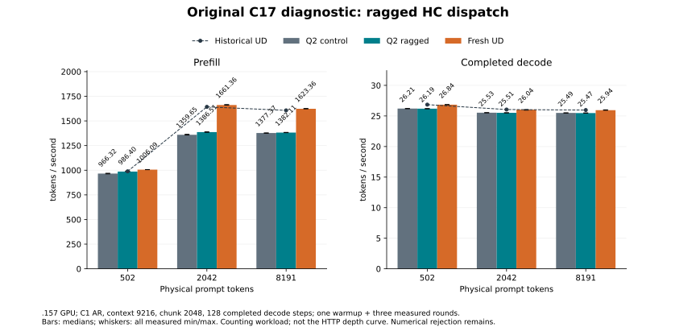

<!-- SPDX-License-Identifier: MIT -->
# Ragged HC dispatch: completed original-C17 diagnostic

Extending the experimental HC-down library dispatch to incomplete prefill
batches improves the historical 2042-token Q2 prefill by **1.975%**, from
1359.654 to 1386.506 token/s. Decode is effectively unchanged. Q2 remains
16.544% slower than fresh UD in prefill and 2.010% slower in decode there.
This is a three-point counting-prompt diagnostic, not the requested Gufo
HTTP context curve. The [canonical comparison](Q2-CURVE-PARITY.md) remains
the acceptance target.

## Full-model observations

All three providers use the byte-frozen historical C17 benchmark, ABI and
adapter, C1 AR without MTP, capacity 9216, prefill chunks up to 2048 and 128
completed decode steps. Each prompt has one warmup and three measured rounds.
These are medians from fresh full MMQ builds on `.157`, with original models.

| Physical prompt tokens | Q2 control PP | Q2 candidate PP | UD PP | Q2 control TG | Q2 candidate TG | UD TG |
|---:|---:|---:|---:|---:|---:|---:|
| 502 | 966.321 | 986.397 | 1006.085 | 26.205 | 26.188 | 26.843 |
| 2042 | 1359.654 | 1386.506 | 1661.359 | 25.527 | 25.513 | 26.036 |
| 8191 | 1377.372 | 1382.113 | 1623.356 | 25.492 | 25.474 | 25.943 |

All rates are token/s. Candidate PP changes versus the current Q2 control are
+2.078%, +1.975% and +0.344%; TG changes are -0.066%, -0.056% and -0.071%.
No decode gain is established. The two-predicate patch changes HC-down
prefill selection only; the paired producer still applies only at n2048.

[All 48 samples and durations](figures/q2-hc-library-ragged-model.csv) include
36 fresh observations and 12 historical UD witnesses. The
[verified report](../config/q2-hc-library-ragged-model-results.json) retains
inputs/counts, output identities, replay, all command exits and source hashes.
The [PNG](figures/q2-hc-library-ragged-model.png) is also available for export.

The earlier exact-2048 diagnostic improved from 1411.691 to 1439.264 token/s
and later replayed at 1438.975. It uses a different prompt/measurement path.
1386.506 at physical 2042 cannot be subtracted from 1439.264 at exact 2048
to claim a regression or a gain. Neither fixture is the canonical prose sweep.

## Numerical and timing limits

All twelve candidate/control output-ID sequences match, but all 24 prefill
and final-decode logit hashes differ. Same-build replay passes; pristine UD
reproduces all 36 historical output/frontier witnesses. These checks do not
clear the component's unchanged FP64/row-position failures or the inherited
KL rejection. Candidate KL and task quality are not newly qualified.

The [component](Q2-HC-LIBRARY-RAGGED.md) saves 41–48% complete-cycle time at
n2042/2047, yet the full-model gain is much smaller. Sparse whole-command
[clock observations](../config/q2-hc-library-ragged-clock-observations.json)
are not aligned with individual arms or GPU kernels and include loading and
host work. They cannot establish the cause or normalize component rates into
model throughput. No causal bottleneck claim follows from that difference.

## Validation and closure

Two host cohorts each pass 17/17 Debug and 17/17 ASan/UBSan on `.157`.
The component exits 1 for retained numerical failures; all fifteen model
build/run commands exit zero. The six-cohort closure verifies 79 artifacts,
6119 source-file instances and 30 commands, including the component failure.
An early local audit ran before collection finished and failed with
`FileNotFoundError`; its exit is retained, and the completed archive passes
without rerunning the GPU workload.

Release at **2026-10-03T21:11:50.582832+00:00** verifies all 36 recorded
processes/groups retired, KFD empty and all four original leases free.
The [release receipt](../config/q2-hc-library-ragged-window-release.json)
records no reservation, waiter or restart. The candidate remains experimental;
Q2/UD parity and numerical acceptance are not achieved.
