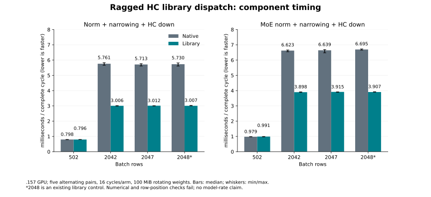

<!-- SPDX-License-Identifier: MIT -->
# HC library dispatch for incomplete prefill batches

This completed experiment is a component/native-model diagnostic. It does not
implement the [canonical HTTP context curve](Q2-CURVE-PARITY.md), which remains
the Q2/UD acceptance target. The [full-model comparison](Q2-HC-LIBRARY-RAGGED-MODEL.md)
measures only 1.975% PP gain at physical 2042, with no decode gain or promotion.

The original-C17 comparison confirms Q2 at 1362.819 prefill token/s versus UD
1663.579 for 2042 physical prompt tokens: an 18.079% deficit. The current
experimental library consumer and paired producer are restricted to exactly
2048 rows. A 2042-row request and a 2047-row final chunk use the native HC-down
consumer. This source fact identifies an unmeasured dispatch boundary; it does
not explain the entire model deficit or establish a speedup.

This component experiment extends only the existing HC-down library
selection to **96 through 2048 rows**, M320/K10240, F16 weights/input and F32
output. It still requires algorithm 7526 to pass the installed library's
support check with zero workspace. Selection still examines the original
sixteen heuristic results; refusal means the requested algorithm is unavailable
through this selection policy, not proof that no library algorithm could work.
Refused shapes are reported explicitly, with no silent substitution or live
tuning. Algorithm identity remains
installation-specific. All 1019 other provider files are unchanged, including
the executor, native GPU kernels and the producer's n2048 restriction.

The [source manifest](../config/q2-hc-library-ragged-source.json) and
[two-predicate patch](../experiments/q2-hc-library-ragged.patch) preserve the
measured parent. The initial component-only guard is preserved in its source
capsule. After the measured component decision, the remote guard also permits
the explicit original-C17 Q2 comparison with a full MMQ rebuild. It refuses
other model modes, MMQ reuse and persistent launch.
No public C ABI, state format, allocation or reactive-scheduling policy changes.
Scalar decode is outside the new dispatch range and receives no speed claim.

## Controlled experiment

The same binary compares the original native consumer with the actual
`BlasLt::Gemm` candidate. Both paths retain the same original F32 norm producer
and separate narrowing pass. Broadening the paired producer would be a separate
change, considered only after this consumer comparison.

- Ordinary and MoE correctness cases use 96, 97, 129, 502, 2042, 2047 and
  2048 rows, with an additional tiny-input case at 2042: 16 cases in total.
  Native and library outputs each receive the original sampled FP64 down
  check; full residual/norm/F16 arrays must agree. Both producers receive
  independent full-row FP64 norm checks. Limits remain 2e-5.
- Every output has guards and complete finite/write checks. All case down
  arrays are saved, with complete hashes of intermediate arrays. Original
  inputs and weights are checked unchanged.
- Repeated identical F16 rows at 97, 2042, 2047 and 2048 expose differences
  caused by a row's position. Every output row is compared and saved for both
  consumers. Position drift remains an explicit failure.
- Complete ordinary/MoE norm → narrowing → down cycles are timed at 502,
  2042, 2047 and 2048 rows. Each uses sixteen original-layout weight matrices
  occupying 100 MiB, matching production `hipMalloc` placement. Both paths
  and allocations warm first. Five pairs alternate order and allocation
  roles; each arm contains sixteen cycles timed with HIP events.
- Copies, plan creation and output validation stay outside timing. Numerical
  failures retain exit 1 while timings continue; runtime/resource failures
  stop the experiment. There are no substituted successful golden values.

At n2048 the current model already uses the library plus paired producer.
The native comparison there is a control, not evidence of a new model gain.
Ragged library arithmetic can differ from native arithmetic, including by
row position. Existing library/scaled operator failures and Q2 KL rejection
remain; a component speedup cannot clear them.

The bounded saved down arrays occupy 62,054,400 bytes if all shapes are
supported, within the unchanged 128 MB collection bound. The runner allows
300 seconds for this expanded component only; thermal and lease policy are
unchanged. No dependency installation or hardware tuning is involved.

## Current validation and next gate

The component has now run on `.157`: all seven shapes support the selected
library algorithm. Five alternating pairs per timed shape and path yield:

| Rows | Path | Native cycle ms | Library cycle ms | Time change |
|---:|---|---:|---:|---:|
| 502 | Ordinary | 0.798420 | 0.796070 | -0.294% |
| 502 | MoE | 0.978557 | 0.991017 | +1.273% |
| 2042 | Ordinary | 5.760764 | 3.006450 | -47.812% |
| 2042 | MoE | 6.622996 | 3.897816 | -41.147% |
| 2047 | Ordinary | 5.712737 | 3.012495 | -47.267% |
| 2047 | MoE | 6.639228 | 3.915409 | -41.026% |
| 2048 | Ordinary control | 5.730309 | 3.006620 | -47.531% |
| 2048 | MoE control | 6.694967 | 3.906902 | -41.644% |

All twenty n2042/n2047 timing pairs favor the library. n502 has no useful
gain, and n2048 already uses the library in the current experimental model.
The numbers time the complete producer/narrowing/down cycle, not just GEMM.
[All 80 samples](figures/q2-hc-library-ragged-component.csv),
[verified report](../config/q2-hc-library-ragged-results.json),
[SVG](figures/q2-hc-library-ragged-component.svg) and
[PNG](figures/q2-hc-library-ragged-component.png) retain the complete evidence.



Numerical qualification **fails** with the actual fixture and analyzer exit 1.
The original producer remains byte-exact in all 72 comparisons, and all 32
full-row independent norm checks pass. Native down passes all sixteen sampled
FP64 cases (maximum relative RMS 1.6490e-5, peak-scaled error 1.9226e-5).
Library down fails all sixteen at the unchanged 2e-5 limits (maxima 3.3883e-5
and 4.2075e-5). Fifty-six full comparisons fail; none is relabelled as success.
All four native repeated-row probes are exact. The library changes 65/1978/
1983/1984 rows at n97/2042/2047/2048, with maximum absolute delta 5.1767e-5.
All forty saved output arrays are finite and hash-verified. No runtime,
guard, thermal or collection failure occurred.

The [recorded component decision](../config/q2-hc-library-ragged-model-decision.json)
admits an exploratory full-model comparison under the owner's prior performance
authorization. It does not clear arithmetic or task-quality rejection.
Fresh model guards pass 17/17 Debug and 17/17 ASan/UBSan on `.157`; the original
C17 control, ragged candidate and pristine UD use physical502/2042/8191,
context9216/chunk2048 and 128 completed steps with one warmup and three rounds.
Scalar decode source remains unchanged. The completed
[full-model results](Q2-HC-LIBRARY-RAGGED-MODEL.md) retain all samples and gaps;
the component saving does not translate into a similar model-rate improvement.

Strict library and HIP host-only fixture syntax, changed-file formatting,
CMake configuration and the five-command build-graph dry run pass locally.
The complete 1020-file source reconstructs through the patch with zero fuzz.
The first strict fixture syntax check
found two unused helpers inherited through the existing fixture includes;
explicit address references resolve the warning without running those helpers.
The failed and corrected commands are retained. The shared upstream formatter
retains the same five untouched failures as the measured parent, with identical
logs. [Static evidence](../config/q2-hc-library-ragged-static.json) retains
the prepared-source checkpoint separately from the runtime measurements.

Core released its enclosing `.157` campaign at 20:44:19 UTC. Q2 admission at
20:46:48 UTC rechecks all twenty core process identities retired, empty KFD
and all four original leases. After the model comparison, release at
21:11:50.582832 UTC verifies all 36 recorded processes/groups retired, KFD
empty and all four leases free. Q2 has no reservation, waiter or restart. The original
[preparation plan](../config/q2-hc-library-ragged-plan.json) retains the earlier
handover dependency without rewriting its historical state.

Reproduction requires fresh ownership and unused labels; preserve exit 1:

```sh
python3 tools/q2-remote.py cpu q2-hc-library-ragged-host-r1
python3 tools/q2-remote.py collect q2-hc-library-ragged-host-r1
python3 tools/q2-remote.py hc-library-ragged-bench q2-hc-library-ragged-component-r1 --source-variant hc-library-ragged
python3 tools/q2-remote.py collect q2-hc-library-ragged-component-r1
python3 tools/analyze-q2-hc-library-ragged.py evidence/q2-hc-library-ragged-component-r1 --host evidence/q2-hc-library-ragged-host-r1 --output config/q2-hc-library-ragged-results.json
```

The analyzer checks original leases, source/fixture identities, all collected
artifacts, both host configurations, complete output arrays, numerical verdicts,
position drift, every sample and the alternating order. It reports numerical
rejection separately from any measured timing benefit. A useful complete-cycle
result is required before admitting a model comparison. Such a comparison must
reuse the unchanged original-C17 Q2/UD benchmark and retained physical inputs
to isolate this diagnostic delta; the historical 26.049 UD decode reference
is not lowered. It cannot replace the canonical HTTP sweep.

Official Gufo pin remains `f783fedb9bea2ec7de941f6da4e02f4a4596b29e`.
Upstream licenses/notices are preserved; first-party delta and fixture are MIT.
No antirez engine or sibling-workspace source/artifact is imported. Q2/UD parity
and numerical/task-quality acceptance remain unproven.
