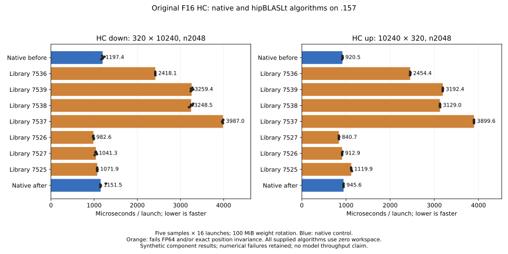
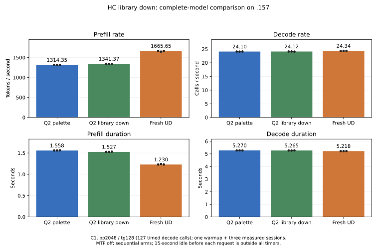

<!-- SPDX-License-Identifier: MIT -->
# HC F16 library algorithm comparison

The `.157` synthetic comparison finds a faster zero-workspace HC down algorithm,
but it fails the unchanged numerical limits. The best down candidate, index
7526, takes **982.612 us**, versus **1197.384 / 1151.463 us** for the native
kernel before/after the sweep: 14.66–17.94% less component time. Both a zero
workspace cap and a 64 MiB cap return the same seven heuristic choices; extra
workspace does not supply another choice in this observation. This is not an
exhaustive search of every possible library algorithm.

All seven library algorithms differ from native outputs and fail exact token-
position invariance. For HC down they also fail the original independent FP64
2e-5 thresholds. Numerical failures remain failures. The owner explicitly
authorizes exploratory performance measurement before their resolution; an
isolated down-only complete-model comparison measures **+2.06% prefill rate**
with unchanged generated tokens but changed logits. Numerical acceptance,
runtime adoption and Q2/UD parity remain unestablished; palette stays selected.



## Scope and independent checks

The first-party `tests/q2_hc_pp.cpp` fixture adds a `library` diagnostic mode.
Its existing 22 analytic cases and `bench` protocol remain intact. The new
mode uses the current affine-palette source at independently fetched official
Gufo pin `f783fedb9bea2ec7de941f6da4e02f4a4596b29e`; no other engine or project
artifact is imported. Model weights are not opened by the synthetic experiment.

The shapes are HC down M320/K10240 and HC up M10240/K320, both n2048,
F16 × F16 -> F32, with the existing row layout, deterministic values and
scales. Each workspace cap requests up to 32 heuristic choices. Algorithm
IDs are deduplicated and support/workspace requirements are checked explicitly
before launch, using the installed library's
[documented extension API](https://rocm.docs.amd.com/projects/hipBLASLt/en/docs-7.2.4/reference/ext-reference.html).
The private scratch allocation is capped at 64 MiB; every returned algorithm
requires zero and receives a null workspace pointer. No global tuning cache,
environment switch, installation or hardware policy is changed.

The native control brackets each shape's sequential algorithm sweep. Every
arm warms all sixteen independent weight matrices (100 MiB total), then records
five GPU-event batches of sixteen launches. Transfers, allocation, descriptor
creation, oracle work and repeated-row checks are outside those timers.
These are component timings, not complete inference or serving throughput.

The independent FP64 oracle visits 7,840 down and 103,680 up positions at
macro-tile and WMMA boundaries. All output values are checked finite/written,
the output guards are checked, complete output hashes and sampled F32 buffers
are retained, and the original 2e-5 relative RMS/error-over-peak limits apply.
A separate probe repeats the same input row at every token position and
compares every output row exactly against token zero. Different accumulation
orders are observed rather than hidden by a relaxed threshold.

| Path | Down median us | Up median us |
|---|---:|---:|
| Native before | 1197.384 | 920.539 |
| Library 7536, first heuristic | 2418.1 | 2454.4 |
| Library 7539 | 3259.4 | 3192.4 |
| Library 7538 | 3248.5 | 3129.0 |
| Library 7537 | 3987.0 | 3899.6 |
| Library 7526 | 982.612 | 912.9 |
| Library 7527 | 1041.3 | 840.733 |
| Library 7525 | 1071.9 | 1119.9 |
| Native after | 1151.463 | 945.583 |

[Complete report](../config/q2-hc-library-results.json) includes every result,
range, heuristic rank, workspace requirement and failure. The
[CSV](figures/q2-hc-library.csv) contains all ninety timing values. The best
HC up algorithm is 8.67–11.09% faster than the plain up control, but the model's
current HC up path fuses projection, mixing and the F16 consumer copy. This
plain GEMM gain therefore does not justify replacing that fused path.

For down index 7526, relative RMS is **3.19547e-5**, error/peak **3.10606e-5**
and maximum position-dependent difference **8.57115e-5**; 634,048 repeated-row
values differ. For up index 7527, the FP64 metrics pass (9.85891e-7 RMS,
1.34394e-6 error/peak), but 9,848,576 repeated-row values differ by up to
7.74860e-7. Native before/after is exact and position invariant for both shapes.
Neither library candidate passes all declared checks.

## Source and model experiment

`tools/prepare-q2-hc-library-down.py` creates one isolated delta to `blaslt.cpp`.
Only F16 M320/K10240/n2048 selects measured algorithm 7526, after checking
support and zero workspace. All other dimensions retain prior routing;
the fused HC up path and scalar decode kernel remain unchanged. There is no
trial GEMM on live model activations and no new tensor or persistent scratch.
The numeric reduction order changes; original F16 model bytes do not.

The library index is specific to the installed library and is not a portable
API guarantee. The exploratory source requires that supported index or fails;
it is not a production fallback policy. Source identity and the exact patch
are in [the source receipt](../config/q2-hc-library-down-source.json).
Changed-file formatting, host syntax and exact reconstruction of all 1,019
files pass [static checks](../config/q2-hc-library-down-static.json).
This is preparation evidence, not GPU or model qualification.

The fresh dispatch passes its structural checks and changes only the expected
`320x10240-n2048-p0` output; all other 21 complete hashes and all sampled
coordinate files match the fresh palette reference. The changed case exactly
reproduces the sweep's algorithm 7526 output. Independent numerical failures
increase from four to five, and both arms retain actual exit 1 with all timing
samples present.

| Fresh dispatch comparison | HC down median us | Unchanged HC up median us |
|---|---:|---:|
| Palette reference | 1184.526 | 954.709 |
| Library-down candidate | 983.476 | 952.521 |

This is 16.97% less down component time, with the unchanged up control 0.23%
faster. [The dispatch report](../config/q2-hc-library-down-results.json)
retains the full ranges, samples and numerical differences. The enclosing
window compares fresh palette, library-down and pristine UD complete
pp2048/tg128 arms with full MMQ rebuilds, MTP off, one warmup plus three fresh
measured sessions and the existing 15-second untimed idle. The complete results
follow; palette remains selected.

## Complete-model result

The library candidate raises median prefill **1314.354 -> 1341.371 tokens/s
(+2.06%)**, reducing elapsed prefill by 31.383 ms. Decode changes +0.09% on its
unchanged kernel path, with overlapping sample ranges. The fresh UD control
reaches **1665.648 tokens/s and 24.340198 calls/s**; the candidate still trails
by **19.47% PP / 0.90% TG**. The library component gain survives at model scale,
but explains only a small part of the remaining gap. It is an exploratory
performance lead, not an accepted numerical replacement or parity result.

| Arm | Prefill tokens/s | Prefill s | Decode calls/s | Decode s |
|---|---:|---:|---:|---:|
| Q2 palette reference | 1314.354 | 1.558179 | 24.099112 | 5.269904 |
| Q2 library down | 1341.371 | 1.526796 | 24.121551 | 5.265001 |
| Fresh pristine UD | 1665.648 | 1.229551 | 24.340198 | 5.217706 |



All arms use the same 2048 input tokens and emit the same 128 greedy tokens,
with 127 timed decode calls and no EOS suppression. The nine input/output
token files match between all three arms. Allocation, loading, the 15-second
idle before every session and the single warmup are outside these measurements.
These are sequential C1 requests with capacity 9216 and chunk 2048, not long
context, sustained service, concurrency or independent quality qualification.

| Arm / measured repetition | Prefill tokens/s | Prefill s | Decode calls/s | Decode s |
|---|---:|---:|---:|---:|
| Palette / 1 | 1314.569149 | 1.557924892 | 24.09911194 | 5.269903734 |
| Palette / 2 | 1314.354440 | 1.558179390 | 24.07442230 | 5.275308309 |
| Palette / 3 | 1311.565545 | 1.561492682 | 24.11627633 | 5.266152961 |
| Library down / 1 | 1341.848450 | 1.526252834 | 24.12155130 | 5.265001343 |
| Library down / 2 | 1341.371056 | 1.526796028 | 24.13449208 | 5.262178279 |
| Library down / 3 | 1337.878796 | 1.530781418 | 24.07577261 | 5.275012439 |
| UD / 1 | 1666.347416 | 1.229035422 | 24.34019764 | 5.217706194 |
| UD / 2 | 1647.293340 | 1.243251551 | 24.35419752 | 5.214706824 |
| UD / 3 | 1665.648379 | 1.229551222 | 24.33557591 | 5.218697123 |

The [complete model report](../config/q2-hc-library-model-results.json) retains
ranges, numerical differences and each sample. The [model CSV](figures/q2-hc-library-model.csv)
contains all 36 measured values. The fresh palette reference reproduces all
21 retained model files exactly, independently of the new candidate.

The candidate changes the eight 2K logit files (prefill and final decode for
warmup and three repetitions). At prefill, maximum absolute logit difference
is **1.910418**, relative L2 **0.195035** and reference-to-candidate KL
**0.00100189**. At final decode these are **1.307928 / 0.0781891 / 2.4614e-7**.
All four short arithmetic/counting logit files remain exact because their
dimensions retain the original dispatch. Each arm repeats its own three saved
outputs exactly across all four sessions (27 checks across the three arms).
Unchanged generated tokens on this prompt do not establish unchanged model
quality or make the independent operator failures false positives. No limit
is relaxed and the library candidate is not selected for development/runtime.

## Campaign validation and closure

Two source-guard versions each pass 12/12 Debug and 12/12 ASan/UBSan tests on
`.157`. Nine runners and 38 commands finish; all **322 artifacts** verify.
Thirty-four commands exit 0; two library sweeps and two component commands
retain their actual numerical-failure exit 1. Source capsules witness both
the kernel and the changed `blaslt.cpp`, and source-guard versions match their
preceding host qualification. Model stat witnesses and binary hashes remain
unchanged within each arm. Maximum observed GPU/CPU readings are 85 C / 92.125 C,
within the owner-authorized 98 C inclusive and lower exposed bounds.

[Closure](../config/q2-hc-library-window-release.json) at **01:03:41 UTC**
verifies all nine runners and 38 command identities/groups/sessions absent,
empty KFD, four original leases free and five original model witnesses unchanged.
[Independent observer retirement](../config/q2-hc-library-observer-retired.json)
passes at **01:04:24 UTC**. Both observers exit 0. The persistent remote receipt,
shared registry and coordination ledger record release. No Q2 remote job,
waiter or automatic retry remains. Direct thread-message transport fails;
delivery is not claimed. [Validation](../config/q2-hc-library-validation.json)
retains all checks and links the receipts. The selected palette source,
qualified runtime, original models and public ABI remain unchanged.

## Preserved failures and reproduction

Sweep r1 completes but library calls leave `std::cout` at fixed precision two,
so small error metrics serialize as `0.00`. The actual numerical flags,
sample buffers and timing values survive; the strict report parser refuses
the inconsistent rounded metrics. A logging-only repair sets scientific
precision before every library event, and sweep r2 replays all saved outputs
exactly with proper metric precision. Both actual GPU exits 1 remain evidence.
The four inherited library-control failures are unchanged; the new sweep
records fourteen down failures (FP64 plus position invariance) and seven up
position-invariance failures. None is relabeled as passing.

Two local analysis failures are also retained: one invocation preceded the
completion of collection, and the next correctly rejected the rounded error
metrics. The corrected analysis uses the completed r2 collection. No failed
receipt, limit or sampled value is overwritten.

In an admitted `.157` window, run:

```sh
python3 tools/q2-remote.py hc-library-bench q2-unique-label --source-variant affine-palette
python3 tools/q2-remote.py collect q2-unique-label
python3 tools/analyze-q2-hc-library.py evidence/q2-unique-label config/REPORT.json
python3 tools/plot-q2-hc-library.py config/REPORT.json docs/figures/REPORT
```

For the complete-model screen, prepare the isolated source with
`tools/prepare-q2-hc-library-down.py`, qualify its guards and component, then
run `q2-bench2k` with `--source-variant affine-palette --rebuild-mmq`,
`q2-bench2k` with `--source-variant hc-library-down --rebuild-mmq`, and
`ud-bench2k --rebuild-mmq`, each with a fresh label. The preparation command
refuses to overwrite an existing source directory. Collect all terminal arms
before invoking `tools/analyze-q2-hc-prefill.py` with the reference/candidate
component paths, two `--models` paths and the `--ud` path. Render that report
with `tools/plot-q2-model-screen.py`. Exact argv and actual exits from this
campaign are preserved under `evidence/q2-hc-library-*`.

Replace the placeholder label with lowercase letters/digits/hyphens and a fresh
directory. Builds and runtime stay on `.157`, under fresh four-lease admission
and the owner-authorized 98 C inclusive/lower exposed bounds. The local syntax
checks execute no GPU workload. All sources and evidence use persistent paths.
