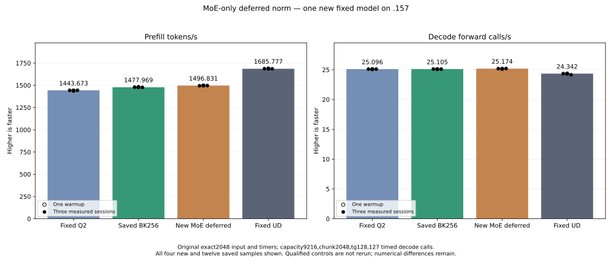

<!-- SPDX-License-Identifier: MIT -->
# MoE-only deferred normalization composition

This new candidate composes the retained deferred-norm numerical experiment
with the measured BK256 bounded provider (1477.969324 PP / 25.10545360 TG).
Fixed Q2 1443.672867 / UD 1685.777092, the original exact2048 tester/input/timers,
and the full PP/TG context-curve target remain. Existing qualified controls
and the old synthetic component are reused without rerunning them.

The old complete synthetic cycle saved 1.894% only for MoE and regressed
10.292% for ordinary combine. It had real feedback-byte differences despite
passing sampled norm/consumer checks. This candidate therefore selects deferred
normalization only for the 2048-row original-F16 MoE route; ordinary combine,
the Q8 producer/consumer and the best parent's native down remain unchanged.
Copying the retained port does not establish numerical acceptance or a model gain.

The producer omits 80 MiB of materialized F32 norm per applicable combine and
writes four scales/token (32 KiB at 2048 rows). Scales occupy the existing
HC-gate buffer beyond `rows * hc_low_rank` float elements; low-rank F16 input
occupies only the prefix. Up/mix and injection reconstruct normalized values
on the existing ordered stream before scratch can be reused. No allocation,
stream, GPU scheduling policy, model conversion or public adapter ABI changes.

An owned C17 identity helper records residual, gamma, scales and rows. A new
producer invalidates old identity; unnormalized consumers clear it. Normed
consumers refuse changed residual/gamma/rows. Unsupported fused consumers
materialize F32 norm before continuing; Q8 still takes its existing route.
The half identity is published for the down consumer, then replaced by the
mixed-row identity. Host guards do not establish GPU address safety by themselves.

The persistent source changes six of 1025 files; 1019 remain exact to the
measured parent. Original and reconstructed patches, donor/parent identities
and all earlier failures remain. The original-F16 numerical include compiles
for gfx1151; the executor compiles with the existing HIP platform definition.
The first plain-C++ attempt omitted that definition and failed; its command
and exit 1 are preserved. Shared formatting runs with exit 1 and 57 reported
violations; no formatting success is claimed.

| New kernel | VGPRs | LDS bytes | Private bytes/thread |
| --- | ---: | ---: | ---: |
| MoE deferred producer | 84 | 10368 | 0 |
| Deferred up/mix | 242 | 24576 | 0 |
| Deferred injection | 42 | 128 | 0 |
| Reconstruction fallback | 13 | 0 | 0 |

Local launch guards pass 78/78. On `.157`, the host CPU capsule passes 24/24
Debug and 24/24 ASan/UBSan, including wrong residual/gamma/row identity,
replacement, invalid publication and cleared-state rejection. Six commands
exit zero and seven artifacts verify; no GPU or model is opened by those tests.
The frozen window permits only one new original-weight model arm, with full
MMQ build, capacity9216/chunk2048, one warmup/three measured sessions,128 output
tokens/127 timed decode calls and15-second waits outside timers. It retains
numerical differences and measures performance separately. No benchmark switch,
qualified control rerun, component rerun, curve, install, tuning or cleanup.
The fresh window completed this one new model and is now released.

| Sample | Prefill seconds | Prefill tokens/s | Decode seconds | Decode forward calls/s |
| --- | ---: | ---: | ---: | ---: |
| Warmup | 1.367551990 | 1497.566465 | 5.049952552 | 25.14875114 |
| Measured 1 | 1.370185422 | 1494.688213 | 5.044815975 | 25.17435733 |
| Measured 2 | 1.366648953 | 1498.556008 | 5.050827256 | 25.14439587 |
| Measured 3 | 1.368224019 | 1496.830907 | 5.039240888 | 25.20220859 |

| Fixed comparison | Median PP tokens/s | Median decode forward calls/s |
| --- | ---: | ---: |
| Saved fixed Q2 | 1443.672867 | 25.09595499 |
| Saved best BK256 parent | 1477.969324 | 25.10545360 |
| New MoE-only composition | 1496.830907 | 25.17435733 |
| Saved fixed UD | 1685.777092 | 24.34174251 |

Median PP improves 1.276182% versus the saved best parent and 3.682139% versus
the fixed Q2 comparator. Every new measured PP exceeds every saved parent
measured PP, but separate historical cohorts do not prove contemporaneous
repeatability. Decode differs by +0.274457% versus parent; this MoE2048 change
does not establish an independent decode optimization. Candidate PP remains
11.208254% below fixed UD; reaching it requires 12.623081% more candidate
throughput. The full PP/TG curve remains gated on fixed-point parity.

All four runtime command exits are zero; 26 artifacts, 18 capsule fixtures and
1025 source files verify. Nine within-arm full-logit replay checks are exact.
All128 output tokens match saved Q2/UD/parent; eight large-point logit files
change versus Q2 and parent. Maximum matched-history KL is 0.001256655 against
Q2 and 0.001687570 against parent; the latter's prefill/last maxima are
0.001687570/0.000001356, with maximum absolute delta 1.699030161. Both small
smoke prompts' logits remain exact to Q2/parent. These results retain the old
numerical rejection; greedy tokens on this prompt do not establish task quality
or numerical acceptance. The candidate remains isolated and is not promoted.

The MoE-only integrated performance result is retained despite those differences.
It recovers one pending family, leaving routing-specific tile64 integration open.
The additive recovery update verifies all19 original report hashes again and
does not classify them all as false failures or add synthetic gains as throughput.

Admission at2026-10-04T22:39:05.931203Z uses checkpointddf5bdf. Release at
2026-10-04T22:44:59.016645Z verifies555 retired process identities/433 groups,
empty KFD, four original leases free and six unchanged model stat tuples.
Observed maxima including compilation are CPU83.125C/GPU75C. Core receives
the release; no Q2 GPU job, reservation, waiter, restart or cleanup remains.
Any later GPU run requires fresh admission. All four new and twelve saved
model samples remain in the CSV and graph; no qualified comparator was rerun.

[Source and patch](../config/q2-hc-moe-deferred-source.json),
[static results](../config/q2-hc-moe-deferred-static.json),
[host receipt](../config/q2-hc-moe-deferred-host-results.json),
[frozen plan](../config/q2-hc-moe-deferred-plan.json),
[model results and full replay](../config/q2-hc-moe-deferred-model-results.json),
[recovery update](../config/q2-rejected-recovery-moe-update.json),
[release](../config/q2-hc-moe-deferred-run-window-release.json),
[all model samples](figures/q2-hc-moe-deferred-model.csv).

