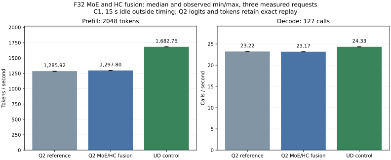

<!-- SPDX-License-Identifier: MIT -->
# F32 MoE epilogue and HC combine fusion

The isolated candidate reaches **1297.80 prefill tokens/s and 23.17 decode
steps/s** at C1 pp2048/tg128 on `.157`. Against its fresh exact-vector reference,
prefill improves **0.92%** and decode measures **0.21% lower**. All saved Q2
model logits and tokens remain exact. The component microbenchmark improves
9.74%; that gain does not carry over wholesale to model throughput.
The fresh UD control reaches 1682.76/24.33, so the parity requirement remains
unmet: Q2 trails by 22.88% in prefill and 4.76% in decode.

## Mechanism and arithmetic

Q2's routed down projection produces F32 expert rows. The current executor
launches `MoeEpilogueVec4` to form `[tokens][2560]` block output, then
`HcCombineVec4Kernel<float>` reads it while updating the four residual streams
and normalizing each stream. The
[updated exact-vector diagnostic](../config/q2-hc-moe-reference-profile.json)
spends 55.385 ms in the 48 MoE epilogues, 120.797 ms in all 96 F32 combines
and 64.086 ms in 193 narrowing calls. Total prefill kernel time is 1637.032 ms,
with 5.425 ms between kernels. These are profiled stage sums, not an estimate
of recoverable wall time or an unprofiled throughput measurement.

The candidate forms the expert sum and gated shared expert once in a 2560-float
LDS row, synchronizes the block, then runs the original F32 combine's lane/chunk
mapping, sum-of-squares expressions, wave reduction and norm scaling. Expert
accumulations use explicit round-to-nearest FMAs, retaining their F32 result
before the residual update. It does not select UD's F16 expert outputs or its
different norm mapping. Runtime byte equality remains a qualification gate.

Only the original IQ2/Q2 routed prefill route, four HC streams, hidden=2560,
1..32 used experts and at least 16 tokens may defer the epilogue into the
immediately following combine. A separate internal pending flag distinguishes
F32 from UD's existing F16 rows and is cleared before consumption. Unsupported
dispatch falls back to the separate F32 epilogue; absent gamma updates the
residual without writing normalized output. Smaller batches and scalar decode
retain the previous route. This introduces no new global allocation, model
format, C ABI, HTTP behavior, reactive policy or KV-cache behavior.

## GPU component qualification

The synthetic GPU fixture compares all residual and normalized values with the
existing separate kernels and an independently evaluated FP64 formula. Eight
cases cover 16/17/33/97/129 token counts, ordinary/tiny/alternating inputs,
1/8/32 experts, 1/3/7 inject partials and absent normalization. Complete paired
buffers are retained. Guard bytes, unwritten-output fill, input immutability
and unsupported-dispatch refusal are checked. The FP64 relative RMS and
error-over-peak limits remain 0.00002.

The same fixture can time reference and candidate alternately at 2048 tokens,
32 iterations and five samples. Its expert rows exceed 32 MiB, resets and
complete-buffer comparisons are outside timing. Finite numerical failures do
not prevent the owner-authorized exploratory timing; they still produce exit 1.
A runtime, guard or missing-write failure stops the fixture. Microbenchmark
results do not establish full-model improvement.

The [GPU receipt](../config/q2-hc-moe-fused-operators.json) records eight passing
cases, 15 complete byte-exact buffer pairs and 6,840,320 compared F32 values.
The maximum independent relative RMS is 7.277e-8 and error-over-peak is
2.590e-7, within the unchanged 2e-5 limits. All five 2048-token microbenchmark
replays also compare their complete residual and normalized buffers exactly
after 32 repeated updates. All three commands exit 0; 34 artifacts are collected
and hash verified. The exact sample times, independent metrics and buffer counts
are retained in the report.

```sh
python3 tools/q2-remote.py q2-profile q2-hc-moe-ref-profile-r1 --source-variant hc-up-vec-exact
python3 tools/q2-remote.py hc-moe-bench q2-hc-moe-micro-r1 --source-variant hc-moe-fused
```

GPU commands require the current coordinated window and four fresh leases;
they must not be launched concurrently. Each source/model measurement uses
its own capsule and immutable evidence label. Full-model arms require an
explicit MMQ rebuild because the executor header changes.

## Static and host checks

The [source receipt](../config/q2-hc-moe-fused-source.json) identifies four
changed files and the official Gufo pin. Patch reconstruction reproduces all
1019 source files. Device assembly, host-side fixture/executor syntax and the
official 486-file format check pass. The [static report](../config/q2-hc-moe-fused-static.json)
records 84 VGPRs, 30 SGPRs, 10,368 LDS bytes and zero private bytes for the
candidate; the separate F32 combine uses 96 VGPRs, 28 SGPRs, 128 LDS bytes and
zero private bytes. These are compiler resources, not dynamic occupancy.

The `.157` [CPU receipt](../config/q2-hc-moe-host.json) records 10/10 Debug and
10/10 ASan/UBSan tests, six command exits 0 and seven collected/hash-verified
artifacts. HIP visibility is disabled and no model is opened. The initial
sandboxed SSH attempt exited 255 before connecting; its transport receipt is
preserved under `evidence/q2-hc-moe-host-r1`. The admitted retry is `-r2`.

The existing qualified runtime patch remains unchanged. Numerical parity with
the retained packed checkpoint does not close the earlier independent Q2
quality gap; Q2 PP/TG parity with UD remains required.

## Complete model measurement

Every arm rebuilds the full MMQ/model target and loads the original unchanged
Q2 or UD model. A warmup precedes three measured requests, with 15 s idle
outside each request's timers. Requests prefill 2048 tokens and produce 128
tokens; the decode denominator is 127 forward calls because prefill produces
the first token. MTP is off. The harness calls the Gufo executor directly and
does not exercise the LIE C reactive scheduler, HTTP or concurrent requests.

| Arm | PP tokens/s median [min, max] | Decode calls/s median [min, max] | PP seconds | Decode seconds |
| --- | ---: | ---: | ---: | ---: |
| Exact-vector Q2 reference | 1285.922 [1282.992, 1287.353] | 23.216 [23.211, 23.226] | 1.592631 | 5.470279 |
| Q2 F32 MoE/HC fusion | 1297.795 [1296.290, 1299.356] | 23.167 [23.160, 23.174] | 1.578061 | 5.481997 |
| Pristine UD control | 1682.761 [1682.752, 1683.344] | 24.326 [24.296, 24.339] | 1.217047 | 5.220790 |



The [complete report](../config/q2-hc-moe-results.json) and
[CSV](figures/q2-hc-moe-fusion.csv) retain every measured rate and duration.
The candidate's 12 F32 frontiers and all nine input/output token files match
the retained packed checkpoint exactly; the fresh Q2 reference does too. Each
arm repeats all nine within-arm checks exactly. The three model arms have four
command exits 0 each and 26 collected/hash-verified artifacts each.

Candidate model-process temperatures peak at GPU 82 C/CPU 89.625 C; reference
82/92.375 C and UD 84/82.5 C. No thermal stop occurs. Decode's lower median is
reported as measured, not rewritten as a gain or proof of no regression. This
series alone does not identify the cause of that small variation, and no
scalar decode kernel is changed by this patch. The measured prefill benefit
does not justify claiming Q2/UD performance acceptance or long-context quality.

## Remaining targets

The [matched candidate profile](../config/q2-hc-moe-profile-delta.json) confirms
48 fused launches, no separate MoE vector epilogue and 48 remaining F32 combines
for the attention blocks. Prefill dispatches fall from 2003 to 1955. The combined
epilogue/combine kernel group falls from 176.182 to 168.690 ms (7.493 ms saved).
Total profiled prefill kernel time falls from 1637.032 to 1610.261 ms; changes
in other kernels contribute too, so that entire delta is not attributed to the
fusion. Decode retains 23,594 dispatches and never launches the fused kernel.
All 15 saved diagnostic buffers match the reference exactly.

The updated reference trace puts routed Q2 down at 298.185 ms, paired IQ2
gate/up at 267.536 ms and the 96 raw-F16 HC down projections at 133.958 ms.
These remain larger prefill targets than this epilogue fusion. Static routed
down variants use 112–169 VGPRs with zero private bytes; actual expert bucket
fill and occupancy must be measured before selecting another tile size.

Activation narrowing is still 64.086 ms over 193 calls. The next producer
experiment can retain F32 `xn` while emitting its already-required FP16 copy
inside the combine, into existing `x_half`, then publish the correct
`half_src_/rows/cols/bf16` identity. `Dense` already reuses that identity for
original F16 weights. The scratch capacity, invalidation before another
producer writes `x_half`, and exact rounding must be checked explicitly.
This is a remaining hypothesis, not implemented or measured by this patch.
The separate scale/SiLU pass totals only 1.212 ms here, so it is a lower priority
than removing full-width activation reads.

Reactive concurrency and deep-context attention/KV measurements remain separate
work. This C1 direct-executor harness cannot establish a serving benefit, and
2K results cannot establish behavior at 128K–1M.

The coordinated window is released at 2026-10-02T15:30:30.921227 UTC after all
seven runners and 35 command identities/groups/sessions retire, KFD is empty
and all four expected leases are freshly verified EX|NB/free. All 171 artifacts
from the seven completed arms are collected/hash verified. The persistent
remote receipt is `run/q2-hc-moe-window-release.json`; its
[tracked copy](../config/q2-hc-moe-window-release.json) preserves closure.
