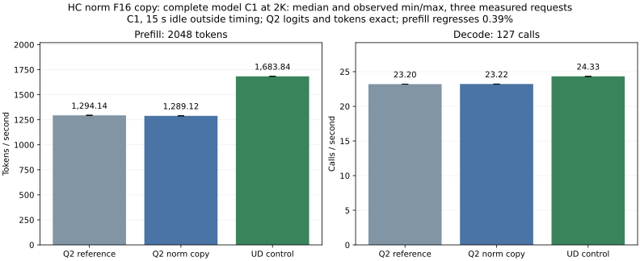

<!-- SPDX-License-Identifier: MIT -->
# F32 HC norm with its F16 consumer copy

The later [complete sequence experiment](Q2-HC-SEQUENCE.md) preserves original
producer controls and includes the consuming down projection in each timing.
It confirms a regression with two down geometries; the earlier isolated
producer saving below does not justify selecting this mechanism.

The isolated HC norm candidate removes a full-width activation read and one
narrowing launch before each eligible raw-F16 HC down projection. Original
weights, the F32 normalized tensor and the consumer's F16 precision are retained.
The matched full-model Q2 pair currently measures 1294.135 -> 1289.123 prefill
tokens/s (-0.39%) and 23.202 -> 23.221 decode calls/s (+0.08%). All saved logits
and tokens remain exact. The candidate is not retained for performance on this
evidence; the fresh UD control is 1683.841/24.327. The matched profiles below locate the cost transferred to HC down.
Component gains below do not establish model or serving gains.

## Mechanism and buffer lifetime

For the original-F16 Q2 HC path at 96 or more rows, the combine producer emits
both the existing F32 norm and its rounded F16 copy into `s_.x_half`. It publishes
the existing half-input cache identity only after successful dispatch. `Dense`
then consumes that copy without a separate `NarrowActivations` call. Bounds
require hidden=2560, four HC streams, a non-null normalization weight, enough
half-buffer columns, and at most `max_batch` rows. No global allocation is added.
The ordinary combine and F32 MoE/HC combine both support the paired outputs.

Recomputing the norm invalidates earlier half/Q8 copies. Overwriting `x_half`
invalidates its previous identity before the new producer is dispatched. The
following HC mixer already invalidates input copies before rewriting mixed
activations. F32 norm remains available to mixing and injection. Scalar decode,
UD's wide-mixer path, C ABI, HTTP, reactive scheduling and KV policy are unchanged.
The qualified runtime patch is not promoted by this experiment.

## Rounding failure and correction

The first GPU arm `q2-hc-norm-micro-r1` exits 1 after completing its timings.
Eight FP64 operator comparisons remain below their original 2e-5 tolerance,
but six MoE F32 norm buffer pairs and three ordinary F16 copies differ. Only
24/33 complete buffer pairs match. This is a real arithmetic difference and
is retained in [the failed report](../config/q2-hc-norm-rounding-failure.json).

Static gfx1151 assembly identifies two changes from merely adding the F16
output: the sum of four squared residuals is contracted in a different order,
and a mixed FMA rounds the final product directly into F16, omitting the
baseline's intermediate F32 rounding. The corrected source makes the measured
sum-of-squares sequence explicit (w squared, then y, z, x FMAs), and anchors the
F32 output registers before narrowing. The register constraint emits no runtime
memory operation or synchronization. Corrected assembly has zero mixed F16 FMA
instructions in these two kernels; this fact alone is not numerical evidence.

The corrected GPU arm `q2-hc-norm-micro-r2` passes eight independent FP64 cases
and six paired-output cases. All 33 saved full-buffer pairs are finite and
byte-exact, including scalar IEEE round-to-nearest-even checks on every F16
output. Cases include 16/17/33/97/129 rows, ordinary/tiny/alternating values,
1/8/32 experts, 1/3/7 injection partials and absent normalization. Guard bytes,
unchanged inputs and refusal before launch are checked. Ten complete repeated
2048-row buffer comparisons pass after timing (five per path).

| Paired operation | Separate median, us | Producer copy median, us | Speedup |
| --- | ---: | ---: | ---: |
| Ordinary HC combine + narrowing | 1956.279 | 1685.318 | 1.1608x |
| F32 MoE/HC combine + narrowing | 2687.380 | 2395.386 | 1.1219x |

Each sample times 32 updates after warmup; five samples alternate arm order.
Buffer uploads and full comparisons are outside HIP-event timing. These are
component measurements, not model rates. Both GPU collections retain 70
hash-verified artifacts each. See [passing operators and every timing sample](../config/q2-hc-norm-operators.json).

## Source and host checks

The [generator](../tools/prepare-q2-hc-norm-half.py) derives the measured MoE/HC
checkpoint from independently fetched official Gufo pin
`f783fedb9bea2ec7de941f6da4e02f4a4596b29e`. The cumulative source remains isolated
under `.deps/gufo-q2-bench-hc-norm-half`; the incremental
[patch](../experiments/q2-hc-norm-half.patch) changes only `executor.cpp`,
`kernels.hip.cpp` and `kernels.hpp`. All 1019 source files reconstruct exactly.
See [source identity](../config/q2-hc-norm-half-source.json) and
[static checks](../config/q2-hc-norm-half-static.json).

Corrected ordinary and MoE kernels use 84 VGPRs, 128/10368 LDS bytes respectively,
and no private scratch in static compiler metadata. The first executor syntax
check missed the MMQ include directory and exited 1; the corrected command
exits 0, preserving the failed log. Device compilation, fixture syntax and all
486 upstream formatting checks pass. These are editing-host static checks only.

On `.157`, 10/10 Debug CTests and 10/10 ASan/UBSan CTests pass with GPU disabled;
all six host commands exit 0 and seven artifacts verify. These CPU fixtures
cover host/runner behavior, not GPU lifetime sanitization or model inference.
See [host receipt](../config/q2-hc-norm-host.json).

## Matched full-model results

All three arms rebuild MMQ from source and use original unchanged weights,
C1 pp2048/tg128, one warmup and three measured requests, MTP off and a 15-second
idle period outside each timed request. Prefill produces the first token;
decode rates therefore count 127 forward calls for 128 output tokens. The
harness calls the Gufo executor directly, without the LIE reactive scheduler,
HTTP, multiple sessions or long-context qualification.

| Arm | PP tokens/s median [min, max] | Decode calls/s median [min, max] | PP seconds | Decode seconds |
| --- | ---: | ---: | ---: | ---: |
| Q2 MoE/HC reference | 1294.135 [1293.453, 1295.818] | 23.202 [23.195, 23.203] | 1.582524 | 5.473775 |
| Q2 paired norm copy | 1289.123 [1288.714, 1290.131] | 23.221 [23.199, 23.223] | 1.588676 | 5.469300 |
| Pristine UD control | 1683.841 [1683.678, 1684.640] | 24.327 [24.309, 24.330] | 1.216267 | 5.220434 |



See [complete samples and identities](../config/q2-hc-norm-results.json) and
[CSV](figures/q2-hc-norm-fusion.csv). The candidate loses 0.3873% prefill and
measures 0.0818% higher decode than the fresh Q2 reference. It remains 23.44%
below UD prefill and 4.55% below UD decode. The component speedup does not
satisfy the minimum performance requirement, so this variant is not promoted.
No scalar decode kernel was changed; this small decode delta is not attributed
to the new prefill producer.

Both Q2 arms preserve all 12 saved F32 frontiers and nine token files against
the retained packed checkpoint. Each of the three arms repeats all nine
within-arm replay checks exactly. This does not resolve the earlier packed
checkpoint's independent-quality limitation. Each arm has four command exits 0
and 26 collected/hash-verified artifacts. Model-process GPU/CPU temperature
maxima are 81/90.375 C for reference, 83/90.125 C for candidate and 85/82.625 C
for UD. No thermal stop occurs; these observations do not isolate clocks or
memory placement as the cause of the regression.

## Diagnostic attribution

Fresh candidate and reference profiles both complete with all seven commands
exiting 0 and 26 artifacts verified per arm. All 15 saved diagnostic model
buffers match exactly. [The diagnostic report](../config/q2-hc-norm-profile-delta.json)
keeps their full phase metadata separate from the unprofiled model rates.

| Prefill group | Reference calls | Candidate calls | Reference ms | Candidate ms |
| --- | ---: | ---: | ---: | ---: |
| HC combines, including MoE | 96 | 96 | 168.755 | 190.960 |
| Activation narrowing | 193 | 99 | 61.871 | 2.443 |
| Raw-F16 HC down | 96 | 96 | 128.961 | 169.462 |
| These groups combined | 385 | 291 | 359.587 | 362.866 |

The producer is actually consumed: 94 narrowing calls disappear. Additional
combine work costs 22.205 ms while narrowing saves 59.428 ms, a net 37.223 ms
component saving. The immediately following HC down calls cost 40.501 ms more,
erasing that gain. Their normalized static instruction stream is identical
([ISA receipt](../config/q2-hc-norm-down-isa.json)); only translation-unit block
labels/comments differ. A change in cache locality after interleaved F32/F16
writes is plausible, but cache misses and actual occupancy were not measured,
so this remains a hypothesis rather than a proven hardware cause.

Total prefill dispatches fall 1955 -> 1861, yet kernel time is
1605.748 -> 1606.391 ms and the kernel span 1611.049 -> 1611.434 ms. Gaps fall
5.301 -> 5.042 ms. This confirms that eliminating launches alone does not yield
a complete-path speedup here. Decode dispatches remain 23594; diagnostic sums
601.320/583.002 ms are not substitutes for the separately measured decode rates.
No reactive scheduler or HTTP improvement is inferred from these traces.

## Further kernel hypothesis

Static inspection of the unchanged raw-F16 HC down kernel finds 251 VGPRs and
24576 LDS bytes for its 64x128 macro-tile, with no private scratch. A local-only
64x64 probe uses 184 VGPRs and 18432 LDS bytes, also without private scratch.
At 2048 tokens, this doubles the launch grid from 80 to 160 blocks while keeping
the low/high K16 accumulation chains. These are compiler and grid facts only;
actual occupancy, output equality and complete-model speed remain unmeasured.
This probe does not justify accepting the current norm-copy regression.

## Reproduction and closure

Use fresh unique labels in a coordinated `.157` window; each GPU/build arm
performs its own four-lease admission. These commands do not promote runtime
source or restart a service:

```sh
python3 tools/q2-remote.py hc-norm-bench q2-norm-check-NEW --source-variant hc-norm-half
python3 tools/q2-remote.py q2-bench2k q2-norm-ref-NEW --source-variant hc-moe-fused --rebuild-mmq
python3 tools/q2-remote.py q2-bench2k q2-norm-model-NEW --source-variant hc-norm-half --rebuild-mmq
python3 tools/q2-remote.py ud-bench2k q2-norm-ud-NEW --rebuild-mmq
```

Replace `NEW` with a unique lowercase suffix. Eight campaign arms retain all
277 hash-verified artifacts and 38 command exit codes. The first GPU numerical
arm exits 1; all other commands exit 0. The first offline profile-analysis
attempt used a single-line event reader on pretty-printed profiler JSON and
failed; it changed no remote state and its exit is retained before corrected
analysis. See [campaign manifest](../config/q2-hc-norm-campaign.json).

The enclosing GPU window is released at **2026-10-02T16:48:53.978770 UTC**:
eight runners and 38 owned command identities/groups/sessions are absent, KFD
is empty, and all four original lease identities are freshly acquired EX|NB
then released. The [closure receipt](../config/q2-hc-norm-window-release.json)
is also persistent on `.157` at `run/q2-hc-norm-window-release.json`; the shared
registry records the release. The independent 16:50:39.628961 UTC observation confirms the closure
observer retired; both SSH commands exit 0. No Q2 job, reservation, waiter or
automatic retry remains. Any future experiment needs fresh coordination and admission.
