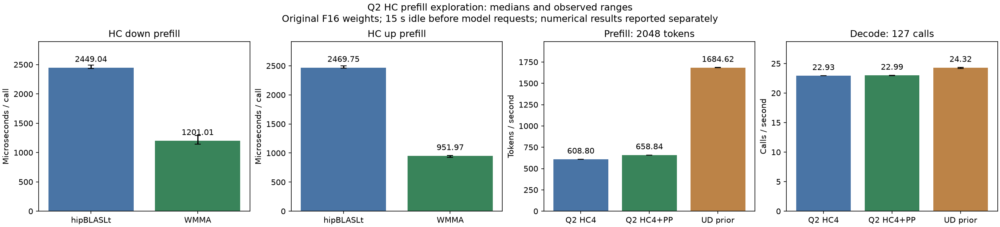

<!-- SPDX-License-Identifier: MIT -->
# Q2 F16 HC prefill exploration

The isolated WMMA candidate is faster than workspace-free hipBLASLt on both
original F16 HC projection shapes. It retains the HC4 decode experiment and
changes only prefill dispatch/tiling. Overall Q2/UD PP and TG parity remains
unmet; this component does not replace that acceptance requirement.

## Component measurements

All runtime checks ran sequentially on `.157`, under the four existing leases.
The benchmark rotates 16 distinct original F16 matrices (100 MiB), warms one
rotation and measures five batches of 16 calls at 2048 input rows. HIP events
measure GPU latency; these values are not model tokens/s.

| Shape | hipBLASLt median µs | WMMA median µs | Speedup |
| --- | ---: | ---: | ---: |
| 320x10240 | 2449.038 | 1201.008 | 2.039× |
| 10240x320 | 2469.747 | 951.972 | 2.594× |

Full ranges and all samples are in [the result JSON](../config/q2-hc-prefill-results.json).

## Numerical findings

The predeclared independent FP64 sampled-oracle limits remain 2e-5 for relative
RMS and maximum error divided by peak reference. The original hipBLASLt path
fails 12/22 cases; the candidate fails 4/22, all in unchanged hipBLASLt fallback
controls. All 16 modified shape/batch cases pass. All 22 complete output buffers
are finite, written and guard-preserving; six unchanged controls have identical
full-output hashes. Both microbench commands retain exit 1/FAILED for the
numerical failures while preserving complete timings, as explicitly authorized
by the owner. A failed baseline criterion is not evidence of candidate degradation.

The oracle samples every macro-tile and WMMA boundaries; it is not a full-output
FP64 comparison. Large outputs are hashed in full, with sampled values/coordinates
saved. The initial baseline stopped at its first failure; that receipt remains.
Its error numbers were rounded to two decimals after a library stream-formatting
change. Subsequent events explicitly restore scientific precision. No tolerance
or original expected values were changed. The reason for the baseline discrepancy
remains open; it must not be declared a false positive without arithmetic evidence.

## Implementation and reproduction

Apply `experiments/q2-hc-prefill-wmma.patch` after `experiments/q2-hc-four-wave.patch`
to independently fetched pinned Gufo with the Q2 runtime patch. The qualified
`.deps/gufo-q2` and `patches/gufo-q2.patch` remain unchanged. Source inventories
and patch checks are recorded in [the source receipt](../config/q2-hc-prefill-source.json).

For n>=96, original HC down uses a 64×128 macro-tile, two K32 blocks, five-row
grouping; HC up uses 128×128, one K32 block and eight-row grouping. Original F16
weights and already narrowed inputs go through the existing raw-half WMMA
pipeline, retaining its two FP32 K16 accumulation chains. No new quantization
or persistent memory is introduced. Unchanged small/ragged and adjacent shapes
continue through hipBLASLt. Each modified token tail is independently checked.

```sh
python3 tools/q2-remote.py hc-pp-bench q2-hc-prefill-reference-NEW
python3 tools/q2-remote.py hc-pp-bench q2-hc-prefill-wmma-NEW --source-variant hc-prefill
python3 tools/q2-remote.py q2-bench2k q2-hc-prefill-model-reference-NEW --source-variant hc
python3 tools/q2-remote.py q2-bench2k q2-hc-prefill-model-wmma-NEW --source-variant hc-prefill
```

Use distinct lowercase labels. Model builds verify all 1019 source files before
reusing this task’s unchanged qualified MMQ archive; only the two separately
rebuilt HC translation units may differ. Header/MMQ changes refuse reuse.

## Thermal policy

The owner explicitly changes the test ceiling from 85 C to 98 C inclusive.
Future commands stop above 98 C, or at a lower exposed hardware max/crit.
Synthetic fixtures verify exact 98000 mC admission,98001 mC rejection, lower
hardware limits, invalid readings and missing CPU/GPU sensors. Debug 8/8 and
ASan/UBSan 8/8 pass on `.157`. Hardware power/fan policy is unchanged; earlier
85 C failures remain immutable. Both sensors on this host expose an effective
98 C inclusive test ceiling in the new telemetry.

## Full-model measurement

The fresh HC4 reference and HC4+prefill candidate use matching C1 pp2048/tg128
conditions: original Q2 weights, MTP off, one warmup and three measured sessions,
15 s idle before each request outside PP/TG timing. Both arms complete all three
measured samples. UD is the earlier completed arm from the same day, with the
same input/timing configuration; it was not rerun in this campaign.


| Arm | PP tok/s min / median / max | TG calls/s min / median / max | PP median s | TG median s |
| --- | ---: | ---: | ---: | ---: |
| Q2 HC4 | 608.723 / 608.800 / 609.118 | 22.91891 / 22.92935 / 22.93502 | 3.363995 | 5.538754 |
| Q2 HC4 + HC prefill | 658.443 / 658.837 / 659.758 | 22.95619 / 22.98869 / 22.99405 | 3.108506 | 5.524456 |
| UD historical | 1681.350 / 1684.619 / 1685.163 | 24.17087 / 24.31592 / 24.32483 | 1.215705 | 5.222915 |

The isolated prefill addition improves model PP by 8.22%. TG changes +0.26%,
which is not a claimed decode gain. Against the historical UD arm, the
candidate remains 60.89% lower PP and 5.46% lower TG. The full parity goal is
still open. The two fresh commands take about 110 s including loading and
60 s explicit idle; they do not measure continuous serving throughput.

The original model stat inventory and complete binaries remain unchanged during
each run. Model resident bytes remain 43,156,012,544; session bytes 376,777,748.
GPU/CPU temperature maxima are 77/85.25 C for HC4 and 80/85.875 C for HC4+prefill.
The new 98 C ceiling lets both campaigns complete without a thermal abort.

All nine input/output token files agree. Four of 12 saved logit frontiers are
byte-exact; eight 2K frontiers change, with maximum KL(reference||candidate)
0.003925764262 and maximum absolute logit difference 3.069013357. Within-arm
replay is exact on 9/9 checks for each arm. These small prompt screens do not
establish independent-teacher quality, broad task accuracy or long-context
parity. Neither a synthetic baseline flag nor unchanged greedy tokens proves
that the full-model logit differences are false positives. The user-authorized
performance result is retained without promoting the candidate.



The remaining dominant measured PP cost is routed Q2 down, followed by IQ2
gate/up and activation packing. HC was 14.2% of the original PP GPU profile,
so this measured improvement cannot by itself close the gap to UD. The next
performance experiment should address those quantized expert kernels and
evaluate composition with HC, preserving this matched baseline.

## Evidence and closure

Seven arms preserve 168 SHA-verified artifacts and 29 actual command exits.
The first incomplete micro check and the two complete micro numerical failures
remain failures; both full-model arms pass their execution/timing scopes.
The [campaign manifest](../config/q2-hc-prefill-campaign.json) identifies every
receipt. Fresh closure at 07:57:31.513 UTC verifies all seven runners and 29
command identities/groups retired, empty KFD and four expected free leases.
No background retry remains. Sources and all evidence are in persistent project
directories; this experiment is checkpointed separately from the qualified patch.
