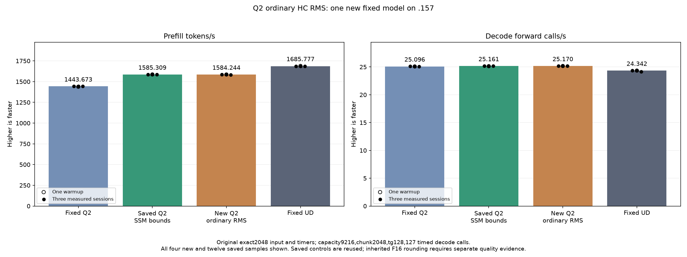

<!-- SPDX-License-Identifier: MIT -->
# Ordinary HC RMS model result

The retry completes one new original-Q2 model on `.157`. The isolated ordinary
RMS component benefit does not produce a measured full-model improvement:
median prefill changes **−0.067176%** against the retained SSM-bounds parent;
decode changes **+0.035194%**. The measured prefill ranges overlap. Preserve
this small negative observation without claiming a demonstrated regression or
speedup. Keep the previous best **1585.308983 PP /25.16079073 TG**.

All21 saved input/token/logit files equal the parent byte-for-byte, and the nine
within-arm repeat checks are exact. Fixed Q2 and UD token outputs also agree;
their inherited matched-history logits/KL differences remain unchanged. This
is no new independent task-quality or upstream numerical qualification.

The candidate selects the qualified ordinary RMS owner only at n>=96. All
original162 numerical bodies and the added qualified body retain exact ISA
identity. MoE/scalar/decode dispatch, persistent allocations, executor lifetime,
callbacks, streams and the public C17 ABI/state/metrics contracts are unchanged.

## Fixed protocol and comparison

Use the original exact2048-token input SHA
75343e606f5b815fe01f69ddc6ce50a997e2de96d8a20304a82a7f24f1180b35,
capacity9216/chunk2048,128 output tokens/127 timed decode forward calls,
C1 greedy/MTP off, one warmup and three measured repetitions. Each15-second
pause and all compilation/loading remain outside PP/TG timers. The qualified
component and saved fixed Q2/UD/SSM-bounds controls are reused without rebuild
or rerun. These are historical comparisons, without contemporary bookends.

| Arm | Median prefill tokens/s | Median decode calls/s | Median prefill seconds | Median decode seconds |
| --- | ---: | ---: | ---: | ---: |
| Fixed Q2, saved | 1443.672867 | 25.09595499 | 1.418603928 | 5.060576497 |
| SSM bounds parent, saved | 1585.308983 | 25.16079073 | 1.291861727 | 5.047536119 |
| Ordinary RMS, new | 1584.244040 | 25.16964571 | 1.292730128 | 5.045760336 |
| Fixed UD, saved | 1685.777092 | 24.34174251 | 1.214869991 | 5.217375049 |

## Every sample, including warmups

| Arm | Repetition | Prefill tokens/s | Decode calls/s | Prefill seconds | Decode seconds |
| --- | --- | ---: | ---: | ---: | ---: |
| Fixed Q2, saved | Warmup | 1438.259006 | 25.08847266 | 1.423943804 | 5.062085753 |
| Fixed Q2, saved | 1 | 1443.398207 | 25.10565683 | 1.418873870 | 5.058620886 |
| Fixed Q2, saved | 2 | 1443.672867 | 25.08698337 | 1.418603928 | 5.062386263 |
| Fixed Q2, saved | 3 | 1443.841794 | 25.09595499 | 1.418437954 | 5.060576497 |
| SSM bounds parent, saved | Warmup | 1586.508538 | 25.13300114 | 1.290884953 | 5.053117186 |
| SSM bounds parent, saved | 1 | 1586.342395 | 25.17262901 | 1.291020152 | 5.045162344 |
| SSM bounds parent, saved | 2 | 1584.079076 | 25.16079073 | 1.292864751 | 5.047536119 |
| SSM bounds parent, saved | 3 | 1585.308983 | 25.15297051 | 1.291861727 | 5.049105431 |
| Ordinary RMS, new | Warmup | 1585.951709 | 25.16578653 | 1.291338184 | 5.046534105 |
| Ordinary RMS, new | 1 | 1584.344759 | 25.16442539 | 1.292647947 | 5.046807071 |
| Ordinary RMS, new | 2 | 1584.244040 | 25.17862403 | 1.292730128 | 5.043961094 |
| Ordinary RMS, new | 3 | 1583.019127 | 25.16964571 | 1.293730420 | 5.045760336 |
| Fixed UD, saved | Warmup | 1689.043527 | 24.34239962 | 1.212520558 | 5.217234208 |
| Fixed UD, saved | 1 | 1686.364042 | 24.34621613 | 1.214447147 | 5.216416355 |
| Fixed UD, saved | 2 | 1685.777092 | 24.34174251 | 1.214869991 | 5.217375049 |
| Fixed UD, saved | 3 | 1685.400011 | 24.15102104 | 1.215141798 | 5.258576845 |

The new prefill range1583.019127–1584.344759 overlaps the saved parent
1584.079076–1586.342395. The best retained Q2 still needs6.337447% more PP
throughput, or76.991736ms less prefill, to match fixed UD at this point.
No Q4 or full-curve rerun is admitted while this diagnostic gap remains.

[CSV](figures/q2-hc-rms-owner-ordinary-model.csv),
[SVG](figures/q2-hc-rms-owner-ordinary-model.svg),
[machine result](../config/q2-hc-rms-owner-ordinary-model-results.json),
[source](../config/q2-hc-rms-owner-ordinary-source.json),
[qualified component](Q2-HC-RMS-OWNER-RESULTS.md).

## Execution and disposition

Two initial CPU launcher attempts retain actual [0,0,8] failures: a new test
used an unsupported replay label, and the new selector's diagnostics conflicted
with the existing all-counting-mode assertions. Correct the selector/tests;
host-r3 then passes36/36 Debug and36/36 ASan/UBSan, all six exits0. Preserve
both failed cohorts and their complete collections.

The new model configure/build/link-inspection/run commands all exit0. All26
model artifacts and seven qualified host artifacts collect and verify before
release. No weight hash, conversion, dependency installation, tuning, foreign
termination, remote cleanup or publication occurs. Sources remain durable
outside `/tmp`; saved comparator binaries and evidence remain intact.

Release 2026-10-06T10:44:44.338440+00:00 / SHA
6b3c8f27beb98a94162aee19d70a682aa4068fe216c12c193e88e155a3268851
retires1408 identities/1127 groups, verifies empty KFD, the four original GPU
leases and original Core CPU lease free/unchanged, and all seven original model
stat tuples unchanged. Canonical/main/remote mirrors agree; Core is informed
before local model analysis. No job, lease, window, waiter, reservation or
restart remains. Historical failure closure is retirement evidence only.

Keep this private candidate and its exact replay evidence; it is not promoted
as the performance default. The next unmeasured priority is IQ2 gate/up producer
ownership and its whole640-column scale/packing boundary. Current packing
already retains20 values per lane with one input read; removing an extra read
from that loop is not an unexplored optimization. The producer must preserve
original FMA/SwiGLU/F16 boundaries and avoid multiplying registers or repeated
consumer conversion. That work remains preparation, with no new rate or
GPU admission. Full-curve parity and independent task-quality remain open.
