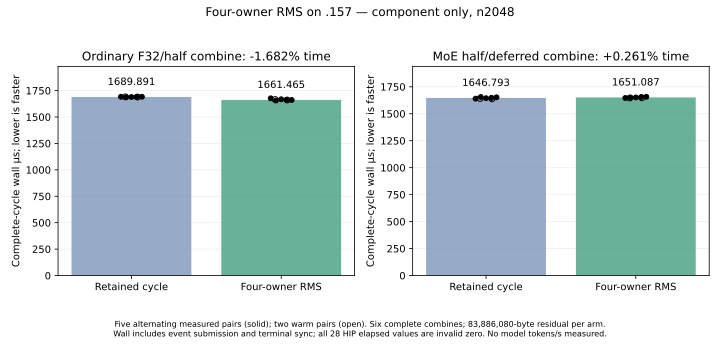

<!-- SPDX-License-Identifier: MIT -->

Subsequent [ordinary-only original-model retry](Q2-HC-RMS-OWNER-MODEL-RESULTS.md)
completes:1584.244040 PP,−0.067176% versus the saved parent, all21 files exact.
The component gain below does not establish a full-model speedup; keep1585.308983.
# Four-owner HC RMS: whole-output qualification

On .157, the ordinary F32/half combine's complete-cycle wall time falls
**1.682111%**, while MoE half/deferred time rises **0.260699%**. All120 whole
output records are bitwise exact, including the post-timing residuals,
normalization/scales and half outputs. Select only the ordinary owner route
for the next original-model candidate; preserve the MoE observation independently.

The fixed model comparison is unchanged: Q2 **1585.308983 PP /25.16079073 TG**
versus UD **1685.777092 PP /24.34174251 TG**, exact2048/tg128. Required PP saving
remains **76.991736ms /6.337447%**. A component gain is not a new model rate,
independent quality result or proof of full-curve parity.

## Every timing sample

The two n2048 shapes each use an83,886,080-byte residual payload, exceeding
the32MiB MALL. Two warm/five measured pairs alternate execution order. Each
sample times six complete combines after a separate reset to the same initial
residual. Allocation/upload/reset/copy/read/hash are outside the timer.

Values below are monotonic complete-cycle wall microseconds, including event
submission and terminal synchronization. All28 HIP elapsed samples are zero,
with raw binary32 bits0; they are preserved as invalid. No pure GPU timing or
model tokens/s is inferred from these durations.

| Pair | Ordinary retained | Ordinary owner | MoE retained | MoE owner |
| --- | ---: | ---: | ---: | ---: |
|Warm0|1690.332333|1665.099667|1641.280167|1646.418500|
|Warm1|1688.939000|1660.696333|1638.538667|1647.668500|
|Measured2|1691.115667|1676.741000|1640.143667|1646.101833|
|Measured3|1687.627333|1655.775000|1655.226500|1649.375000|
|Measured4|1689.000667|1667.751333|1644.005167|1651.086667|
|Measured5|1689.890667|1661.464833|1646.793500|1654.238167|
|Measured6|1691.502167|1661.133000|1652.245000|1657.449833|
|Measured median|1689.890667|1661.464833|1646.793500|1651.086667|
|Owner time change||−1.682111%||+0.260699%|

The ordinary measured ranges do not overlap. The MoE ranges overlap; preserve
its small negative median observation without asserting a robust regression
or mixing it into an ordinary-only candidate.

[All28 records, actual order, warmup flags and raw HIP identities](figures/q2-hc-norm-owner.csv).

## Exact numerical and ownership evidence

All38 cases run with complete guarded output comparisons and38 immutable-input
checks. Coverage includes n1/17/97/129/257/2048, normal/tiny inputs, ordinary
and aligned/misaligned MoE,1/10/16 experts, ten injection parts, gate stride3,
absent gamma and optional absent half. Every produced F32/F16 value is written
and finite. Absent/nonselected output payloads remain untouched. All120 records,
including the six post-timing outputs after repeated residual updates, are exact.

The source/ISA preparation matches all164 numerical bodies/resources to the
private probe, including162 unchanged original production bodies. The actual
component source capsule verifies140 frozen tested files/eight manifests and
the retained1027-file provider. The standalone binary remains unchanged before
and after execution. This synthetic component loads no original model weights
and cannot establish original-model quality or performance.

Host36/36 Debug and36/36 ASan/UBSan pass, nine focused owner regression methods
plus the component-only mode/source guard. All six host command exits and three
component configure/build/run exits are zero. The component is terminal at
2026-10-06T10:16:43.391060UTC. Seven host/four component artifacts are collected
and verified before release.

Release **10:17:30.469914UTC**, SHA
27506424d933e66e9db292653d130a713dac5d8c03d8f9cb05d169e1e10c3d92,
retires1388 identities/1111 groups. KFD is empty; four original GPU leases and
the Core CPU lease remain unchanged/free, seven model stat tuples unchanged.
Canonical/main/remote mirrors agree. Core receives closure before local
analysis. No job/build/client/lease/window/waiter/reservation/restart or remote
cleanup remains. Further GPU work needs fresh coordinated admission.

## Ordinary-only model candidate prepared

A new private1028-file provider derives from the measured1027-file parent.
Only the existing validated F32/half combine at n>=96 selects the qualified
ordinary owner kernel. Smaller rows/scalar decode and all MoE dispatch remain
unchanged. There is one added include and one changed launch file, no executor
lifetime, persistent allocation, callback, stream or public C17 ABI change.

Its new ordinary kernel's instructions/operands/resources match the qualified
fixture exactly; all162 original production bodies remain identical. The source
and ISA comparison pass locally. The qualified component and Q2/UD comparators
are not rerun. Original-model runtime wiring, matching host checks, a separate
model-only plan/window and the original exact2048/tg128 measurements remain
pending. No model gain, adoption or numerical promotion is reported yet.

The complete context curve/Q4 stay deferred until the agreed fixed gap closes.
The goal remains full PP/TG parity across the agreed curve, beyond this point.

[Component result](../config/q2-hc-norm-owner-component-results.json),
[host gate](../config/q2-hc-norm-owner-host-results.json),
[frozen plan](../config/q2-hc-norm-owner-plan.json),
[release](../config/q2-hc-norm-owner-window-release.json),
[ordinary-only source](../config/q2-hc-rms-owner-ordinary-source.json),
[163-body source/ISA audit](../config/q2-hc-rms-owner-ordinary-static.json).
