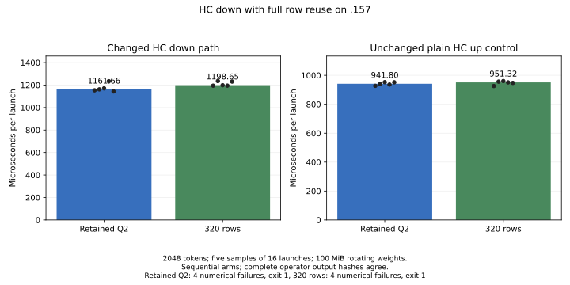
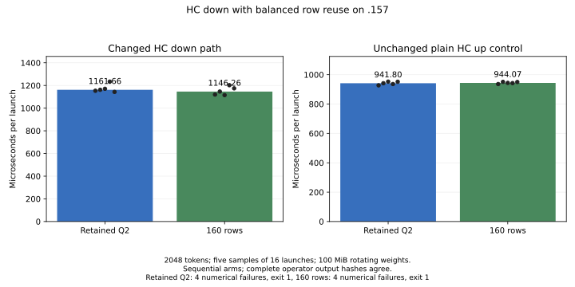
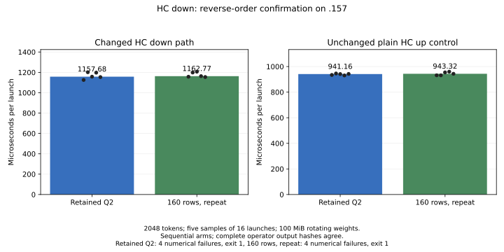

<!-- SPDX-License-Identifier: MIT -->
# HC row reuse preserves outputs without a consistent speed gain

Neither geometry is selected. On `.157`, a full 320-row HC down tile increases
median component time **3.18%**. A 160-row tile initially reduces it **1.33%**,
but a reverse-order confirmation increases it **0.44%**. All complete operator
outputs remain exact; the four inherited fallback numerical failures remain
unchanged. No complete-model benchmark follows these component results.

The retained [paired HC up](Q2-HC-UP-CHAINS.md) source and its prior
**1335.84 PP / 24.09 TG** measurement remain the development reference.
Its recorded gap to that window's UD control is 20.09% PP / 0.99% TG.
This campaign adds no model-throughput, quality, long-context or parity claim.

## Hypothesis and arithmetic

The latest [Q2/UD profile](Q2-HC-SINGLE-CHAIN.md) attributes 89.885 ms of extra
prefill kernel time to HC down. Its original-F16 matrix is M320/K10240; the
retained 64x128/BK2 mapping uses five row blocks for each input stripe.
The new mappings share that stripe across more output rows while preserving
both ordered K16 accumulation chains and their final F32 addition.

The first candidate covers all 320 output rows with a 32-token tile and four
row/two token waves. The second covers 160 rows with a 64-token tile and two
row/four token waves. Both have five 16-row result tiles per wave. A dedicated
epilogue writes the final unpaired tile without reading or overwriting another
wave's rows. Every other specialization retains its original epilogue.

| Mapping at n2048 | Blocks | VGPRs | LDS bytes | Private bytes | Logical input staging | Logical weight staging |
| --- | ---: | ---: | ---: | ---: | ---: | ---: |
| Retained 64x128/BK2 | 80 | 251 | 24,576 | 0 | 200 MiB | 100 MiB |
| Full row 320x32/BK2 | 64 | 241 | 45,056 | 0 | 40 MiB | 400 MiB |
| Half row 160x64/BK2 | 64 | 210 | 28,672 | 0 | 80 MiB | 200 MiB |

Staging counts describe one complete projection's block-level reads, not
physical DRAM traffic. Cache reuse can change their hardware cost. Register
and LDS counts are compiled resources, not measured occupancy. The half-row
mapping halves weight staging and reduces LDS relative to full-row, but it
does not produce a stable timing advantage over the retained mapping.

Original F16 weights, the existing narrowed input, scalar decode, paired HC up,
routed IQ2/Q2, PLE, model files and the public ABI remain unchanged. All eleven
shared dense specialization instruction bodies match the retained assembly
after normalizing function-local labels. No persistent buffer or launch is added.

## Measurements and numerical evidence

Each component arm runs the existing 22-case FP64 fixture, followed by five
samples per shape. Each sample rotates sixteen matrices over sixteen launches:
**100 MiB** of original-layout synthetic weights. GPU events exclude transfers,
initialization and oracle checks. HC down and plain HC up use 2048 tokens.
The latter is an unchanged control, separate from the retained fused-up path.

| Comparison | Reference down median, us | Candidate down median, us | Down time change | Reference / candidate up median, us | Control time change |
| --- | ---: | ---: | ---: | ---: | ---: |
| 320 rows | 1161.664486 | 1198.654056 | +3.18% | 941.802561 / 951.320112 | +1.01% |
| 160 rows, first pair | 1161.664486 | 1146.261454 | -1.33% | 941.802561 / 944.069088 | +0.24% |
| 160 rows, reverse-order pair | 1157.675028 | 1162.771702 | +0.44% | 941.157341 / 943.324566 | +0.23% |

The first two comparisons share one fresh reference. The confirmation runs
the 160-row candidate before a new retained reference, without source or
fixture changes. Down sample ranges overlap in both 160-row pairs. Its small
initial gain therefore does not survive the ordering check; no useful,
consistent component benefit admits the conditional model stage.

[Full-row report](../config/q2-hc-full-row-results.json) ·
[All samples in CSV](figures/q2-hc-full-row.csv)

[First half-row report](../config/q2-hc-half-row-results.json) ·
[All samples in CSV](figures/q2-hc-half-row.csv)

[Reverse-order report](../config/q2-hc-half-row-reverse-results.json) ·
[All samples in CSV](figures/q2-hc-half-row-reverse.csv)

There are fifty unique timing samples across the five component arms; the
shared first reference appears in two figures. All 22 complete operator output
hashes agree across all five arms: 88 cross-arm hash comparisons and 176 saved
sample/coordinate file comparisons are exact. Every changed-dispatch case
passes the independent `2e-5` limits. Four unchanged fallback cases fail in
every arm: down n32, n95, M319/K10240/n129 and M320/K10208/n129. All five actual
component exits 1 are preserved. The complete 22-case suite is not called a pass.
Timed-buffer checksums also agree; complete-output hashes refer to the operator
cases, not to every element of the rotated timing buffers.

## Source checks and next investigation

The [full-row generator](../tools/prepare-q2-hc-full-row.py) derives from the
retained paired-up tree at independent official Gufo pin
`f783fedb9bea2ec7de941f6da4e02f4a4596b29e`. The
[half-row generator](../tools/prepare-q2-hc-half-row.py) applies only the geometry
delta to that isolated full-row source. No sibling code or artifact is imported.

| Candidate | Patch | Source identity | Static qualification |
| --- | --- | --- | --- |
| 320 rows | [Patch](../experiments/q2-hc-full-row.patch) | [Source](../config/q2-hc-full-row-source.json) | [Checks](../config/q2-hc-full-row-static.json) |
| 160 rows | [Patch](../experiments/q2-hc-half-row.patch) | [Source](../config/q2-hc-half-row-source.json) | [Checks](../config/q2-hc-half-row-static.json) |

Device compilation, host fixture syntax, changed-file formatting and exact
1019-file reconstruction pass for each final source. The full upstream format
check retains exit 1 for the same two unchanged test files. An initial command
compiled the previous single-chain source; its successful exit is preserved
but excluded from qualification. Corrected commands bind the actual candidate
source hashes. An initial generic epilogue also changed control assembly;
the final isolated epilogue restores all eleven shared bodies exactly.

The next useful scope is the complete HC producer/consumer sequence. The earlier
[norm-copy profile](Q2-HC-NORM-FUSION.md) removed 59.428 ms of narrowing but added
22.205 ms to combines and 40.501 ms to the following down projection. That is
measured cost transfer; a cache explanation remains unproven. The HC fixture
and the actual model's `Uploader::Copy` both allocate weights with `hipMalloc`,
so mapped-file versus device-allocation policy does not explain this HC case.
The same allocation API does not prove identical placement or cache history.
A read-only, zero-fuzz dry run confirms that the earlier exact norm-copy patch
can be combined with the half-row source. No combined source is run or promoted
here. Further work should measure the producer and consumer together before
another geometry-only search.

## Validation and release

Both `.157` host cohorts pass 12/12 Debug and 12/12 ASan/UBSan; every component
capsule matches its qualified 43-file guard/fixture cohort. The
[campaign validation](../config/q2-hc-row-validation.json) verifies seven
runners, 27 command exits, 254 artifacts, both source reconstructions and all
saved comparisons. There are 22 command exits 0 and five inherited numerical
exits 1. Maximum GPU/CPU temperatures are 49 / 81 C. No original model is opened.
The [conditional model protocol](../config/q2-hc-full-row-protocol.json) remains
documented without launching model arms.

[Release](../config/q2-hc-row-window-release.json) at
**2026-10-03 05:54:12.255241 UTC** verifies seven runners and all 27 command
identities/groups/sessions absent, empty KFD and four original leases EX|NB/free.
[Independent retirement](../config/q2-hc-row-observer-retired.json) at
**05:55:21.869301 UTC** confirms the closure observer retired. Both observers
exit zero. The persistent `.157` receipt is `run/q2-hc-row-window-release.json`;
the shared registry records release. Direct thread notification again fails at
its MCP transport, so delivery is not claimed; the agreed ledger fallback
records the handover. No GPU job, waiter, automatic retry or runtime promotion
remains. Sources and raw evidence stay in persistent project paths.
