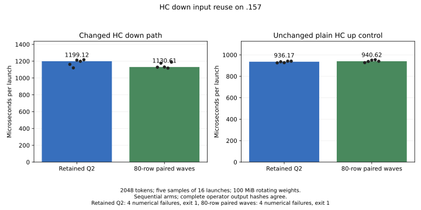
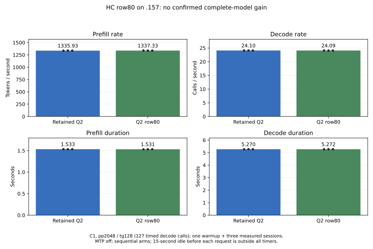

<!-- SPDX-License-Identifier: MIT -->
# HC down: 80-row tiles and paired accumulation waves

The candidate is **not selected**. It lowers isolated HC down median time by
5.71%, but the complete model moves only **1335.93 -> 1337.33 prefill tokens/s
(+0.104%)**, with overlapping sample ranges. Decode changes -0.0325% with
overlap and unchanged scalar dispatch. This screen establishes no useful
complete-model gain. Every saved model output remains exact, and the retained
paired-HC-up development source stays selected. Q2/UD parity remains unmet.

## Mechanism and source

The earlier [row-reuse experiment](Q2-HC-ROW-REUSE.md) reduced input staging by
increasing weight staging. This variant keeps the 128-token tile and covers
80 output rows instead of 64. At 2048 tokens, logical input staging falls from
200 to 160 MiB while logical weight staging stays at 100 MiB. These are
block-level byte counts, not measured physical memory traffic.

The original F16 operands, two ordered K16 accumulation chains and final F32
low+high addition are preserved. Physical wave pairs divide the two chains,
with coalesced 16-byte fetches. Eight logical wave pairs each cover five row
tiles and one token tile. The final unpaired 16-row output tile has bounded
stores. Only HC down M320/K10240/n>=96 selects the isolated kernel; scalar
decode, paired HC up, experts, attention, model storage and the ABI stay intact.

| Mapping at n2048 | Blocks | Threads/block | VGPR/thread | LDS bytes | Private bytes | Logical input / weight staging |
| --- | ---: | ---: | ---: | ---: | ---: | ---: |
| Retained 64x128/BK2 | 80 | 256 | 251 | 24,576 | 0 | 200 / 100 MiB |
| Row80 80x128/BK2 | 64 | 512 | 137 | 26,624 | 0 | 160 / 100 MiB |

The [generator](../tools/prepare-q2-hc-row80.py) derives from the retained
HC-up-chains source and this workstream's previously measured coalesced-wave
implementation. Both originate from independently fetched official Gufo pin
`f783fedb9bea2ec7de941f6da4e02f4a4596b29e`; no sibling project code or artifacts
are imported. Only `kernels.hip.cpp` changes. The
[source manifest](../config/q2-hc-row80-source.json) and
[patch](../experiments/q2-hc-row80.patch) bind the exact source. First-party code
keeps MIT SPDX markers, and upstream notices are preserved.

Static compilation, changed-file formatting, host fixture syntax and zero-fuzz
reconstruction of all 1019 source files pass. Eleven other dense instruction
bodies match the retained assembly after normalizing local labels.
[Static resources](../config/q2-hc-row80-static.json) alone do not establish
runtime occupancy, reduced DRAM traffic or speed.

## Component measurements

The existing 22-case independent FP64 fixture is unchanged. It covers both HC
shapes, n32/95/96/97/127/128/129/2048, tiny and alternating inputs, plus ragged
dimensions. All 22 complete-output hashes match across the two arms. The same
four fallback cases exceed the original 2e-5 limits: down n32, n95, M319/K10240
and M320/K10208. Both actual component exits remain 1 after all timings; the
complete suite is not labeled numerically qualified.

Each shape rotates sixteen original-layout `hipMalloc` matrices over 100 MiB,
with five samples of sixteen launches after warmup. GPU-event timing excludes
allocation, copies and numerical checks. The plain HC up shape is an unchanged
control, distinct from the model's fused paired-up path. Complete hashes cover
the operator cases; timed rotations retain finite-output checks and final-matrix
checksums, not a full hash of every rotated output. Equal allocation APIs do
not establish the same placement or cache history as full-model inference.

| Shape | Reference median [min, max], us | Row80 median [min, max], us | Time change |
| --- | ---: | ---: | ---: |
| HC down 320x10240 | 1199.119 [1120.829, 1217.356] | 1130.607 [1117.770, 1188.500] | -5.714% |
| Plain HC up control 10240x320 | 936.175 [925.563, 941.312] | 940.620 [927.683, 954.803] | +0.475% |

[Component report](../config/q2-hc-row80-results.json),
[all twenty samples in CSV](figures/q2-hc-row80.csv) and
[PNG](figures/q2-hc-row80.png) preserve the overlap and failures.

## Complete-model comparison

Both sources receive fresh full MMQ builds on `.157`. Each runs C1
pp2048/tg128, MTP/prefix reuse off, capacity 9216 and chunk size 2048, with one
warmup and three measured fresh sessions. A 15-second idle precedes each
session and is excluded from timing, as are loading and allocation. The first
generated token belongs to prefill; decode times 127 forward calls. All measured
requests emit 128 tokens without early EOS. Arms run sequentially, not as an
interleaved statistical trial or sustained serving workload.

| Source | Prefill tokens/s median [min, max] | Decode calls/s median [min, max] | Prefill median s | Decode median s |
| --- | ---: | ---: | ---: | ---: |
| Retained Q2 | 1335.933710 [1335.630934, 1337.397019] | 24.09672252 [24.09488433, 24.10157819] | 1.533010197 | 5.270426296 |
| Row80 | 1337.325450 [1336.725609, 1339.652362] | 24.08888365 [24.07134853, 24.10789467] | 1.531414810 | 5.272141369 |

The observed prefill median difference is only 1.595387 ms. Overlapping ranges
and unchanged-control variation do not establish a useful gain. No fresh UD
arm follows this rejection. The prior [matched retained Q2/UD comparison](Q2-HC-UP-CHAINS.md)
remains historical evidence of the unresolved gap; it is not relabeled as
part of this window.

| Source / repetition | Prefill tokens/s | Prefill s | Decode calls/s | Decode s |
| --- | ---: | ---: | ---: | ---: |
| Retained / 1 | 1335.630934 | 1.533357717 | 24.10157819 | 5.269364480 |
| Retained / 2 | 1337.397019 | 1.531332858 | 24.09672252 | 5.270426296 |
| Retained / 3 | 1335.933710 | 1.533010197 | 24.09488433 | 5.270828375 |
| Row80 / 1 | 1339.652362 | 1.528754816 | 24.10789467 | 5.267983859 |
| Row80 / 2 | 1337.325450 | 1.531414810 | 24.07134853 | 5.275981936 |
| Row80 / 3 | 1336.725609 | 1.532102016 | 24.08888365 | 5.272141369 |

The [model report](../config/q2-hc-row80-model-results.json),
[24-value CSV](figures/q2-hc-row80-model.csv) and
[PNG](figures/q2-hc-row80-model.png) retain all results. The shared plotter now
also accepts comparisons without a UD arm; it does not invent a missing control.

All 21 reference/candidate files match exactly, including full vocabulary
logits and input/output token files. The reference also reproduces the
21 retained checkpoint files, verified by the
[reference replay receipt](../config/q2-hc-row80-reference-replay.json).
All eighteen within-arm model replay checks pass. Exactness preserves this
development checkpoint; it does not resolve earlier independent quality drift
or qualify long contexts, concurrency, HTTP latency or the zero-regression goal.

## Validation, ownership and consequence

Debug and ASan/UBSan each pass 12/12 on `.157`. The
[campaign audit](../config/q2-hc-row80-validation.json) binds all five source
capsules and their frozen fixtures, 155 artifacts and twenty command exits:
eighteen zero, two inherited component numerical exits one. Original model
stat witnesses are unchanged. GPU/CPU observed maxima are 82 / 92.75 C.

Window release at **2026-10-03 07:40:59.295813 UTC** verifies all five runners
and twenty command identities/groups/sessions absent, empty KFD and four
original leases free. Independent observation at **07:42:53.752001 UTC**
verifies the closure observer retired. The
[release](../config/q2-hc-row80-window-release.json),
[retirement](../config/q2-hc-row80-observer-retired.json), shared registry and
coordination ledger record handover. Direct outgoing notification fails at
transport, so delivery is not claimed. No GPU job, waiter or retry remains.

This closes another reuse hypothesis without replacing the selected source.
Fewer logical reads and fewer registers were insufficient to establish a
complete-model improvement. Cache behavior is a possible explanation, not a
measured diagnosis. Further work should target the complete inference path
and the remaining expert/activation costs, rather than infer speed from these
static counts. This kernel experiment changes no reactive scheduling.
