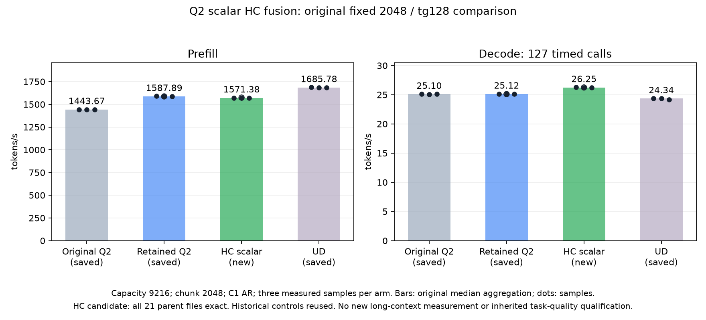
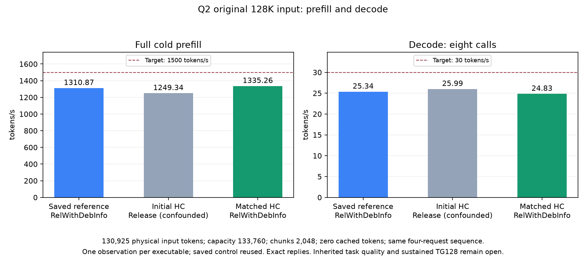

<!-- SPDX-License-Identifier: MIT -->
# Original-F16 scalar HC up/mix fusion

**Build qualification correction:** the initial fixed/native HC executables
were built as Release, whereas their saved controls use RelWithDebInfo.
The compiler revision is identical but instruction scheduling and resources
are not. Those measurements remain observations of the complete executables,
not isolated model-level fusion gains. The exact component pair remains valid.
The corrected candidate preparation is recorded after the128K result below.

The subsequent original-model .157 trial improves fixed-point C1 decode
from25.12414406 to26.24707057 token/s (+4.469512%), with all21 parent model
files byte-exact and nine internal replays exact. Prefill measures1571.380247
versus saved1587.893545 (-1.039950%). Retain both binaries; this is a measured
decode candidate, not a30TG/1500PP goal closure. The subsequent native32K
case below reaches26.825569 token/s with exact responses, about2.18% above
both saved controls using its same original request sequence.

The .157 component passes64 complete exact output comparisons and50
independent FP64 checks. With injection, completed operation time falls
42.970453 to34.630484us (-19.408613%); without injection it falls35.839672
to34.132219us (-4.764143%). All five measured pairs favor the candidate
in both modes. This qualified the original-model integration below.
Native128K results below do not confirm a decode gain; inherited task quality
remains unqualified.

This private decode component joins the native F16 HC up projection and the
following mix/injection into one launch. The retained provider is unchanged.
The original shape is hidden2560, low-rank320, four HC streams and ten
256-element injection slices. The proposed kernel retains each projection's
F32 FMA sequence and wave sum, each mix FMA and each injection reduction.
It adds no rounding or quantization boundary. Exact GPU replay is required;
compilation alone does not establish equivalence or speed.

One wave owns one hidden position and its four gates. Eight waves share a
block; ten designated blocks also compute the original injection slices.
The mixed result is written directly, eliminating the40KiB gate plane and
one kernel launch. This changes scheduling and register pressure:44 VGPR,
128bytes LDS and no private scratch/spills, versus19 VGPR for the original
projection and22 for its separate mixer. Logical traffic is not a measured gain.

The standalone fixture directly calls the retained original kernels as its
control. Six guarded input families cover small activations, cancellation,
signed zero and half/float subnormals, with and without injection. Complete
gate/mix/injection outputs require byte equality. A separate FP64 formula
checks sampled gates/mixes and all injection partials at unchanged2e-5
relative RMS/peak-scaled limits; F32 subnormals instead retain the GPU's
original arithmetic-mode replay requirement. Finite numerical failures are
preserved and do not suppress performance measurements.

Performance measures completed HIP graphs containing64 complete operations,
rotating16 independent original-F16 matrices totaling100MiB, beyond the
32MiB MALL. Two warmups precede five alternating-order paired measurements
per injection mode. Allocation, upload, poisoning and output checks stay
outside timers. The candidate's timed graph must never write the removed
gate plane. Raw GPU event times are valid only if finite and positive.

This is synthetic component qualification, not original-model PP/TG or
independent task quality. The scoped supervisor admits one300second .157
window after fresh coordination/lease/model-stat/KFD checks, with no model
access, remote build or cleanup. CPU child-lifetime tests precede admission.
Original source provenance is the independently fetched Gufo pin and the
1028-file retained provider in the [source manifest](../config/q2-hc-scalar-up-mix-source.json).
[Static resources](../config/q2-hc-scalar-up-mix-static.json) and local compiler
commands under evidence/q2-hc-scalar-up-mix-preparation are retained.

## Completed .157 result — 7 October 2026

| Complete operation | Original median us | Fused median us | Latency change |
|---|---:|---:|---:|
| HC up + mix + injection | 42.970453 | 34.630484 | -19.408613% |
| HC up + mix, no injection | 35.839672 | 34.132219 | -4.764143% |

Both modes use two graph warmups and five measured paired replays. All28 raw
device event times are zero/invalid; the table uses completed wall duration,
including synchronization, divided by64 complete graph operations. No timing
is inferred from those invalid event values. The largest independent relative
RMS error is2.52710553715e-7, below the unchanged2e-5 limit. Every differential
pair is byte-exact, inputs/guards survive and deleted gate planes stay unwritten
in the timed candidate. No precision or weight representation is reduced.

The CPU supervisor's success/failure lifecycle cases, preflight and GPU
component exit0. Local object/assembly/link and changed-file formatting pass;
the provider-wide formatting command retains exit1 on unchanged inherited
files, with its logs preserved. No retained provider source is edited.

Fresh coordination and preflight precede admission10:47:51.889888UTC.
The GPU process completes10:48:02.565352UTC; all11 raw artifacts collect and
match remote hashes before release10:49:10.590347UTC. Receipt64e2f31e records
1959 retired identities/1565 groups, empty KFD, five free original leases
and seven unchanged model stat tuples. Peak CPU/GPU37/37C. No model access,
remote build, service change or cleanup occurs; Core receives the release.
No GPU job/client/handle/lease/window/waiter/reservation remains.

[Audited results](../config/q2-hc-scalar-up-mix-results.json),
[all28 timing samples](figures/q2-hc-scalar-up-mix-samples.csv),
[frozen plan](../config/q2-hc-scalar-up-mix-plan.json),
[offline auditor](../tools/analyze-q2-hc-scalar-up-mix.py).

The component gate admitted the private integration and unchanged original-Q2
model comparison below. Its percentage must not be extrapolated to whole-model
decode or counted directly toward the30TG goal.

## Private model integration

The [integration generator](../tools/prepare-q2-hc-scalar-model.py) copies the
retained1028-file provider and changes only executor.cpp, kernels.hpp,
kernels.hip.cpp and one new include. The include is byte-identical to the
qualified component. All1029 resulting source files reconstruct from the
saved patch; the original provider is unchanged. The scalar eligibility
requires n_tokens1, original F16 down/up matrices at2560/320/four streams,
F32 or absent injection, F32 normalized inputs and `!MatrixRows(n_tokens)`.
That last condition excludes the single-logit head inside a prefill phase,
which originally uses the matrix path and its existing arithmetic.

The up Dense launch is skipped only for that eligibility. The fused call
occurs after the existing input-cache invalidations and leaves the existing
ten-part injection bookkeeping intact. No allocation, stream, model state,
C ABI or metrics change is introduced. Existing wide-prefill optimizations
and their inherited task-quality limitation remain as documented.

The complete original CMake Release target, including its own unchanged MMQ,
builds locally with the frozen counting harness; configure/build exit0.
Executor object relocation references the new launcher. No retained control
is rebuilt. [Source](../config/q2-hc-scalar-model-source.json),
[build identities](../config/q2-hc-scalar-model-build.json).
The next .157 window admitted only this new original-Q22048/tg128 process,
one warmup and three measured sessions, using saved parent/control results.

## Completed original-model result — 7 October 2026

| Original fixed2048/tg128 | Prefill token/s | Decode token/s |
|---|---:|---:|
| Fixed Q2, saved | 1443.672867 | 25.09595499 |
| Retained IQ2 fixed bounds, saved | 1587.893545 | 25.12414406 |
| New scalar HC, warmup | 1574.392732 | 26.24295711 |
| New scalar HC, measurement1 | 1571.380247 | 26.26203910 |
| New scalar HC, measurement2 | 1570.364534 | 26.24707057 |
| New scalar HC, measurement3 | 1571.871662 | 26.23981297 |
| New scalar HC, original median aggregation | 1571.380247 | 26.24707057 |
| Fixed UD, saved | 1685.777092 | 24.34174251 |

Capacity9216, chunk2048, physical input2048 and127 timed decode calls remain
unchanged. No historical control was rebuilt or rerun. All21 saved parent
inputs/tokens/logits match byte-for-byte, including arithmetic/counting smoke
and the fixed prompt; all nine internal output/frontier replays are exact.
Resident model bytes43,156,012,544 and deferred scratch7,946,240 are unchanged.
The candidate adds no precision boundary. These results establish no added
numerical difference on this workload; the parent's earlier intermediate
changes still need independent task-quality qualification.

All three decode samples exceed the saved parent's range. The observed
increase is4.469512%, not the component's19.408613%. Prefill regresses1.039950%
in this observation even though the optimized branch excludes prefill. Do
not erase that result, assume its cause, add separate percentage gains or
replace the retained best-prefill binary. Historical, noncontemporaneous
controls limit causal attribution. The next useful test is native C1 at the
unchanged32K input and then the original long-prefix scope, after staging
this exact provider; the full129K target remains unmeasured for this candidate.

[PNG](figures/q2-hc-scalar-model.png), [SVG](figures/q2-hc-scalar-model.svg),
[all parent/candidate warmup and measured samples](figures/q2-hc-scalar-model-samples.csv),
[audited model result](../config/q2-hc-scalar-model-results.json),
[frozen model plan](../config/q2-hc-scalar-model-plan.json).

CPU supervisor success/failure cases and preflight pass before admission
11:02:21.339035UTC. The only model command exits0 at11:04:00.937607UTC;
34 artifacts collect and verify before release11:05:14.110896UTC, SHA
f409048c74ef54a1bcc7714bbadeb973204700bfded7ef2994d73054cb602272.
All1960 identities/1566 groups are retired, KFD is empty, five original leases
free and seven original model stat tuples unchanged. Peak CPU70.375C/GPU77C.
Core receives the verified handover. No Q2 model job/client/handle/lease/window/
waiter/reservation remains; no remote build, dependency, tuning or cleanup occurs.

## Native32K preparation

The same1029-file provider now builds against the exact333-file frozen C17
core/adapter of the retained133760-capacity curve. The new private CMake
selection verifies both inventories and excludes other experimental providers.
The previously qualified own MMQ archive is hash-bound and reused unchanged;
no retained server or client is rebuilt. Local configure/build exit0.
[Native build](../config/q2-hc-scalar-native-build.json).

One new native32K server is planned on loopback port8000 with the saved
synapse-lie-bench87d856cf. The four serialized requests remain exactly
200e66bd: three original preparations then32711 physical tokens, sixteen
prefill calls (full2048 intermediates), zero cached tokens and eight decode
calls. This is the original native depth point, not TG128 or a new full curve.
The runner preserves both child exit codes even on failure; CPU fixtures
check owned child retirement and reject altered requests/cache/call counts
using private ephemeral ports. Original128K observations remain unchanged.

## Completed native32K result — 7 October 2026

The same four serialized requests complete with zero cached tokens,
32711 physical tokens, fifteen full2048 chunks plus1991 final tokens and
eight output/decode calls. Server/client exit0; response content, streamed
token pieces, usage and finish reasons match both same-sequence saved
controls in all four cases. This is a native C17 HTTP/worker/adapter result,
separate from the direct2048/tg128 measurement above.

| Saved or new observation at32K | Prefill token/s | Decode token/s | Request sequence |
|---|---:|---:|---|
| Original retained full curve, unchanged | 1402.245716 | 26.234155 | Earlier complete prefix sequence |
| Retained A1, saved | 1426.532712 | 26.250492 | Three preparations then original32K |
| Retained A2, saved | 1422.901121 | 26.253731 | Three preparations then original32K |
| New scalar HC | 1419.137366 | 26.825569 | Same three preparations then original32K |

Against A1/A2, native decode improves2.190726%/2.178118%; prefill regresses
0.518414%/0.264513%. Against the older full-curve observation the rates are
nominally+1.204614% PP/+2.254364% TG, but its preceding sequence differs.
Keep every reference separate: no replacement baseline, new aggregation or
new control run. The new point is one observation and eight output calls,
not sustained TG128 or proof of the128K target. It demonstrates that part of
the decode benefit survives the native graph path and longer context.

The numerical core, sampling, chunking and original request bytes are fixed;
this adds no precision reduction. Native reply equality is narrower evidence
than the21 full input/token/logit files in the direct trial and does not
qualify inherited parent task quality. Keep both providers for the observed
prefill/decode tradeoff. The next depth test should reuse this exact native
binary and the saved130925-token request; do not rebuild it to expand depth.

All15 artifacts collect and match remote SHA-256 before release
11:25:23.218979UTC, SHA
f57e3961aec8b3242b671b872a560144bdb0c96a32894162a9b3aa35f1a5fc3d.
The release/registry retire1962 identities/1568 groups, with KFD empty,
all five original leases free and seven original model stat tuples unchanged.
Sampled peak CPU86.375C/GPU87C. Core receives the handover; no Q2 job/client/
handle/lease/window/waiter/reservation remains. No remote build or cleanup.

The first offline audit exits1 because tuple token pieces in the in-memory
validator were compared with their JSON-list serialization. Only container
normalization is corrected; values, requests and tolerances are unchanged.
The original failure is retained under evidence/q2-hc-scalar-native-preparation,
and the corrected audit exits0 without rerunning inference.
[Full result](../config/q2-hc-scalar-native32-results.json),
[frozen plan](../config/q2-hc-scalar-native32-plan.json),
[offline audit](../tools/analyze-q2-hc-scalar-native32.py).

## Original128K follow-up preparation

The next depth point reuses native server578e3320 and C client87d856cf without
rebuilding either. The exact four-request filefcee51ef is shared by the saved
unprofiled final128K measurement and the later diagnostic profile. Only the
unprofiled1310.874605 PP /25.344213 TG observation is a throughput reference.
The full prefix is130925 tokens,63 complete2048 chunks plus1901 final tokens,
zero prefix-cache hits and eight output calls at capacity133760. No change to
sampling, precision, prompt bytes, output budget or cache policy is planned.
The dedicated128K supervisor preserves the already qualified32K child
lifecycle and changes only the frozen shape, input identity and ownership
label. CPU fixtures on .157 must verify saved-input rejection and child
success/failure retirement before fresh admission. Long-depth results and
inherited task-quality qualification remain open until measured.

## Original128K observation and build audit — 7 October 2026

The saved server578e3320 and client87d856cf complete the exact original
four-request filefcee51ef. All response content, token pieces, usage and
finish reasons match the saved unprofiled final128K control. The prefix has
130925 tokens,64 calls (63x2048+1901), zero cached tokens and eight output calls.

| Original128K observation | Prefill token/s | Decode token/s |
|---|---:|---:|
| Saved retained, unprofiled | 1310.874605 | 25.344213 |
| Initial HC Release | 1249.340740 | 25.987615 |
| Observed change | -4.694108% | +2.538657% |

Prefill takes104.795270s versus99.876067s; the1500 target allows87.283333s.
Decode takes38.479868ms/call;30 token/s requires33.333333ms/call. This is one
observation with eight output calls, not sustained TG128. Keep the prior
best-prefill executable; no whole-goal or independent-quality acceptance.

Active samples (GPU busy>=80%) show mean clocks2565.55 versus2625.02MHz and
mean GPU busy90.89% versus95.63%. Sampled peak CPU/GPU are92.375/97C versus
97.5/99C. These observations do not establish the regression's cause. The
cache capture also rises212.72 to623.57ms, outside the prefill timer; it cannot
be subtracted from the measured prefill time. No clock normalization or altered
temperature limit is used to recover a rate.

The offline binary audit finds an additional uncontrolled difference: the
old build is RelWithDebInfo, the initial HC build Release. Both record AMD
Clang22/f58b06dc and the HIP target adds-O3, but the differing debug/codegen
configuration still changes595 of920 common device-function byte sequences,
147 function sizes and132 resource records. A sampled SwigluHalf tail shows
different instruction scheduling, not just relocated addresses. The same
build-type mismatch also affects the initial fixed2048 HC comparison. This
does not erase exact token/logit evidence, but prevents attributing those
model-rate deltas solely to the new fusion. No performance control was rerun.

The new matching RelWithDebInfo build regenerates only the HC candidate and
its own MMQ. Configure/build exit0; serverf2ceaa65 preserves all333 core and
1029 provider source identities. It retains every common function size and
resource record;907 of920 common functions are byte-exact, and the13 remaining
disassemblies differ only in address literals (including diagnostic strings).
Two functions are the added HC variants. Static comparison is not runtime
qualification. The next window admits only this corrected candidate on the
same original130925/8 input, with fresh CPU checks and ownership admission.
[Matching build](../config/q2-hc-scalar-matched-build.json),
[device-code auditor](../tools/audit-q2-native-device-code.py).

The first128K window's CPU tests, verify, run, server and client exit0.
All22 raw artifacts collect/hash before release11:45:00.617434UTC,
SHAc8a3b6773443278305262a5a150ff72843c6f82fe5a6fff5b98b24ca00553865:
1964 identities/1570 groups retired, empty KFD, five original leases free,
seven model stat tuples unchanged. Latest registry matches independently;
Core receives closure. No remote build or cleanup. An initial remote-shell
transport exit127 occurs before Python/GPU admission and is retained; using
python3-c corrects transport without changing the test.
[Result](../config/q2-hc-scalar-native128-results.json),
[plan](../config/q2-hc-scalar-native128-plan.json),
[offline auditor](../tools/analyze-q2-hc-scalar-native128.py).

## Matching-build original128K result — 7 October 2026

The corrected serverf2ceaa65 uses the saved RelWithDebInfo configuration,
unchanged compiler revision, same1029-file provider and same333-file C17 core.
The saved client87d856cf replays the same original four requestsfcee51ef;
all content, streamed token pieces, usage and finish reasons remain exact.
No reference is rebuilt/rerun and no new precision boundary is introduced.

| Original128K observation | Prefill token/s | Decode token/s |
|---|---:|---:|
| Saved retained RelWithDebInfo | 1310.874605 | 25.344213 |
| Initial HC Release, build-confounded | 1249.340740 | 25.987615 |
| Matching HC RelWithDebInfo | 1335.257764 | 24.825466 |

The matching-build observation is+1.860068% PP and-2.046807% TG versus the
saved reference. Its prefill98.052229s exceeds the1500 target by10.768896s;
decode40.281218ms/call exceeds the30 target by6.947885ms. The candidate's
native128K decode benefit is not confirmed. Keep the saved reference and
both experimental binaries; no overall promotion. These are eight output
calls, not sustained TG128, and exact responses do not settle inherited
task quality. The scalar branch excludes prefill, so the nominal PP increase
is not evidence that this decode fusion accelerates prefill.

Active telemetry (busy>=80%) reports2661.92MHz mean clock/96.73% mean busy,
versus saved2625.02MHz/95.63%; sampled CPU/GPU peaks92.125/97C. No causal
claim or clock-normalized rate follows. The matched new HC kernel itself has
3024 instruction bytes versus3000 in Release, retaining44VGPR/no private
scratch; the next bounded decode check should measure the component under
the matching configuration before another model run. Prefill optimization
still needs the unchanged2048-row expert/dense chain, not smaller chunks.

Fresh Core own non-use, CPU fixture pass and verify11:58:57 precede
admission11:59:43.943212UTC, sourcefb355e95/plan5b06f7d5. Run/server/client
exit0; all23 raw artifacts collect/hash before release12:02:55.635711UTC,
SHA893459ca2d2a2f604b073f1a8e3f34631133b9b64f68a9f4948dd76479b430c8.
All1966 identities/1572 groups are retired, KFD empty, five original leases
free, seven model stat tuples unchanged, latest registry independently matched.
Core receives closure; no Q2 job/client/handle/lease/window/waiter/reservation
remains. No remote build, dependency installation, tuning or cleanup.

[PNG](figures/q2-hc-native128.png), [SVG](figures/q2-hc-native128.svg),
[exact-value CSV](figures/q2-hc-native128.csv),
[matching result](../config/q2-hc-scalar-native128-matched-results.json),
[matching plan](../config/q2-hc-scalar-native128-matched-plan.json).

## Phase-specific compilation

Phase-specific HC compilation prepared — 2026-10-07 UTC: the decode-only
up/mix kernel moves to its own HIP translation unit, with -g0 confined to
that file. The common backend keeps the saved RelWithDebInfo build and
original kernel source. Static audit finds918/920 common device functions
byte-exact; the two differences are diagnostic helpers, with no common
size/resource changes. Both fused kernels exactly match the first measured
component and the production objects linked into the new fixture. The
executor and its prefill-phase exclusion remain byte-identical to the parent;
no precision boundary or runtime allocation is added. Build/link and changed
HIP formatting pass; provider-wide formatting retains inherited failures.
Runtime component/model qualification is pending; no performance promotion.
[Source and static audit](../config/q2-hc-scalar-isolated-static.json).
