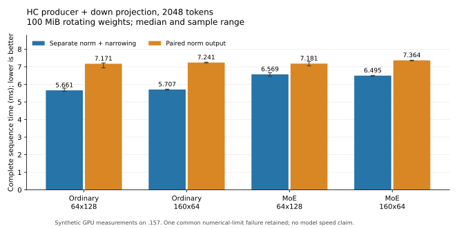

<!-- SPDX-License-Identifier: MIT -->
# HC norm producer and down projection as one sequence

Producing the F16 copy alongside the F32 norm makes the complete synthetic
HC sequence slower: **26.69% ordinary / 9.31% MoE** with the retained down
geometry. The previously tested half-row geometry does not recover that cost.
All complete outputs remain exact, with one independent tiny-input failure
shared by both paths. Neither candidate is selected and no original-model arm
is admitted. The retained Q2 result remains 1335.84 PP / 24.09 TG, still below
UD; these new component durations are not model throughput.

## Why this experiment

The earlier [norm-copy experiment](Q2-HC-NORM-FUSION.md) reduced the producer
and narrowing time, but its full-model profile transferred that saving into
HC down. The new fixture includes that consumer inside each timed iteration.
Its purpose is to expose the interaction before another full-model campaign.
The [half-row follow-up](Q2-HC-ROW-REUSE.md) had not shown a stable isolated-GEMM
gain; combining it with the producer tests a distinct interaction hypothesis.

The reference sequence is ordinary `HcCombine` or retained `HcCombineMoeF32`,
then `NarrowActivations`, then the original-F16 320x10240 down projection.
The paired sequence uses an exact F32/F16 norm producer followed directly by
the same down projection. The original MoE kernel and dispatch are preserved,
instead of using the candidate with a null optional output as a control.
This allows both producers to be timed in alternating order in one binary.

Both source variants derive independently from official Gufo pin
`f783fedb9bea2ec7de941f6da4e02f4a4596b29e` and the retained HC-up-chains source.
The [sequence generator](../tools/prepare-q2-hc-sequence.py) rebases the prior
rounding-preserving producer patch and keeps original fallback dispatch.
The [geometry generator](../tools/prepare-q2-hc-sequence-half-row.py) adds the
previous BM160/BN64/BK2 geometry. Both patches reconstruct all 1019 source files
exactly. They remain isolated under `.deps/gufo-q2-bench-hc-sequence*`.

## Measured component results

Each arm uses 2048 tokens and five samples of sixteen complete iterations.
Sixteen device-allocated original-F16 matrices rotate over 100 MiB, exceeding
the 32 MiB cache. Production HC weights also use `hipMalloc`; equal allocation
APIs do not prove equal placement or full-model cache history. Both arms warm
up, alternate execution order and swap their output allocation assignments.
Residual reset, allocation, host copies, hashing and numerical checks are
outside HIP-event timing. There are no intermediate events or synchronizations
between the producer and consumer. All requests are synthetic and sequential.

| Down geometry | Producer | Separate median [min, max], us | Paired median [min, max], us | Paired time change |
| --- | --- | ---: | ---: | ---: |
| Retained 64x128 | Ordinary | 5660.652 [5598.626, 5782.526] | 7171.251 [6940.435, 7214.681] | +26.686% |
| Retained 64x128 | MoE | 6569.315 [6457.866, 6658.666] | 7181.129 [7047.250, 7297.934] | +9.313% |
| Half-row 160x64 | Ordinary | 5707.382 [5664.242, 5730.151] | 7240.563 [7220.939, 7263.073] | +26.863% |
| Half-row 160x64 | MoE | 6495.116 [6453.884, 6501.815] | 7364.358 [7338.428, 7375.511] | +13.383% |



[Every timing and full-buffer hash](../config/q2-hc-sequence-results.json),
[CSV](figures/q2-hc-sequence.csv) and [PNG](figures/q2-hc-sequence.png) are retained.
The [offline analyzer](../tools/analyze-q2-hc-sequence.py) binds all artifacts,
source capsules, fixtures, sample identities and actual exits.

Compared across binaries, the half-row paired sequence is another 0.97% slower
ordinary and 2.55% slower MoE. Its separate-producer controls change +0.83% and
-1.13%. These small cross-process differences do not justify a speedup claim;
the large paired-output regression is present in both geometries. A hardware
cache cause remains unproven: no cache-miss counters or physical memory traffic
were measured, and the fixture does not reproduce every full-model operation.

## Numerical and host qualification

Six independent cases cover 96/97/129 tokens with ordinary, tiny and alternating
inputs, on both ordinary and MoE producers. A separate FP64 formula checks every
residual/norm value. Projection dot products are independently accumulated in
FP64 at token/row tile boundaries using scalar IEEE-rounded F16 activations.
The existing 2e-5 relative-RMS and peak-scaled limits are unchanged. Complete
residual, norm, half and down buffers are compared, including scalar narrowing,
guards, input immutability and refusal before mutation for invalid dispatches.
Ten complete replay comparisons follow the timed samples in each binary.

All 128 within-arm full-buffer hash comparisons and 64 cross-geometry comparisons
match, as do all 36 saved norm/half/down file pairs. All six independent norm
cases pass in each binary. The ordinary n97 tiny-input down case fails its
peak-scaled check at **2.1601903e-5**, with relative RMS **1.5762204e-5**.
Reference and candidate are byte-identical in this case, across geometries.
This is an unresolved common numerical limit failure, not a newly introduced
drift or a passing qualification. Both component commands retain actual exit 1
after recording all timings. No tolerance or golden was changed.

Both `.157` CPU cohorts pass 12/12 Debug and 12/12 ASan/UBSan, covering host
parsers/runner guards rather than GPU memory sanitization or model inference.
Device/fixture/executor static compilation passes. The original fourteen
producer/dense assembly bodies remain exact in the sequence source; the
half-row source matches its earlier fourteen controls, and both paired
producer bodies are unchanged across the two new variants. The paired producers
use 84 VGPRs, 128/10368 LDS bytes and no private scratch. The full upstream
format check retains its two unchanged failing files; all changed upstream
files pass formatting. [Static identities](../config/q2-hc-sequence-static.json)
and the [half-row checks](../config/q2-hc-sequence-half-row-static.json) preserve
the distinction.

## Memory lifetime and reactive execution

The owner asks whether retiring RAM sooner can help reactive execution. It can
reduce live storage and resource waits when an existing lifetime is unnecessarily
long. A GPU completion frontier must cover the last consumer before storage is
reused, and another ready request may then use the available budget. Reduced
allocation/live bytes, concurrency throughput and C1 kernel time need separate
measurements. An asynchronous launch returning is not completion.

In this actual HC path, F32 `s_.xn` remains an input to `HcMixRawF16Gemm` and
its fused injection after the down projection. Its lifetime cannot end when
down finishes. The F16 input uses `s_.x_half`, which the fused up/mix then
overwrites with the mixed activation copy after its previous consumer, on the
same stream. The executor already reuses that allocation. The paired producer
adds no allocation but still materializes both normalized representations;
eliminating the narrowing launch does not retire either allocation or remove
the later need for normalized F32 values. This experiment contains no reactive
scheduler, concurrent requests or memory-pressure experiment and proves no
reactive gain or regression.

A next source-level hypothesis is to avoid materializing the large F32 norm:
retain the original normalization scale and residual, emit the down input, and
reconstruct the identical F32 values inside their later consumer. At 2048x10240,
the F32 tensor alone occupies 80 MiB; avoiding its write/read is different from
simply freeing its buffer later. This requires proving residual/scale lifetimes,
preserving each FP32 multiplication and F16 rounding boundary, and timing the
complete mix/injection sequence. It is not implemented or qualified by this
campaign and does not imply an 80 MiB allocation reduction in the current
shared-scratch executor. Another geometry sweep is not the next priority.

## Reproduction and closure

Use unique labels within a newly coordinated `.157` window. Each GPU/build arm
performs fresh four-lease admission; the examples are not an automatic retry.

```sh
python3 tools/q2-remote.py hc-sequence-bench q2-sequence-NEW --source-variant hc-sequence
python3 tools/q2-remote.py hc-sequence-bench q2-sequence-row-NEW --source-variant hc-sequence-half-row
python3 tools/q2-remote.py collect q2-sequence-NEW
python3 tools/q2-remote.py collect q2-sequence-row-NEW
python3 tools/analyze-q2-hc-sequence.py results.json q2-sequence-NEW q2-sequence-row-NEW
```

All four campaign runners and eighteen command identities/groups/sessions are
absent at **2026-10-03 06:35:11.147429 UTC**. KFD is empty and all four original
leases are EX|NB/free. Independent observation confirms closure-observer
retirement at **06:35:35.885265 UTC**; both SSH commands exit zero. The persistent
`.157` receipt is `run/q2-hc-sequence-window-release.json`, also recorded in the
shared registry and [locally](../config/q2-hc-sequence-window-release.json).
The two numerical exits remain 1; the other sixteen command exits are 0.
All 94 artifacts verify. No model was opened. GPU/CPU observed maxima are
61/79.625 C. Direct thread transport failed; the agreed ledger/registry fallback
records the handover without claiming delivery. No GPU job, lease, waiter or
automatic retry remains.
