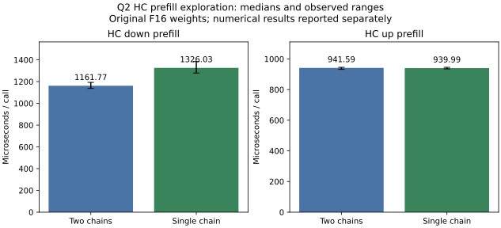

<!-- SPDX-License-Identifier: MIT -->
# Single-chain HC down is slower and adds numerical failures

The independently derived single-chain HC candidate is rejected. On `.157`,
HC down median time increases **14.14%**, from 1161.768 to 1326.033 us, despite
reducing static VGPR use from 251 to 219. Eight changed operator cases now
exceed the original FP64 limits; four existing fallback failures remain.
The unchanged plain-up control changes -0.17%. No complete-model benchmark is
admitted by this result. The retained paired-HC-up executor and its prior
1335.84 PP / 24.09 TG measurement remain the development reference; Q2/UD
performance parity is still unmet.

This is separate from the owner's
[bitfield and floating-point representation proposal](Q2-BIT-CONVERSION.md).
That static probe finds identical extraction code for bitfields and shifts,
and fewer conversion instructions for a bounded packed-half construction.
It has no GPU timing verdict and is not rejected by the HC result.

## Mechanism and source

Only original-F16 HC down at M320/K10240 and batch at least 96 changes.
The same low/high K16 products sequentially update one F32 accumulator,
replacing two separate ordered accumulators and a final addition. Both matrix
products remain. The 64x128 tile, BK2 staging, 256-thread launch, original
weights and activation narrowing are preserved. Paired fused HC up, scalar
decode, routed IQ2/Q2 and PLE are unchanged.

This deliberately changes rounding. Historical DS4's documented single-chain
mechanism motivated the experiment, but no DS4 source or artifact is imported
and its exactness does not transfer to this implementation. The generator
derives the candidate from this workstream's retained paired-up tree at the
independent official Gufo pin `f783fedb9bea2ec7de941f6da4e02f4a4596b29e`.
See the [generator](../tools/prepare-q2-hc-single-chain.py),
[single-file delta](../experiments/q2-hc-single-chain.patch) and
[source identities](../config/q2-hc-single-chain-source.json).

Device-only gfx1151 compilation, host syntax, changed-file formatting and exact
1019-file patch reconstruction pass. The complete upstream format check retains
exit 1, identical to the retained baseline's violations in two unchanged test
files. The [static record](../config/q2-hc-single-chain-static.json) preserves
both results. Down resources are 219 VGPR, 22 SGPR, 24 KiB LDS and zero private
scratch; paired HC up remains at 242 VGPR. A longer dependency chain is a
possible explanation for the time regression, not a measured causal finding.

## Fresh diagnostic Q2/UD profiles

Before the component comparison, fresh retained Q2 and pristine UD each run
marked pp2048/tg16 with fifteen decode calls. All **28 replay checks** match
their respective saved unprofiled model controls. The
[profile comparison](../config/q2-hc-single-chain-profiles.json) records kernel
time, not unprofiled request throughput.

| Prefill group | Q2 ms | UD ms | Extra Q2 ms |
| --- | ---: | ---: | ---: |
| HC down projection | 131.016 | 41.131 | 89.885 |
| Routed expert down | 263.964 | 179.360 | 84.604 |
| Explicit activation packing/narrowing | 71.833 | 6.885 | 64.949 |
| Other kernels | 742.846 | 712.540 | 30.306 |
| HC up projection | 82.316 | 56.554 | 25.762 |
| Routed gate/up | 265.306 | 241.311 | 23.995 |
| Q8 dense GEMV | 3.118 | 3.128 | -0.010 |
| **Kernel sum** | **1560.398** | **1240.908** | **319.490** |

The kernel spans are 1565.687 and 1245.325 ms; inter-kernel gaps are 5.289 and
4.417 ms. The warm C1 difference therefore remains predominantly inside GPU
kernels. Twelve fused WMMA causal-attention calls take 44.662 ms Q2 and
43.526 ms UD; this is not evidence of a missing attention implementation.

The offline classifier previously relied on exact template strings or a Q8
prefix. Appended accumulation flags caused retained HC down to fall into
`other` and paired F16 HC up to be labeled Q8. The fix reads the actual weight
flag, recognizes the recorded shapes and keeps unrelated operations separate.
Focused regression cases cover old/new signatures and both weight types. The
original trace files are preserved; the corrected report has complete time
accounting. Group aliases alone would have hidden the HC-up label error but
could not have recovered the missing down group.

## Component and numerical evidence

Each arm runs the existing 22 independent FP64 operator cases and ten timing
samples: five each for down and the unchanged plain-up control. Each timing
sample rotates sixteen matrices, **100 MiB** of weights, for sixteen launches.
GPU events exclude initialization and validation. This is a shaped synthetic
component comparison, not original-model throughput or serving concurrency.

| Shape | Reference min / median / max, us | Single-chain min / median / max, us | Median time change |
| --- | ---: | ---: | ---: |
| HC down 320x10240 | 1137.819 / 1161.768 / 1192.796 | 1278.551 / 1326.033 / 1384.282 | +14.14% |
| Plain up control 10240x320 | 932.245 / 941.587 / 945.277 | 935.039 / 939.991 / 945.066 | -0.17% |

All [twenty timing samples](figures/q2-hc-single-chain-samples.csv),
[range summary](figures/q2-hc-single-chain.csv) and
[numerical report](../config/q2-hc-single-chain-results.json) are retained.
All eight admitted down operator cases change complete-output hashes and fail
the unchanged `2e-5` relative-RMS/error-over-peak limit. At n2048, relative RMS
rises from `1.5904e-5` to `3.1831e-5`. Other complete output hashes are exact;
the four preexisting fallback failures are identical. Total failures are
therefore 4 in the reference and 12 in the candidate. Both actual exits 1 are
retained, with all performance samples completed and finite. The maximum
saved sampled-value difference is `7.7963e-5`; no complete-model quality claim
follows from this component result.

## Qualification and closure

Two `.157` CPU cohorts pass 12/12 Debug and 12/12 ASan/UBSan; the second includes
the profile-classification fix. The qualified source/guard capsules match all
six collected arms. [Validation](../config/q2-hc-single-chain-validation.json)
verifies 162 artifacts, thirty command exits 0 and the two numerical exits 1.
The [conditional model protocol](../config/q2-hc-single-chain-protocol.json)
is preserved but its full-model benchmark arms are not launched.

The window is released at **2026-10-03 05:04:19.071141 UTC**. Six runners and
32 command identities/groups/sessions are absent, KFD is empty, all four
original leases are free and five original model stat witnesses are unchanged.
The persistent `.157` receipt is `run/q2-hc-single-chain-window-release.json`;
the shared registry records the release. Independent observation at
**05:05:39.030000 UTC** confirms the closure observer retired. The direct
inter-thread notification fails at its HTTP transport; delivery is not claimed,
and the agreed registry/ledger fallback records the handover. No GPU job,
waiter, automatic retry, model mutation or runtime promotion remains.
