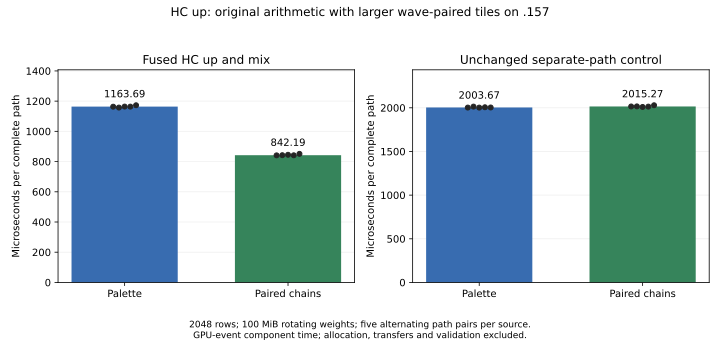
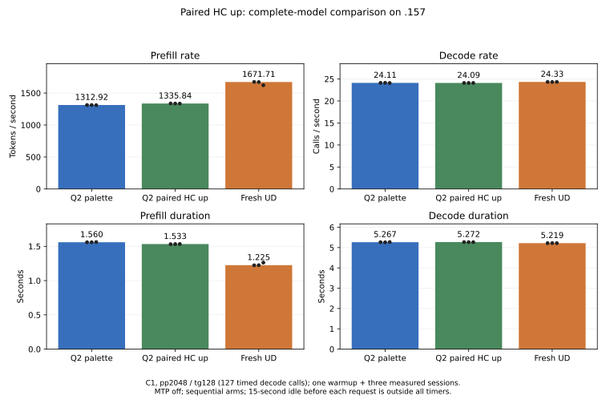

<!-- SPDX-License-Identifier: MIT -->
# HC up: larger tiles with paired accumulation waves

The `.157` synthetic full-path comparison reduces HC up projection and mixing
median time **1163.686 -> 842.188 us (-27.63%)**. All 62 saved cross-source
files are byte-exact; all eleven independent FP64 cases and all five timed
replays per arm pass. The unchanged separate-path control differs +0.58%.
Fresh complete-model prefill rises **1312.915 -> 1335.837 tokens/s (+1.75%)**,
with all 21 saved files byte-exact. The source is retained for further prefill
development. Decode medians differ -0.0813% with overlapping ranges; Q2 still
trails fresh UD by 20.09% prefill and 0.99% decode. This is a measured C1 gain,
not qualified-runtime promotion, independent model quality or Q2/UD parity.

## Mechanism

The selected palette uses 128-row by 64-token tiles for the original-F16 HC up
projection, versus the UD path's 256x128 tiles. The earlier [up/mix experiment](Q2-HC-UP-FUSION.md)
found that a raw-F16 256x128 tile needs 256 VGPR and 492 bytes of private scratch.
The original raw-F16 numerical path keeps two separate K16 accumulator chains;
their register footprint prevented the larger tile from being useful.

This candidate assigns the existing low/high K16 chains to pairs of physical
waves. The block has 512 threads representing eight logical wave pairs. Each
chain keeps its original sequence of WMMA operations. In the existing gate
LDS, one wave publishes its low sum, a block barrier precedes the paired wave's
F32 low+high addition, and another barrier precedes sigmoid/mixing. The original
four-stream F32 FMA order and optional F16 output conversion are retained.
All threads reach the barriers; only the first 256 perform the existing mixed
output stores. No persistent weight layout, original value, allocation, stream,
public C ABI or reactive scheduling policy changes.

The fused HC up launch uses 256x128/BK1/WM4/WN2, preserving eight-row grouping.
At 2048 rows it launches 640 blocks instead of 2560. Static gfx1151 compilation
reports **242 VGPR, 27 SGPR, 24 KiB LDS and zero private scratch**. These are
compiler resources, not measured occupancy or a speedup claim. HC down, plain
up controls, injection and scalar decode retain their original dispatches.

This differs from the [earlier down-projection wave pairing](Q2-HC-DATA-REUSE.md),
which preserved its old tile dimensions and showed no full-model benefit. Here
wave pairing enables a larger fused-up tile without the previous spills.

## Independent and exact checks

The first-party fixture reuses the original seven HC up cases and adds
n127/n128/n257 plus n129 identical repeated rows. Cases cover the n96 dispatch
boundary, partial token tiles, tiny unsaturated and cancellation-prone values,
optional injection and optional half output. Inputs end at the last live
element. Guards, finite/written outputs, unchanged input bytes and unsupported
geometry/null rejection remain checked. The repeated-row case additionally
requires every mixed row to match row zero exactly.

Sampled independent FP64 dot products, sigmoid/mixing and injection use the
unchanged **2e-5 relative-RMS and error-over-peak** limits. All eleven cases pass
in both sources. Each arm compares 31 complete buffer pairs; all 62 files also
match across sources, including F32 mixed rows, F16 copies and injection
partials. These are synthetic formula and implementation-consistency checks,
not an independent full-model teacher or resolution of earlier checkpoint drift.

## Component timing

The fixture rotates sixteen independent original-layout F16 weight matrices,
**100 MiB total**, with the same 2048-row low-rank input and F32 normalized
streams. The normalized input itself is 80 MiB. It warms every weight matrix,
then alternates five pairs of fused and separate paths, sixteen launches per
timing interval. The fused path includes projection, mixing and half output;
the separate control includes plain up projection, mixing and narrowing.
Injection is disabled in both timing paths and qualified separately above.

GPU-event timers exclude allocation, upload, numerical validation, output
copies and comparisons. After every pair, full mixed/half outputs are checked
finite, guarded and byte-exact. Sources run sequentially; this is a component
screen with an unchanged in-process control, not an interleaved model trial.

| Sample | Palette fused us | Paired fused us | Palette separate control us | Paired separate control us |
|---|---:|---:|---:|---:|
| 1 | 1163.202047 | 841.107488 | 2002.559662 | 2015.268564 |
| 2 | 1157.488942 | 842.187583 | 2013.698578 | 2016.233683 |
| 3 | 1164.028764 | 844.919741 | 2002.216339 | 2009.768486 |
| 4 | 1163.686275 | 841.549873 | 2006.281137 | 2013.558388 |
| 5 | 1172.753453 | 851.079702 | 2003.666162 | 2029.153109 |
| Median | 1163.686275 | 842.187583 | 2003.666162 | 2015.268564 |



The [complete report](../config/q2-hc-up-chains-results.json) retains every
buffer hash, oracle metric, timing, replay and actual exit.
[CSV](figures/q2-hc-up-chains.csv) contains all twenty measured component values.

## Complete-model comparison

All three sources receive fresh full MMQ builds on `.157`: the preceding
palette, the paired-up candidate and pristine upstream UD. Each uses C1,
pp2048/tg128, MTP off, context capacity 9216 and chunk size 2048. There is one
warmup followed by three measured fresh sessions. The 15-second idle before
each request is excluded from timing. The first generated token belongs to
prefill; decode measures 127 forward calls. Original token history and EOS
behavior are retained, with no early EOS in the measured requests.

| Source | Prefill median tokens/s | Decode median calls/s | Prefill median s | Decode median s |
|---|---:|---:|---:|---:|
| Q2 palette | 1312.915386 | 24.11111725 | 1.559887272 | 5.267279764 |
| Q2 paired HC up | 1335.836758 | 24.09152619 | 1.533121459 | 5.271563080 |
| Fresh UD | 1671.708994 | 24.33283518 | 1.225093606 | 5.219284931 |

The candidate saves **26.765813 ms** of complete prefill. Every candidate
prefill sample exceeds every palette sample. The decode difference is
**-0.0813%**, with overlapping observed ranges and unchanged scalar dispatch.
This short sequential comparison neither establishes a causal decode loss
nor proves zero-margin non-regression. No acceptance tolerance is relaxed.
The remaining gap against fresh UD is **20.09% PP / 0.99% TG**; UD's third
prefill sample is slower than its first two and remains in the report.

| Source / sample | Prefill tokens/s | Decode calls/s | Prefill s | Decode s |
|---|---:|---:|---:|---:|
| Palette 1 | 1312.915386 | 24.11111725 | 1.559887272 | 5.267279764 |
| Palette 2 | 1312.980727 | 24.13086822 | 1.559809644 | 5.262968529 |
| Palette 3 | 1310.546272 | 24.08165034 | 1.562707127 | 5.273724941 |
| Paired HC up 1 | 1337.266845 | 24.08869063 | 1.531481924 | 5.272183613 |
| Paired HC up 2 | 1335.836758 | 24.09152619 | 1.533121459 | 5.271563080 |
| Paired HC up 3 | 1334.854704 | 24.09800006 | 1.534249378 | 5.270146888 |
| UD 1 | 1674.111346 | 24.33283518 | 1.223335595 | 5.219284931 |
| UD 2 | 1671.708994 | 24.31790001 | 1.225093606 | 5.222490426 |
| UD 3 | 1622.068133 | 24.33491530 | 1.262585682 | 5.218838793 |



The [model report](../config/q2-hc-up-chains-model-results.json) and
[36-value CSV](figures/q2-hc-up-chains-model.csv) retain every sample. All 21
palette/candidate files are byte-exact, including complete vocabulary frontiers
and token files. The fresh palette also reproduces its 21 retained files.
All nine input/output token files agree with UD, and all 27 within-arm model
replay checks pass. These checks do not resolve earlier checkpoint drift or
substitute for an independent original-Q2 teacher.

`.deps/gufo-q2-bench-hc-up-chains` is selected for further prefill development.
This warm repeated-padding experiment does not qualify varied-input I/O,
long contexts, concurrent requests, HTTP/TTFT or the zero-regression requirement.
The new kernel changes no reactive flow; the measured gain comes from the
changed HC up implementation. Reactive PLE results remain a separate measured
hypothesis in [the first-access comparison](Q2-PLE-FIRST-ACCESS.md).

## Source and validation

The [generator](../tools/prepare-q2-hc-up-chains.py) derives an isolated source
from the measured affine palette at independently fetched official Gufo pin
`f783fedb9bea2ec7de941f6da4e02f4a4596b29e`. The [patch](../experiments/q2-hc-up-chains.patch)
changes only `kernels.hip.cpp`, retaining upstream notices. No antirez engine,
DS4 source or sibling project artifact is imported. Source identities and
exact reconstruction of all 1,019 files are recorded in
[source](../config/q2-hc-up-chains-source.json) and
[static](../config/q2-hc-up-chains-static.json) reports.

Changed-file formatting, fixture syntax and device-only compilation pass.
The first device command mistakenly names the previous HC-input source; its
successful compile is retained but is not evidence for this candidate. The
corrected r2 command compiles the recorded paired-up source. Both inherited
enumeration warnings remain in its receipt. No GPU workload executes on the
editing host. The `.157` host capsule passes 12/12 Debug and 12/12 ASan/UBSan;
its eight guard/build/fixture files match all five subsequent source capsules.
The first index check reports generated CSV/SVG whitespace and exits 2. The
exporter now emits LF CSV and strips SVG trailing spaces; the failed receipt
and original generated files are retained. No measurement changes.

All six runners and 24 commands exit 0; all 217 artifacts pass hash/size
verification. Maximum observed GPU/CPU temperatures are **81 C / 90.125 C**.
Every build/GPU arm takes four fresh coordinated leases, retaining the
owner-approved 98 C inclusive/lower exposed hardware limits. Original model
files, numerical limits and the qualified runtime are unchanged.

[Closure](../config/q2-hc-up-chains-window-release.json) at
**2026-10-03 02:52:18 UTC** verifies six runners and 24 command process groups
and sessions absent, empty KFD, four original leases free and five model stat
witnesses unchanged. [Independent observer retirement](../config/q2-hc-up-chains-observer-retired.json)
passes at **02:53:03 UTC**. Both observers exit 0, and all six release result
hashes match collected evidence. No Q2 remote job, waiter or automatic retry
remains. The [validation report](../config/q2-hc-up-chains-validation.json)
records these checks and the limited development selection. Inter-thread
notification fails at the MCP transport; the persistent receipt, shared
registry and coordination ledger record the release without claiming delivery.

## Reproduction

Prepare a fresh isolated source with `tools/prepare-q2-hc-up-chains.py`, then
qualify the host capsule. Within an admitted `.157` window, use fresh labels:

```sh
python3 tools/q2-remote.py hc-up-chain-bench q2-unique-up-ref --source-variant affine-palette
python3 tools/q2-remote.py collect q2-unique-up-ref
python3 tools/q2-remote.py hc-up-chain-bench q2-unique-up-candidate --source-variant hc-up-chains
python3 tools/q2-remote.py collect q2-unique-up-candidate
python3 tools/analyze-q2-hc-up-chains.py evidence/q2-unique-up-ref \
  evidence/q2-unique-up-candidate --output config/UP-REPORT.json
python3 tools/plot-q2-hc-up-chains.py config/UP-REPORT.json docs/figures/UP-REPORT
```

Full models use `q2-bench2k` with the two source variants and pristine
`ud-bench2k`, each with `--rebuild-mmq`. Pass their collected paths to
`--models REFERENCE CANDIDATE UD`; figures use `tools/plot-q2-model-screen.py`.
The shared model-report helper's original default contract is replayed exactly
against the preceding HC-input campaign. All source and evidence paths are
persistent; no model conversion or full payload rehash is performed.
