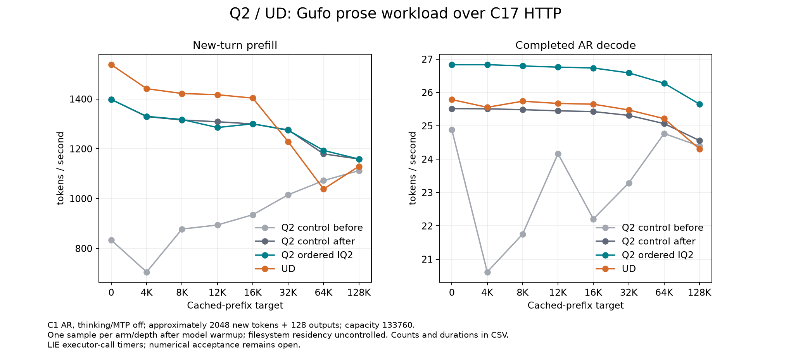

<!-- SPDX-License-Identifier: MIT -->
# Ordered IQ2 signs on the canonical context curve

The ordered packed-sign kernel improves complete Q2 decode by **4.446–5.188%**
across all eight context depths against an unchanged Q2 control run immediately
after it. The median per-depth increase is **5.143%**. This is original-weight
HTTP model throughput on `.157`, following the same Gufo prose recipe and
frozen C17 executor timers as the prior canonical curves. The completed
comparison places candidate decode **4.055–5.526% above UD** at all eight depths.
Prefill remains **7.348–9.299% below UD at 0–16K**. Whole-curve parity is not met.

Both candidate and repeated control preserve all 20 baseline request payloads,
completion texts, finish reasons and physical work counts, including calibration,
warmup and prefix preparation. Every measured continuation completes 128 tokens.
This confirms observed output replay, not independent full-model numerical or
quality qualification. Earlier Q2 numerical failures remain open.

[SVG](figures/q2-iq2-canonical/curve.svg),
[all 32 observations with counts, durations and cache times](figures/q2-iq2-canonical/samples.csv),
[verified four-arm report](../config/q2-iq2-canonical-results.json).

## Candidate against UD

| Prefix target | Ordered IQ2 PP tok/s | UD PP tok/s | Ordered IQ2 TG tok/s | UD TG tok/s |
| ---: | ---: | ---: | ---: | ---: |
| 0 | 1397.861 | 1537.868 | 26.833 | 25.788 |
| 4096 | 1330.162 | 1441.439 | 26.835 | 25.557 |
| 8192 | 1317.565 | 1422.065 | 26.797 | 25.739 |
| 12288 | 1285.465 | 1417.251 | 26.761 | 25.673 |
| 16384 | 1300.349 | 1403.560 | 26.736 | 25.650 |
| 32768 | 1274.496 | 1228.679 | 26.589 | 25.477 |
| 65536 | 1193.506 | 1038.518 | 26.277 | 25.216 |
| 131072 | 1158.643 | 1129.700 | 25.651 | 24.308 |

Candidate PP exceeds this UD observation at 32K, 64K and 128K, but the prior
unchanged UD sweep reached 1274.059 PP at64K and 1220.249 at128K, both above
this candidate. Long-context PP parity is therefore not established by the
current crossing. Every rate is retained; no slower UD point is replaced or
used to declare the overall target achieved. Short-context PP remains the
largest reproducible gap after accounting for the Q2 run-order effect.

## Decode gain, with prefill order effects retained

| Prefix target | Q2 control PP tok/s | Ordered IQ2 PP tok/s | Q2 control TG tok/s | Ordered IQ2 TG tok/s | TG change % |
| ---: | ---: | ---: | ---: | ---: | ---: |
| 0 | 1398.334 | 1397.861 | 25.517 | 26.833 | +5.161 |
| 4096 | 1329.349 | 1330.162 | 25.512 | 26.835 | +5.188 |
| 8192 | 1315.652 | 1317.565 | 25.486 | 26.797 | +5.146 |
| 12288 | 1308.705 | 1285.465 | 25.451 | 26.761 | +5.145 |
| 16384 | 1299.850 | 1300.349 | 25.429 | 26.736 | +5.142 |
| 32768 | 1275.940 | 1274.496 | 25.314 | 26.589 | +5.037 |
| 65536 | 1179.648 | 1193.506 | 25.068 | 26.277 | +4.826 |
| 131072 | 1158.997 | 1158.643 | 24.559 | 25.651 | +4.446 |

The initial Q2 baseline, candidate and post-candidate Q2 control are all
retained. At depth zero their prefill rates are **833.320, 1397.861 and
1398.334 tokens/s**. The unmodified control reproduces the candidate's high
prefill rate, so the initial 67.746% apparent increase must not be attributed
to the packed-sign patch. Relative to the repeated control, candidate PP
varies from −1.776% to +1.175%. This sequence is consistent with prior storage
warming evidence; it is not a controlled cold/warm filesystem experiment.
No page cache was flushed or original model file changed.

Source inspection supports the distinction: `PrefillPhase` makes both
`MatrixRows` and `ExpertMatrixRows` select tiled prefill, including partial
chunks. The changed `vec_dot_iq2_xxs_q8_1` belongs to MMVQ; the IQ2 MMQ traits
use separate tile loaders and Q8 dot functions. Thus a large PP change was a
reason to run an unchanged control, not a reason to claim a prefill optimization.
The measured 41.364% component-time reduction applies to one decode stage;
it must not be added directly to full-model throughput.

The generic gfx1151 IQ2 MMQ tile loader already expands packed signs, but the
subsequent [active-path audit](Q2-DEEPSEEK-AUDIT.md#follow-up-in-the-active-prefill-wmma-loader--2026-10-04)
corrects the earlier inference that this covered Qwen prefill. For hidden2560 /
expert640 / padded-down768, `MoeExperts` selects `RoutedGatedIQ2Gemm` and its
dedicated `RoutedF16GEMMKernel`, which still loads `ksigns64`. The prepared WMMA
sign-expansion candidate targets this separate path while preserving the ordered
decode change. Static compilation finds eight fewer loads per kernel body,
with more integer instructions. Subsequent component qualification preserves all
22 output pairs exactly and passes its 20 independent checks, but takes 2.49–2.58%
more time. That candidate is not advanced to a model arm.
PLE first access remains a separate hypothesis. Neither candidate changes the
performance evidence or qualification status recorded in this campaign.

Each provider is rebuilt from full MMQ sources, with the same 333-file C17
core and exact qualified runtime harness. The candidate changes only the IQ2
vector-dot header in the 1020-file Q2 provider. C1 greedy sampling, thinking,
MTP and vision settings, RAM prefix policy, context capacity 133760, chunk2048,
seeds, calibration and all timing boundaries are unchanged. PLE cache-first
and larger-cache experiments are absent from every arm.

## Evidence and remaining work

Host checks pass 19/19 Debug and 19/19 ASan/UBSan. All four model arms
each complete with five command exits zero and 30 collected artifacts verified.
The candidate and repeated-control validations retain all eight actual counts,
PP/TG durations, cache timings and complete-history comparisons:

- [Initial baseline validation](../config/q2-iq2-curve-baseline-validation.json).
- [Candidate validation](../config/q2-iq2-curve-candidate-validation.json).
- [Repeated-control validation](../config/q2-iq2-curve-repeat-validation.json).
- [Order-control comparison](../config/q2-iq2-curve-order-control.json).

The unchanged repeat is admitted at 01:15:08 UTC after all 23 existing owned
identities retire, KFD is empty and all four original leases are free. An
earlier local preflight mistakenly included an observed desktop PID in the
retirement set; that attempt exits 1 before any admission or workload. It is
retained, and the checker is corrected to inspect only owned command/session
identities. No foreign process is terminated or changed.

The extended analyzer accepts the optional repeated control, validates it
against the same provider/core/harness and preserves both baselines in JSON,
plots and CSV. Full analysis exits zero, both complete-history comparisons are
exact, and all 32 CSV rows match the verified counts and durations. The chart
is visually inspected. No independent numerical qualification is inferred.

Verified window release at **2026-10-04T01:33:37.055967+00:00** checks 39 owned
identities and 26 process groups retired, empty KFD, all four original lease
inodes free and five original model stat identities unchanged. All 26 command
exits are zero and 127 artifacts verify. Remote/main release receipts and the
shared registry record closure; outgoing MCP transport fails and delivery is
not claimed. No Q2 workload, waiter or automatic restart remains.
[Release receipt](../config/q2-iq2-curve-window-release.json).
The candidate is not promoted and the whole-curve Q2/UD goal remains open.
