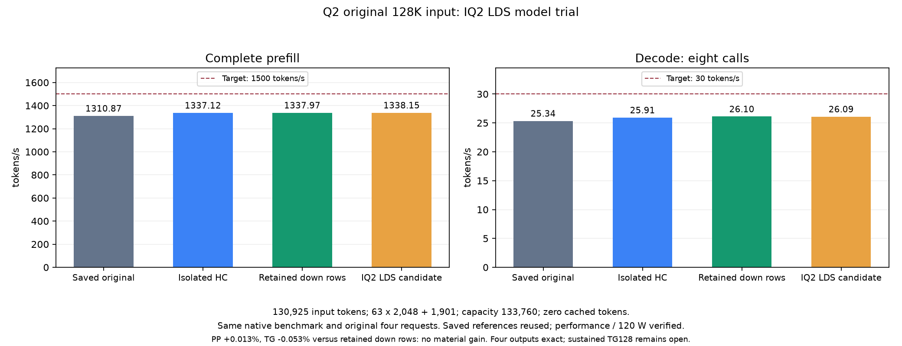

<!-- SPDX-License-Identifier: MIT -->

# IQ2 scalar LDS: component gain does not transfer to the model

The original128K model trial completes on .157 on2026-10-07. The candidate
adds IQ2 LDS only to scalar decode, on top of the retained four-row Q2 down.
Use the saved native C benchmark, all four unchanged requests,130925 input
tokens,63 full2048-token chunks plus the1901-token tail, capacity133760,
zero cached tokens and eight AR calls. Controls are neither rebuilt nor rerun.

| Original128K observation | Full prefill ms | PP token/s | Eight decode calls ms | TG calls/s |
|---|---:|---:|---:|---:|
| Saved original Q2 |99876.067130|1310.874605|315.653915|25.344213|
| Isolated HC |97915.672036|1337.119965|308.708599|25.914406|
| Retained four-row down |97853.296131|1337.972303|306.494308|26.101627|
| New IQ2 LDS candidate |97840.147349|1338.152114|306.656405|26.087829|

The incremental result is PP+0.013439% /TG-0.052859%, effectively flat.
The component's mean5.96% saving did not yield a model gain. Keep four-row
down as the reference; do not promote LDS or repeat the context curve.
All four replies and token pieces remain exact against the original and R3.
This is eight measured AR calls, not sustained TG128 or independent task quality.
The1500PP/30TG goal remains unmet. Prefill kernels are unchanged, so its tiny
variation is not attributed to this decode-only change.

Performance/120 W and fan curves verify before/after; sampled peaks are
CPU90.625C/GPU92C. CPU fixtures, verify/admit/run/release and both children
exit0. All38 artifacts hash-verify before18:08:03.238385UTC release,
SHA`0d852d5fe4a0cebcb2139e20c891d67aa4fa71f06dd51375f7ee443c99925e25`.
Independent closure18:08:32 verifies the registry, eight retired identities
and groups, empty KFD, five free original leases and seven unchanged models.
No Q2 remote workload/window/reservation remains. No remote cleanup occurred.

[Exact values](figures/q2-iq2-decode-lds-native128.csv),
[audited result](../config/q2-iq2-decode-lds-native128-results.json),
[frozen plan](../config/q2-iq2-decode-lds-native128-plan.json).

## Model integration and component provenance

Model integration prepared on2026-10-07: the private provider composes LDS
gate/up with the retained four-row Q2 down provider. Dispatch requires
`!prefill_phase`, one token, ten selected experts, IQ2_XXS,640rows,2560columns
and512experts with matching gate/up shapes. Every prefill path, including
one-token tails, stays unchanged. Native Q8_1 packing uses the same MMQ context,
stream and2880-byte input pool reservation. No model/activation format changes.

Local build preserves all923 common device functions exactly. The added
2648-byte kernel retains62VGPR/no scratch and the component's instructions;
the only differing word at offset120 is its PC-relative codebook address.
ELF symbols resolve both addresses to the same2048-byte IQ2 table. Initial
strict comparison exit1 is retained, not interpreted as a numerical failure.
Build/source/relocation receipts are under
`evidence/q2-iq2-decode-lds-model-preparation/` and
`config/q2-iq2-decode-lds-{model-source,build}.json`.
The model timing above is complete; independent task quality remains open.

## Earlier scalar component

The scalar component completed on .157 on 2026-10-07, exit 0. All 906 full
output comparisons are exact and all 1359 independent FP64 checks pass.
The saved production archive is linked directly, without a control rebuild.
Each call includes native Q8_1 quantization plus gated IQ2 projection; 512
synthetic original-format experts occupy 432537600 bytes across gate/up.
Each arm retains 64 distinct outputs, with two warmups and five timed rounds.

| Measured round | Saved control µs/call | Literal clone µs/call | LDS µs/call | LDS versus control |
|---|---:|---:|---:|---:|
| 1 | 50.435641 | 50.408781 | 49.108516 | -2.631% |
| 2 | 59.249656 | 50.535016 | 49.027750 | -17.252% |
| 3 | 50.295344 | 61.787656 | 48.949781 | -2.675% |
| 4 | 50.368938 | 50.468297 | 56.046344 | +11.272% |
| 5 | 57.576438 | 50.563000 | 48.826172 | -15.198% |
| Arithmetic mean | 53.585203 | 52.752550 | 50.391713 | -5.960% |

Four of five pairs improve, but timing varies substantially and one regresses.
These component timings justified the subsequent model trial above, but did
not establish a token-rate improvement, sustained decode or model quality.
The component itself changed no production dispatch, prefill or quantization.
The fixture covers ragged rows, inactive IDs, tiny/zero/cancellation inputs;
per-repetition failure filenames cannot overwrite earlier comparisons.

All 38 files (2892208 bytes) were copied directly and hash-verified before
release at 16:26:42.197559 UTC, SHA `4fe172bd`. No duplicate transport archive
was created. Current-boot process retirement, empty KFD, five free leases,
seven unchanged model stats and the persistent registry are verified.
Performance/120 W and fan readbacks pass before/after; no agent tuning.
[Machine-readable results](../config/q2-iq2-decode-lds-results.json),
[fixture](../tests/q2_iq2_decode_lds.hip).

The retained scalar IQ2 gate/up dot reads the256-entry,2048-byte magnitude
codebook through global constant storage. Official Gufo's DeepSeek scalar
gate/up stages that table in LDS. This is a separate mechanism from the
already measured IQ2 prefill table experiments: the new draft targets the
Qwen single-token gated vector path, preserving its existing Q8_1 activation
format rather than importing DeepSeek's Q8_K arithmetic.

The generator extracts the exact retained MMVQ dot and two-row gated body.
The candidate loads the unchanged table cooperatively with64 threads, then
adds one uniform barrier before any early return. Gate and up remain in
separate32-thread waves. Weight bytes, parity/sign expansion, integer dots,
the rounded scale-product boundary, wave sum and SwiGLU expression remain.
Only the table-load address changes inside the dot. Model dispatch and
prefill are untouched; the current four-row Q2 down trial is independent.

Local gfx1151 object and assembly compilation use the saved native MMQ
compiler flags, with no GPU execution or control archive rebuild:

| Static property | Literal control | Codebook in LDS |
|---|---:|---:|
| Next-free VGPR |69|62|
| SGPR |24|24|
| LDS bytes |16|2064|
| Private scratch bytes |0|0|
| Instruction sites |381|418|
| Global-load sites |15|8|
| LDS-load sites |1|9|
| Workgroup-barrier sites |1|2|

These are compilation observations, not dynamic instruction counts, numerical
qualification or performance evidence. Initial staging and LDS bank conflicts
may outweigh the cheaper repeated reads. The completed component above is
the first runtime check of this draft. A positive component still requires
a new original-input model measurement under verified power mode.

Provenance: independently fetched official Gufo pin
`f783fedb9bea2ec7de941f6da4e02f4a4596b29e`, retained isolated-HC source
manifesteb12a478. The algorithm clue is in the pinned
`deepseek_v4_flash/kernels/rocm/detail/ds4_rocm_iq2_gate.hip.hpp`; no sibling
CachyOS/DS4 workspace source or artifact is imported. Existing Gufo/ggml
copyrights and MIT notices remain in `third_party/gufo/`.

[Generator](../tools/prepare-q2-iq2-decode-lds.py),
[derived kernel](../experiments/q2-iq2-decode-lds.inc),
[private launch entry](../experiments/q2-iq2-decode-lds.hip),
[source binding](../config/q2-iq2-decode-lds-source.json),
[static compilation](../config/q2-iq2-decode-lds-static.json).
