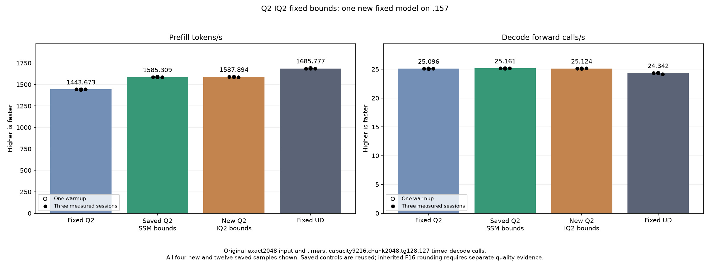

<!-- SPDX-License-Identifier: MIT -->

# Fixed IQ2 gate/up bounds

Start from the retained1585.308983 PP/25.16079073 TG SSM-bounds Q2 provider,
not the slower measured1582.080007 sign-arithmetic candidate. Fixed Q2 remains
1443.672867 PP; fixed UD1685.777092 PP. The exact original2048 input/tg128
point,127 timed decode calls,capacity9216/chunk2048,C1 greedy,MTP off and
one warmup/three measured sessions with15-second untimed pauses stay unchanged.
Saved controls are neither rebuilt nor rerun. Whole-curve parity is unmet.

Only unpacked IQ2 paired gate/up m640/k2560 BN64/128 selects a private clone.
It uses constant model row/K dimensions, marks all weight rows live and removes
output-tail scalar fallbacks. Ten grid blocks each own64 logical rows, covering
640 exactly; every float2 pair starts on an even row and remains within its
block. The640 output stride preserves alignment. Routing/token validity checks
stay in place. Other dimensions/packed modes/decode use the original selector.

The original sign table, codebook, four-lane compressed ownership, scale owner,
F16 rounding/FMA,K16 WMMA order and anchored F32 SwiGLU are unchanged. No table,
buffer, lifetime, stream, callback or public ABI/state/metric change occurs.
Original source template and all162 original numerical ISA bodies/resources
remain exact. Two private bodies are added; no original control recompiles.

| Geometry | Static instructions before / candidate | VGPR before / candidate | SGPR before / candidate | LDS bytes | Private bytes |
| --- | ---: | ---: | ---: | ---: | ---: |
| BN64 |1351 /1004|104 /104|28 /24|17536|0|
| BN128 |2361 /1685|150 /150|38 /32|25728|0|

Static instruction reductions25.68%/28.63% do not establish runtime savings.
F16 FMA/WMMA/exponential/barrier counts remain unchanged. Output stores use
64-bit float2 instead of the generic runtime alignment/tail scalar branches.
The generated grid/source assumptions need full runtime qualification.

A new fixture compares113 complete float output pairs across36 cases. It
retains ragged generic dimensions and captured real routing, and adds short
actual640x2560 cases n1/17/65/145 to exercise the private bounds directly.
Three weight rotations exceed MALL in five timed production-sized shapes;
70 alternating complete-operator wall/HIP records include two warmups/five
measurements. Post-timing outputs and immutable inputs are checked. Safe finite
numerical/timing rejection still allows the original model; guard/unwritten/
nonfinite/device faults stop further device work. No old sign-format experiment
is rerun because this candidate leaves those bytes unchanged.

Local source/production assembly/static audit/fixture host+device compilation
all exit0. Fresh .157 closure/lease/process/KFD/model-stat checks pass11:27:30UTC
against40974980. Core reports updated .157/.158 non-use11:28UTC. Host-r1
finishes2026-10-06T11:28:28.582584UTC,36/36 Debug plus36/36 ASan/UBSan, all six
commands0/seven artifacts collected. Freeze160 fixtures/six manifests/1028
provider files. The component and model below now complete this preparation.

The launcher also refuses collection of a receipt without actual finished_at
or any command without an integer exit code. New regression cases cover live
receipts, missing/null command exits and terminal numerical-failure preservation.
This prevents the prior early-collection snapshot mistake without altering
benchmark timing, model behavior or accepted historical evidence.

[Source](../config/q2-iq2-fixed-bounds-source.json),
[static audit](../config/q2-iq2-fixed-bounds-static.json),
[frozen plan](../config/q2-iq2-fixed-bounds-plan.json).

## Completed unchanged model comparison

One new Q2 model concludes2026-10-06T11:35:47.942119UTC. PP1587.893545 is
+0.163032% versus saved1585.308983; TG25.12414406 is nominally−0.145650%.
All21 full parent files and9 within-arm checks are exact. Original scalar/decode
numerical bodies stay identical, so the historical decode-rate difference is
not attributed to a changed decode algorithm. Prefill sample ranges overlap;
this small improvement is retained without claiming a robust causal speedup.

| Session | Fixed Q2 PP / TG | Saved SSM PP / TG | New fixed IQ2 PP / TG | Fixed UD PP / TG |
| --- | ---: | ---: | ---: | ---: |
| Warmup | 1438.259006 / 25.08847266 | 1586.508538 / 25.13300114 | 1587.016332 / 25.10556241 | 1689.043527 / 24.34239962 |
| Measured 1 | 1443.398207 / 25.10565683 | 1586.342395 / 25.17262901 | 1589.688108 / 25.12414406 | 1686.364042 / 24.34621613 |
| Measured 2 | 1443.672867 / 25.08698337 | 1584.079076 / 25.16079073 | 1587.893545 / 25.11902171 | 1685.777092 / 24.34174251 |
| Measured 3 | 1443.841794 / 25.09595499 | 1585.308983 / 25.15297051 | 1585.263379 / 25.14732426 | 1685.400011 / 24.15102104 |
| Median measured | 1443.672867 / 25.09595499 | 1585.308983 / 25.16079073 | 1587.893545 / 25.12414406 | 1685.777092 / 24.34174251 |

All113 complete component pairs are exact. All70 raw HIP durations are invalid
zero and remain preserved; the synchronized complete-cycle wall timer supplies
the independent operator measurements. No projection into model t/s is made.

| Shape | Reference median µs | Candidate median µs | Candidate time change |
| --- | ---: | ---: | ---: |
| uniform-e160 | 3640.810000 | 3609.927000 | -0.848245% |
| uniform-e512 | 5485.683667 | 5473.844000 | -0.215828% |
| real-layer0 | 5227.058000 | 5215.261333 | -0.225685% |
| real-layer3 | 4270.541667 | 4234.516333 | -0.843578% |
| real-layer22 | 5519.543000 | 5491.830333 | -0.502083% |

Static instructions fall26–29%, but measured component wall saves only0.2–0.85%
with some overlapping ranges. Much removed code belongs to generic branches
that are normally untaken; the F16 FMA and WMMA work remains. This result does
not support pursuing static instruction counts as a throughput target.

Retain the fixed-bounds candidate as the nominal prefill parent for the next
private composition; keep the SSM provider/binary and its1585 comparison intact.
The result is not adoption into the production backend or independent task
quality. The new point still needs6.164365% PP, equivalent to74.889015ms, to
match fixed UD. The stable saved SSM gap remains76.991736ms. Full-curve parity
and independent quality stay unmet; full curve/Q4 are not rerun.

Host36+36 and13 primary host/component/model commands pass,37 artifacts verify.
Release2026-10-06T11:36:23.473824UTC/56ab4a49 checks1440 historical/current
identities/1153 groups retired, empty KFD, original Core CPU/four GPU leases
unchanged/free and seven original model stat tuples unchanged. Canonical/main/
run/remote mirrors agree; Core receives release before local analysis. No
job/window/lease/reservation/waiter/restart/cleanup remains on .157/.158/.161.

Next investigate replacing IQ2's four-lane shuffles with exact DPP quad
broadcasts. The current producer performs eight LDS-backed bpermute exchanges
per stage. A direct register permutation could remove that dependency while
retaining the same owners, sign bytes and floating arithmetic. This is only a
next source hypothesis; it has no runtime qualification or speed claim.

[Full model CSV](figures/q2-iq2-fixed-bounds-model.csv),
[all seventy operator timing records](figures/q2-iq2-fixed-bounds-component.csv),
[model result](../config/q2-iq2-fixed-bounds-model-results.json),
[component result](../config/q2-iq2-fixed-bounds-component-results.json),
[final audit](../config/q2-iq2-fixed-bounds-final-audit.json).
