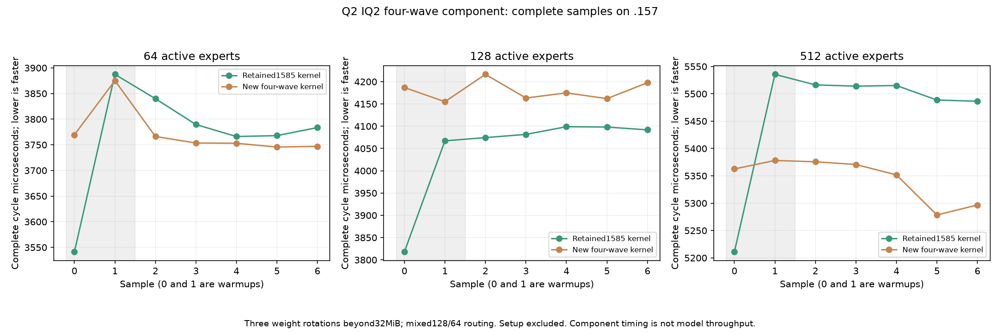
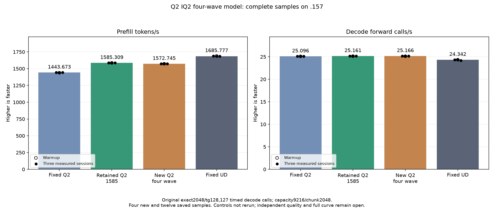

<!-- SPDX-License-Identifier: MIT -->
# IQ2 gate/up in four waves

This candidate starts from retained1585.308983 PP /25.16079073 TG and changes
only nonpacked IQ2 BN64. Four wave32 groups compute both gate and up, sharing
each activation fragment between their two accumulators. BM128,64 logical
output rows, the grid,17536 LDS bytes and all runtime allocations stay fixed.
The previous rejected BM256 wide-pair trial enlarged both the output tile and
LDS; this candidate does neither.

The wave-local epilogue evaluates the original explicitly rounded F32 product
and SwiGLU value, then transposes final values in four disjoint scratch planes.
K-stage block barriers remain. Eight epilogue block barriers disappear from
the compiled body. Global activation reads per block remain unchanged; only
the sharing of LDS activation reads changes. It introduces no expert or KV cache.

Static comparison with the saved parent assembly finds161 other production
kernel bodies instruction/operand/resource exact, after normalizing the added
private template argument. The affected body uses193 instead of104 VGPRs,
with zero private scratch and unchanged LDS. Its instruction count1351→2138
is per-wave code with twice the row work; it is not a dynamic instruction
count or a speedup. Fewer waves with more registers do not prove occupancy.

The symbolic ownership audit enumerates256 weight-group owners,1024 compact
eight-byte writes,256 scale owners,512 activation chunks and8192 accumulator
owners; both layouts agree. It checks63 ragged output shapes and disjoint
epilogue scratch. The fixture compares96 complete output pairs, including
unaligned rows, mixed128/64 routing, untouched BN16/48/128 and packedBN64.
Three mixed cases rotate weights beyond32MiB and retain42 timings. These are
planned GPU counts, not completed results at preparation time.

Local production assembly, fixture host/device syntax, source reconstruction
and146 launcher guards pass. Fresh .157 host31 Debug+31 ASan/UBSan passes at
2026-10-06T01:55:56UTC, six successful commands/seven verified artifacts.
The plan binds107 fixtures,nine manifests and1027 provider files. Both staged
capsules verify without executing SSH. New GPU admission is required.

The original exact2048/tg128 benchmark is unchanged:127 timed decode calls,
capacity9216/chunk2048,greedy C1,MTP off,one warmup and three measurements,
15-second pauses outside timers. Saved fixedQ21443.672867,retained1585.308983
and fixedUD1685.777092 are reused without rebuilding or rerunning controls.
Safe numerical or timing rejection still permits the requested model test;
runtime/guard exit2 stops dependent device work. Full curve and Q4 remain deferred.

## Priority relative to the remaining gap

The fixed point needs approximately77ms less prefill time, or6.337447% more
throughput. The separately saved1571 profile attributes103.691949ms to IQ2BN64,
135.807810ms to IQ2BN128 and161.558060ms to Q2 down. Those are diagnostic costs
on the older profiled executable, not fresh timings for retained1585.
The current variant addresses the first of these. Improvements there must be
measured before extending the layout to a wider tile with higher register cost.
Q2-down data movement and repeated decode work are the next expert priorities;
previous negative shuffle/palette/output-tile experiments remain evidence.

Ten percent less time across all three expert paths would save about40ms;
twenty percent would save about80ms in that saved trace. These are arithmetic
scenarios, not predicted gains. HC combine/norm/inject186.168095ms is the next
large family for a new mechanism. Additional SSM predicate simplifications,
host callbacks and compressed streaming cache have lower priority: the latest
predicate and cache trials have already failed to improve complete-model time,
and the profile has only5.090460ms between prefill kernels.

[Source](../config/q2-iq2-four-wave-source.json),
[static audit](../config/q2-iq2-four-wave-static.json),
[plan](../config/q2-iq2-four-wave-plan.json),
[profile](Q2-CURRENT-BEST-PROFILE.md).

## Completed GPU and original-model result

The model completes on .157 at 2026-10-06T02:03:58.692617+00:00. Keep the saved
1585.308983 PP / 25.16079073 TG provider. The new candidate measures
1572.745422 PP / 25.16571902 TG: -0.792499% PP and +0.019587% TG.
All three new PP samples are below the saved parent range. Historical controls
are reused, so this is not a contemporaneous causal attribution.

All 96 complete component pairs, all 21 parent model files and all nine
within-arm replays are exact. The inherited independent quality gap remains.
The four GPU/model commands and three component commands all exit zero.

| Component | Parent microseconds | New microseconds | Time change |
| --- | ---: | ---: | ---: |
| mixed-e64 | 3783.618927 | 3752.979914 | -0.809781% |
| mixed-e128 | 4091.877937 | 4174.888929 | +2.028677% |
| mixed-e512 | 5514.080048 | 5351.764679 | -2.943653% |

| Model sample | Prefill seconds | Prefill tokens/s | Decode seconds | Decode calls/s |
| --- | ---: | ---: | ---: | ---: |
| Warmup | 1.302495684 | 1572.366055 | 5.056792200 | 25.11473578 |
| Measured 1 | 1.302181505 | 1572.745422 | 5.046547642 | 25.16571902 |
| Measured 2 | 1.301925727 | 1573.054405 | 5.044781306 | 25.17453033 |
| Measured 3 | 1.303460063 | 1571.202723 | 5.048952932 | 25.15373023 |
| Three-sample median | 1.302181505 | 1572.745422 | 5.046547642 | 25.16571902 |

Model allocation remains 43,156,012,544 bytes, deferred scratch 7,946,240 bytes
and session allocation 376,777,748 bytes. Loading takes 11.93061401 seconds;
compilation and loading remain outside PP/TG. No public C17 ABI, persistent
state or metrics contract changes.

### Component distribution finding

The 512-expert synthetic case has zero BN128 tiles and 512 BN64 tiles. Every
layer in the saved fixed-input model profile has 128–159 BN128 tiles and
89–359 BN64 tiles. Their median counts are 139.5 and 294.5. Thus the positive
component case matches expert cardinality but not the model tile distribution.
This does not isolate the regression cause. Per-expert tail occupancy is still
missing from that trace, and no unmeasured dispatch threshold is promoted.

The next expert experiment should recover the exact fixed-input route counts
and measure the affected short/full tails before selecting a launch geometry.
Extending this four-wave implementation blindly to BN128 is not justified.
The [bound coverage audit](../config/q2-iq2-routing-coverage.json) retains all
three synthetic geometries and the 48-layer model ranges without a GPU rerun.
The fixed exact2048/tg128 acceptance benchmark stays unchanged.

All 13 host/component/model commands exit zero and 37 artifacts verify;
107 fixtures, nine manifests and 1027 provider files remain exact. Both charts
are visually reviewed. The window releases at 2026-10-06T02:04:37.758289UTC,
SHA256 cf9f3b99ded9b5012145a111dad5722347cead379fc7f675c89b62276b05835c.
All 1274 recorded identities / 1018 groups are retired, KFD is empty, four
original leases are free, seven model stat tuples are unchanged and canonical,
main and remote mirrors agree. Core receives closure; no job, build, waiter,
reservation, restart or cleanup remains.

[Component samples](figures/q2-iq2-four-wave-component.csv),
[model samples](figures/q2-iq2-four-wave-model.csv),
[model result](../config/q2-iq2-four-wave-model-results.json),
[final audit](../config/q2-iq2-four-wave-final-audit.json),
[disposition](../config/q2-iq2-four-wave-disposition.json).

