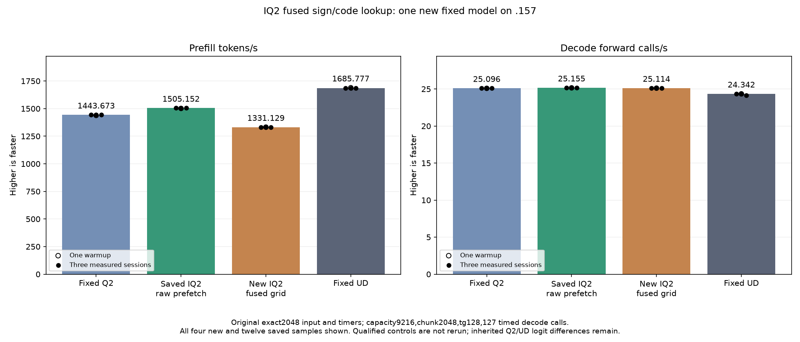

<!-- SPDX-License-Identifier: MIT -->
# IQ2 signed-codebook fusion

The owner defers Q4 and resumes Q2 from the retained raw-prefetch parent
PP1505.152258/TG25.15493858. This candidate replaces the two magnitude/sign
lookups and their masks/XOR with one lossless signed-high-byte table lookup.
No raw weight/header prefetch, scale expression, F16 rounding, compact LDS
layout, packed FMA, ordered K16 WMMA, routing, tail or SwiGLU operation changes.
Q2 down, decode, dense Q8, attention and scheduling remain unchanged.

The independently fetched official Gufo pin remains
`f783fedb9bea2ec7de941f6da4e02f4a4596b29e`. Original codebooks and notices
remain. No model payload is converted or copied. The isolated provider has
1026 verified files and changes only the IQ2 lookup and a generated include.
The scalar generator exhausts32768 entries/eight lanes, checking262144 half
operands against original magnitudes, independently completed sign parity
and IEEE half bits.

The production assembly changes exactly eight IQ2 specializations; the other
149 kernels match the saved parent without rebuilding that parent. Each
IQ2 body loses31 instructions (BN16/48/128) or32 (BN64), and static
`global_load_b64` count changes10 to6. VGPR, LDS and zero private scratch stay
the same. Packed F16 FMA and WMMA instruction counts match. These are static
counts, not dynamic bandwidth, measured occupancy or a model speedup.

The new table occupies262144 device bytes; the parent's unused2048-byte high
table is omitted from the production object, giving260096 additional constant
bytes in this translation unit. Random table traffic can offset fewer
instructions. The earlier Q8 table regression remains evidence, not an
assumption that this different lookup will win or fail.

The new fixture includes an exhaustive guarded device-table replay,81 complete
IQ2 gate/up output pairs and42 timing samples with three weight rotations
larger than32MiB. Its literal control is the measured raw-prefetch parent,
not a rerun of an old qualified component. A safe numerical/timing rejection
does not block the original model measurement. Guard/unwritten-output faults
stop device work. All errors and actual exits are retained.

The unchanged model tester uses exact2048/tg128,127 timed decode calls,
capacity9216/chunk2048, C1, greedy, MTP off, one warmup/three measurements and
15-second pauses outside timers. The fixed Q2 reference1443.672867 and
UD1685.777092 remain unchanged and are reused without relaunching. No full
context curve is admitted until the fixed-point gap is closed.

[Source](../config/q2-iq2-fused-grid-source.json),
[static evidence](../config/q2-iq2-fused-grid-static.json),
[plan](../config/q2-iq2-fused-grid-plan.json),
[staging](../config/q2-iq2-fused-grid-staging-results.json),
[host](../config/q2-iq2-fused-grid-host-results.json).
Ninety-five launch guards and25 Debug/25 ASan/UBSan tests pass. Host/device
fixture compilation passes. The initial fixture namespace qualification
error exits1 and is corrected only in the test wrapper; an initial local host
reader before collection also exits1. Neither is numerical or model evidence.

## Completed original fixed model — 2026-10-05 UTC

The new model completes at06:38:26.647188UTC. Median PP1331.128807 is
11.561850% below the saved best raw-prefetch parent1505.152258 and7.795676%
below the original fixed Q2 reference1443.672867. Median TG25.11415619
changes-0.162125% against the saved parent, with no decode kernel change.
The model confirms that fewer static instructions do not establish a gain.
No hardware cache counter was measured: larger lookup traffic is a possible
explanation, not a proven cause. The 262144-byte fused table is retained as a
negative experiment; the original1505.152258 provider remains the base.

All21 parent model files, including full saved logits and generated tokens,
are byte-exact; all nine internal model replays are exact. Eight inherited
logit-file differences versus fixed Q2 remain, with matched-history maximum
KL0.001256655237; against UD the maximum is0.008626378682. These are unchanged
from the parent, not new numerical errors. Independent task quality and
whole-context PP/TG parity remain unqualified.

The following table retains every session. Only the fused-grid column is
new; Q2, parent and UD are the unchanged saved comparisons. PP is tokens/s;
TG is timed forward calls/s (127 calls for128 outputs). One warmup is shown
and excluded from the three-session medians.

| Session | Fixed Q2 PP / TG | Saved best PP / TG | New fused-grid PP / TG | Fixed UD PP / TG |
| --- | ---: | ---: | ---: | ---: |
| Warmup | 1438.259006 / 25.08847266 | 1501.690147 / 25.15123490 | 1332.280766 / 25.11293232 | 1689.043527 / 24.34239962 |
| Measured 1 | 1443.398207 / 25.10565683 | 1505.152258 / 25.16777240 | 1331.128807 / 25.10261656 | 1686.364042 / 24.34621613 |
| Measured 2 | 1443.672867 / 25.08698337 | 1503.530071 / 25.14904438 | 1332.060918 / 25.11415619 | 1685.777092 / 24.34174251 |
| Measured 3 | 1443.841794 / 25.09595499 | 1505.315370 / 25.15493858 | 1330.969286 / 25.12316935 | 1685.400011 / 24.15102104 |
| Median measured | 1443.672867 / 25.09595499 | 1505.152258 / 25.15493858 | 1331.128807 / 25.11415619 | 1685.777092 / 24.34174251 |

[Complete sample CSV](figures/q2-iq2-fused-grid-model-wrapped.csv),
[SVG](figures/q2-iq2-fused-grid-model-wrapped.svg),
[model result and complete replay](../config/q2-iq2-fused-grid-model-results.json).

## Component result and closure

Exhaustive device format outputs match for32768 entries/262144 high bytes;
both complete guarded format files are preserved. All81 whole-output pairs
are exact, finite, written and guarded. The inherited fixture checks the full
floating output arrays and logs their hashes; it does not save those81 arrays.
All42 timing samples remain in the report and CSV. Values below are operator
microseconds per rotation iteration, not model tokens/s.

| Active experts | Parent median µs | Fused median µs | Operator time change |
| ---: | ---: | ---: | ---: |
| 64 | 3652.20578512 | 4122.33066559 | +12.872355% |
| 128 | 4073.25299581 | 5036.78194682 | +23.655023% |
| 512 | 5267.13212331 | 8260.30158997 | +56.827309% |

[Complete operator report](../config/q2-iq2-fused-grid-component-results.json),
[all42 timings including warmups](figures/q2-iq2-fused-grid-component.csv).

All13 host/component/model commands exit0 and39 artifacts verify. Ninety-five
launch guards and25 Debug/25 ASan/UBSan checks pass. The candidate compilation
takes153.242682 seconds outside PP/TG timers. Original input, capacity,
chunk, MTP, routing, timers and reference binaries remain unchanged.

Window release at06:39:20.614047UTC retires745 identities/588 groups, verifies
empty KFD, four unchanged original leases free and seven unchanged model stat
tuples. Canonical/main/remote/active/ready mirrors match and core is notified.
No Q2 GPU job, lease, reservation, waiter, restart or cleanup remains. Future
GPU work requires fresh handover/admission anchored to release
d0437a918ee5de4155f56b4206ba37482d226694a755a8dc6e4f71e00c8ebdd4.
Q4 stays deferred. No old comparator/cohort, full curve, tuning, dependencies
or deployment is run. All preparation failures and actual exits stay retained.

[Release](../config/q2-iq2-fused-grid-window-release.json),
[local integrity audit](../config/q2-iq2-fused-grid-final-audit.json).
