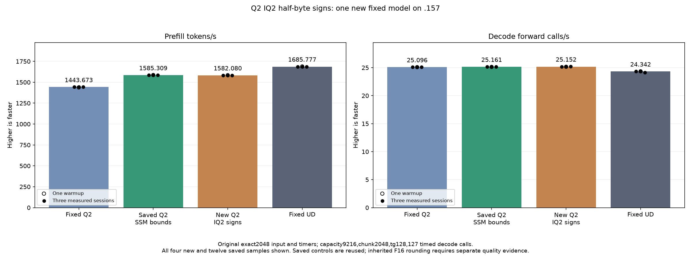

<!-- SPDX-License-Identifier: MIT -->

# IQ2 half-byte sign arithmetic

This private experiment starts from the retained SSM-bounds Q2 provider,
1585.308983 PP / 25.16079073 TG. The fixed original-counting point remains
exact2048 prompt /128 outputs /127 timed decode calls, capacity9216,
chunk2048, C1 greedy, MTP off, one warmup and three measurements with15-second
untimed pauses. Saved Q2 reference1443.672867 PP and UD1685.777092 PP remain
unchanged and are not rebuilt or rerun. Whole-curve parity remains unmet.

The existing four-lane IQ2 ownership publishes compact high half-bytes to LDS.
The candidate replaces the eight-byte sign-table lookup and mask with parity,
two full32-bit multiply/mask expressions and sign-bit XOR. It adds no table,
allocation, stream or callback. Runtime dispatch changes only unpacked IQ2
gate/up m640/k2560 with BN64/128; all other dimensions, decode, Q8, Q2 down,
attention, full640 scaling/packing and public ABI/state/metrics stay unchanged.
This differs from the earlier integer-magnitude WMMA-sign experiment: half
sign-bit XOR avoids its signed-byte negation. Historical trials stay preserved.

The host arithmetic audit checks all128 sign tags/1024 sign bytes against the
independently fetched original Qwen sign table. Device assembly retains all162
original bodies and resources exactly, adding two private bodies. Both remove
four static global64-bit loads and add11 total static instructions. BN64 keeps
104 VGPR/17536 LDS bytes; BN128 keeps150 VGPR/25728 LDS bytes and reduces SGPR38
to36. Neither spills. F16 FMA, WMMA and barrier counts are unchanged. These
facts do not establish runtime correctness or a speedup.

A new fixture exhausts32768 code/sign combinations and compares101 complete
float outputs including ragged n1/16/17/49/65/129/144/145/257, m1/65/640,
three weight rotations, uniform160/512 experts and captured layers0/3/22.
Seventy alternating operator timings include two warmups and five measured
repetitions. The synchronized monotonic wall timer is retained separately from
raw HIP event values; invalid HIP zeros cannot become a speed claim. Format
buffers and any differing full outputs are preserved. Finite numerical or
timing rejection still allows the original-model experiment; guard, unwritten,
nonfinite or device faults stop further GPU work.

The first fixture host/device compilation fails because the original sign table
is in the global namespace. Corrected retries exit0; both actual failures remain
in local evidence. An initial plan-freeze attempt before result collection also
fails; the collected retry succeeds without rerunning host tests.

On .157, host-r1 finishes2026-10-06T11:12:21.906973UTC with36/36 Debug and36/36
ASan/UBSan, six exits0 and seven collected artifacts. Freeze153 fixture hashes,
six manifests and1028 provider files. Fresh original lease/process/KFD/model-stat
checks pass11:11:23UTC against previous release6b3c8f27. Core explicitly reports
no own .157 work. The new component and model results below complete this preparation.

[Source](../config/q2-iq2-half-sign-arithmetic-source.json),
[static audit](../config/q2-iq2-half-sign-arithmetic-static.json),
[plan](../config/q2-iq2-half-sign-arithmetic-plan.json).

## Completed original-model comparison

One new model completes2026-10-06T11:20:12.918611UTC. Its PP is1582.080007,
TG25.15197322: PP−0.203681% versus saved1585.308983. All21 full parent model
files and9 within-arm replay checks are exact. Inherited matched-history KL
against fixed Q2/UD stays unchanged; independent quality remains open.
Keep the SSM-bounds performance best and preserve this private trial.

| Session | Fixed Q2 PP / TG | Saved best PP / TG | New sign arithmetic PP / TG | Fixed UD PP / TG |
| --- | ---: | ---: | ---: | ---: |
| Warmup | 1438.259006 / 25.08847266 | 1586.508538 / 25.13300114 | 1584.603253 / 25.15945042 | 1689.043527 / 24.34239962 |
| Measured 1 | 1443.398207 / 25.10565683 | 1586.342395 / 25.17262901 | 1581.372153 / 25.15197322 | 1686.364042 / 24.34621613 |
| Measured 2 | 1443.672867 / 25.08698337 | 1584.079076 / 25.16079073 | 1582.080007 / 25.14437651 | 1685.777092 / 24.34174251 |
| Measured 3 | 1443.841794 / 25.09595499 | 1585.308983 / 25.15297051 | 1582.153945 / 25.21421627 | 1685.400011 / 24.15102104 |
| Median measured | 1443.672867 / 25.09595499 | 1585.308983 / 25.16079073 | 1582.080007 / 25.15197322 | 1685.777092 / 24.34174251 |

The component's32768 exhaustive sign/code outputs and101 full float pairs are
exact, including final timed buffers. All70 HIP events are invalid zero and
remain raw evidence. Complete synchronized wall-cycle time changes are:

| Shape | Reference median µs | Candidate median µs | Candidate time change |
| --- | ---: | ---: | ---: |
| uniform-e160 | 3657.347333 | 3734.515000 | +2.109935% |
| uniform-e512 | 5513.209667 | 5583.661333 | +1.277870% |
| real-layer0 | 5225.964333 | 5289.209333 | +1.210207% |
| real-layer3 | 4175.593000 | 4245.507667 | +1.674365% |
| real-layer22 | 5520.426000 | 5612.333667 | +1.664865% |

The table lookup already benefits from caching; replacing it with integer work
is slower in these paired synthetic cases. Original-model PP also falls
slightly. No claim that register expansion universally wins is supported.

The first model collection was started before actual termination; its24 files
and receipt reporting zero verified artifacts are preserved locally. A first
terminal retry refuses to overwrite that snapshot and retains exit1. Move the
snapshot intact within local evidence, then collect all26 final artifacts
without rerunning inference or deleting anything on .157. This is a collection
workflow error, not a model numerical failure; it motivates a terminal receipt
guard in the next launcher revision.

Host/component/model13 commands exit0;39 final artifacts verify. Release
2026-10-06T11:21:43.043192UTC/40974980 checks1424 identities/1140 groups retired,
empty KFD, unchanged/free original Core CPU+four GPU leases and unchanged seven
model stat tuples. Canonical/main/run/remote mirrors agree; Core is informed
before local analysis. No job/window/lease/reservation/waiter/restart/cleanup
remains. Full curve and Q4 remain deferred until the fixed gap is closed.

Next prepare fixed IQ2 gate/up bounds for the actual m640/k2560 model dimensions,
removing redundant row/K address and output-tail work while keeping the original
sign table and every rounded arithmetic operation. Its local source/ISA probe
is separate from this measured sign candidate and has no runtime admission.

[Full model CSV](figures/q2-iq2-half-sign-arithmetic-model.csv),
[all seventy operator timing records](figures/q2-iq2-half-sign-arithmetic-component.csv),
[model result](../config/q2-iq2-half-sign-arithmetic-model-results.json),
[component result](../config/q2-iq2-half-sign-arithmetic-component-results.json),
[final audit](../config/q2-iq2-half-sign-arithmetic-final-audit.json).
