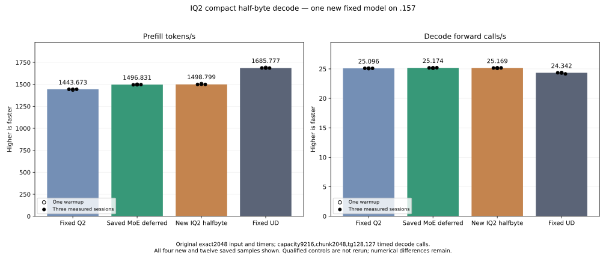

<!-- SPDX-License-Identifier: MIT -->
# Compact IQ2 half-bit decoding

The new original-weight model measures 1498.799455 PP / 25.16866636 TG on the
unchanged fixed input. Prefill is nominally +0.131514% versus the saved parent;
all 21 parent input/output/full-logit files are exact. The marginal candidate
is retained for further composition, without default promotion or a claim of
stable gain. Fixed UD 1685.777092 remains unmet; it requires +12.475160% more
prefill throughput. The `.157` window is released and all evidence is collected.

The new candidate replaces the signed integer code bytes in the existing IQ2
weight stage with the high byte of their exact F16 representation. Absolute
values 8, 25 and 43 have half bits 0x4800, 0x4e40 and 0x5160. The low byte is
reconstructed from the low two bits of the high byte; its sign remains in bit 7.
Weight storage in LDS stays at one byte per value. No model-weight conversion,
new allocation, stream, stage layout or public ABI is introduced.

The previous [shared F16 stage](Q2-IQ2-HALFSTAGE.md) preserves every parent
output but regresses full-model prefill by 2.108708%. This new mechanism keeps
compact staging and removes the consumer's half addition, preserving its exact
signed magnitude, rounded scale, packed half FMA and ordered K16 WMMA sequence.
The 2 KiB derived codebook is generated from the independently pinned official
Gufo/ggml table. Original upstream notices and table bytes remain unchanged.

## Local preparation

Both compact decoders pass 262,144 scalar bit checks across every codebook/sign
pair and 1,296 packed four-value combinations. These are host format checks,
not original-weight inference or independent model quality.

The permutation decoder uses one packed byte selection to reconstruct the low
bytes. The shift decoder reconstructs the same bytes with masked shifts and
ORs. Matched local gfx1151 assembly changes eight paired IQ2 bodies and preserves
149 other bodies exactly. The saved parent assembly is reused without rebuilding
or rerunning a qualified model/component. All three source snapshots are retained.

| Unpacked token tile | Parent instructions | Permutation instructions | Shift instructions | Parent → permutation VGPR | LDS bytes |
| --- | ---: | ---: | ---: | ---: | ---: |
| 16 | 661 | 640 | 672 | 82 → 83 | 11392 |
| 48 | 1161 | 1143 | 1175 | 94 → 94 | 15488 |
| 64 | 1391 | 1366 | 1398 | 102 → 102 | 17536 |
| 128 | 2381 | 2361 | 2395 | 148 → 148 | 25728 |

The selected permutation bodies have zero private scratch. Static packed half
adds change from 32 to zero, half FMAs stay at 32 and byte permutations grow
from 32 to 48. IQ2 loader packed xor/add instructions change from 16 to zero.
LDS load/store counts remain unchanged. These instruction/resource counts do
not establish a runtime gain; the shift variant is retained without a GPU run.

The shared upstream formatting command returns 1 for seven unchanged inherited
provider files. Its initial runs also reject include ordering in the new kernel
because stdin formatting lacked its filename. A separate filename-aware source
corrects that ordering and generates exactly the same kernel bodies. The changed
production file and new fixture pass their focused formatting checks. All actual
exits and original sources remain retained; no unrelated parent source is fixed.

The first local scope test returns 1 because the new component is absent from
parser mode choices. It is corrected before staging or SSH, and all 83 final
launch guards pass. Fixture device compilation and host syntax checks pass.

## Frozen new-only scope

One new component compares 81 whole outputs at widths 16/48/64/128, ragged row
and output edges, and ordinary/packed outputs. Three rotations of gate/up weights
span 162201600 / 324403200 / 1297612800 bytes for 64/128/512 active experts,
each exceeding 32 MiB MALL. Its 42 alternating timing samples measure fused
IQ2 gate/up and SwiGLU with existing maps and F16 input. They exclude map
construction and down projection and are not complete MoE/model throughput.

The new GPU format replay has 917,504 entries and 3,670,016 packed word pairs:
all 256 codebook indices × 128 signs × 16 scale boundaries, followed by all
65,536 F16 scale patterns for six signed magnitudes. NaNs/infinities are checked
by raw bits, and each entry has a distinct write stamp. Initialization, output
poison, launch and readback use the same nonblocking stream. Numerical failures
retain arrays and do not suppress performance; corrupted guards stop device work.

Only this candidate's original counting model follows, including if the new
component regresses or its numerical check rejects. The original exact2048
input, capacity 9216/chunk 2048, one warmup plus three measurements, tg128 with
127 timed decode calls and 15-second pauses outside timers stay fixed. Saved
Q2 1443.672867 PP, parent 1496.830907, marginal selective 1497.606050 and fixed
UD 1685.777092 remain references. No qualified control or old component reruns,
full curve, dependency installation, tuning, cleanup or deployment is admitted.

The new `.157` CPU capsule passes 25/25 Debug and 25/25 ASan/UBSan CTest.
All six commands exit 0; seven artifacts, 32 frozen fixtures and 1020 pinned
host-source files verify. These are CPU fixtures and open no model or GPU.

At this preparation checkpoint, GPU performance and full-model replay were
pending fresh coordinated admission. Static preparation establishes neither
point parity nor completion of context, resource and independent quality gates.

## Completed new component

The `.157` component completes with three command exits 0/0/0; four artifacts,
32 frozen fixtures and 1025 provider files verify. All 81 whole output pairs
are exact. The full format domain also passes: zero changed packed words,
zero unwritten entries and exact guards across all 917,504 entries, including
all half scale patterns. This is differential operator evidence, not task quality.

| Mixed routing, top10 | Parent median microseconds | Candidate median microseconds | Time change |
| --- | ---: | ---: | ---: |
| 64 active experts | 3907.750765 | 3898.445129 | −0.238133% |
| 128 active experts | 4305.073102 | 4259.701093 | −1.053920% |
| 512 active experts | 5666.060130 | 5618.328094 | −0.842420% |

All 42 samples are retained. The 64-expert arm has overlapping timing ranges;
the other two pairs are separated in this one process. This does not establish
repeatability across clocks/process reloads or a full-model gain. The marginal
candidate is retained and its planned original-weight model is run.

## Completed new original-weight model

All four new model configure/build/library/model commands exit 0. Its 26
artifacts, 32 frozen fixtures, 1025 provider files and 51 runtime-library
identities verify. The new full MMQ build takes 153.747043 seconds and remains
outside PP/TG timers. No qualified model control or old component is rerun.

| New model sample | Prefill seconds | Prefill tokens/s | Decode seconds | Decode forward calls/s |
| --- | ---: | ---: | ---: | ---: |
| Warmup | 1.361205247 | 1504.549005 | 5.053877335 | 25.12922091 |
| Measured 1 | 1.366468314 | 1498.754109 | 5.048869793 | 25.15414443 |
| Measured 2 | 1.363556368 | 1501.954777 | 5.045956674 | 25.16866636 |
| Measured 3 | 1.366426971 | 1498.799455 | 5.045042693 | 25.17322602 |

| Original fixed comparison | Prefill tokens/s | Decode forward calls/s |
| --- | ---: | ---: |
| Saved fixed Q2 | 1443.672867 | 25.09595499 |
| Saved MoE parent | 1496.830907 | 25.17435733 |
| Saved selective tile candidate | 1497.606050 | 25.15356932 |
| New compact half-byte candidate | 1498.799455 | 25.16866636 |
| Saved fixed UD | 1685.777092 | 24.34174251 |

The nominal prefill increment is +0.131514% versus the parent and +0.079688%
versus the saved selective candidate. The new source starts from the MoE
parent, so the selective dispatch's change is not added to this result.
Overall PP is +3.818496% versus original Q2 and 11.091480% below original UD.
The small nominal increment has no contemporaneous bookends or cross-process
repeatability proof; it is retained, not counted as a stable new gain.
The updated candidate source is a base for further compositions, while the
original nineteen-report recovery receipt and all old evidence stay unchanged.

All 21 parent files and nine within-arm replays are exact, and all 128 greedy
tokens match Q2/UD. Eight original-Q2 logit files differ exactly as in the parent;
maximum matched-history KL remains 0.001256655 to Q2, 0.008626379 to UD and zero
to the parent. Independent task quality remains open. TG differs −0.022606%
versus parent; this prefill-only mechanism does not establish a decode change.
CPU/GPU maxima including compilation are 85.25/74 C.

The saved profile assigns roughly 18.4% of prefill GPU work to this IQ2 gate/up
stage. Its isolated 0.2–1.1% component time change cannot be added to model
throughput. The new compact decoder avoids the previous F16-plane regression,
but it does not resolve the remaining original-point gap or admit the full curve.

Fresh admission at 2026-10-05T01:48:47.045282Z follows core's explicit handover
and uses checkpoint `f6ec5f0`. Release at 01:57:25.099623Z verifies 628 recorded
identities / 493 groups absent, empty KFD, four original leases free and six
unchanged model stat tuples. Canonical release and main/remote active/ready
mirrors share SHA256 `b776d02591cdd626e5104af334764198a1ca81e760e177b596ac4444f7a714dd`.
No Q2 GPU job, reservation, waiter, restart or cleanup remains. Core receives
the release; any later GPU build/run needs fresh coordinated admission.

[Initial permutation source](../config/q2-iq2-halfbyte-perm-source.json),
[shift source](../config/q2-iq2-halfbyte-shift-source.json),
[formatted selected source](../config/q2-iq2-halfbyte-perm-formatted-source.json),
[static evidence](../config/q2-iq2-halfbyte-static.json),
[new fixture](../tests/q2_iq2_halfbyte.hip),
[frozen plan](../config/q2-iq2-halfbyte-plan.json),
[host receipt](../config/q2-iq2-halfbyte-host-results.json),
[component outputs and timings](../config/q2-iq2-halfbyte-component-results.json),
[all 42 component samples](figures/q2-iq2-halfbyte-component.csv),
[model samples and replay](../config/q2-iq2-halfbyte-model-results.json),
[retained candidate update](../config/q2-iq2-halfbyte-retained-update.json),
[all 16 new/saved model samples](figures/q2-iq2-halfbyte-model.csv),
[release](../config/q2-iq2-halfbyte-window-release.json),
[provenance](../third_party/gufo/LIE-Q2-IQ2-HALFBYTE.md).

