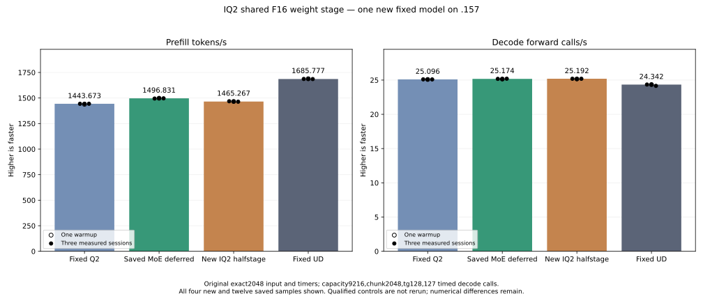

<!-- SPDX-License-Identifier: MIT -->
# IQ2 shared F16 weight stages

The completed new original-weight model preserves every parent replay byte
but regresses prefill:1465.267121 versus1496.830907 tokens/s, -2.108708%.
The component is13.640–16.820% slower despite81 exact complete outputs.
The experiment is retained without promotion. Fixed Q2/UD references remain
unchanged and the `.157` window is released.

The saved fixed-input MoE profile attributes 254.797 ms of prefill GPU work to
IQ2 expert gate/up. The new isolated candidate starts from measured MoE-deferred
1496.830907 PP / 25.17435733 TG. Fixed Q2 1443.672867 / 25.09595499 and UD
1685.777092 / 24.34174251 remain saved references. The original exact2048 input,
capacity9216/chunk2048, one warmup plus three measured samples, tg128 with127
timed decode calls and15-second waits outside timers remain the model contract.
No qualified control or old component is relaunched; full curves wait for parity.

The paired IQ2 kernel currently expands signed weight codes into F16 in both
half-waves of every consuming wave. The candidate performs the same
CodesToHalves packed add/FMA in the producer once per weight and stages those
halves in LDS. The duplicate consumers load the identical half values. Scale
rounding, signed codebook bytes, K16 accumulation order, live-fragment bounds,
SwiGLU and ordinary/packed output contracts remain. No stream, synchronization
point, global scratch, weight conversion or public ABI change is added.

F16 weight staging doubles the code plane from8192 to16384 bytes. Replacing
activation-plane padding with a quarter/token XOR permutation bounds the full
BN128 stage to32768 bytes. XOR operates inside each16-token fragment, so it
cannot leave any supported16/48/64/128-token tile. The separate corrected
weight swizzle uses the low row bits: eight producer lanes address eight bank
groups for a128-bit store. The initial row-shift variant and all its assembly
remain retained. Neither variant had measured runtime during preparation;
the completed swizzled measurements are recorded below. Static bank addressing
does not prove hardware occupancy or speed.

Local matched gfx1151 assemblies change eight paired IQ2 bodies and preserve
all149 other bodies exactly. Both variants have zero private scratch. The
initial variant changes unpacked BN64 VGPR102 to121 and BN128 VGPR148 to169;
expanded shared memory and longer producer lifetimes can reduce residency or
overlap. Instruction/resource counts do not establish a performance gain.
The final swizzled resource inventory is retained separately.

The new synthetic fixture embeds the literal saved parent kernel in the same
binary. It compares81 complete outputs over four widths, ragged token/output
edges, float/packed outputs and three weight rotations. Its three large cases
use2048 tokens,640 output rows,2560 inputs, top10 and64/128/512 experts with the
existing mixed128/64 map. Rotated gate/up weights span162201600/324403200/
1297612800 bytes, exceeding32 MiB MALL. Initialization, uploads, poison fills,
launches and readback use one nonblocking stream. Output mismatches retain
whole arrays and do not suppress42 kernel-timing samples. A changed output
guard stops further device work. This fixture measures fused gate/up plus
SwiGLU with prebuilt maps/F16 input, excluding map construction and down
projection; it is not a complete MoE cycle or original-weight model rate.

Launch guards admit this provider only for the new component or its matched
original counting model with full MMQ build. The first local guard run finds
the new provider missing from the final source whitelist: exit1 is retained
and corrected before staging. Final82 scope guards pass. Device assembly and
host fixture syntax pass. The frozen plan schedules one host Debug/ASan capsule,
one new component and one new model, retaining performance independently from
numerical or timing rejection. It requires fresh coordinated admission before
GPU build/run. Dependencies, tuning, cleanup and deployment are excluded.

The new `.157` CPU host capsule passes25/25 Debug and25/25 ASan/UBSan.
Its six commands exit0; seven artifacts,31 frozen fixtures and1020 pinned
host-source files verify. This is host qualification and opens neither GPU
nor original model. Component/model GPU work was still unadmitted at this
preparation checkpoint; its later admission and release are recorded below.

## Completed new component and model

The component completes three commands with exits0/0/0. Four artifacts,
31 frozen fixtures and1025 provider files verify. All81 complete parent/
candidate output pairs are exact, including guards and packed outputs.
All42 timings are retained; no old component cohort runs.

| Mixed routing, top10 | Parent median microseconds | Candidate median microseconds | Time change |
| --- | ---: | ---: | ---: |
|64 active experts|3891.385714|4428.241094|+13.795995%|
|128 active experts|4287.924131|4872.805278|+13.640193%|
|512 active experts|5637.055715|6585.196177|+16.819782%|

Model performance is collected despite the component regression. The new
original counting model completes with all four commands exiting0. Its26
artifacts,31 frozen fixtures and1025 provider files verify. Compilation takes
154.252034 seconds and remains outside all PP/TG sample timers.

| New model sample | Prefill seconds | Prefill tokens/s | Decode seconds | Decode forward calls/s |
| --- | ---: | ---: | ---: | ---: |
| Warmup |1.397017264|1465.980452|5.047442540|25.16125721|
| Measured1 |1.394985117|1468.116021|5.040690236|25.19496221|
| Measured2 |1.397697369|1465.267121|5.048366240|25.15665345|
| Measured3 |1.398960767|1463.943842|5.041265517|25.19208710|

| Saved fixed comparison | Prefill tokens/s | Decode forward calls/s |
| --- | ---: | ---: |
| Fixed Q2 |1443.672867|25.09595499|
| Retained MoE parent |1496.830907|25.17435733|
| New IQ2 halfstage |1465.267121|25.19208710|
| Fixed UD |1685.777092|24.34174251|

PP differs by-2.108708% versus parent. The candidate remains1.495786% above
original Q2 because it contains prior retained improvements, not because its
new halfstage is beneficial. TG differs by+0.070428%; the candidate changes
large-batch IQ2 prefill, so this does not establish a decode improvement.
All21 parent input/output/full-logit files and nine within-arm replays are
exact. All128 output tokens match fixed Q2/UD. The eight large logit-file
differences from original Q2 exactly reproduce the parent's differences;
maximum matched-history KL remains0.001256655 to Q2 and0.008626379 to UD.
Independent task quality and full-curve parity remain open.

The generated unpacked BN64/128 code halves the static counts for packed
FP16 add and FMA,32 to16 each, and byte permutations32 to16. It adds LDS
128-bit loads36 to40 and68 to72 respectively, and stores4 to6 /6 to8.
BN64 LDS grows17536 to24576 bytes and VGPR102 to121; BN128 grows25728 to32768
bytes and VGPR148 to169. The complete-model regression is consistent with
those traffic/lifetime tradeoffs, but no new stage trace or hardware counter
measurement isolates their contributions. The next kernel hypothesis should
reduce decode instructions while retaining compact weight staging; duplicating
the F16 plane is not selected for the provider.

CPU/GPU maxima including the model build are82.25/74 C. The51 runtime-library
hashes are retained. Admission at2026-10-05T01:04:06.741506Z uses checkpoint
`e0194a5` after core's handover and fresh checks. Release at01:11:17.660053Z
verifies612 recorded identities /480 groups absent, empty KFD, four unchanged
original leases free and six original model stat tuples unchanged. Canonical
release and main/remote active/ready mirrors share SHA256
`eb0d67857983fc0c0591bcdeccafb8c75dcf99029582754378513e1a2d49f8b3`.
There is no remaining Q2 GPU job, reservation, waiter, restart or cleanup.
Another GPU run requires a fresh coordinated admission.

[Initial retained source](../config/q2-iq2-halfstage-source.json),
[swizzled source](../config/q2-iq2-halfstage-swizzled-source.json),
[literal control](../experiments/q2-iq2-halfstage-control.inc),
[swizzled patch](../experiments/q2-iq2-halfstage-swizzled.patch),
[fixture](../tests/q2_iq2_halfstage.hip),
[static evidence](../config/q2-iq2-halfstage-swizzled-static.json),
[host receipt](../config/q2-iq2-halfstage-host-results.json),
[frozen plan](../config/q2-iq2-halfstage-plan.json),
[component outputs and all timings](../config/q2-iq2-halfstage-component-results.json),
[model samples and whole-logit replay](../config/q2-iq2-halfstage-model-results.json),
[all16 model samples](figures/q2-iq2-halfstage-model.csv),
[release](../config/q2-iq2-halfstage-window-release.json).

