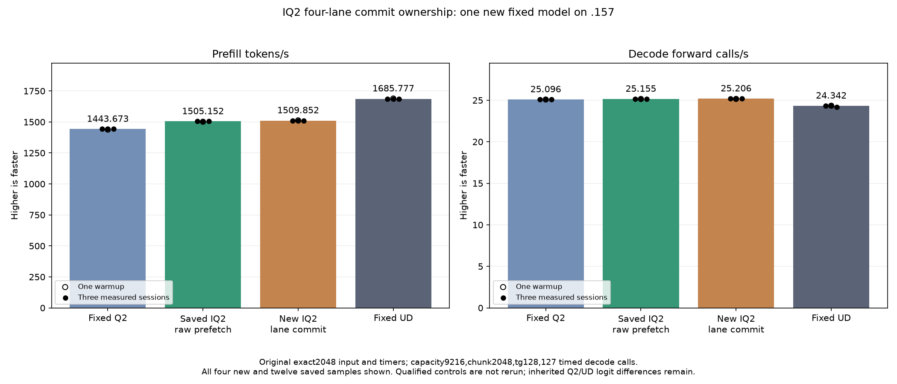

<!-- SPDX-License-Identifier: MIT -->
# Compact IQ2 decode ownership across four lanes

One new candidate starts from the measured IQ2 raw-prefetch provider:
1505.152258 PP /25.15493858 TG. Original fixed Q2 remains1443.672867 and
UD1685.777092, using the same exact2048 input/tg128 tester. This experiment
changes the IQ2 gate/up producer's ownership, not expert routing geometry.
The new component and original model now complete. All81 component pairs and
21 parent model files are exact. Model PP1509.852296/TG25.20625148 is a small
positive result versus saved1505.152258, despite slower operator timings.
Every sample and the distinction between these observations are retained below.

Every lane retains its original eight-byte encoded group and two-byte scale
prefetch. Four-lane groups exchange those compressed words; each lane decodes
one of four eight-value portions for each original owner. The resulting64-bit
slices cover the original compact LDS cells exactly once. Scale publication
stays with the original owner, followed by the unchanged block barrier.
Codebook/sign bytes, scale rounding, WMMA accumulation and epilogues remain
unchanged. Q2 down, vector decode, dense kernels and attention are untouched.

This differs from the measured8/16-value local commit variants, which did not
redistribute ownership, and from the older Q2-down half-wave sharing probe.
It does not introduce another table, tensor allocation, stream or geometry.
Its source is derived from independently fetched official Gufo at
f783fedb9bea2ec7de941f6da4e02f4a4596b29e; no sibling DS4 code is imported.

## Static preparation

The1025-file source inventory changes one numerical file. All149 unrelated
kernel bodies remain identical; eight IQ2 bodies change. A separate ownership
enumeration verifies1024 unique slices over8192 shared bytes, with peer lanes
always in the same wave. This is not a GPU race or numerical proof.

| BN | Parent next-free VGPR | Candidate next-free VGPR | LDS bytes | Private bytes |
|---|---:|---:|---:|---:|
|16|78|86|11392|0|
|48|88|96|15488|0|
|64|96|104|17536|0|
|128|142|150|25728|0|

Both output specializations have these resources. Next-free register metadata
does not measure allocated occupancy. Eight static32-bit exchanges and four
64-bit stores replace the two128-bit compact stores per producer stage;
weight/codebook load totals and ordered arithmetic are retained. More register
pressure can erase any access benefit; only runtime measurement decides.
Production assembly, fixture host/device compilation and107 launcher guards
pass. The retained parent assembly is reused without rebuilding old controls.

## Frozen new-candidate qualification

The [plan](../config/q2-iq2-lane-commit-plan.json) freezes57 fixture files,
four manifests and the coordination helper. New .157 host Debug/ASan gates
pass27 tests each, six commands exit0 and seven artifacts verify. Local capsule preparation
already verifies every frozen fixture and all1025 provider files before SSH.
Fresh root handover confirms no root use/reservation of .157 after the saved
short48 release; the helper separately checks actual ownership and device state.

The component compares81 complete guarded outputs against the literal retained
parent in one new binary: BN16/48/64/128 with ragged15/17/129 token rows,
F32/packed outputs, then actual2048x640x2560 mixed128/64 dispatch for64/128/512
experts. Three weight rotations exceed32MiB. The42 timing records include two
warmups and five alternating measured cycles per arm and expert count.
Safe numerical failures save their arrays and preserve timings; unsafe guards
or unwritten required outputs stop subsequent device work.

One original model follows despite safe numerical or component timing rejection:
2048 prompt tokens,128 output tokens,127 timed decode calls, capacity9216,
chunk2048, greedy C1, MTP off, one warmup and three measurements,15-second
cooldowns outside timers. Compilation/loading are outside PP/TG. Historical
Q2, best-parent and UD files/binaries/results remain unchanged and are reused.
No qualified cohort, Q4 or full curve is rerun. Independent task quality and
whole-curve parity remain open.

[Source](../config/q2-iq2-lane-commit-source.json),
[patch](../experiments/q2-iq2-lane-commit.patch),
[static evidence](../config/q2-iq2-lane-commit-static.json),
[host evidence](../config/q2-iq2-lane-commit-host-results.json),
[local capsule check](../config/q2-iq2-lane-commit-staging-results.json).

## Completed GPU component and original model — 2026-10-05 UTC

All81 guarded output pairs are retained;42 timings cover three rotated-weight distributions. Positive time changes mean slower.

| Distribution | Reference median us | Candidate median us | Time change |
| --- | ---: | ---: | ---: |
| mixed-e64 | 3658.460617 | 3746.565819 | +2.408259% |
| mixed-e128 | 4061.651548 | 4086.291313 | +0.606644% |
| mixed-e512 | 5434.246699 | 5560.216904 | +2.318080% |

The original model benchmark runs despite component timing rejection. All three comparator columns below are saved evidence, without rebuild or rerun.

| Session | Fixed Q2 PP / TG | Saved best PP / TG | New lane commit PP / TG | Fixed UD PP / TG |
| --- | ---: | ---: | ---: | ---: |
| Warmup | 1438.259006 / 25.08847266 | 1501.690147 / 25.15123490 | 1512.701776 / 25.15742671 | 1689.043527 / 24.34239962 |
| Measured 1 | 1443.398207 / 25.10565683 | 1505.152258 / 25.16777240 | 1510.259601 / 25.20649263 | 1686.364042 / 24.34621613 |
| Measured 2 | 1443.672867 / 25.08698337 | 1503.530071 / 25.14904438 | 1509.852296 / 25.17944517 | 1685.777092 / 24.34174251 |
| Measured 3 | 1443.841794 / 25.09595499 | 1505.315370 / 25.15493858 | 1508.620907 / 25.20625148 | 1685.400011 / 24.15102104 |
| Median measured | 1443.672867 / 25.09595499 | 1505.152258 / 25.15493858 | 1509.852296 / 25.20625148 | 1685.777092 / 24.34174251 |

There are0 changed parent model files. Within-arm replay is exact=True. PP change versus saved best=+0.312263%.

Resident model memory remains43,156,012,544 bytes. Compilation/loading stay outside PP/TG. Independent task quality and the context/concurrency curve remain open. The window releases at2026-10-05T10:12:32.599494+00:00 with834 retired identities/660 groups, empty KFD, four free original leases and unchanged seven model stat tuples. All37 artifacts verify across13 runtime commands; canonical/main/remote mirrors agree.

[All model samples](figures/q2-iq2-lane-commit-model-wrapped.csv), [all component samples](figures/q2-iq2-lane-commit-component.csv), [final audit](../config/q2-iq2-lane-commit-final-audit.json).

## Retained decision and the next ownership opportunity

Retain the new nominal best as the next composition source; the previous1505
source and every old control stay available unchanged. Model PP increases
0.312263% against its parent and4.584101% against original Q2. Reaching fixed
UD still requires11.651788% more PP. Opposite component/model trends and the
historical model comparisons do not establish a stable causal gain. Vector
decode is unchanged; its nominal0.203987% increase is not credited to IQ2.
Inherited fixed-Q2/UD logit differences remain exactly the same. This is no
independent quality, full-curve or qualified-runtime promotion.
[Machine-readable decision](../config/q2-iq2-lane-commit-retained-update.json).

Recorded CPU/GPU maxima including the new build are83.375/77 C. Component
and model commands all exit0; build/loading remain outside throughput timers.
The exported PNG is visually checked, with all new/saved samples retained.

The [new source audit](../config/q2-iq2-wide-pair-opportunity.json) identifies a
different possible saving in IQ2 BN64. A BM256 block could compute128 logical
rows, with gate and up accumulators for each row held by the same wave. At
M640 the output grid would shrink10→5 blocks, sharing each activation load
across more output rows. It could publish only final SwiGLU values into a
per-wave transpose, removing the present cross-wave pairing barriers while
keeping every stage barrier and the original product/Sigmoid ordering.

The audit enumerates512 fetch owners,4096 paired accumulator positions and
2048 output positions, including nine ragged output widths. It establishes
logical ownership only. Useful matrix products and total weight decoding do
not decrease; accumulators double32→64 values per lane and stage LDS would
grow17536→26752 bytes. Registers, occupancy and tails can erase any benefit.
This proposal is not yet implemented, compiled or measured. It targets only
nonpacked BN64, retaining128/48/16 maps, down, dense and scalar decode.
