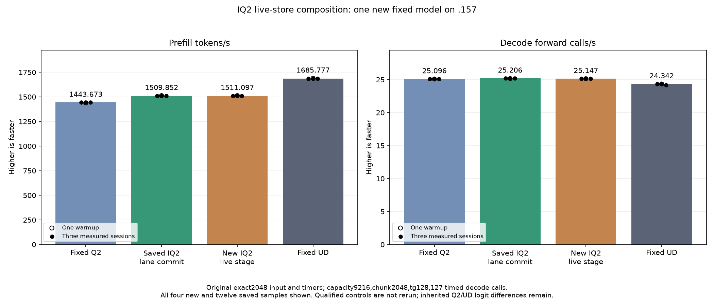

<!-- SPDX-License-Identifier: MIT -->
# IQ2 live-store suppression on the compact producer

The new original-model run completes at **1511.097261 PP /25.14684805 TG**,
nominally+0.082456% PP and-0.235669% TG against the saved1509.852296 parent.
All21 parent model files and nine internal replays are exact. Retain the
composition as marginal evidence, with both sources available; historical
sample ranges overlap and do not establish a stable causal improvement.
Fixed UD1685.777092 still requires11.559801% more PP throughput. Whole-curve
parity and independent task quality remain unmet.

This new composition starts from the retained four-lane IQ2 provider,
1509.852296 PP / 25.20625148 TG. It applies the exact existing live-stage
predicate once during activation-slot preparation. Each K stage then omits
stores only for complete 16-row fragments that the matrix loop never reads.
Padding inside the final live fragment, weights, scale rounding, WMMA order,
barriers, epilogues and routing remain unchanged. The source derives from
independently fetched official Gufo at
`f783fedb9bea2ec7de941f6da4e02f4a4596b29e` and keeps its notices.

The [source inventory](../config/q2-iq2-live-compose-source.json) verifies
1025 provider files with one changed file. Local production assembly changes
six IQ2 bodies and preserves all151 others. LDS, VGPR allocation, arithmetic
instruction counts, barriers and zero private bytes are unchanged. BN128 uses
two additional scalar registers. These facts do not establish runtime safety
or a performance gain. [Static accounting](../config/q2-iq2-live-compose-static.json).

The old live-stage component already preserves all102 output arrays and passes
51 independent checks in each of three arms, with105 retained timing samples.
Its four recorded-routing medians improve0.817–2.081% versus the final control;
two cases missed the historical advancement threshold. That original verdict
is preserved. The owner requests testing new compositions even when an old
component result is marginal. A read-only audit verifies318 saved artifacts
and their original fixture capsules; it does not rerun or qualify the new
composition. [Retained evidence](../config/q2-iq2-live-compose-retained-results.json).

The [frozen plan](../config/q2-iq2-live-compose-plan.json) admits only one new
original-model run: exact2048 input, chunk2048, capacity9216, tg128 with127
timed decode calls, C1, greedy, MTP off, one warmup and three measurements.
Saved fixed Q2 1443.672867 /25.09595499, UD1685.777092 /24.34174251 and the
1509.852296 parent are reused without rebuild or rerun. All samples and saved
logits must be reported; compilation/loading stay outside PP/TG.

Launcher113 guards and local source-capsule checks pass. The .157 host cohort
passes27/27 Debug and27/27 ASan/UBSan; six commands exit zero and seven
collected artifacts verify. [Host receipt](../config/q2-iq2-live-compose-host-results.json).
GPU model performance,
independent task quality and PP/TG curve parity remain unproven at preparation.
The `.157` GPU window requires a fresh handover, original-lease admission and
verified retirement. No full curve, Q4, cleanup, tuning or deployment is part
of this experiment. Core ABI, model state and metrics contracts are unchanged.

Reproduce only with a fresh admitted window and a new exclusive label:

```sh
python3 tools/q2-remote.py q2-counting-iq2-live-compose q2-iq2-live-compose-model-NEW --source-variant iq2-live-compose --rebuild-mmq
```

## Completed original-model comparison — 2026-10-05 UTC

One new original-model candidate completes; the three comparator columns below are saved evidence, without rebuild or rerun. PP is prefill tokens/s; TG is timed decode forward calls/s.

| Session | Fixed Q2 PP / TG | Saved parent PP / TG | New live-stage PP / TG | Fixed UD PP / TG |
| --- | ---: | ---: | ---: | ---: |
| Warmup | 1438.259006 / 25.08847266 | 1512.701776 / 25.15742671 | 1512.689655 / 25.13929840 | 1689.043527 / 24.34239962 |
| Measured 1 | 1443.398207 / 25.10565683 | 1510.259601 / 25.20649263 | 1508.605796 / 25.14044870 | 1686.364042 / 24.34621613 |
| Measured 2 | 1443.672867 / 25.08698337 | 1509.852296 / 25.17944517 | 1512.288237 / 25.14684805 | 1685.777092 / 24.34174251 |
| Measured 3 | 1443.841794 / 25.09595499 | 1508.620907 / 25.20625148 | 1511.097261 / 25.14869047 | 1685.400011 / 24.15102104 |
| Median measured | 1443.672867 / 25.09595499 | 1509.852296 / 25.20625148 | 1511.097261 / 25.14684805 | 1685.777092 / 24.34174251 |

There are 0 changed parent model files. Within-arm replay is exact=True. PP change versus saved parent=+0.082456%; TG change=-0.235669%.

Resident model memory remains43,156,012,544 bytes. Compilation/loading stay outside PP/TG. Independent task quality and the context/concurrency curve remain open. The window releases at 2026-10-05T11:27:01.876120+00:00 with 878 retired identities/696 groups, empty KFD, four free original leases and seven unchanged model stat tuples. All33 artifacts verify across10 runtime commands, including the separate27+27 host cohort. Canonical/main/remote mirrors agree. No historical component or comparator is rerun.


[All model samples](figures/q2-iq2-live-compose-model-wrapped.csv), [model replay](../config/q2-iq2-live-compose-model-results.json), [final audit](../config/q2-iq2-live-compose-final-audit.json).

The observed model-cohort peaks, including compilation/loading, are84.875 C
CPU and75 C GPU, with no thermal stop. Saved-parent logit differences are zero;
inherited differences versus fixed Q2/UD remain KL0.001256655237433772 /
0.008626378681797702. Matching these retained frontiers does not establish
independent task quality. No kernel, default runtime or service is promoted.

A separate [source audit](../config/q2-scaled-live-stage-opportunity.json)
finds that scaled-Q2 down BN48/64 also skips wholly dead matrix fragments but
still writes their zero activations. All131 enumerated slot-ownership cases
retain their readers and final-fragment padding. This is a new bounded down
hypothesis, not a runtime result or an automatic extension of IQ2 qualification.
