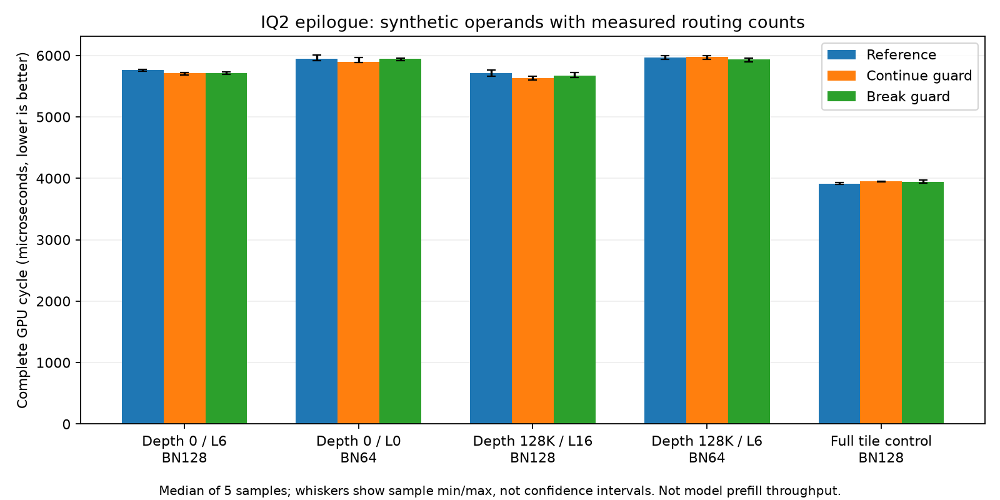

<!-- SPDX-License-Identifier: MIT -->
# Skip empty IQ2 paired epilogue fragments

Inspection for the [routing diagnostic](Q2-ROUTE-PROFILE.md) finds an opportunity
smaller than a mixed-width map. The active IQ2 gate/up matrix loop already skips
16-row fragments beyond `live_tok_tiles`. Its paired epilogue still writes eight
accumulators per thread to shared memory and executes two workgroup barriers
for each such fragment, although every output-row predicate is false.

The candidate adds a workgroup-uniform guard before those stores. It is limited
to paired IQ2 specializations with more than one token fragment. Every live
fragment keeps its arithmetic, output addressing and both barriers, including
the last live fragment. The condition depends only on the tile descriptor and
expert bucket bounds, which are identical across all threads in the workgroup;
there is no barrier reached by only a subset of threads.

The source starts from measured ordered IQ2 decode, changes only
`kernels.hip.cpp`, and leaves the other 1019 files exact. It retains the original
PLE reader, routing map, tile widths, weight conversion, accumulation order,
SwiGLU expression and down projection. It includes neither the rejected WMMA
sign expansion nor PLE cache-first. The source is separate from the running
routing profile and has no instrumentation.

Both providers compile locally to gfx1151 device assembly with identical
flags; no GPU program is executed by this check. The unpacked IQ2 specializations
used by the model show:

| Token tile | Static instructions before/after | VGPR before/after | SGPR before/after | LDS bytes | Scratch bytes |
| ---: | ---: | ---: | ---: | ---: | ---: |
| 16 | 661 / 661 | 82 / 82 | 24 / 24 | 11392 | 0 |
| 48 | 1161 / 1190 | 94 / 94 | 30 / 30 | 15488 | 0 |
| 64 | 1391 / 1414 | 102 / 102 | 30 / 32 | 17536 | 0 |
| 128 | 2381 / 2432 | 148 / 148 | 38 / 40 | 25728 | 0 |

The static body grows because of the guards. Shared-store/barrier instructions
remain present for live fragments; their potential saving is dynamic when a
tail is empty. Unchanged VGPR/LDS and zero scratch do not prove a speedup or
identical compiled outputs. Extra branch/layout cost may outweigh tail savings.

The required next check is a matched complete GPU gate/up cycle, covering full
and partial 16-row boundaries, packed/unpacked outputs, independent FP64 checks,
full-output replay and guard regions. Existing numerical limits remain unchanged;
finite output and performance must remain available on a numerical rejection.
Use original-size rotating weights beyond the 32 MiB MALL cache. Only a qualified
component improvement may advance to an uninstrumented full canonical 0–128K
Q2/control/UD comparison. No model gain, promotion or parity is claimed.

[Source manifest](../config/q2-iq2-live-epilogue-source.json),
[static evidence](../config/q2-iq2-live-epilogue-static.json),
[minimal patch](../experiments/q2-iq2-live-epilogue.patch).

## Component qualification prepared — 2026-10-04

The fixed `iq2-live-epilogue-check` mode now builds the reference or candidate
kernel directly, with no MMQ archive reuse or model access. Both use the same
fixture and measured ordered-IQ2 parent. The component fixture uses four exact
count distributions from accepted canonical continuations. Activations and
encoded weights are synthetic; it does not replay model hidden states.

| Case | New tokens | Gate/up tile | Active weight bytes |
| --- | ---: | ---: | ---: |
| Depth 0, layer 6 | 2040 | 128 | 286387200 |
| Depth 0, layer 0 | 2040 | 64 | 321868800 |
| Depth 131072, layer 16 | 2046 | 128 | 274560000 |
| Depth 131072, layer 6 | 2046 | 64 | 310041600 |
| Full-tile control | 2048 | 128 | 135168000 |

The control has 160 experts with exactly 128 rows each: no fragment can be
skipped, so it exposes the added guard cost. Every active weight set exceeds
32 MiB. Each timed cycle includes activation narrowing, routing compaction and
fused IQ2 gate/up with SwiGLU; allocations and uploads stay outside. Two warmup
samples precede five retained samples of eight calls. Units are microseconds
per complete component cycle, never model token/s.

The assignment builder preserves each recorded count, places ten distinct
experts on every token and independently verifies the resulting histogram.
Operator cases cover both sides of 16-row and tile boundaries, tiny/normal
inputs, partial output rows, packed/unpacked outputs and guard regions.
There are 46 full operator FP64 comparisons and five 256-value independent
cycle samples, retaining the original 0.002 limits. Reference/candidate replay
also compares every value of the five complete cycle outputs. All 102 arrays
occupy 262319680 bytes; only this fixed mode receives a 384000000-byte collection
limit. Tolerance failures retain arrays and performance and return exit 1;
runtime faults and guard corruption stop execution.

The analyzer verifies exact count provenance from the diagnostic log, accepted
request attribution, input/count/route hashes, all outputs, complete cycles,
source/fixture identities and ownership receipts. The separate host route
builder and parser/selection tests now pass in the 21-test Debug/ASan cohort
on `.157`, as recorded below. The earlier local syntax/configuration receipts
remain separate static evidence. The core owns the next GPU window; host
qualification does not establish a GPU numerical result or model-rate claim.

[Fixed plan](../config/q2-iq2-live-epilogue-plan.json),
[static wiring receipt](../config/q2-iq2-live-epilogue-wiring.json).

## Exit once the live fragments end — 2026-10-04

The separate `iq2-epilogue-break` candidate exits the paired epilogue loop at
the first empty fragment. Fragment index `j` increases monotonically and
`live_tok_tiles` is constant and uniform across the workgroup, so every later
fragment is also empty. All live-fragment stores, arithmetic and both barriers
remain before that exit. This changes only the loop's control flow relative
to the first guard; the candidate still starts from the measured ordered
provider and changes only the same single source file.

Matched local device compilations reproduce the prior reference/continue
accounting and show fewer static instructions with the early exit:

| Token tile | Original | Continue guard | Break guard | VGPR, all three | Scratch, all three |
| ---: | ---: | ---: | ---: | ---: | ---: |
| 16 | 661 | 661 | 661 | 82 | 0 |
| 48 | 1161 | 1190 | 1177 | 94 | 0 |
| 64 | 1391 | 1414 | 1404 | 102 | 0 |
| 128 | 2381 | 2432 | 2401 | 148 | 0 |

These are unpacked specializations. The packed variants also drop 14/10/31
instructions at 48/64/128 relative to `continue`; both 16-row specializations
are unchanged. LDS, static WMMA count and barrier/store bodies are unchanged.
The added SGPR allocation versus the original remains: 30→32 at64 and 38→40
at128. Lower static instruction count does not establish a runtime improvement,
numerical identity or model gain; scheduling and instruction pairing also change.

The same fixed component fixture and analyzer now accept either candidate
against the unchanged reference. The prepared sequence is reference, continue,
break, with a separate complete comparison report for each candidate. Existing
source variants, numerical limits and full-tile control remain available.
No GPU window is admitted and the core handover is still required.

[Break source](../config/q2-iq2-epilogue-break-source.json),
[three-way static accounting](../config/q2-iq2-epilogue-break-static.json),
[break wiring receipt](../config/q2-iq2-epilogue-break-wiring.json).

## Host qualification complete — 2026-10-04

`q2-epilogue-host-r1` runs the CPU-only path on `.157` from04:50:43 to04:51:13 UTC.
Both 21/21 Debug and 21/21 ASan/UBSan pass, including the real count assignment
builder and the selection/report rejection cases. All six commands exit zero;
seven collected artifacts verify by size/SHA. Every relevant fixture matches
the source capsule, and the JSON header used by the native host test matches
all three GPU provider manifests.

This path builds with `Q2_HIP=OFF`, loads no model and acquires no GPU lease.
All 24 telemetry samples show KFD empty. Fresh closure at04:52:32 UTC confirms
the seven recorded PIDs and six owned groups absent. The GPU registry is still
at the preceding routing release; no GPU window was acquired or handed over.
The core reservation is unchanged. GPU operators, all 51 numerical checks,
complete-output replay and cycle timings remain pending.

[Host result and closure](../config/q2-iq2-epilogue-host-results.json).
The fixed fixture plan is retained byte-for-byte as executed; its preparation
status fields are historical, while this result records the completed host gate.

## GPU comparison complete — 2026-10-04

The three fixed arms run sequentially on `.157` at06:31:40–06:34:10 UTC after
the core's canonical release and fresh original-lease admission. All nine
configure/build/fixture commands exit zero. The collected 318 artifacts and
all three 1020-file provider inventories verify, including exact fixture
identity against the earlier host qualification.

All 51 independent checks pass in every arm with the unchanged0.002 limits.
Each candidate preserves all102 reference arrays byte-for-byte, including
the five full cycle outputs. This qualifies this component only; existing
independent model numerical rejection and whole-curve parity remain open.

The table reports median **microseconds per complete GPU cycle**. Negative
changes mean less elapsed time. The depth labels identify the source of the
routing counts; operands are synthetic and these are not model token/s.

| Routing case | Reference µs | Continue µs | Continue change | Break µs | Break change |
| --- | ---: | ---: | ---: | ---: | ---: |
| Depth0, layer6, BN128 | 5763.265 | 5707.431 | −0.969% | 5716.095 | −0.818% |
| Depth0, layer0, BN64 | 5948.101 | 5896.742 | −0.863% | 5941.526 | −0.111% |
| Depth128K, layer16, BN128 | 5714.972 | 5635.848 | −1.384% | 5668.512 | −0.813% |
| Depth128K, layer6, BN64 | 5969.625 | 5977.730 | +0.136% | 5937.150 | −0.544% |
| Full-tile control, BN128 | 3915.443 | 3948.817 | +0.852% | 3940.782 | +0.647% |

Five retained samples follow two warmups in each case. The graph's whiskers
show observed sample minima/maxima, not confidence intervals. There is one
process run per variant; order/clock variability is not independently isolated.
CPU/GPU peaks are66.125/56 C for the reference,70/74 C for continue and69/75 C
for break. No thermal or runtime stop occurs. These small differences establish
no uniform component gain: neither guard advances to a full model comparison.
The roughly50% empty-fragment geometry did not become a comparable time saving.

The next source-level hypothesis is repeated activation staging: `commit_stage`
still stores zeros for wholly empty16-row fragments in every K stage, although
`compute_stage` skips reading them. A candidate would skip only rows beyond the
last live16-row fragment; zero padding inside the final live fragment and all
barriers must remain. This is an unimplemented hypothesis. Extra predicates
and register pressure could outweigh the reduced LDS stores.

[Summary and decision](../config/q2-iq2-epilogue-summary.json),
[continue analysis](../config/q2-iq2-epilogue-continue-results.json),
[break analysis](../config/q2-iq2-epilogue-break-results.json),
[all105 samples](figures/q2-iq2-epilogue/samples.csv),
[vector figure](figures/q2-iq2-epilogue/cycles.svg).

Verified closure at06:36:53 UTC retires12 process identities and9 owned groups,
checks KFD empty, all four original leases EX|NB/free and all six model stat
tuples unchanged. Remote/main `run/q2-iq2-epilogue-window-release.json` has SHA
`2c5f328a762c9ffe3172c566767c4e3126e74ac09cae9a4a488e567320104160`.
No Q2 job, waiter, GPU reservation or restart remains. Core may freshly admit
its next window. Outgoing MCP delivery fails; persistent receipts carry the
handover and no message delivery is claimed.
