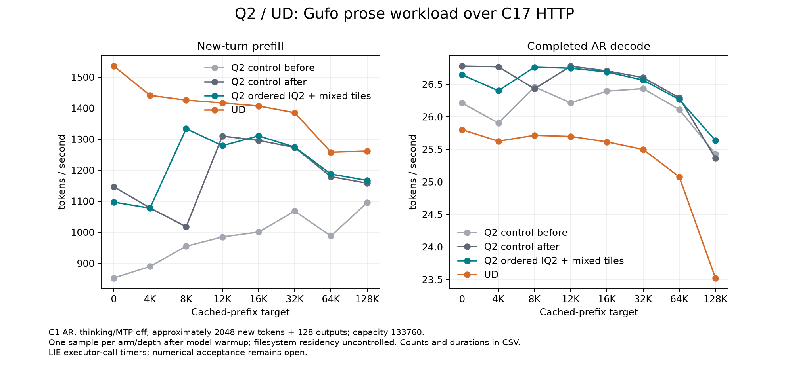

<!-- SPDX-License-Identifier: MIT -->
# Mixed IQ2 tiles on the canonical Q2/UD curve

The four complete .157 curves do **not establish a uniform full-model gain**
from mixed 128/64 gate/up dispatch. Q2 prefill remains below UD at all eight
points. Both Q2 controls and the candidate retain the earlier ordered-sign
decode improvement; their faster decode than UD cannot be attributed to the
new prefill map. The candidate remains experimental and is not promoted.

All 20 Q2 requests, replies, finish reasons and physical work counts match
exactly between the first control and both subsequent Q2 arms, including
calibration, warmup and prefix preparation. This is response replay, not an
independent model numerical or task-quality certificate.

[SVG](figures/q2-iq2-mixed-canonical/curve.svg),
[all 32 observations, counts, durations and cache times](figures/q2-iq2-mixed-canonical/samples.csv),
[verified comparison](../config/q2-iq2-mixed-canonical-results.json).

## Prefill — tokens per second

| Prefix target | Q2 control before | Q2 mixed | Q2 control after | UD |
| ---: | ---: | ---: | ---: | ---: |
| 0 | 852.547 | 1097.170 | 1146.838 | 1535.721 |
| 4096 | 889.661 | 1077.649 | 1078.445 | 1441.504 |
| 8192 | 954.818 | 1333.875 | 1017.860 | 1426.041 |
| 12288 | 984.855 | 1279.121 | 1310.030 | 1416.947 |
| 16384 | 1000.595 | 1310.772 | 1296.209 | 1407.221 |
| 32768 | 1068.264 | 1274.508 | 1273.390 | 1385.347 |
| 65536 | 987.841 | 1187.607 | 1179.144 | 1258.262 |
| 131072 | 1095.648 | 1166.886 | 1158.194 | 1261.714 |

## Decode — tokens per second

| Prefix target | Q2 control before | Q2 mixed | Q2 control after | UD |
| ---: | ---: | ---: | ---: | ---: |
| 0 | 26.212 | 26.645 | 26.780 | 25.803 |
| 4096 | 25.906 | 26.401 | 26.770 | 25.626 |
| 8192 | 26.459 | 26.763 | 26.430 | 25.715 |
| 12288 | 26.216 | 26.747 | 26.778 | 25.699 |
| 16384 | 26.394 | 26.690 | 26.706 | 25.615 |
| 32768 | 26.433 | 26.564 | 26.603 | 25.499 |
| 65536 | 26.114 | 26.267 | 26.293 | 25.078 |
| 131072 | 25.429 | 25.636 | 25.365 | 23.523 |

## Attribution and scope

The unchanged second Q2 control improves PP by 5.709–34.519% over the first.
Consequently, the candidate's higher rates than the first control do not isolate
its benefit. Compared with the repeated control, candidate PP changes by
−4.331% at 0, −0.074% at 4K, +31.047% at 8K, −2.359% at 12K and
+0.088–1.124% at 16–128K. The low 8K control stays in the result. These single
sequential observations cannot isolate filesystem residency, order, clock or
thermal effects, or prove a causal regression at a particular depth.

Candidate PP is 28.557% below UD at 0, 25.241% below at 4K and 5.615–9.727%
below at 8–128K. At 128K it processes 2046 new tokens after 130933 cached
tokens: 1166.886 versus 1261.714 tokens/s. Candidate TG differs from the repeated
Q2 control by −1.376% to +1.258%; no new decode optimization is introduced.
The measured UD 128K decode rate of 23.523 is preserved without attributing its
cause or crediting that lower value to the mixed map.

The [component](Q2-IQ2-MIXED.md) still has exact outputs and 1.487–4.148% lower
complete-cycle time on the four measured routing shapes. Those gains cannot
be substituted for a uniform full-model improvement. Repeated comparisons are
needed to distinguish the small long-context differences from variability.

The historical [1439.264 Q2 / 1666.902 UD counting-prompt result](Q2-LIBRARY-NORM.md)
remains valid for that workload and timer. It is neither replaced by 852.547 nor
proved to have regressed by this different prose workload. The shared numerical
kernel file is byte-identical from that composition through the current mixed
provider. A fresh same-harness counting replay is the appropriate regression
control; it does not replace the canonical graph as optimization priority.

## Other acceptance gates

This campaign covers C1 continuation PP/TG. The CSV also retains complete HTTP
request duration and cache capture/restore. It does not record client first-token
arrival time or a latency distribution, and global memory telemetry is not a
per-model host/device allocation peak. Native C2/C4/C8, fresh long-prompt ingestion,
the native 256K frontier and independent numerical/task quality remain open.
512K/1M and optional capabilities have separate qualification gates. The complete
[acceptance matrix](Q2-CURVE-PARITY.md) and [validation protocol](Q2-VALIDATION.md)
remain in force. No zero-margin statistical acceptance or goal completion is claimed.

## Validation and closure

The host capsule passes 22/22 Debug and 22/22 ASan/UBSan on .157. All four model
arms rebuild MMQ and complete eight depths with five zero command exits each;
120 model artifacts verify. With the host cohort, 26 commands exit zero and
127 artifacts verify. The analyzer checks source inventories, host-qualified
harness bytes, actual request histories and physical token/timing counts.
The 32 exported CSV rows match the report and the graph is visually inspected.
All numerical kernels remain identical to the ordered provider; only three
host/build files and two C17 helper files differ in the mixed composition.

C1 AR, thinking/MTP/vision/SSD off, RAM prefix budget 16384 MiB, capacity 133760
and chunk 2048 are unchanged. No filesystem cache is dropped and no cold-cache
claim is made. Whole-cohort thermal peaks, including builds and loading:

| Arm | CPU °C | GPU °C |
| --- | ---: | ---: |
| baseline | 93.125 | 98.000 |
| q2 | 95.250 | 97.000 |
| baseline_repeat | 96.375 | 98.000 |
| ud | 96.000 | 100.000 |

No thermal guard stops occur; these whole-cohort peaks cannot explain a
particular cell. Fresh closure at **2026-10-04T10:16:14.814706+00:00** verifies all 70 recorded
process identities and 50 groups retired, empty KFD, four unchanged original
lease identities free and six unchanged model stat tuples. Remote/main receipts
and the shared registry record release; no Q2 workload, waiter, reservation or
restart remains. No cleanup occurs on .157.

[Release receipt](../config/q2-iq2-mixed-model-window-release.json), SHA256
`5b171da1f0cd4a4d64faf78fe7d07ab07b9a36a6da17dc4c36afc00df35f60f5`. Source checkpoint: `452b0dd`.
