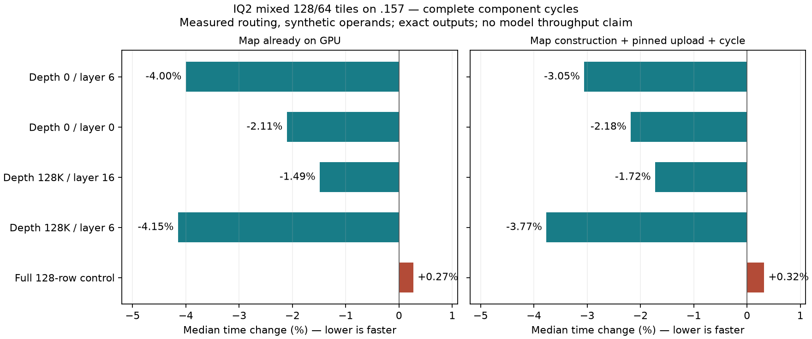

<!-- SPDX-License-Identifier: MIT -->
# Mixed IQ2 128/64-row dispatch

This experiment follows the large/tail partition identified in the
[official DeepSeek audit](Q2-DEEPSEEK-AUDIT.md). The measured ordered-IQ2
provider remains byte-identical across all 1020 files. The first-party C17
map builder uses the existing Qwen descriptor format and launches its existing
128-row and 64-row gate/up kernels on disjoint spans. No numerical kernel,
weight encoding, scale, K reduction, Q2 down or PLE code changes.

For an expert with `g = ceil(count / 64)` groups, the map contains `g / 2`
wide descriptors followed by one narrow tail when `g` is odd. A wide index
is relative to 128 rows; a tail index is relative to 64. This distinction
preserves the tail's original row offset. The complete map uses
`ceil(count / 128)` descriptors per expert. A 65–128-row remainder still uses
one wide tile; this avoids decoding the weights twice merely to remove padding.

The implementation independently expresses the inspected mechanism from official
Gufo `f783fedb9bea2ec7de941f6da4e02f4a4596b29e`,
`src/models/deepseek_v4_flash/kernels/rocm/detail/ds4_rocm_q2_down.hip.hpp`.
No sibling DS4 project source, build or evidence is changed or imported.
LIE ABI, persistent state and metrics contracts are unchanged.

## Complete component comparison

The [frozen plan](../config/q2-iq2-mixed-plan.json) reuses the four accepted
canonical count vectors at depths 0/128K and the full-128-row control from the
epilogue fixture. Operands are synthetic; these component cycles do not run
the original model or measure context throughput. The active weight extents
remain 274.56–321.87 MB, with 135.168 MB in the full-tile control, all above
32 MiB MALL. Total allocated encoded weights are 432,537,600 bytes.

Each arm measures two scopes, with two warmups and five samples of eight calls:

- `resident-map-cycle`: activation narrowing, routing compaction and every
  gate/up/SwiGLU launch, with the map already on the device.
- `map-upload-cycle`: also construct the map and copy it from pinned host
  storage. Both arms synchronize the stream before reusing the pinned source.
  This is a serialized component cycle and does not reproduce overlap with
  the model's shared expert. Both HIP-event and host-wall durations are retained.

All output elements must be finite, written, and bounded by unchanged guards.
The fixture saves five full arrays and five independent 256-value FP64 oracle
samples. The analyzer checks all ten output pairs, exact operands, expected
map hashes, source inventories, host-qualified fixture bytes, actual command
policy, process/lease closure and both timing scopes. Numerical failures keep
their timings and exit1; runtime and guard errors stop execution. The existing
0.002 independent tolerances are unchanged.

The fixed remote modes are:

```sh
python3 tools/q2-remote.py iq2-mixed-reference-check q2-iq2-mixed-reference-r1 --source-variant iq2-mixed
python3 tools/q2-remote.py iq2-mixed-check q2-iq2-mixed-candidate-r1 --source-variant iq2-mixed
```

These component modes reject model dispatch, detached execution and MMQ reuse.
Both compile the same ordered provider and use distinct explicit runtime map
policies. A useful component result would justify model integration and the
full canonical HTTP PP/TG curve at all eight 0–128K depths; it cannot establish
Q2/UD parity or independent model quality by itself.

## Host qualification on .157 — 2026-10-04

The first cohort passes the new map coverage test but exits8 from CTest because
the general remote source allowlist rejects the new component variant. That
failure and its original command exits are retained under
`evidence/q2-iq2-mixed-host-r1`. After the allowlist correction, the second
cohort passes **22/22 Debug and 22/22 ASan/UBSan**, all six commands exit0,
and seven collected artifacts verify. Coverage exhausts every supported single
bucket length1–4096, every two-expert split of4096, maximum occupancy, skewed
boundaries, exact-capacity guards, invalid inputs and unchanged failure outputs.
The parser tests reject a wrong policy, map identity, incomplete run or timing
scope, and preserve a numerical failure alongside its samples.

The [host receipt](../config/q2-iq2-mixed-host-results.json) binds the executed
fixtures. `Q2_HIP=OFF`, no model access and no GPU lease apply to these host
checks. C17 and HIP host syntax also pass locally; the first missing generated
codebook include and transient local ENOSPC failures are retained. Two generated
Python bytecode files were removed only from the owned worktree on .155 to
restore writes. No cleanup occurred on .157.

The earlier live-stage LDS-store candidate remains prepared separately and
unmeasured; it is not composed into this mixed-map experiment.

## Completed GPU component comparison — 2026-10-04

Fresh admission at08:28:59 UTC verifies the preceding Q2 release is still the
latest ownership event, with no intervening core admission, all23 recorded
processes and18 groups retired, empty KFD, four original free lease identities
and six unchanged model stat tuples. Both arms complete with six zero command
exits and28 verified artifacts. All five independent FP64 cases pass per arm;
maximum relative RMS and scaled error are0.0005847284 and0.0006282251 against
the unchanged0.002 limits. All ten saved output pairs are byte-identical,
261,637,120 bytes per arm including sampled arrays. Both1020-file provider
inventories and every host-qualified fixture identity match.

| Actual route case / original width | Resident reference µs | Mixed µs | Time change | Map/upload reference µs | Mixed µs | Time change |
| --- | ---: | ---: | ---: | ---: | ---: | ---: |
| Depth0 layer6 /128 | 5734.363 | 5504.934 | −4.001% | 5686.487 | 5512.775 | −3.055% |
| Depth0 layer0 /64 | 5938.268 | 5813.262 | −2.105% | 5886.310 | 5757.854 | −2.182% |
| Depth128K layer16 /128 | 5691.495 | 5606.867 | −1.487% | 5636.346 | 5539.204 | −1.723% |
| Depth128K layer6 /64 | 6043.516 | 5792.842 | −4.148% | 5956.488 | 5732.219 | −3.765% |
| Full128-row control | 3929.453 | 3940.033 | +0.269% | 3899.179 | 3911.634 | +0.319% |

The four real-routing cases improve in both scopes; the full-tile control is
slightly slower. One process per arm does not isolate clock or order variation.
This supports preparing a model-integrated candidate, not attributing these
percentages to full prefill or declaring the remaining Q2/UD gap closed.
The full canonical PP/TG comparison and independent model quality remain open.

[Complete result](../config/q2-iq2-mixed-results.json),
[all140 samples with HIP and wall timing](figures/q2-iq2-mixed/samples.csv),
[graph](figures/q2-iq2-mixed/cycles.svg).



Fresh release at08:32:30.689733 UTC confirms31 process identities and24 groups
retired, empty KFD, four original leases free and six unchanged model stats.
Remote/main receipts and the shared registry record closure; no Q2 GPU job,
reservation, waiter or restart remains. [Release receipt](../config/q2-iq2-mixed-window-release.json)
SHA256 `a60daa4f4328529c0184f3aa2704fe5cf1801a570964f59c91eb8bef2885c8a0`.

Initial Git index writes failed after the observed filesystem ENOSPC.
A verified22-file source checkpoint is also retained
in the persistent .157 directory
`run/q2-iq2-mixed-checkpoint-20261004T0830`, alongside the separate host/GPU
run sources and evidence; [backup receipt](../config/q2-iq2-mixed-durable-checkpoint.json).
No source is placed in `/tmp`, and no cleanup occurs on .157.

## Model integration and four-arm plan

The isolated `.deps/gufo-q2-curve-iq2-mixed` provider changes only
`executor.cpp`, its private header and the model CMake source list, adding the
exact component-qualified C17 map source/header. All1017 other parent files
remain byte-identical, including every numerical kernel, the ordered decode
header and original PLE. The existing down map stays at offset zero. Eligible
IQ2 prefill calls append one wide/tail map in existing storage and dispatch
both nonempty spans; other formats, decode and unsupported larger chunks keep
their original path. Each map fits one existing capacity reservation, while
three are already allocated. No allocation or synchronization primitive is added.

[Generator](../tools/prepare-q2-iq2-mixed-model.py),
[patch](../experiments/q2-iq2-mixed-model.patch),
[1022-file manifest](../config/q2-iq2-mixed-model-source.json).
The first generation stops on an include-anchor mismatch, then source copying
hits ENOSPC on seven files. Those failures remain retained. The seven files are
restored by buffered writes and all1020 parent identities verify before the
candidate edits; the generator's explicit resume mode requires that complete,
unchanged parent and refuses an existing candidate manifest or patch.

Executor C++ syntax and ten Python AST checks pass locally. The new HTTP identity,
explicit mixed composition, source verification and parser/remote rejection
tests pass **22/22 Debug and22/22 ASan/UBSan on .157**, all six commands exit0
and seven artifacts verify. The C17 helper is exactly the component-tested
implementation. These host checks do not execute the new original-model path.

The [model plan](../config/q2-iq2-mixed-model-plan.json) retains four full
canonical Gufo prose HTTP curves: ordered Q2, mixed-map Q2, unchanged ordered
Q2 again, then pristine UD. All four require full MMQ rebuilds, the same frozen
C17 core, all eight0–128K depths and128 completed outputs per cell. The analyzer
checks all complete Q2 histories and physical work counts and retains both
controls. No model promotion, prefill gain or Q2/UD parity is claimed from
source integration or host tests. Fresh coordinated GPU admission is required.
