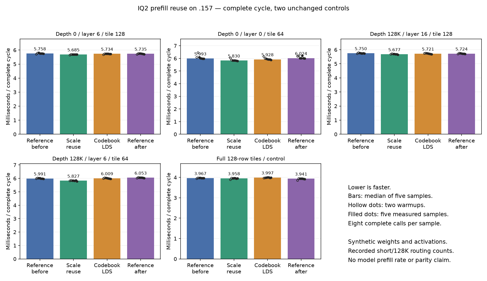

<!-- SPDX-License-Identifier: MIT -->
# DeepSeek follow-up: IQ2 prefill data reuse

This follow-up inspects the independently fetched official Gufo DeepSeek port
at `f783fedb9bea2ec7de941f6da4e02f4a4596b29e`. No sibling DS4 workspace source,
build, model or evidence is imported or modified. The target remains the full
canonical Q2/UD curve; the counting replay is a separate regression control.
[Inspected source identities and dispositions](../config/q2-deepseek-prefill-followup.json).

## Two isolated candidates

DeepSeek's IQ2 loaders place the 256-entry magnitude codebook in shared memory
once per workgroup and reuse it across rows. The new **grid-lds** probe adapts
that storage mechanism to Qwen's paired IQ2 prefill kernel. It stages the same
2 KiB table before the K loop; sign decoding, scale rounding, WMMA order and
SwiGLU remain unchanged. It adds one setup barrier and no barrier inside the
K loop. Every production launch has 256 threads, so each entry is initialized
before any thread consumes the table. Random LDS accesses and additional LDS
occupancy can still be worse than the existing cached global lookups.

DeepSeek's Q2 down loader also demonstrates reusing a quantized superblock
over successive K steps. The **scale-reuse** probe applies the narrower idea
to IQ2: its F16 block scale currently reloads and widens on each two-block
stage. Cache the exact widened scale for the four stages of that superblock.
The original multiplication order and F16 rounding remain in place. This
removes three of four dynamic header loads/conversions, while adding a uniform
refresh branch and a longer-lived register. It does not eliminate three
quarters of total weight reads or kernel instructions.

Both candidates start independently from the measured ordered-IQ2 provider.
Each changes only `kernels.hip.cpp`; the other 1019 files remain exact.
They contain neither the mixed map nor the earlier live-stage experiment.
The [generator](../tools/prepare-q2-iq2-prefill-reuse.py),
[grid patch](../experiments/q2-iq2-prefill-grid-lds.patch),
[scale patch](../experiments/q2-iq2-prefill-scale-reuse.patch), and full
[grid](../config/q2-iq2-prefill-grid-lds-source.json)/
[scale](../config/q2-iq2-prefill-scale-reuse-source.json) inventories are retained.

## Matched static device compilation

Reference and both candidates compile with identical gfx1151 production flags.
This is local device assembly only, with no GPU or runtime fixture execution.
Every non-IQ2 kernel body remains identical. All eight IQ2 specializations are
recorded in the [complete static report](../config/q2-iq2-prefill-reuse-static.json).
The ordinary-output specializations used by the active prefill show:

| Token tile | Instructions: original / grid / scale | Global-load instructions: original / grid / scale | VGPR: original / grid / scale |
| ---: | ---: | ---: | ---: |
| 16 | 661 / 679 / 663 | 25 / 18 / 25 | 82 / 82 / 83 |
| 48 | 1161 / 1170 / 1161 | 32 / 25 / 32 | 94 / 94 / 95 |
| 64 | 1391 / 1379 / 1382 | 34 / 27 / 34 | 102 / 102 / 103 |
| 128 | 2381 / 2357 / 2375 | 48 / 41 / 48 | 148 / 169 / 149 |

All variants have zero scratch. Grid staging adds 2048 LDS bytes per workgroup:
11392→13440, 15488→17536, 17536→19584 and 25728→27776 bytes respectively.
Scale reuse leaves LDS unchanged. Its static header-load instruction still
exists inside the refresh branch, so unchanged static load counts do not
contradict less frequent execution. These are static bodies, not throughput
measurements. The grid variant's BN128 register increase is a material risk.

## Ideas that should not be copied again

- Qwen already narrows the input once per token matrix and reuses it through
  `rows_token`; the DeepSeek token-compact idea is not a new top-k-fold saving
  in this active path.
- The Q2 scaled kernel already emits a 64-bit LDS store for each affine pair.
  The compiler combines both pairs as `ds_store_2addr_stride64_b64`. DeepSeek's
  scalar-to-wide store patch therefore does not establish a missing Qwen fix.
- Q2 weight staging, wider output fragments and epilogue scatter have previous
  negative measurements. Reuse them only with a distinct measured bottleneck.
- DeepSeek's active large-prompt IQ2 dispatch uses Q8 MMQ; replacing the Qwen
  F16 path would change activation rounding and accumulation. HIP D2R stubs
  cannot supply the CUDA direct-fused path on this GPU.

The earlier live-stage candidate is still a third separate prefill hypothesis:
it avoids repeated stores for empty fragments that WMMA never reads. It has
static evidence but no GPU qualification and is not included in these patches.

## Completed GPU comparison — 2026-10-04

The **scale-reuse** candidate is faster on all four recorded routing distributions
against both unchanged controls. Its median complete-cycle time falls
1.274–2.745% versus the first control and 0.815–3.743% versus the final control.
The full-tile control is 0.221% faster than the first reference but 0.445% slower
than the second. This supports a controlled model experiment, not a general
speedup claim or default promotion. **Grid-LDS does not advance**: its routing
changes are mixed, with the full-tile case slower than both controls.

All four arms pass 51 independent FP64 checks each. Both candidates and the
repeated reference preserve all 102 output arrays byte for byte. Maximum
relative RMS / scaled error remains 0.000618805 / 0.000881553, below the
unchanged 0.002 limits. The separate original-model quality rejection is not
resolved by these component checks.

### Complete-cycle medians — microseconds, lower is faster

| Recorded routing / tile | Reference before | Scale reuse | Grid LDS | Reference after |
| --- | ---: | ---: | ---: | ---: |
| 0 / layer 6 / tile 128 | 5758.402 | 5684.955 | 5733.885 | 5735.068 |
| 0 / layer 0 / tile 64 | 5992.633 | 5829.605 | 5927.614 | 6023.809 |
| 128K / layer 16 / tile 128 | 5750.288 | 5677.000 | 5720.706 | 5723.644 |
| 128K / layer 6 / tile 64 | 5991.179 | 5826.710 | 6008.786 | 6053.263 |
| Full-tile control | 3966.960 | 3958.199 | 3996.686 | 3940.673 |

### Time change against both controls

| Recorded routing / tile | Scale vs before | Scale vs after | Grid vs before | Grid vs after |
| --- | ---: | ---: | ---: | ---: |
| 0 / layer 6 / tile 128 | -1.275% | -0.874% | -0.426% | -0.021% |
| 0 / layer 0 / tile 64 | -2.720% | -3.224% | -1.085% | -1.597% |
| 128K / layer 16 / tile 128 | -1.274% | -0.815% | -0.514% | -0.051% |
| 128K / layer 6 / tile 64 | -2.745% | -3.743% | +0.294% | -0.735% |
| Full-tile control | -0.221% | +0.445% | +0.749% | +1.421% |

The two unchanged references vary by −0.663% to +1.036% across cases.
At 128K/layer 16 some individual samples overlap; five samples within one arm
are not five independent server runs. These observations do not establish a
confidence interval or guarantee a whole-model improvement. The component
uses synthetic operands with measured routing histograms; it does not execute
attention over a 128K context or measure model tokens per second.

[SVG](figures/q2-iq2-prefill-reuse/cycles.svg),
[all 140 samples, including warmups](figures/q2-iq2-prefill-reuse/samples.csv),
[audited four-arm report](../config/q2-iq2-prefill-reuse-results.json),
[decision](../config/q2-iq2-prefill-reuse-decision.json).

### Qualification and next model gate

All host/runtime tests execute on .157. Host Debug and ASan/UBSan pass 22/22
each. All 18 host/component commands exit zero and 431 artifacts verify.
Each component has two warmups and five samples of eight complete calls,
including narrowing, routing compaction and paired gate/up/SwiGLU. Active
weight sets are 135–321 MB, larger than the 32 MiB cache. No original model
is loaded. CPU peaks are 69.000/67.000/69.625/67.000 °C and GPU peaks are
73/69/70/67 °C in arm order; no thermal or lifecycle stop occurs.

The next model comparison uses the native C `synapse-lie-bench` canonical
curve being implemented by the core workstream. Freeze that qualified driver
and the core before a new Q2 reference / scale / repeated-reference / UD
campaign. Preserve prose, prefix preparation, physical token counts and timing
scope at all eight 0–128K depths. Do not substitute the historical counting
input or a new Python curve runner. The unchanged ordered provider and scale
manifest are ready; no model run is admitted by this component decision.

No core ABI, persistent state, scheduling or metrics contract changes. No
mixed-map, live-stage or grid-LDS patch is composed into the scale candidate.
Only the independently fetched official Gufo source is used.

Fresh release at **2026-10-04T11:20:32.723493+00:00** verifies 129 recorded identities
and 97 groups retired, KFD empty, all four original leases free and all six
original model stat tuples unchanged. Remote/main receipts and the shared
registry record closure. No Q2 job, waiter, restart or GPU reservation remains;
no cleanup occurs on .157. Source checkpoint: `a405f48`.

[Release receipt](../config/q2-iq2-prefill-reuse-window-release.json), SHA256
`25e8774fc34b98dea48eabfdd26e9f021562bbae63a066b6e517f06ae537a44b`.
