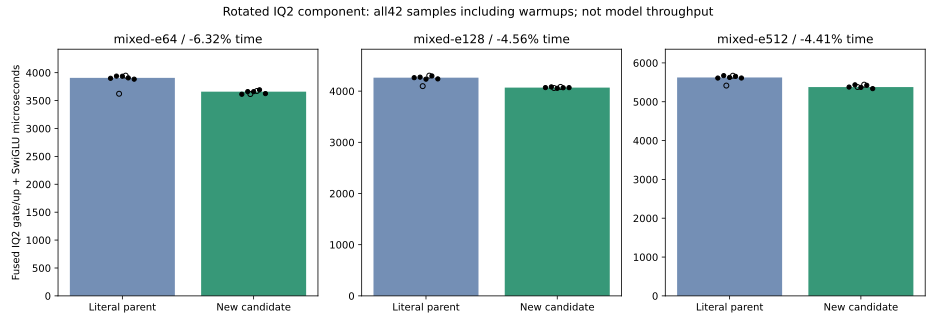
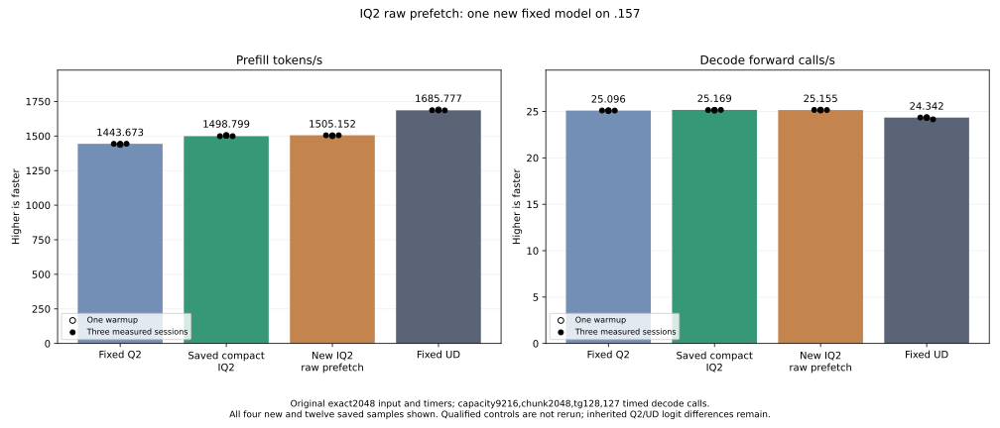

<!-- SPDX-License-Identifier: MIT -->
# Deferred IQ2 expansion with raw prefetch

The new original-weight model measures1505.152258 PP /25.15493858 TG on the
unchanged fixed input: nominally+0.423859% PP versus the compact parent and
+4.258540% versus fixed Q2. All21 parent files, including full logits, are exact.
The candidate is retained as the next composition base, without default or
independent quality promotion. Fixed UD1685.777092 remains unmet, requiring
12.000436% further prefill throughput. The R2 GPU window is released.

One new candidate starts from the saved compact IQ2 composition at
1498.799455 PP / 25.16866636 TG. It changes only IQ2 paired routed prefill.
Fetch retains the original eight-byte group and two-byte F16 header across
current-stage WMMA; unchanged codebook/sign expansion and scale conversion
move to LDS commit, before the existing barrier. Weight format, compact LDS
layout, tile geometry, routing, original F32 scale expression/F16 rounding,
packed F16 FMA, K16 WMMA order and SwiGLU remain unchanged. No new allocation,
device table, stream, public ABI, state or metrics contract is introduced.

The logical prefetched weight payload shrinks from 32 decoded high bytes plus
the half scale to one raw group plus its half header, 34 to 10 bytes. This is
not allocated register storage or a reduction of persistent model bytes.
Deferred codebook lookup may expose latency at commit; actual performance
must be measured.

Matched local production assembly changes eight IQ2 bodies and preserves the
other 149 exactly. Every changed body has zero private scratch and unchanged
LDS. Ordinary-output specializations show:

| Token tile | Parent / candidate instructions | Parent / candidate next-free VGPR | LDS bytes |
| ---: | ---: | ---: | ---: |
| 16 | 640 / 595 | 83 / 78 | 11392 |
| 48 | 1143 / 1095 | 94 / 88 | 15488 |
| 64 | 1366 / 1316 | 102 / 96 | 17536 |
| 128 | 2361 / 2311 | 148 / 142 | 25728 |

These are static counts. Moving expansion out of initial and loop fetch into
one commit body removes duplicated static load instructions; each dynamic
stage still decodes the same group. No bandwidth, occupancy or throughput gain
is inferred. The qualified parent assembly is reused without rebuilding it.

The new fixture compares 81 guarded complete outputs against a literal copy
of the compact parent. It includes ordinary/packed outputs, ragged token/row
edges, widths 16/48/64/128 and the existing mixed 128/64 map. Initialization,
poisoning, launch and readback use the same nonblocking stream. Three rotations
span 162201600 / 324403200 / 1297612800 weight bytes for 64/128/512 active
experts, above 32 MiB MALL. Forty-two alternating warmup/measured timings cover
fused IQ2 gate/up and SwiGLU only, excluding map construction and down projection.
They are not whole-model performance.

Saved exhaustive compact-format qualification is reused: format, decoder,
tables and half arithmetic are unchanged. New full outputs test the changed
producer lifecycle. Numeric failures preserve arrays and timings; guard/runtime
faults stop device work. The original-weight model follows any safe component
verdict, including a numerical or timing rejection.

The fixed comparison stays exact2048/tg128, 127 timed decode calls, capacity9216,
chunk2048, MTP off, one warmup plus three measurements, 15-second waits outside
timers. Saved Q2 1443.672867 / UD 1685.777092 and compact parent 1498.799455 PP
are reused without control or old component reruns. No context sweep,
dependency installation, tuning, cleanup or deployment is admitted.

Production/fixture device compilation and host syntax pass; 86 launch guards
pass locally. The first new-fixture format check fails on renamed line wrapping;
its whitespace-only correction passes without changing arithmetic tokens.
The shared formatter retains exit1 for nine byte-identical inherited files.
Both failures remain separate from numerical/performance evidence.

New `.157` host fixtures pass25/25 Debug and25/25 ASan/UBSan; six command exits are zero, seven artifacts and36 frozen fixture files verify. These fixtures access neither models nor GPU.

The initial component launch exits1 locally before SSH/GPU because its source
manifest name contains an extra `iq2-`. The original plan, local staging and
command failure remain retained. Its unused window closes03:52:26UTC with no
component/model/build started, KFD empty, four free original leases and unchanged
model stats. The corrected launcher uses a named manifest binding and a new
87th guard. A distinct plan and new host/component labels preserve the original
failure. The new host capsule again passes25/25 Debug and25/25 ASan/UBSan;
provider and static source evidence stay unchanged. The next helper binds that
closed unused window, rather than its own future release.

At preparation, GPU component/model evidence awaited fresh coordinated R2
admission. The completed measurements below supersede that pending status.
Static preparation alone establishes neither original-weight quality nor parity.

[Corrected frozen plan](../config/q2-iq2-raw-prefetch-plan-fixed.json),
[source inventory](../config/q2-iq2-raw-prefetch-source.json),
[static evidence](../config/q2-iq2-raw-prefetch-static.json),
[patch](../experiments/q2-iq2-raw-prefetch.patch),
[literal parent](../experiments/q2-iq2-raw-prefetch-control.inc),
[new fixture](../tests/q2_iq2_raw_prefetch.hip).

## New component completed

The corrected R2 component finishes03:58:33.017569UTC with three command exits
0/0/0; four artifacts,36 frozen fixtures and1025 provider files verify. All81
whole output pairs are byte-exact, guards intact and every required output
finite/written. Original inputs/weights remain immutable at fixture completion.
This is differential operator evidence, not independent task quality.

| Active experts | Literal parent median microseconds | New median microseconds | Time change |
| ---: | ---: | ---: | ---: |
| 64 | 3906.555176 | 3659.788132 | -6.316743% |
| 128 | 4263.173103 | 4068.631490 | -4.563306% |
| 512 | 5625.725428 | 5377.772013 | -4.407492% |

All42 alternating samples, including two warmups per arm/shape, remain in
[the CSV](figures/q2-iq2-raw-prefetch-component.csv) and
[component report](../config/q2-iq2-raw-prefetch-component-results.json).
No existing qualified component cohort or model control is rerun. Original
fixed-input model timing is still required; component percentages cannot be
added to model throughput.

## Completed original-weight comparison

The model finishes04:03:42.869134UTC with four command exits0. All26 artifacts,
36 frozen fixture files and1025 provider files verify. Fresh candidate build
takes154.256086 seconds outside PP/TG timers; model load and15-second waits
remain outside inference timers. Capacity9216/chunk2048, MTP off and the exact
original2048-token input/128-output/127-timed-call contract are unchanged.

| Arm | Sample | PP tokens/s | TG calls/s | PP seconds | TG seconds |
| --- | --- | ---: | ---: | ---: | ---: |
| Fixed Q2, saved | Warmup | 1438.259006 | 25.08847266 | 1.423943804 | 5.062085753 |
| Fixed Q2, saved | Measurement 1 | 1443.398207 | 25.10565683 | 1.418873870 | 5.058620886 |
| Fixed Q2, saved | Measurement 2 | 1443.672867 | 25.08698337 | 1.418603928 | 5.062386263 |
| Fixed Q2, saved | Measurement 3 | 1443.841794 | 25.09595499 | 1.418437954 | 5.060576497 |
| Compact IQ2 parent, saved | Warmup | 1504.549005 | 25.12922091 | 1.361205247 | 5.053877335 |
| Compact IQ2 parent, saved | Measurement 1 | 1498.754109 | 25.15414443 | 1.366468314 | 5.048869793 |
| Compact IQ2 parent, saved | Measurement 2 | 1501.954777 | 25.16866636 | 1.363556368 | 5.045956674 |
| Compact IQ2 parent, saved | Measurement 3 | 1498.799455 | 25.17322602 | 1.366426971 | 5.045042693 |
| New IQ2 raw prefetch | Warmup | 1501.690147 | 25.15123490 | 1.363796655 | 5.049453854 |
| New IQ2 raw prefetch | Measurement 1 | 1505.152258 | 25.16777240 | 1.360659687 | 5.046135906 |
| New IQ2 raw prefetch | Measurement 2 | 1503.530071 | 25.14904438 | 1.362127728 | 5.049893669 |
| New IQ2 raw prefetch | Measurement 3 | 1505.315370 | 25.15493858 | 1.360512249 | 5.048710399 |
| Fixed UD, saved | Warmup | 1689.043527 | 24.34239962 | 1.212520558 | 5.217234208 |
| Fixed UD, saved | Measurement 1 | 1686.364042 | 24.34621613 | 1.214447147 | 5.216416355 |
| Fixed UD, saved | Measurement 2 | 1685.777092 | 24.34174251 | 1.214869991 | 5.217375049 |
| Fixed UD, saved | Measurement 3 | 1685.400011 | 24.15102104 | 1.215141798 | 5.258576845 |

| Arm | Median PP tokens/s | Median TG calls/s |
| --- | ---: | ---: |
| Fixed Q2, saved | 1443.672867 | 25.09595499 |
| Compact parent, saved | 1498.799455 | 25.16866636 |
| New raw prefetch | 1505.152258 | 25.15493858 |
| Fixed UD, saved | 1685.777092 | 24.34174251 |

Observed PP changes+0.423859% versus parent /+4.258540% versus fixed Q2,
remaining10.714633% below UD and needing12.000436% more throughput from the
candidate to equal it. TG differs-0.054543% versus parent with overlapping
sample ranges. Historical controls are reused rather than rerun; no claim of
contemporaneous repeatability or a stable incremental gain follows.

All21 parent inputs, outputs and full logits remain byte-exact, with zero KL
and all nine within-arm replays exact. All128 greedy tokens also match fixed
Q2/UD. Eight changed Q2 full-logit files are inherited unchanged from the MoE
composition; matched-history KL remains0.001256655237 versus Q2 and
0.008626378682 versus UD. Differential replay is not independent task quality.
Resident model43156012544 bytes, session376777748 bytes and deferred scratch7946240
bytes match the saved compact parent; no allocation is added. Load takes10.97909399
seconds outside PP/TG timers.

R2 host/component/model total13 commands and37 artifacts verify. Host fixtures
pass25/25 Debug and25/25 ASan/UBSan. Across model build/inference telemetry,
CPU/GPU maxima are82.750/72 C. Release04:04:02.651364UTC retires683 identities/
538 groups, verifies empty KFD, four free original lease inodes and six unchanged
model stat tuples. Main/remote canonical/active/ready mirrors agree. Core
receives the release; no Q2 GPU job, waiter, reservation, restart or cleanup
remains. The first unused window and failed local staging stay retained; the
separate local preflight's import-path exit1 is corrected before SSH/GPU.

[Model report](../config/q2-iq2-raw-prefetch-model-results.json),
[all16 model samples CSV](figures/q2-iq2-raw-prefetch-model-wrapped.csv),
[retained decision](../config/q2-iq2-raw-prefetch-retained-update.json),
[release](../config/q2-iq2-raw-prefetch-r2-window-release.json),
[local staging preflight](../config/q2-iq2-raw-prefetch-staging-results.json).
Both original and wrapped figure exports remain retained; wrapped labels
avoid collisions. No old model/component cohort, full curve or independent
quality run is added. Next numerical target is deferred Q2_K down unpacking
on this new retained parent, keeping the same fixed comparison and tile geometry.

