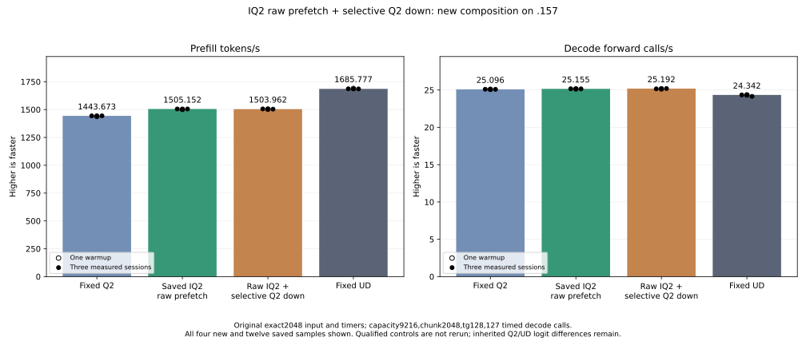

<!-- SPDX-License-Identifier: MIT -->
# Best IQ2 raw prefetch with retained selective Q2 down

This new composition combines the measured IQ2 raw-prefetch base at
PP1505.152258/TG25.15493858 with the preserved C17 Q2 down48/64 selector.
That selector previously measured PP1497.606050 on the earlier MoE parent
PP1496.830907. Its marginal result remains preserved; its throughput change
cannot be added to the later IQ2 improvement without a model measurement.

The selector assigns a complete expert to64 rows only when its16-padded
bucket has at least256 rows and its reserved64 rows do not exceed its
reserved48 rows. Other experts retain48. Both down spans fit the existing
map reservation; the original IQ2 gate/up spans follow them unchanged.
Activations, original quantized weights, scaled F16 packing/inverse scales,
K accumulation, SwiGLU and per-output routing remain unchanged. No GPU
allocation, stream, model-state precision or public ABI/metrics change is added.

All five changed provider files are byte-exact to the previously measured
selector composition: executor source/header, provider CMake and the two C17
policy files. All117 numerical HIP/MMQ source files are byte-exact to the
current best IQ2 parent. The1027-file inventory combines those two retained
sources. These are source-identity checks, not another assembly or GPU result.
Local executor/C17 syntax and93 matched-launch guards pass. Source generation,
patch and provider inventory remain durable inside this worktree.

The existing C17 fixture checks exact capacities, live/padded row coverage,
disjoint width ownership, sentinel guards and untouched outputs on rejection.
The existing scaled-tile GPU component and its recorded independent numerical
failures are reused without a rerun or tolerance change. The new model runs
after a fresh coordinated admission regardless of safe numerical rejection.
There is no new component cohort or qualified Q2/UD control build/run.

The comparison remains original exact2048/tg128,127 timed decode calls,
capacity9216/chunk2048,MTP off,one warmup and three measured sessions, with
15-second waits outside PP/TG. Fixed Q2 PP1443.672867/TG25.09595499, fixed UD
PP1685.777092/TG24.34174251 and the saved best IQ2 parent are reused. Source
records are emitted only after the original complete event at executor
teardown; map preparation and bounded record copies remain in actual PP time.
Independent task quality and complete context-curve parity remain open.

The frozen plan binds40 fixtures and seven manifests. Local capsule staging
verifies all40 fixture files and1027 provider files and stops before SSH.
The first launcher-edit attempt failed locally because its text anchor also
matched a nested branch; it wrote no launcher/provider files. The corrected
indentation-delimited edit passes93 guards and staging. That preserved
preparation failure is neither a GPU fault nor a model rejection.

Fresh core handover confirms no root .157 GPU job/build/eval/client/lease/
waiter/reservation/restart/interleaving after the previous Q8 K16 release.
This is not admission; the new checkpoint still requires the bounded helper's
lease/KFD/process/registry/model-stat/thermal checks. No deployment, dependency
installation, tuning, cleanup or full context curve is authorized by this plan.

New .157 host qualification passes25/25 Debug and25/25 ASan/UBSan with six
zero command exits. Seven artifacts,40 frozen fixture files and the1020-file
CPU provider capsule verify. This gate opens neither the model nor the GPU;
it is not model performance or independent numerical quality evidence.

[Source inventory](../config/q2-iq2-raw-selective-source.json),
[composition patch](../experiments/q2-iq2-raw-selective.patch),
[source identity/syntax checks](../config/q2-iq2-raw-selective-static.json),
[local capsule receipt](../config/q2-iq2-raw-selective-staging-results.json),
[host qualification](../config/q2-iq2-raw-selective-host-results.json),
[frozen plan](../config/q2-iq2-raw-selective-plan.json),
[prior selector measurements](Q2-SCALED-SELECTIVE.md) and
[retained IQ2 parent](Q2-IQ2-RAW-PREFETCH.md).

## Completed original-weight comparison

The new model completes with four zero command exits; all26 artifacts,40 frozen fixtures and1027 provider files verify. Qualified models and old component cohorts are not rerun.

| Arm | Sample | PP tokens/s | TG calls/s | PP seconds | TG seconds |
| --- | --- | ---: | ---: | ---: | ---: |
| Fixed Q2, saved | Warmup | 1438.259006 | 25.08847266 | 1.423943804 | 5.062085753 |
| Fixed Q2, saved | Measured 1 | 1443.398207 | 25.10565683 | 1.418873870 | 5.058620886 |
| Fixed Q2, saved | Measured 2 | 1443.672867 | 25.08698337 | 1.418603928 | 5.062386263 |
| Fixed Q2, saved | Measured 3 | 1443.841794 | 25.09595499 | 1.418437954 | 5.060576497 |
| IQ2 raw parent, saved | Warmup | 1501.690147 | 25.15123490 | 1.363796655 | 5.049453854 |
| IQ2 raw parent, saved | Measured 1 | 1505.152258 | 25.16777240 | 1.360659687 | 5.046135906 |
| IQ2 raw parent, saved | Measured 2 | 1503.530071 | 25.14904438 | 1.362127728 | 5.049893669 |
| IQ2 raw parent, saved | Measured 3 | 1505.315370 | 25.15493858 | 1.360512249 | 5.048710399 |
| New raw + selective | Warmup | 1503.924744 | 25.14616442 | 1.361770267 | 5.050472027 |
| New raw + selective | Measured 1 | 1505.846391 | 25.15857840 | 1.360032479 | 5.047979977 |
| New raw + selective | Measured 2 | 1503.961988 | 25.19241290 | 1.361736544 | 5.041200322 |
| New raw + selective | Measured 3 | 1503.805202 | 25.20288389 | 1.361878518 | 5.039105865 |
| Fixed UD, saved | Warmup | 1689.043527 | 24.34239962 | 1.212520558 | 5.217234208 |
| Fixed UD, saved | Measured 1 | 1686.364042 | 24.34621613 | 1.214447147 | 5.216416355 |
| Fixed UD, saved | Measured 2 | 1685.777092 | 24.34174251 | 1.214869991 | 5.217375049 |
| Fixed UD, saved | Measured 3 | 1685.400011 | 24.15102104 | 1.215141798 | 5.258576845 |

| Arm | Median PP tokens/s | Median TG calls/s |
| --- | ---: | ---: |
| Fixed Q2, saved | 1443.672867 | 25.09595499 |
| IQ2 raw parent, saved | 1505.152258 | 25.15493858 |
| New raw + selective | 1503.961988 | 25.19241290 |
| Fixed UD, saved | 1685.777092 | 24.34174251 |

New PP changes-0.079080% versus saved parent and+4.176093% versus fixed Q2. Candidate source and all samples remain preserved. The next base is `.deps/gufo-q2-iq2-raw-prefetch-run` at PP1505.152258/TG25.15493858; no stable increment or default promotion is established.

The retained base still needs12.000436% more prefill throughput to reach original fixed UD. Parent whole-file comparison has21 exact files; all nine within-arm replays pass. Inherited Q2/UD logit differences and independent task-quality qualification remain separate.

All192 routing records are emitted after the original complete event and replay identically across all four sessions. Selected rows are1124248 of3932160; original descriptors124736 become100156 narrow plus18060 wide. Reserved rows fall from5987328 to5963328. These counts do not prove occupancy or additive throughput; map work and split launches remain in actual PP.

Configure/build/ldd/model wall seconds are[1.523218, 153.748155, 0.526486, 97.791621]. Compilation, model loading and15-second waits remain outside PP/TG. CPU/GPU telemetry maxima are83.625/75.000 C, with thermal stop `None`.

GPU window closure at2026-10-05T05:39:08.060027+00:00 verifies retired owned identities/groups, empty KFD, four free original leases and six unchanged model stat tuples. Canonical/main/remote/active/ready mirrors match; future GPU work requires fresh handover/admission.

Final read-only verification passes: all10 command exits/33 artifacts,
40 frozen fixtures/seven manifests/1027 provider files,117 unchanged numerical
files/five exact selector files,21 whole parent files/nine replays,192 routing
records and all16 model CSV samples verify. All19 original rejected-test
reports remain unchanged. Closure retires727 identities/574 groups. This
verification runs no additional GPU build/model or old component/control.

Across the four sessions, the selector covers28.591105% of actual rows and
reduces total reserved rows by0.400847%. Split launches and preparation remain
in the actual timer. This limited work reduction supports prioritizing new
changes to active expert kernel work; it does not quantify the causes of the
small observed PP difference. The preserved marginal candidate remains
available for later composition rather than being deleted.

[All16 model samples](figures/q2-iq2-raw-selective-model-wrapped.csv), [all192 routing records](figures/q2-iq2-raw-selective-model-routing.csv), [model report](../config/q2-iq2-raw-selective-model-results.json), [retained disposition](../config/q2-iq2-raw-selective-retained-update.json) and [release](../config/q2-iq2-raw-selective-window-release.json) retain full values.

