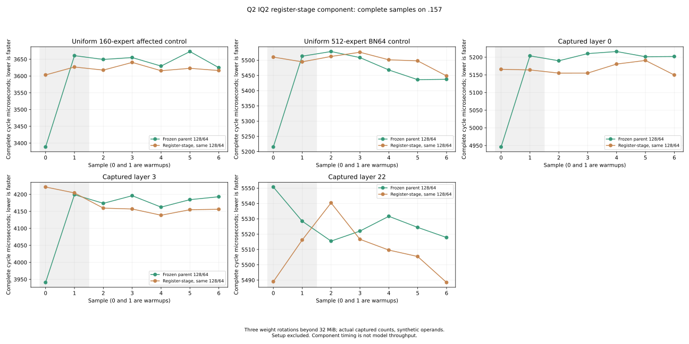
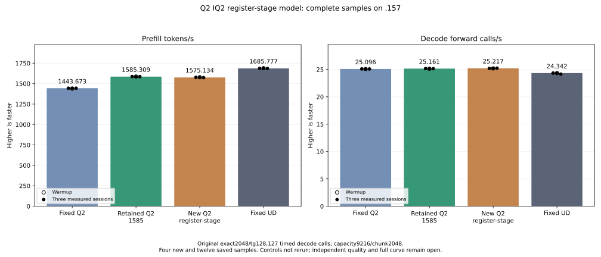

<!-- SPDX-License-Identifier: MIT -->
# IQ2 weights retained within their producer wave

The completed .157 model test measures1575.134325 PP /25.21702868 TG,
nominally-0.641809%/+0.223514% versus retained1585.308983 /25.16079073.
All96 component pairs,21 parent model files and nine internal replays are
exact. Keep the saved1585 provider; this IQ2 candidate is retained as evidence.
The fixed UD point remains1685.777092 PP /24.34174251 TG, requiring6.337447%
more PP from the retained provider. No controls were rebuilt or rerun.

The original IQ2 stage publishes decoded code bytes and rounded scales to
LDS, then reads them from the same wave32. Source ownership enumeration
confirms that none of these weight reads crosses waves. Activations do cross
waves, so their shared stage and both K-loop block barriers remain necessary.

The new private kernel gives the two half-waves the two K32 groups of the same
sixteen weight rows. It decodes the original table/sign bits into registers,
then exchanges the words between half-waves before the unchanged half FMA
and WMMA operations. This removes the8192-byte code plane and1024-byte scale
plane. The raw weight addresses as a set, activation addresses,128-token
tile,64 output rows, eight waves,64 accumulators per lane, descriptors and
number of dispatches remain fixed. It changes neither expert nor KV caching.

Only nonpacked IQ2 BN128 selects the new kernel. The initial shared-template
implementation also changed nine unrelated Q2 compiled bodies; its failed
scope audit and source remain preserved. The isolated v2 leaves the original
generic template intact and keeps the new numerical body in its own include.
All161 other production kernel bodies, operands and resources now match the
saved parent assembly. No parent executable or assembly was rebuilt.

| Compiled property | Saved parent | Isolated candidate |
| --- | ---: | ---: |
| LDS bytes per block |25728|16512|
| Next-free VGPR |150|142|
| Private scratch bytes per thread |0|0|
| Static instructions |2361|2355|
| Static block-barrier sites |18|18|
| Static WMMA instructions |32|32|
| Compiler occupancy field |9|10|

These are compiler observations. The occupancy field is not measured active
occupancy. Eighteen register-exchange instructions replace eight LDS shuffle
instructions and the weight-stage loads/stores; their runtime cost still
needs measurement. Fewer resources alone did not help the tail16 trial.
No throughput gain, GPU safety or numerical equivalence follows from this table.

The source audit accounts for256 unchanged weight-group fetches,1024
eight-byte publication groups and4096 consumer word reads per stage. It
checks which wave owns every read; it does not execute floating-point code.
The original scale rounding, K16 accumulation order and anchored F32 SwiGLU
epilogue are retained in source. Full GPU outputs and actual model results
must establish the compiled behavior, including zero/negative scales and tails.

## Complete component and model measurements

Both fixture arms use identical original128/64 maps. The candidate calls the
production selector; its control uses the bound literal saved1585 body.
Edge token counts and output widths plus captured layers0/3/22 give96 guarded
full-output pairs. Five shapes each have two warmups and five alternating
measurements with three weight rotations beyond32MiB:70 timing samples.
Uniform160 exercises only BN128; uniform512 is the unchanged BN64 control.
Captured counts are real, while operator operands remain synthetic.

| Component | Parent median us | Candidate median us | Time change |
| --- | ---: | ---: | ---: |
| Uniform160, BN128 only |3649.441401|3617.655754|-0.870973%|
| Uniform512, unchanged BN64 |5467.982610|5501.382192|+0.610821%|
| Captured layer0 |5202.055931|5155.110677|-0.902437%|
| Captured layer3 |4184.441566|4156.162262|-0.675820%|
| Captured layer22 |5522.008260|5509.595235|-0.224792%|

The small component reductions do not survive the original model benchmark.
The unchanged control also varies. These observations do not isolate cache,
clock or occupancy effects, and they do not establish a causal decode gain:
this specialization does not change the one-token decode path.

| Original2048/128 sample | Prefill tokens/s | Decode calls/s | Prefill s | Decode s |
| --- | ---: | ---: | ---: | ---: |
| Warmup |1578.706281|25.19522528|1.297264744|5.040637605|
| Measured1 |1577.153349|25.19586049|1.298542086|5.040510525|
| Measured2 |1575.134325|25.21702868|1.300206571|5.036279318|
| Measured3 |1573.689119|25.24314215|1.301400623|5.031069398|

C1 greedy, MTP off, capacity9216/chunk2048 and127 timed decode calls remain
fixed; the original input hash and tester are unchanged. Comparators are the
saved fixedQ21443.672867/25.09595499, UD1685.777092/24.34174251 and best parent
1585.308983/25.16079073. All measured candidate PP samples are below the saved
parent range. Model residency43,156,012,544 bytes, deferred scratch7,946,240
bytes and session376,777,748 bytes match the parent.

Fresh .157 host33 Debug+33 ASan/UBSan pass. All13 runtime commands exit0;
37 collected artifacts,118 fixtures,12 manifests and1028 provider files verify.
The release at2026-10-06T03:31:16.929649UTC has SHA
`57b67078e073f09c2aeb73b2ed2f6c288781131029c8267b840d6bcc77b2f04b`.
KFD is empty, four original leases are free, seven model stat identities are
unchanged and1328 recorded identities/1062 groups are absent. Main/remote
mirrors agree; Core received closure. No job, reservation or cleanup remains.
Model peaks are CPU84.875C/GPU75C with no thermal stop. Saved historical
comparisons do not prove contemporaneous repeatability or independent quality.

[Component results](../config/q2-iq2-register-stage-component-results.json),
[model results](../config/q2-iq2-register-stage-model-results.json),
[final audit](../config/q2-iq2-register-stage-final-audit.json),
[disposition](../config/q2-iq2-register-stage-disposition.json),
[all70 component samples](figures/q2-iq2-register-stage-component.csv),
[all16 new/saved model samples](figures/q2-iq2-register-stage-model.csv).

The same wave ownership exists in the active Q2-down stage and is the next
extension to examine after this experiment. A source-only [Q2-down draft](Q2-DOWN-REGISTER-STAGE-DRAFT.md) now exists; it is not runtime qualified.
It differs from the old half-wave decode trial, which kept its code/affine LDS
stage. The saved1571 trace attributes135.807810ms to IQ2 BN128 and161.558060ms
to Q2 down. These are older diagnostic costs, not fresh1585 measurements or
a prediction that the candidate will save those times.

[Isolated source](../config/q2-iq2-register-stage-source-v2.json),
[source and ISA audit](../config/q2-iq2-register-stage-static-v2.json),
[isolated patch](../experiments/q2-iq2-register-stage-v2.patch),
[generator](../tools/prepare-q2-iq2-register-stage-v2.py),
[initial source retained](../config/q2-iq2-register-stage-source.json),
[provenance](../third_party/gufo/LIE-Q2-IQ2-REGISTER-STAGE.md).

No public C17 model/state/metrics ABI changes. Official upstream source and
the experimental providers remain separate from LIE's owned scheduler and
resource policy. This experiment changes data movement inside inference;
it does not claim a reactive scheduling gain.
