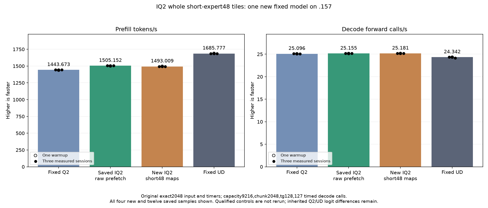

<!-- SPDX-License-Identifier: MIT -->
# Whole short-expert IQ2 tiles

This isolated candidate starts from the measured1505.152258 PP /25.15493858 TG
IQ2 raw-prefetch provider. Entire nonempty expert buckets containing1..48 rows
use the existing BN48 gate/up kernel. All other experts retain original128/64
descriptors; original Q2 down routing, weights, arithmetic, tables and decode
remain unchanged. The own C17 builder preserves map capacity and allocates
nothing. No extra count download or GPU stream is introduced.

The [saved routing audit](../config/q2-iq2-tail-audit.json) contains11280 short
buckets out of14620 active expert-layer buckets across48 layers. It describes
an earlier selective composition, not a new current-best trace. A lower row
reservation does not establish a throughput gain. Only whole short buckets
are eligible: changing a hot expert's64-row tail to48 would misinterpret its
width-relative index.

The first prepared provider is retained without overwrite. A distinct counted
provider stores at most256 span records in the executor and emits them only
at teardown, after the original tester's complete event. Copies stay inside
inference timing; no timed I/O, device allocation or count transfer is added.
Its1027-file inventory changes five files, including the new C17 builder/header.
All eleven numerical HIP/include sources match the measured parent exactly.

Local independent row-coverage, descriptor-preservation and capacity checks
pass, including all single counts and two-expert splits up to4096 rows and
the512-expert bound. The same binary passes ASan/UBSan/LeakSanitizer outside
sandbox ptrace; the initial LeakSanitizer environmental failure remains saved.
Host/device fixture syntax and executor syntax pass; an initial standalone
executor command missing the existing MMQ include directory also remains saved.
The105 launcher scope guards pass. These are preparation, not GPU evidence.

The new GPU fixture compares the same production kernels under original128/64
and proposed128/64/48 maps. It covers n1/15/17/33/48/49/65/128/129, ragged output
columns, empty experts and three2048x640x2560/top10 distributions: uniform64,
uniform512 and512 experts with8 hot buckets plus504 short buckets. Three weight
rotations give39 complete output pairs; alternating arms retain42 timing
samples including warmups. Large weight sets exceed32MiB MALL. Output guards,
unwritten values and immutable inputs are checked; unsafe cases stop device
work. Safe numerical or timing rejection does not suppress the original model
performance run.

The original exact2048/tg128 input, capacity9216, chunk2048, C1 greedy, MTP-off,
one warmup/three measurements and127 timed decode calls stay fixed. Saved Q2
1443.672867, best1505.152258 and UD1685.777092 comparisons are reused without
rebuilding or rerunning them. The full-model run includes map construction,
upload, any additional dispatch and bounded record costs excluded from the
synthetic kernel interval. Q4 and the complete context curve remain deferred.
No numerical acceptance, performance improvement or parity is claimed yet.

[Counted source](../config/q2-iq2-short-tiles-source-v2.json),
[preparation audit](../config/q2-iq2-short-tiles-static.json),
[fixed plan](../config/q2-iq2-short-tiles-plan.json).

## Completed GPU component and original model — 2026-10-05 UTC

All39 guarded output pairs are retained;42 timings cover three rotated-weight distributions. Positive time changes mean slower.

| Distribution | Reference median us | Candidate median us | Time change |
| --- | ---: | ---: | ---: |
| uniform-e64 | 3663.742701 | 3681.542397 | +0.485834% |
| uniform-e512 | 5452.215195 | 5589.078903 | +2.510240% |
| skew-e512 | 7240.566889 | 7301.712036 | +0.844480% |

The original model benchmark runs despite component timing rejection. All three comparator columns below are saved evidence, without rebuild or rerun.

| Session | Fixed Q2 PP / TG | Saved best PP / TG | New short48 PP / TG | Fixed UD PP / TG |
| --- | ---: | ---: | ---: | ---: |
| Warmup | 1438.259006 / 25.08847266 | 1501.690147 / 25.15123490 | 1496.659409 / 25.17376242 | 1689.043527 / 24.34239962 |
| Measured 1 | 1443.398207 / 25.10565683 | 1505.152258 / 25.16777240 | 1493.009363 / 25.17241252 | 1686.364042 / 24.34621613 |
| Measured 2 | 1443.672867 / 25.08698337 | 1503.530071 / 25.14904438 | 1493.660614 / 25.18294596 | 1685.777092 / 24.34174251 |
| Measured 3 | 1443.841794 / 25.09595499 | 1505.315370 / 25.15493858 | 1492.905914 / 25.18106245 | 1685.400011 / 24.15102104 |
| Median measured | 1443.672867 / 25.09595499 | 1505.152258 / 25.15493858 | 1493.009363 / 25.18106245 | 1685.777092 / 24.34174251 |

Actual model usage retains192 records and45120 short48 descriptors across the original four sessions, emitted after the original complete event. There are0 changed parent model files. Within-arm replay is exact=True. PP change versus saved best=-0.806755%.

Resident model memory remains43,156,012,544 bytes. Compilation/loading stay outside PP/TG. Independent task quality and the context/concurrency curve remain open. The window releases at2026-10-05T09:39:41.445380+00:00 with818 retired identities/647 groups, empty KFD, four free original leases and unchanged seven model stat tuples. All37 artifacts verify across13 runtime commands; canonical/main/remote mirrors agree.

[All model samples](figures/q2-iq2-short-tiles-model-wrapped.csv), [all component samples](figures/q2-iq2-short-tiles-component.csv), [final audit](../config/q2-iq2-short-tiles-final-audit.json).

## Disposition and the next mechanism

The candidate is retained as a measured negative result. Best1505.152258
remains unchanged; the nominal+0.103852% TG change is not attributed to this
map change because numerical decode is unchanged and comparisons are saved
historical sessions. No independent task-quality or complete-curve claim.

The [retained geometry audit](../config/q2-iq2-short-tiles-geometry-audit.json)
reuses the already saved parent assembly without rebuilding it. In the
active F32 gate/up specialization, BN48 reserves15488 LDS bytes versus17536
for BN64 and has next-free VGPR88 versus96. These are static metadata, not
measured occupancy or memory traffic. Crucially, the original paired kernel
already skips token fragments beyond `live_tok_tiles`: every whole bucket
of1..48 rows has the same useful WMMA fragment count under either geometry.
Weight decoding and the two activation-fetch iterations per thread remain.
Lower reserved row capacity therefore did not remove that matrix work.

The next new IQ2 hypothesis must change actual fetch/decode ownership or
consumer work, rather than repeat this map or the previous8/16-value commits.
One source-level proposal assigns each group of four lanes different8-value
codebook slices, sharing the original encoded group from a designated lane.
The bounded producer would cover all rows through successive ownership groups
and write the same compact LDS bytes. It is not implemented or measured;
extra pointers, shuffle traffic and register lifetime could offset any benefit.
Full output, actual resource usage and the original model benchmark are needed.
