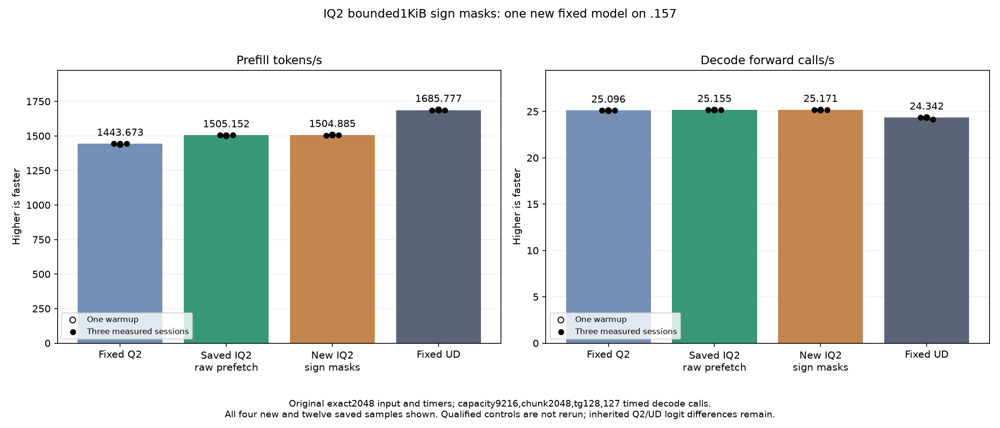

<!-- SPDX-License-Identifier: MIT -->
# IQ2 pre-masked signs: bounded1KiB lookup

The owner defers Q4 and resumes Q2. The preceding large signed-grid lookup is
numerically exact but regresses full-model PP11.561850%; it remains preserved.
This distinct candidate starts from the measured best raw-prefetch provider
PP1505.152258/TG25.15493858. It retains the original2048-byte magnitude grid
and replaces the original sign lookup followed by bit7 masks with a128-entry,
1024-byte pre-masked sign table. It adds no heap buffer, stream or model-file
conversion. Raw prefetch, F16 scale/rounding, compact LDS, ordered WMMA,
routing/tails/SwiGLU, Q2 down, decode, Q8 and attention remain unchanged.

The scalar generator exhausts32768 sign/code combinations/eight lanes:
262144 independent parity/IEEE-half checks pass. Device and host fixture
compilation passes; inherited enumeration-switch warnings remain visible.
All97 launch guards pass. The isolated1026-file provider changes only the
IQ2 sign lookup and a generated include; the original notices and tables stay.
The official independently fetched Gufo pin remains
f783fedb9bea2ec7de941f6da4e02f4a4596b29e. No sibling workspace source/artifact
is imported; DS4 remains separately owned.

Local production assembly preserves149 unrelated bodies and changes exactly
eight IQ2 bodies. Each loses14 static instructions; global64-bit loads remain
10. VGPR/LDS and zero private storage remain unchanged, as do packed F16 FMA
and WMMA counts. The constant tables are2048 bytes magnitude plus1024 bytes
signs. These static facts do not establish dynamic cache behavior or speedup.

A new fixture exhausts all32768 combined device encodings with guarded full
readback, checks81 complete IQ2 gate/up output pairs and records42 rotated
weight timings. Its literal control is the saved best parent's kernel inside
this new fixture; no old qualified component cohort is rerun. Safe numerical
or timing rejection does not block the new full-model measurement. Unwritten
outputs or guard faults stop device work. Full floating arrays are checked
and their hashes logged; only the two guarded format arrays are saved by this
inherited fixture. Failures and actual exits remain preserved.

The original tester remains exact2048/tg128,127 timed decode calls,
capacity9216/chunk2048,C1,greedy,MTP off,one warmup/three measurements and
15-second pauses outside timers. Fixed Q2 PP1443.672867, saved best1505.152258
and fixed UD1685.777092 are reused without compilation or rerunning.
The frozen plan binds44 fixtures/four manifests. A preparation checkpoint and
fresh lease admission from release d0437a91 remain required before GPU work.
Q4, old controls/cohorts, full context curves, cleanup, tuning, dependency
installation and deployment are outside this bounded experiment.

[Source](../config/q2-iq2-sign-mask-source.json),
[static evidence](../config/q2-iq2-sign-mask-static.json),
[plan](../config/q2-iq2-sign-mask-plan.json),
[local staging](../config/q2-iq2-sign-mask-staging-results.json).

The new .157 host gate passes25/25 Debug and25/25 ASan/UBSan checks;
all six commands exit0 and seven artifacts verify. Source capsule44 fixtures
and1020 CPU-default provider files match, with no GPU/model access.
[Host evidence](../config/q2-iq2-sign-mask-host-results.json).

## Completed fixed model — 2026-10-05 UTC

The original model completes at06:56:47.004261UTC. New PP1504.885103/TG25.17103717
changes-0.017749%/+0.063998% against saved best1505.152258/25.15493858. Measured
PP ranges overlap, so no additional model speedup or repeatable regression is
established. Retain the marginal sign-mask source for composition; the existing
raw-prefetch provider remains the base. Relative to fixed Q2, PP is+4.240035%;
against fixed UD it is-10.730481%. Whole-curve parity remains open.

All21 saved parent input/output/full-logit files and all nine internal replays
are byte-exact. Eight inherited logit-file differences versus fixed Q2 remain,
with maximum matched-history KL0.001256655237; the unchanged maximum against
UD is0.008626378682. This candidate introduces no observed numerical drift on
these inputs. Independent task quality remains separately unqualified.

Only the sign-mask arm is new. All three references are reused historical
observations. Values below retain every warmup and measurement; PP means
tokens/s and TG means127 timed forward calls/s for128 outputs. The warmup is
shown and excluded from the three-session medians.

| Session | Fixed Q2 PP / TG | Saved best PP / TG | New sign-mask PP / TG | Fixed UD PP / TG |
| --- | ---: | ---: | ---: | ---: |
| Warmup | 1438.259006 / 25.08847266 | 1501.690147 / 25.15123490 | 1506.989538 / 25.14724037 | 1689.043527 / 24.34239962 |
| Measured 1 | 1443.398207 / 25.10565683 | 1505.152258 / 25.16777240 | 1504.019624 / 25.17103717 | 1686.364042 / 24.34621613 |
| Measured 2 | 1443.672867 / 25.08698337 | 1503.530071 / 25.14904438 | 1504.885103 / 25.17693634 | 1685.777092 / 24.34174251 |
| Measured 3 | 1443.841794 / 25.09595499 | 1505.315370 / 25.15493858 | 1505.943529 / 25.16716287 | 1685.400011 / 24.15102104 |
| Median measured | 1443.672867 / 25.09595499 | 1505.152258 / 25.15493858 | 1504.885103 / 25.17103717 | 1685.777092 / 24.34174251 |

[Complete CSV](figures/q2-iq2-sign-mask-model-wrapped.csv),
[SVG](figures/q2-iq2-sign-mask-model-wrapped.svg),
[model result and full replay](../config/q2-iq2-sign-mask-model-results.json).

## Component result and closed window

All32768 device sign/code combinations/262144 high bytes and81 whole-output
pairs are exact, guarded, finite and written. Complete guarded format arrays
remain available; the inherited fixture logs all whole-float-array hashes after
checking every value but does not save those81 floating arrays. Timing medians
are microseconds per rotation iteration, not model tokens/s. All42 samples,
including warmups, remain in the report and CSV.

| Active experts | Parent median µs | Sign-mask median µs | Operator time change |
| ---: | ---: | ---: | ---: |
| 64 | 3641.45278931 | 3625.08042653 | -0.449611% |
| 128 | 4071.13424937 | 4056.00134532 | -0.371712% |
| 512 | 5421.45474752 | 5360.63003540 | -1.121926% |

The small component gain does not establish a complete-model gain.
[Complete component report](../config/q2-iq2-sign-mask-component-results.json),
[all42 rotated timings](figures/q2-iq2-sign-mask-component.csv).

All13 host/component/model commands exit0 and39 artifacts verify. Host tests
pass25 Debug/25 ASan/UBSan;97 launch guards pass. Candidate compilation takes
153.751016 seconds outside PP/TG timers. Observed CPU/GPU maxima are83.125/76C;
no thermal stop occurs. No extra runtime tensor/stream or file conversion.

Window release at06:58:48.219732UTC retires761 identities/601 groups, verifies
empty KFD, four unchanged original leases free and seven unchanged model stat
tuples. Canonical/main/remote/active/ready mirrors match and core is notified.
No Q2 GPU job, lease, reservation, waiter, restart or .157 cleanup remains.
Core owns next window; later GPU work requires fresh handover/admission from
release effb3e6f046de261e8b89cce5d94cbc9aa8c12882d539965c43a57bc5b1f3b05.
Q4 stays deferred. No old controls/cohorts, full curve, tuning, dependencies
or deployment is run. The large-table regression and all older failures stay.

[Release](../config/q2-iq2-sign-mask-window-release.json),
[local integrity audit](../config/q2-iq2-sign-mask-final-audit.json).
