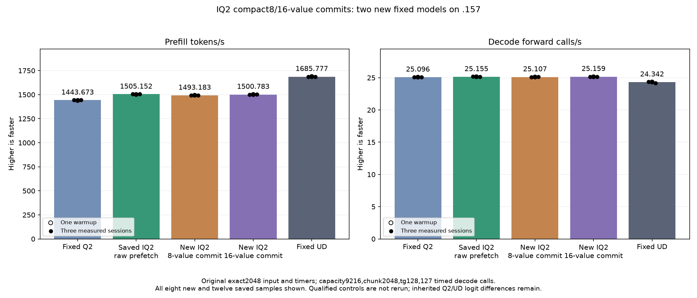

<!-- SPDX-License-Identifier: MIT -->
# Bounded compact IQ2 decode/store commits

Two isolated candidates derive from the measured IQ2 raw-prefetch provider
1505.152258 PP /25.15493858 TG. They decode and publish eight or sixteen
high-byte values per commit instead of retaining all four decoded slices.
Weight fetch ownership, the ten-byte raw prefetch, compact LDS layout, scale
expression/rounding, ordered K16 updates, SwiGLU and packed residual are
unchanged. No expanded weights, new table, allocation or stream is introduced.
This tests temporary lifetime and instruction scheduling, not lane ownership
repartition or a reactive-scheduler gain.

Both production assembly compilations and both host/device fixture
compilations exit0. Each provider has1025 files with one changed numerical
source. All149 unrelated bodies are exact in the retained assembly comparison;
the eight IQ2 bodies change. LDS, allocated VGPR and zero private bytes are
unchanged. Eight-value commits replace two128-bit stores with four64-bit
stores; sixteen-value commits preserve store counts and alter scheduling.
Neither static result establishes a GPU throughput benefit.

The original exact2048/tg128 tester, input, capacity9216/chunk2048, C1 greedy,
MTP-off, one warmup/three measured sessions and127 timed decode calls remain
fixed. Saved Q21443.672867, best1505.152258 and UD1685.777092 are reused without
rebuilding or rerunning their model/component cohorts. Full-context parity
remains the goal; closing this point admits the subsequent curve.

Each new fixture covers81 guarded complete-output pairs and42 alternating
timings with three weight rotations exceeding32MiB. It compares with the
literal measured raw-prefetch parent. Original compact-format evidence is
reused because tables and conversion arithmetic are unchanged. Safe numerical
or timing rejection still proceeds to the complete model performance test;
guard or unwritten-output failures stop further device work. Differential
equality does not establish independent task quality.

The frozen plan binds50 fixtures/four manifests and one host cohort, two new
component cohorts and two new model cohorts.103 local launch guards pass.
The preparation's initial generator and fixture-wiring anchor failures retain
their actual exit1 receipts; corrected preparations exit0. Neither failure
ran on the GPU or changes a numerical verdict.

Source derives from independently fetched official MIT Gufo pin
f783fedb9bea2ec7de941f6da4e02f4a4596b29e and the retained LIE parent. The C17
core ABI, state and metric contracts are unchanged. No DS4 source, build,
cache or qualification evidence is modified. Sources are durable under the
owned worktree and the task-owned remote run directories. No cleanup,
dependencies, tuning, Q4 or full-curve run is included.

The new .157 host cohort passes26/26 Debug and26/26 ASan/UBSan tests. All six
commands exit0 and seven collected artifacts verify, with no GPU/model access.
[Host receipt](../config/q2-iq2-slice-commit-host-results.json).

GPU admission and measured results remain pending. The window helper anchors
the previous canonical release2fa8f9c0e8268dcf44800ad1494faa79eb14723af786b6d7c9f56d893a86a709;
fresh handover, host gates and checkpoint admission are required before GPU
build/run. Local compilation is not model or GPU inference evidence.

The first helper admission exits1 while reading an incorrect self-anchor,
before opening leases or admitting any GPU work. The original helper, plan
and command receipt remain. A distinct v2 helper names the actual previous
Q8-mirror release; its corrected plan preserves all50 fixture/four manifest
hashes and reuses the completed host cohort. Fresh root handover confirms no
root .157 job/build/eval/client/lease/waiter/reservation/restart/interleaving.

[Source inventory](../config/q2-iq2-slice-commit-source.json),
[production assembly comparison](../config/q2-iq2-slice-commit-static.json),
[corrected fixed experiment plan](../config/q2-iq2-slice-commit-plan-v2.json).

## Completed GPU components and original models — 2026-10-05 UTC

Each new component retains81 complete guarded pairs and42 timings. Results below are operator time changes; positive means slower. All weight sets rotate beyond32MiB.

| Variant | Complete outputs exact | e64 time change | e128 time change | e512 time change |
| --- | ---: | ---: | ---: | ---: |
| iq2-slice-commit | True | +2.670476% | +3.060343% | +4.970932% |
| iq2-pair-commit | True | +0.302372% | +0.631255% | +2.350010% |

The full models follow the original input/timers regardless of safe component rejection. The three qualified comparison columns are saved evidence, not rerun cohorts.

| Session | Fixed Q2 PP / TG | Saved best PP / TG | New8-value PP / TG | New16-value PP / TG | Fixed UD PP / TG |
| --- | ---: | ---: | ---: | ---: | ---: |
| Warmup | 1438.259006 / 25.08847266 | 1501.690147 / 25.15123490 | 1493.679882 / 25.11758696 | 1502.224949 / 25.14551341 | 1689.043527 / 24.34239962 |
| Measured 1 | 1443.398207 / 25.10565683 | 1505.152258 / 25.16777240 | 1493.182914 / 25.10419205 | 1500.783083 / 25.13729970 | 1686.364042 / 24.34621613 |
| Measured 2 | 1443.672867 / 25.08698337 | 1503.530071 / 25.14904438 | 1494.335482 / 25.10671289 | 1500.257769 / 25.19679414 | 1685.777092 / 24.34174251 |
| Measured 3 | 1443.841794 / 25.09595499 | 1505.315370 / 25.15493858 | 1490.965464 / 25.14215453 | 1503.417407 / 25.15862222 | 1685.400011 / 24.15102104 |
| Median measured | 1443.672867 / 25.09595499 | 1505.152258 / 25.15493858 | 1493.182914 / 25.10671289 | 1500.783083 / 25.15862222 | 1685.777092 / 24.34174251 |

Resident model memory remains43,156,012,544 bytes per new arm. Compilation and loading are excluded from PP/TG. Independent task quality and the complete context/concurrency curve remain unqualified.

iq2-slice-commit: 0 changed parent model files; within-arm exact=True. PP change versus saved best=-0.795225%.

iq2-pair-commit: 0 changed parent model files; within-arm exact=True. PP change versus saved best=-0.290281%.

The window releases at2026-10-05T08:50:49.013536+00:00 with802 retired identities/634 groups, empty KFD, four free original leases and unchanged seven model stat tuples. All67 artifacts verify across20 runtime commands. The initial admission exit1 and distinct corrected helper/plan remain preserved. Canonical/main/remote/active/ready mirrors match; no job, lease, waiter, reservation, restart or cleanup remains.

[All model samples](figures/q2-iq2-slice-commit-model-wrapped.csv), [all operator timings](figures/q2-iq2-slice-commit-component.csv), [final audit](../config/q2-iq2-slice-commit-final-audit.json).

Both candidates remain measured negative experiments. Saved best1505.152258
is unchanged; sixteen-value decode25.15862222 overlaps the parent's samples
and has unchanged numerical decode code, so it is not an added decode gain.
The initial local report attempts exit1 on an assumed absent `loaded` field;
the corrected analysis extracts the actual load event from verified logs.
Original exits remain preserved and no GPU cohort is rerun for that correction.

## Next bounded routing hypothesis

The [short-expert audit](../config/q2-iq2-tail-audit.json) reuses saved routing
records from the earlier IQ2 raw/selective-down composition, not a fresh trace
or a new performance reference. Across48 layers,11280 of14620 active expert
buckets have1..48 rows (77.154583%). The measured parent's mixed gate map uses
one64-row tile for every such whole bucket; the existing dispatch supports48.
Changing only these whole buckets would reserve541440 rather than721920 row
slots, a hypothetical180480-row reduction. This is a capacity calculation,
not an instruction, GPU-utilization or throughput result.

The bounded proposal preserves128/64 handling for all other experts and the
Q2 down map. Existing counts are already downloaded for `RouteHints`, so it
needs no extra count transfer. Exact per-expert counts are absent from the
six-band saved histogram; it cannot establish the fraction eligible for16.
Do not reuse a hot expert's encoded64-row tail index with48-row dispatch:
its starting row may not be divisible by48. A new C17 span/map implementation,
capacity/tail qualification, complete mixed outputs and the original model
test remain necessary. No new provider or GPU gain is claimed by this audit.
