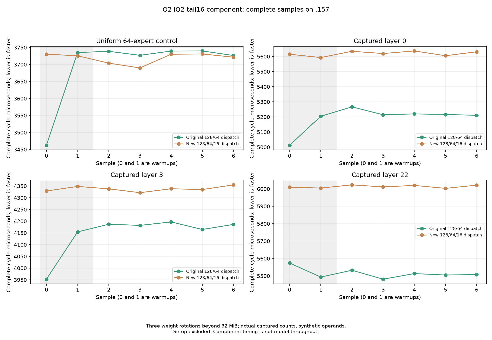
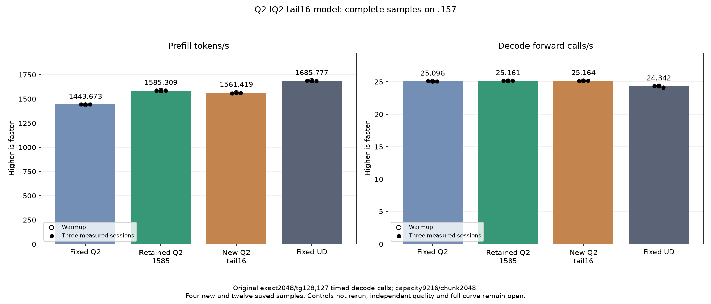

<!-- SPDX-License-Identifier: MIT -->
# IQ2 dispatch for one-fragment tails

The completed model measures **1561.419263 PP / 25.16419202 TG**, a
1.506944% prefill regression against retained1585.308983 / 25.16079073.
Keep the retained1585 provider. All 96 component pairs, 21 parent model
files and nine internal replays are exact. The 192 recorded dispatch maps
match the previously captured parent routes in every session. The candidate
therefore exercised the intended small tails; it did not improve throughput.
The preparation description below is followed by the complete results.

This candidate starts from saved1585.308983 PP /25.16079073 TG and selects
the existing BN16 kernel for IQ2 tails with1..16 live rows. Wide128 descriptors
and64-row tails with17..64 live rows retain their original kernels and order.
The C17 map converts nonzero tail offsets to16-row index units, adds no
descriptors or device allocation, and appends at most one additional launch
per eligible layer. Original Q2-down maps, model format and decode are unchanged.

The1029-file source changes the adapter's CMake/executor/header and adds the
own C17 map/header. All thirteen numerical HIP/include sources match the
retained1585 parent exactly. Bounded192 usage records for the four prefill
sessions are copied inside the original timers and emitted at executor
teardown, after the original tester's complete event. No timed logging or new
device count transfer is introduced. This is still a measured hypothesis.

The [captured fixed-input routes](Q2-CURRENT-ROUTING.md) show9016/12753 tails
eligible (70.697%), including284 with nonzero offsets. Existing device ISA
reserves86 rather than104 VGPR and11392 rather than17536 LDS bytes for BN16
versus BN64. The original BN64 path already omits empty WMMA fragments and
activation stores; static resource savings do not establish actual occupancy
or throughput gains. The old whole-bucket short48 negative is retained.

Fresh .157 host33+33 passes, including every single count and two-expert split
through4096, all three captured512-expert distributions, map capacity/errors,
unchanged output guards, and launch/provider restrictions. Local HIP host/device
syntax passes. Source-patch reconstruction and all1029 identities verify.
These checks establish preparation, not GPU numerical or model performance.

The GPU fixture retains96 complete guarded output pairs: nine edge token
counts by three output widths, full uniform64-expert control, unchanged-route
uniform512 control, and captured layers0/3/22. Operands are synthetic; counts
are measured. Cyclic assignment gives each token ten distinct experts and
each output slot one owner. The three actual-count cases plus the full control
retain56 timing samples, two warmups/five measured alternating pairs with
three rotated weight sets beyond32MiB. The inherited raw `active_experts`
timing field denotes allocated expert capacity; the bound count arrays show
the number of actually nonempty experts. No independent teacher claim.

Guards/runtime failures exit2 and stop dependent device work. Safe numerical
differences exit1 with timings retained, then the new original2048/tg128 model
still runs as requested. That benchmark preserves the exact input, capacity9216,
chunk2048, C1 greedy/MTP-off, one warmup/three measurements,127 timed decode
calls and15-second pauses. Saved fixedQ2/UD and retained1585 comparisons are
reused without builds/reruns. Full context curves and Q4 remain deferred.

[Source](../config/q2-iq2-tail16-source-v2.json),
[static audit](../config/q2-iq2-tail16-static.json),
[plan](../config/q2-iq2-tail16-plan.json),
[staged capsules](../config/q2-iq2-tail16-staging.json).
No public model/state/metrics ABI changes; the new map contract is
[`q2_iq2_tail16.h`](../experiments/q2_iq2_tail16.h).

## Completed component and model results

Positive component time changes mean slower. The uniform64 control does not select BN16; its small change is timing variation, not an optimization gain.

| Component | Parent microseconds | Candidate microseconds | Time change |
| --- | ---: | ---: | ---: |
| uniform-e64 | 3738.690376 | 3721.424103 | -0.461827% |
| real-layer0 | 5216.238340 | 5631.201426 | +7.955217% |
| real-layer3 | 4186.291695 | 4338.007927 | +3.624120% |
| real-layer22 | 5508.110682 | 6019.924164 | +9.291997% |

All four sessions below use the original exact2048/tg128 benchmark. PP is prefill tokens/s; TG counts127 timed decode forward calls. The three reference columns are saved evidence, without rerun or rebuild.

| Session | Fixed Q2 PP / TG | Retained1585 PP / TG | New tail16 PP / TG | Fixed UD PP / TG |
| --- | ---: | ---: | ---: | ---: |
| Warmup | 1438.259006 / 25.08847266 | 1586.508538 / 25.13300114 | 1566.280121 / 25.14109155 | 1689.043527 / 24.34239962 |
| Measured 1 | 1443.398207 / 25.10565683 | 1586.342395 / 25.17262901 | 1558.919429 / 25.14932640 | 1686.364042 / 24.34621613 |
| Measured 2 | 1443.672867 / 25.08698337 | 1584.079076 / 25.16079073 | 1561.419263 / 25.19198143 | 1685.777092 / 24.34174251 |
| Measured 3 | 1443.841794 / 25.09595499 | 1585.308983 / 25.15297051 | 1561.851370 / 25.16419202 | 1685.400011 / 24.15102104 |
| Three-sample median | 1443.672867 / 25.09595499 | 1585.308983 / 25.16079073 | 1561.419263 / 25.16419202 | 1685.777092 / 24.34174251 |

| New model session | Prefill seconds | Decode seconds |
| --- | ---: | ---: |
| Warmup | 1.307556658 | 5.051491092 |
| Measured 1 | 1.313730499 | 5.049837040 |
| Measured 2 | 1.311627215 | 5.041286664 |
| Measured 3 | 1.311264336 | 5.046853875 |

The best retained source is still1585.308983 /25.16079073. The new measured
PP range1558.919429–1561.851370 is below the saved1584.079076–1586.342395 range.
These are historical controls, not a contemporaneous causal measurement.
The same 43,156,012,544 resident bytes,7,946,240 deferred bytes and376,777,748
session bytes apply. Loading13.59875575 seconds and compilation are excluded
from inference timers. No public C17 model/state/metrics contract changes.

The three captured component distributions and actual192 model usage records
rule out an inactive selector or a uniform-only fixture as the explanation
for this result. They do not separate extra launch scheduling, cache behavior
and compiler scheduling as causes. Lower static resource use did not produce
a net gain. Preserve the complete candidate and keep the old mixed128/64 map.
No independent quality or full-context-curve acceptance is implied.

Fresh host33 Debug+33 ASan/UBSan tests pass. All13 runtime commands exit0,
37 artifacts and116 frozen fixtures/12 manifests/1029 provider files verify.
The two local wiring-anchor failures are retained in the final audit and
were corrected before host/GPU qualification. Model CPU/GPU peaks are
79.375/71C; no thermal stop occurs. All collection precedes the verified
02:57:24.367920UTC release, SHAb7da267d, with1312 retired identities/1049
retired groups, empty KFD and four unchanged free leases. Seven model stat
tuples and all canonical/main/remote mirrors match. No Q2 work remains active.

[Component CSV](figures/q2-iq2-tail16-component.csv),
[model CSV with all16 samples and durations](figures/q2-iq2-tail16-model.csv),
[component report](../config/q2-iq2-tail16-component-results.json),
[model report](../config/q2-iq2-tail16-model-results.json),
[final audit](../config/q2-iq2-tail16-final-audit.json),
[retained disposition](../config/q2-iq2-tail16-disposition.json).
