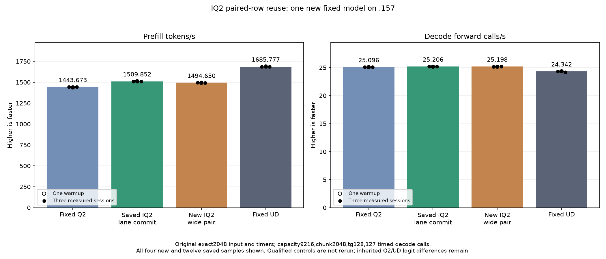

<!-- SPDX-License-Identifier: MIT -->
# IQ2 paired-row reuse and wave-local SwiGLU

One new candidate starts from the retained nominal1509.852296 PP parent and
changes only nonpacked IQ2 BN64. It doubles the combined gate/up tile from
BM128 to BM256, computing128 logical output rows instead of64. Original
fixed Q2/UD remain1443.672867/1685.777092 with the same exact2048/tg128 tester.
The completed model measures 1494.649738 PP / 25.19840692 TG, a 1.006890%
PP regression versus that parent, with all parent outputs exact. The negative
candidate remains retained; the 1509.852296 parent stays the composition base.
The completed results below supersede the historical preparation status.

For BM256, weight fetch unit0 loads gate rows0..127 and unit1 the corresponding
up rows. Each wave retains both projections' original K-ordered accumulators,
so its two matrix fragments share the same activation tile. The epilogue
evaluates the unchanged F32 product/Sigmoid boundaries before publishing only
final SwiGLU values into disjoint per-wave transpose planes. Wave barriers
protect each plane; every weight/activation stage barrier remains unchanged.
There is no cross-wave epilogue reader or extra tensor allocation.

At M640, the grid has five output blocks instead of ten. Total useful matrix
products and weight decoding remain the same; duplicated activation fetches
and cross-wave epilogue staging are the intended savings. BN128/48/16, packed
IQ2, Q2 down, scalar decode, dense, attention and routing descriptors retain
their previous dispatches. Both the original raw prefetch and four-lane compact
publication remain in the parent lineage.

This derives only from independently fetched official Gufo at
f783fedb9bea2ec7de941f6da4e02f4a4596b29e plus the recorded LIE patches. It
imports no sibling DS4 source or artifact. The literal1509 parent kernel is
retained inside the new fixture; old model binaries/cohorts are not rebuilt.

## Static result

The1025-file provider changes one numerical file. Production assembly replaces
one IQ2 specialization and preserves156 kernel bodies exactly, including the
other seven paired IQ2 variants. The saved parent assembly is reused.

| Resource | Parent BM128 | Candidate BM256 |
|---|---:|---:|
| Logical rows per block |64|128|
| Next-free VGPR |104|169|
| LDS bytes |17536|26752|
| Private bytes |0|0|
| Static block barriers |10|2|
| Static WMMA instructions per body |16|32|
| Static instructions per body |1342|1977|

The candidate does twice the output work per block. These are static metadata,
not dynamic traffic, occupancy, speed or numerical proof. Larger register/LDS
requirements may outweigh the reuse. Production compilation, fixture host/device
syntax and109 launcher guards pass. The existing logical audit enumerates
fetch/accumulator/output ownership, but GPU execution is still required.

## Frozen new-candidate test

The [plan](../config/q2-iq2-wide-pair-plan.json) freezes59 fixtures/four manifests
and the new helper. Local staging verifies all1025 provider files and reaches
the SSH boundary without executing network or GPU work. A fresh .157 host
Debug/ASan cohort passes27 tests each, six commands exit0/seven artifacts verify.
Root confirms fresh non-use handover; checkpoint and own admission precede
remote HIP build. The previous release is5011dbe0; no reservation is inherited.

The new component covers84 complete paired outputs: n1/17/49/65/129 crossed
with m1/65/127/129/640 at BN64/K256, plus original2048x640x2560 mixed128/64 maps
for64/128/512 active experts. Three weight rotations cover each case, with
guards, required-output poison checks, finite values and immutable inputs.
All42 performance samples use rotating weights beyond32MiB, two warmups and
five alternating measured cycles. Safe numerical differences save complete
arrays and retain timings; unsafe guards/unwritten required outputs stop work.

One original2048/tg128 model follows even when the component is slower or has
safe numerical differences. Capacity9216, chunk2048, greedy C1, MTP off, one
warmup/three measurements and127 timed decode calls stay fixed. Fifteen-second
idle, compilation and loading stay outside PP/TG. Historical fixed Q2, retained
1509 parent and fixed UD evidence are reused without rerun. Q4 and the full
context curve remain deferred; independent quality/parity are not established.

[Source](../config/q2-iq2-wide-pair-source.json),
[patch](../experiments/q2-iq2-wide-pair.patch),
[static comparison](../config/q2-iq2-wide-pair-static.json),
[host results](../config/q2-iq2-wide-pair-host-results.json),
[ownership audit](../config/q2-iq2-wide-pair-opportunity.json),
[local staging](../config/q2-iq2-wide-pair-staging-results.json).

## Completed GPU component and original model — 2026-10-05 UTC

All 84 guarded output pairs are exact; 42 timings cover three rotated-weight
distributions. Positive time changes mean slower.

| Distribution | Reference median us | Candidate median us | Time change |
| --- | ---: | ---: | ---: |
| mixed-e64 | 3754.486402 | 3755.632718 | +0.030532% |
| mixed-e128 | 4088.925044 | 4208.732605 | +2.930050% |
| mixed-e512 | 5559.606552 | 5388.187408 | -3.083296% |

The original model benchmark runs despite component timing rejection. All three comparator columns below are saved evidence, without rebuild or rerun.

| Session | Fixed Q2 PP / TG | Saved best PP / TG | New wide pair PP / TG | Fixed UD PP / TG |
| --- | ---: | ---: | ---: | ---: |
| Warmup | 1438.259006 / 25.08847266 | 1512.701776 / 25.15742671 | 1493.555055 / 25.15350497 | 1689.043527 / 24.34239962 |
| Measured 1 | 1443.398207 / 25.10565683 | 1510.259601 / 25.20649263 | 1494.649738 / 25.14822809 | 1686.364042 / 24.34621613 |
| Measured 2 | 1443.672867 / 25.08698337 | 1509.852296 / 25.17944517 | 1494.661516 / 25.19840692 | 1685.777092 / 24.34174251 |
| Measured 3 | 1443.841794 / 25.09595499 | 1508.620907 / 25.20625148 | 1492.591920 / 25.20696594 | 1685.400011 / 24.15102104 |
| Median measured | 1443.672867 / 25.09595499 | 1509.852296 / 25.20625148 | 1494.649738 / 25.19840692 | 1685.777092 / 24.34174251 |

All 21 parent model files and nine within-arm replays are exact. Prefill changes
-1.006890% versus the saved best. The wider tile is retained as negative evidence;
the 1509.852296 parent remains the source for the next composition.

Resident model memory remains 43,156,012,544 bytes. Compilation and loading
stay outside PP/TG. Independent task quality and the context/concurrency curve
remain open. The window releases at 2026-10-05T10:41:18.352210 UTC with
850 retired identities / 673 groups, empty KFD, four free original leases and
seven unchanged model stat tuples. All 37 artifacts verify across 13 runtime
commands; canonical, main and remote mirrors agree.

[All model samples](figures/q2-iq2-wide-pair-model-wrapped.csv), [all component samples](figures/q2-iq2-wide-pair-component.csv), [final audit](../config/q2-iq2-wide-pair-final-audit.json).
