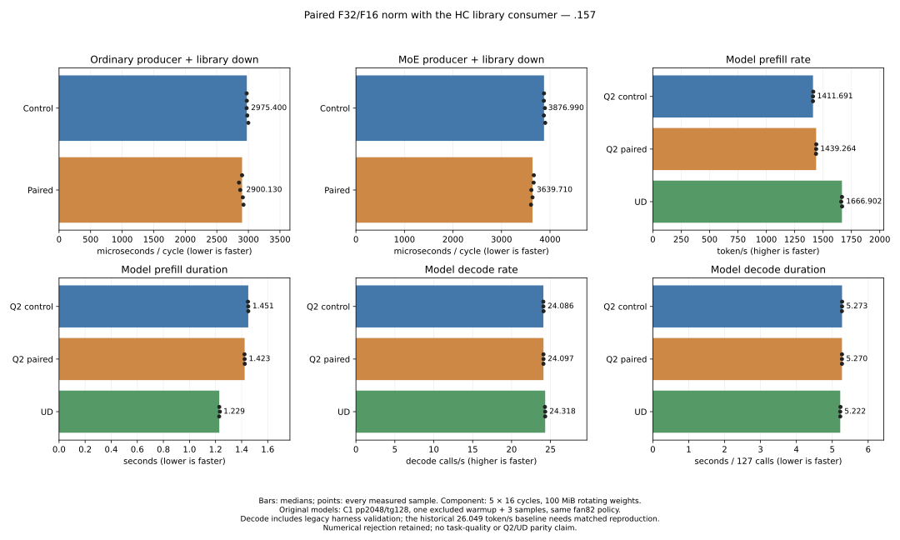

<!-- SPDX-License-Identifier: MIT -->
# Paired norm output with the HC library consumer

The paired norm/library composition raises fresh C1 prefill from 1411.691 to
1439.264 token/s (+1.9532%) while preserving all 21 saved model files. Fresh
UD reaches 1666.902 token/s: Q2 remains 13.6563% below UD prefill and 0.9112%
below its decode rate. Existing numerical failures remain; parity is not met.

This experiment composes the exact paired F32/F16 norm producer with the
measured scaled-Q2 / hipBLASLt HC-down implementation. The earlier native
consumer erased the producer's saving; this experiment measures the new
consumer together with the producer before admitting a complete model trial.

## Complete component cycle

On `.157`, five alternating repetitions of sixteen complete cycles use the
actual `BlasLt::Gemm` dispatch, M320/K10240/n2048, zero-workspace algorithm 7526,
three injection parts and ten routed experts. Sixteen original-layout F16
weight matrices rotate 100 MiB. Both allocations and both paths are warmed;
allocation roles alternate. Timing includes producer, reference-only narrowing
and consumer. Upload, validation, plan construction and hashing stay outside
GPU-event timing.

| Cycle | Reference median, us | Paired median, us | Time change |
|---|---:|---:|---:|
| Ordinary combine + HC down | 2975.400 | 2900.130 | -2.5297% |
| MoE combine + HC down | 3876.990 | 3639.710 | -6.1202% |

| Path | Five measured samples, us |
|---|---|
| Ordinary reference | 2973.03, 2975.40, 2972.25, 2982.40, 2998.85 |
| Ordinary paired | 2900.13, 2851.26, 2870.82, 2911.39, 2922.39 |
| MoE reference | 3876.99, 3873.68, 3895.46, 3873.83, 3901.44 |
| MoE paired | 3666.80, 3662.90, 3616.46, 3639.71, 3609.01 |

All candidate samples are below their corresponding control range. This
supports a model comparison, not adding these percentages to model throughput.
[All component receipts](../config/q2-library-norm-results.json) retain timings,
full-buffer hashes, independent checks and the actual command exits 0/0/1.

Ten correctness cases cover 96,97,129 and2048 rows, ordinary/MoE paths and small
input patterns. Ten additional post-timing replays cover both paths across
five repetitions. All 80 complete residual/norm/half/down hash pairs agree;
18 saved norm/half/down pairs agree byte for byte. Scalar F16 conversion is
exact. Invalid gamma/output/row/hidden arguments refuse dispatch without
modifying outputs; input and weight buffers remain unchanged.

All ten independent FP64 residual/norm checks pass. Fifteen down comparisons
fail the unchanged independent relative-RMS and peak-scaled thresholds of 2e-5; the two paths produce identical
bytes, so these failures also apply to the control. The inherited library
logging leaves the stream at two decimal places: printed 0.00 error values
are rounded presentation, not zero-error evidence. Boolean verdicts are
computed at full precision and preserve exit 1. Full arrays for the bounded
small cases and hashes for every case remain available. This experiment does
not resolve the existing scaled/library numerical rejection.

## Source, lifetime and provenance

The independently fetched official Gufo pin remains
`f783fedb9bea2ec7de941f6da4e02f4a4596b29e`. No antirez engine, sibling project
source or model conversion is introduced. First-party fixture/report code is
MIT; existing upstream notices remain.

[Preparation](../tools/prepare-q2-library-norm.py) with `--cycle` starts from
the frozen `scaled-library` inventory and applies the previously measured
[sequence patch](../experiments/q2-hc-sequence.patch), SHA256
`f45133061c4f31aa721a8959ca470263d980ea6de9cbfbeb009e34ad7951c773`.
The candidate lives persistently in `.deps/gufo-q2-bench-library-norm-cycle`.
Only `executor.cpp`, `kernels.hip.cpp` and `kernels.hpp` change; 1017 files stay
exact, including the scaled experts, HC library dispatch and HC-up kernels.
The original ordinary and MoE controls remain separate and unchanged.

The producer keeps F32 norm values for mixing/injection and writes their
existing F16 consumer representation into the existing half scratch. Before
writing it invalidates the previous cached identity; after dispatch it
publishes pointer/rows/columns/type. Recomputing the norm invalidates both
cached representations. Other geometries retain the original fallback. No
new allocation, persistent state format, public C ABI, HTTP behavior or
reactive-scheduling contract changes. Model measurements below qualify only
the exercised shapes and histories, not arbitrary lifetimes or serving.

[Static evidence](../config/q2-library-norm-cycle-static.json) retains the
initial fixture syntax failure and corrected successful check. Patch,
formatting, device assembly and executor syntax succeeded. The fixture fix
handles a failed library call explicitly with its error string. This is local
compile evidence, not GPU inference.

Both host cohorts pass 16/16 Debug and16/16 ASan/UBSan on `.157`. The second
qualifies the separately admitted full-model launcher guards: unsupported
modes and MMQ archive reuse are refused before staging; the allowed component
and full-rebuild model invocations reach the staging boundary in the fixture.
[The decision](../config/q2-library-norm-model-decision.json) preserves the
component rationale and the owner's exploratory performance authorization.

## Complete model comparison

Fresh original-model C1 requests use 2048 prompt tokens and 128 output tokens,
with 127 timed decode calls. One warmup precedes three measured sessions;
15-second idle periods, loading and compilation stay outside request timers.
Context capacity 9216, chunk 2048 and MTP-off match the previous experiments.
Every model arm rebuilds all MMQ sources and acquires the original four leases.
The fan82 policy, CPU98 inclusive limit and exposed GPU sensor bounds stay fixed.

The paired source measures 1439.264244 PP token/s versus 1411.691465 for its
fresh scaled/library control: **+1.9532% throughput**, with prefill falling
1.450741930 to 1.422949266 seconds (**27.792664 ms saved**). All three candidate
PP samples exceed all three control samples. Decode changes only +0.0434%
with overlapping ranges and no changed scalar-decode implementation; this
does not establish a decode optimization.

The new source preserves **all 21 complete saved model files**, including all
logits and input/output tokens, against its fresh control. The control also
reproduces all 21 files of the preceding scaled/library experiment. Both arms
pass 9/9 within-arm replay checks. No new logit drift is observed in this scope.
Against the original historical qualified Q2 implementation, both still have
maximum matched-history KL 0.002995927251 > 0.002 across 12 checked frontiers.
The earlier scaled/library numerical rejection is unchanged, not repaired.

Candidate execution ends at 2026-10-03 16:44:22.617 UTC (18:44 Europe/Rome).
The component and model additions remain isolated experimental source; task
quality, concurrency, HTTP and long-context performance remain unqualified.

The owner's cumulative comparison is larger than the last incremental gain:
this 1439.264 PP observation is about 3.79% above the preceding 1386.762 scaled
control. Those are separate cohorts; the directly controlled latest gain is
1.9532%. Component percentages are not summed into a model-rate claim.

| Source | Prefill token/s | Prefill seconds | Decode calls/s | Decode seconds |
|---|---:|---:|---:|---:|
| Q2 scaled/library control | 1411.691465 | 1.450741930 | 24.08612132 | 5.272746006 |
| Q2 paired norm/library | 1439.264244 | 1.422949266 | 24.09657332 | 5.270458928 |
| Pristine UD | 1666.901950 | 1.228626555 | 24.31815223 | 5.222436261 |

The current paired source needs another 15.8163% prefill-rate increase to
match this UD control, or 194.322711 ms less median prefill time. Decode remains
0.9112% below UD. These are matched-protocol sequential runs, not broad parity.

All sessions, including the excluded warmup:

| Source | Session | Prefill token/s | Prefill seconds | Decode calls/s | Decode seconds |
|---|---|---:|---:|---:|---:|
| Q2 control | Warmup | 1408.599410 | 1.453926493 | 23.57673726 | 5.386665618 |
| Q2 control | 1 | 1414.094139 | 1.448276988 | 24.07983285 | 5.274122989 |
| Q2 control | 2 | 1411.691465 | 1.450741930 | 24.08612132 | 5.272746006 |
| Q2 control | 3 | 1411.386922 | 1.451054965 | 24.10743338 | 5.268084660 |
| Q2 paired | Warmup | 1436.947607 | 1.425243335 | 24.10269511 | 5.269120296 |
| Q2 paired | 1 | 1440.414411 | 1.421813045 | 24.09537275 | 5.270721534 |
| Q2 paired | 2 | 1439.264244 | 1.422949266 | 24.10188652 | 5.269297070 |
| Q2 paired | 3 | 1438.260668 | 1.423942158 | 24.09657332 | 5.270458928 |
| UD | Warmup | 1670.080030 | 1.226288539 | 23.85216063 | 5.324465233 |
| UD | 1 | 1666.901950 | 1.228626555 | 24.28748712 | 5.229030051 |
| UD | 2 | 1660.402276 | 1.233436035 | 24.32002162 | 5.222034832 |
| UD | 3 | 1668.166107 | 1.227695486 | 24.31815223 | 5.222436261 |



[Validated JSON](../config/q2-library-norm-model-results.json),
[every measured sample as CSV](figures/q2-library-norm.csv) and
[PNG](figures/q2-library-norm.png) preserve the complete comparison.

## Reproduction

Run each label once in a freshly admitted `.157` window. Collection refuses
existing results; keep failed runs and use new labels after a concrete fix.
The generator refuses to overwrite a source tree. Dependencies, original
models and fan policy are the already recorded environment.

```sh
python3 tools/prepare-q2-library-norm.py --cycle
python3 tools/q2-remote.py cpu q2-norm-host-new
python3 tools/q2-remote.py hc-library-norm-bench q2-norm-component-new --source-variant library-norm-cycle
python3 tools/q2-remote.py collect q2-norm-component-new
python3 tools/analyze-q2-hc-sequence.py component.json q2-norm-component-new --library
# Only after a recorded component decision and fresh per-arm admission:
python3 tools/q2-remote.py q2-bench2k q2-norm-reference-new --source-variant scaled-library --rebuild-mmq
python3 tools/q2-remote.py q2-bench2k q2-norm-candidate-new --source-variant library-norm-cycle --rebuild-mmq
python3 tools/q2-remote.py ud-bench2k q2-norm-ud-new --rebuild-mmq
```

The fixed-cohort [model analyzer](../tools/analyze-q2-library-norm.py) binds
all sources and stable fixtures, every artifact, full MMQ builds, model/binary
witnesses, both thermal devices and original lease identities. It binds each
launcher to its own passing host cohort, preserving the component-only guard
used before the separate model decision. The [plot tool](../tools/plot-q2-library-norm.py)
exports SVG/PNG and every measured sample in CSV.

## Decode priorities from the preceding profile

The preceding composed-Q2 diagnostic trace has 15 decode steps. This new norm
patch changes wide prefill; it does not replace the scalar decode kernels.
The old trace provides measured priorities, not a profile of the new binary.

| Area | Q2 total, 15 steps | Q2 ms/step | Interpretation |
|---|---:|---:|---|
| Dense Q8 GEMV | 262.159 ms | 17.477 | 46.71% of kernel time; split by actual matrix/shape before optimizing |
| HC F16 down + up | 88.421 ms | 5.895 | Scalar vector kernels; down alone adds 1.296 ms/step over UD |
| Inter-kernel gaps | 84.102 ms | 5.607 | Includes device/host dependencies; not all recoverable launch overhead |

HC down costs 44.688 ms versus 25.246 ms in UD, with 1455 calls each. HC up
adds 43.733 ms on Q2; its UD counterpart is quantized and falls within the Q8
group, so the entire HC sum is not a direct same-format difference. Dense Q8
is already 24.383 ms below UD in aggregate, while Q2 routed gate/up and down
are respectively 6.068 and 12.357 ms below UD. Those are not the leading
relative regressions in this trace, though dense Q8 dominates absolute cost.

A focused next decode experiment should target HC scalar loads, activation
reuse and dependency-preserving fusion, retain the F16 weights and original
F32 accumulation/rounding, rotate weights and test the complete down/mix/up
cycle before a model run. Dense Q8 shape attribution follows for larger
absolute speedups. Scheduling work should target an observed wait and prove
real overlap: the executor already captures and replays HIP graphs, and UD
has 87.082 ms gaps, more than Q2. Callback/thread count is no speedup evidence.
Single-sequence token dependencies and multi-request throughput are separate.

## The original UD decode baseline remains about 26 token/s

The owner correctly identifies the earlier .157 baseline: the main LIE
worktree's `docs/C1-BASELINE.md` and hash-verified raw `t0-c1-perf-r2` receipt
measure **26.049385991 token/s** at 2042 physical prompt tokens, context 9216,
chunk 2048 and 128 completed decode steps. The pinned Gufo documentation also
reports 25.87 at depth 0/pp2048. The current 24.318 UD control is not a replacement
for that target; the 0.911% Q2 deficit above is within this diagnostic harness.
Q2's 24.097 is 7.497% below the historical rate, and this harness's own UD
control is 6.646% below it. Prompt, emitted histories and completed-step/timer
boundaries differ; six additional input tokens alone are not an explanation.

Inspection finds an avoidable cost in `tests/q2_model.cpp`: its timed Argmax
calls `Require(bool, const std::string&)` with a long string literal for each
of 248320 logits, then separately calls `std::max_element`. The historical
C17 harness puts complete finite-frontier checking outside its timed loop.

A separate host-only probe on .157 uses the saved Q2 frontier, GCC 16.2.1,
`-O2 -g -DNDEBUG`, five alternating repetitions of 32 calls, and a separate
allocation-counting build. Both paths retain every finite check, max-element
tie behavior and exception text. Invalid NaN/infinity checks and ties agree.
All five commands exit 0. No GPU, original model read or model forward occurs.

| Argmax path | Median us/call | Range us/call | Allocations/call |
|---|---:|---:|---:|
| Existing harness | 2578.921 | 1902.979–2808.892 | 248320 |
| Same checks, construct message only on failure | 777.427 | 678.745–979.520 | 0 |

Every original sample is slower than every changed sample. The median
1.801494 ms difference identifies a harness cost, not an inference-kernel gain
or a corrected model rate. CPU timing varies across repetitions; never subtract
this isolated result from old model timings. PP timers do not include Argmax,
so the measured +1.953% prefill addition is unaffected by this particular issue.

[All samples, source/input hashes and baseline witnesses](../config/q2-argmax-cost-results.json),
[CPU probe](../experiments/q2-argmax-cost.cpp), [exclusive remote runner](../tools/probe-q2-argmax.py)
and the [prepared harness-only patch](../experiments/q2-model-argmax-check.patch)
are retained. The measured model harness is unchanged at this checkpoint.
The immediate next decode work is applying/qualifying that patch and a fresh
matched Q2/UD comparison, then replaying the historical physical prompt with
aligned completed-work accounting. Keep the full numeric checks and old data.
Only after resolving the baseline difference should the kernel priorities
above be used to claim progress toward production decode parity.

The paired norm producer also currently accepts ragged batches while the
library consumer is selected only at 2048 rows. Other shapes use the native
consumer that previously regressed with paired output. Their performance is
not qualified by this 2K result; bound dispatch to the measured composition or
qualify those shapes before wider adoption.

## Validation and closure

All six runners and 132 artifacts verify, including 6119 frozen source-file
instances. Both host cohorts pass 16/16 Debug and16/16 ASan/UBSan. All 27 remote
commands finish: the component keeps its numerical exit 1; all other commands
exit 0. The three model arms pass 27/27 internal replays. Maximum observed CPU
and GPU temperatures are 84.5 C and 73 C. Original model witnesses and each
built binary remain unchanged.

Local failures are retained: the initial fixture syntax error, a sandbox-
denied collection leaving an empty archive, the exclusive-download refusal
of that archive, and a log-summary assertion expecting a different CTest
literal. The empty archive is retained separately; collection and actual
16-test logs verify after correction. No failed GPU arm is relabeled passing.

Fresh closure at 2026-10-03 16:50:57.568 UTC verifies 33 recorded PIDs and their
groups absent, KFD empty and original four leases acquired EX|NB then released.
CPU/GPU are 40/38 C. The persistent remote release receipt, shared registry and
local main-repository release/ready copies record release. Direct outgoing
thread transport fails again; delivery is not claimed. Core's incoming C17
sampler checkpoint is acknowledged in the local record and was not imported.
No Q2 job, waiter or restart remains. See the [release receipt](../config/q2-library-norm-window-release.json).
