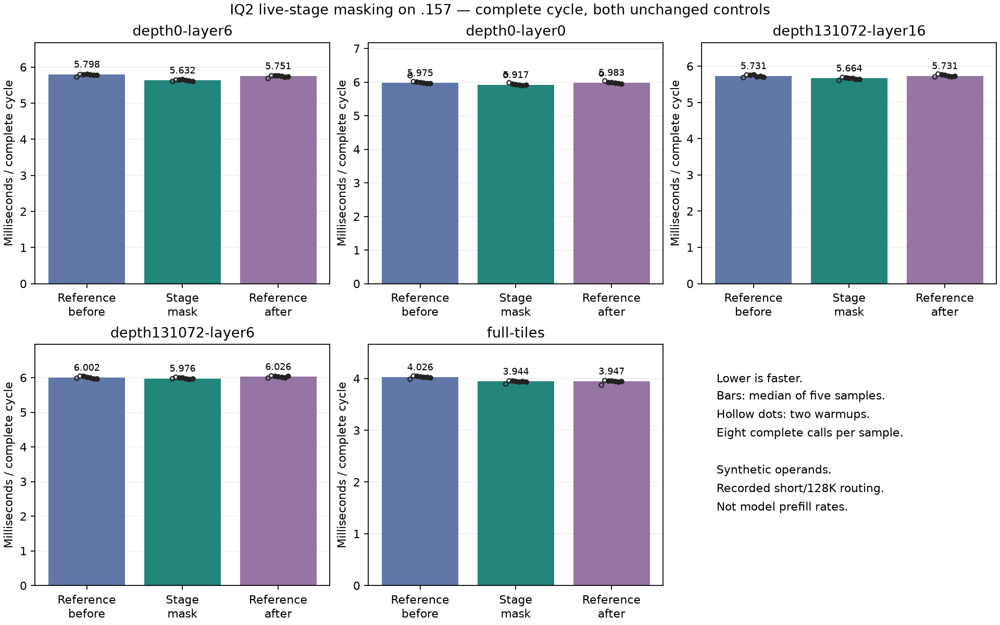

<!-- SPDX-License-Identifier: MIT -->
# Omit unread IQ2 activation-stage stores

The isolated candidate masks activation LDS slots once before the K loop.
It omits repeated zero stores for entire 16-row fragments that the existing
matrix loop never reads. Partial live fragments retain their zero padding.
Weight conversion, accumulation, barriers, epilogue, routing, tile geometry,
down projection and the original PLE reader remain unchanged.

This differs from the completed [empty-epilogue experiment](Q2-IQ2-LIVE-EPILOGUE.md),
which omitted stores and barriers after the matrix loop. The candidate was
prepared earlier but has no prior runtime transport in retained evidence.
It also excludes the scale-reuse and scaled-row-input patches whose model
comparisons did not establish a uniform gain.

[Source and provenance](../config/q2-iq2-live-stage-source.json),
[patch](../experiments/q2-iq2-live-stage.patch),
[static device accounting](../config/q2-iq2-live-stage-static.json).
Recorded canonical routing has 48.61–50.85% wholly unread fragments; skipping
their zero stores removes a calculated 49.74–54.57 GiB of logical LDS traffic
across a large prefill call. This is not DRAM traffic or a measured time saving.
[Accounting and tail exclusions](../config/q2-iq2-live-stage-traffic.json).

The [three-arm plan](../config/q2-live-stage-plan.json) measures unchanged
reference, stage masking and unchanged reference again. It reuses the complete
narrowing/compaction/IQ2 gate-up/SwiGLU fixture with four recorded short/128K
routing histograms and a full-tile control. Operands are synthetic, rotating
active weights exceed 32 MiB, and timing units are microseconds per cycle.
There are two warmups, five samples of eight calls, 51 independent FP64 checks
and 102 retained output arrays per arm. Numerical limits and failure exits
remain unchanged. This is not attention at 128K or a model token-rate test.

All sixteen measured harness/fixture files are byte-identical to the retained
`.157` `q2-native-row-host-r1` source capsule, whose Debug and ASan/UBSan suites
passed 22/22. The existing qualification is reused, avoiding another unchanged
CPU run. [Reuse receipt](../config/q2-live-stage-host-reuse.json).

Advance only if all independent checks and output bytes pass, and the four
recorded-routing medians improve against both controls by more than the larger
of 1% or twice the observed reference drift. The full-tile overhead must stay
within that same allowance. This selects further profiling, not automatic
model admission or promotion. Full canonical Q2/UD parity and independent
model quality remain required; neither is established by a component gain.

## Completed component comparison — 2026-10-04

All nine remote commands exit zero and all 318 artifacts verify. Every arm
passes all 51 independent FP64 checks at unchanged limits. All 102 arrays
(65,579,920 F32/packed values) match byte for byte against the first reference,
for both the candidate and repeated reference. Maximum relative RMS and
scaled-peak error are 0.000618805 and 0.000881553. This does not clear the
separate inherited model-level quality rejection.

Complete-cycle medians are microseconds; lower is faster.

| Routing case | Reference before | Stage mask | Reference after | Change vs before | Change vs after |
|---|---:|---:|---:|---:|---:|
| depth0-layer6 | 5797.746 | 5631.643 | 5751.317 | -2.865% | -2.081% |
| depth0-layer0 | 5974.785 | 5916.559 | 5983.410 | -0.975% | -1.117% |
| depth131072-layer16 | 5730.823 | 5664.452 | 5730.728 | -1.158% | -1.157% |
| depth131072-layer6 | 6001.955 | 5976.272 | 6025.519 | -0.428% | -0.817% |
| full-tiles | 4026.182 | 3943.544 | 3947.077 | -2.053% | -0.089% |

The candidate is faster than both references in all five cases, with
0.817–2.081% less time on the recorded routing shapes against the final control.
However, two routing cases fail the frozen advancement threshold: the depth-zero
64-row case saves 0.975% against the first control, and the 128K 64-row case saves
0.428%. The complete component effect is small despite the large logical LDS
store count. This supports deprioritizing this mechanism; it does not prove a
unique hardware bottleneck or a whole-model improvement.

**No new full-model curve is launched for this component.** The source remains
isolated and its positive component measurements are retained. Independent
model quality and full Q2/UD parity remain open.

[Audited results and frozen-gate decision](../config/q2-live-stage-results.json),
[all 105 samples including warmups](figures/q2-live-stage/samples.csv),
[vector figure](figures/q2-live-stage/cycles.svg).

CPU peaks are 71.500/71.500/72.250 C; GPU peaks are 77/76/77 C. No configured
thermal or lifecycle stop occurs. The existing 22/22 Debug and ASan/UBSan host
qualification is reused after exact source comparison, rather than rerun.

Fresh release at 14:15:56 UTC verifies 283 process identities and 215 groups
retired, KFD empty, four original lease inodes free and six unchanged model
stat tuples. Main/remote active/release/ready and the shared registry retain
closure; core is notified. No Q2 job, GPU reservation, observer/waiter, restart
or .157 cleanup remains. [Release](../config/q2-live-stage-window-release.json),
SHA256 `5fbc4745618252e52b0590b7d562ae49538d3021762dd597c8fea6985191499d`.
