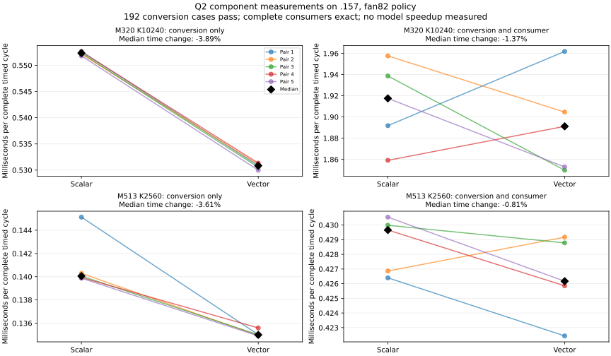

<!-- SPDX-License-Identifier: MIT -->
# Vector memory access for F32 to F16 conversion

This measured component experiment changes memory access in the F16 activation
conversion, preserving per-value arithmetic and existing model dispatch.
In the separately marked scaled-input pp2048 profile, the scalar F16 kernel
runs 193 times for 61.239276 ms, 4.0524% of the diagnostic kernel sum. This is
one cost to reduce; it alone cannot explain the measured 18.10% Q2/UD prefill
throughput gap. Profile time is not unprofiled wall time.

The new entry reads four F32 values through float4 and stores four converted
halves through uint2. It retains individual `__half(float)` conversions,
handles a 1–3 element tail without padded input, and falls back to the original
scalar entry for input/output alignment below 16/8 bytes. Zero count is a no-op;
null nonempty input/output and unrepresentable grids are refused before launch.
The BF16 entry is unchanged and no tensor allocation is added to the model.

The [preparation tool](../tools/prepare-q2-narrow-vector.py) derives an isolated
source from the frozen scaled-input experiment. The
[source manifest](../config/q2-narrow-vector-source.json) and
[patch](../experiments/q2-narrow-vector.patch) preserve the independently fetched
Gufo pin and all base hashes. The base's numerical rejection remains; this
experiment isolates a conversion mechanism.

## Current evidence

Local device-only compilation and host syntax checks pass; they execute no GPU
workload. All 150 original instruction bodies remain unchanged after normalizing
only compiler labels, comments and whitespace. One new body is added. Its
vector path contains one 128-bit global load, four ordinary F32/F16 conversions
and one 64-bit store. It uses 10 VGPR / 10 SGPR, with zero LDS or private scratch;
the scalar F16 kernel uses 5 VGPR / 6 SGPR. See the
[static receipt](../config/q2-narrow-vector-static.json).

The [fixture](../tests/q2_narrow_vector.cpp) prepares 192 conversion cases:
all half representations, finite half rounding midpoints and neighboring F32
values, overflow boundaries, 65,536 random F32 bit patterns, allocation tails,
four input alignments and four output alignments. It compares complete device
outputs to the original kernel and an independent integer IEEE RNE oracle;
NaN payloads use the original device route plus independent classification.
Input immutability, output guards, zero/null/oversized calls are checked.

The shaped comparison includes HC down 320×10240 and router 513×2560, both at
2048 tokens. Four rotated activation buffers exceed the 32 MiB cache, and
synthetic weights use read-only registered file mappings. It validates every
conversion and full consumer output, plus 128 independent FP64 dot samples per
shape at the unchanged 2e-5 bound. It times conversion alone and conversion plus
the unchanged consumer in five alternating pairs, eight launches each. Allocations,
transfers, oracle calculation and validation remain outside the GPU timer.

The isolated launcher mode `narrow-vector-check --source-variant narrow-vector`
selects only the component target. Guards refuse model, profile and Terminal-Bench
dispatch with this source. Host guards pass on `.157`. The admitted GPU run
`q2-narrow-vector-r1` finishes at 2026-10-03 13:09:55 UTC with build/configuration/
fixture exits 0/0/0. All 192 conversion cases pass, including 321536 special
input values. Both complete consumers remain bitwise exact: 2621440 HC output
values and 4202496 router values. Their independent relative RMS errors are
3.457862e-6 and 6.818156e-7, within the unchanged 2e-5 bounds.

## Measured result

| Shape and timed scope | Scalar median, us | Vector median, us | Time change |
| --- | ---: | ---: | ---: |
| HC 320x10240, conversion | 552.312374 | 530.837893 | -3.8881% |
| HC, conversion plus consumer | 1917.540669 | 1891.181231 | -1.3746% |
| Router 513x2560, conversion | 140.051872 | 134.996995 | -3.6093% |
| Router, conversion plus consumer | 429.660112 | 426.170260 | -0.8122% |

Conversion-only savings appear in all five paired samples for both shapes.
Complete consumer ranges overlap and paired changes have mixed signs. This
does not justify a model-dispatch change; no full-model run or speedup is
claimed. Reducing a component representing 4.05% of the diagnostic kernel sum
by roughly 4% also leaves the main Q2/UD gap unexplained. That observation is
not an end-to-end throughput prediction.

The [complete report](../config/q2-narrow-vector-results.json) and
[raw timing table](../config/q2-narrow-vector-results.csv) retain all samples,
independent consumer errors, source/binary identities and actual exits.
Reproduce offline with `python3 tools/analyze-q2-component-followups.py` and
`python3 tools/plot-q2-component-followups.py`. The analyzer verifies all four
collected artifacts, the source capsule, 1021 source files and frozen fixture.

Both components use the owner's [fan82 policy](Q2-FAN-CURVE.md), with CPU98 C
inclusive and exposed GPU thresholds. Observed maxima, including compilation,
are CPU69.5 C/GPU40 C. These short runs do not quantify cooling's effect.
Fresh closure at 13:25:01 UTC verifies both components' eight recorded processes
and groups absent, KFD empty and original four leases free. The durable receipt
is `run/q2-component-fan82-window-release.json`; no model restart is queued.
