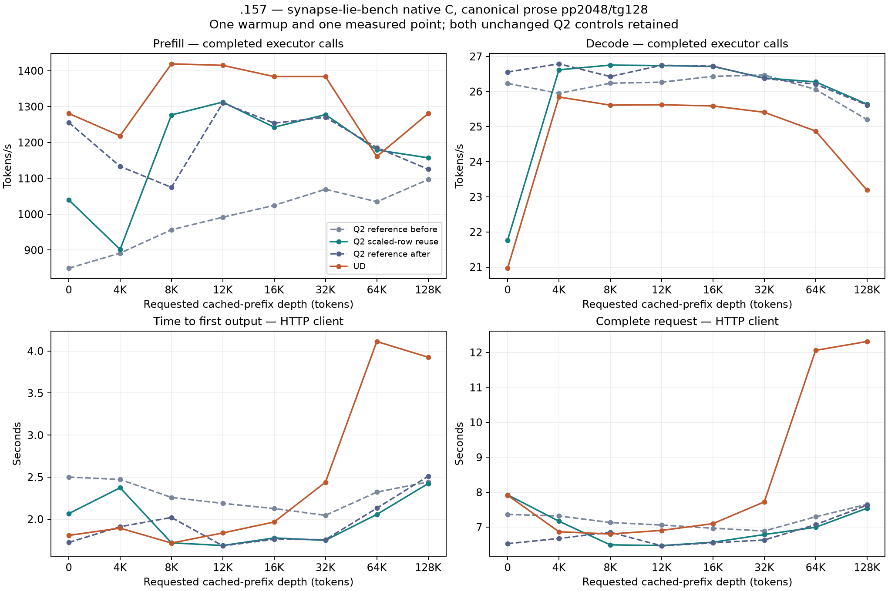

<!-- SPDX-License-Identifier: MIT -->
# Canonical model gate for scaled-row input reuse

The [scaled-row component probe](Q2-SCALED-ROW-REUSE.md) improves packing
medians by about 15%, while complete packing/down improves only 0.4–1.8%
against the repeated unchanged control. It preserves all tested output bytes
and also the control's independent numerical failures. This model gate tests
whether that component gain survives the complete canonical workload.

[Frozen plan](../config/q2-native-row-curve-plan.json): ordered Q2 reference,
scaled-row Q2, ordered Q2 repeated, then pristine UD. All eight cached depths
0/4/8/12/16/32/64/128K, prose calibration, approximately 2048 new tokens,
128 outputs, one warmup and one measured sample per depth remain unchanged.
The client is the same frozen native C `synapse-lie-bench` at `b598e4c`;
the measured C17 server is the same `15c6082` snapshot. Each model arm rebuilds
its complete MMQ library. No new scale-reuse or mixed-tile patch is combined.

The separate `q2-curve-row` mode requires the native client, matched source
manifest and unchanged component evidence. Its build identity is
`q2-canonical-curve-scaled-row-reuse`. The CMake composition checks the full
provider inventory and rejects other numerical or diagnostic compositions.
There is no core ABI, state-layout, scheduling or metrics contract change.
Python only supervises owned processes/leases and audits retained evidence;
the native C client generates and issues all model requests.

The RAM prefix checkpoint budget remains 16 GiB, capture at finish enabled,
SSD/MTP/vision/thinking disabled. The 128K point measures new-token prefill
after a prepared prefix, not fresh prefill of the entire 128K. System file-cache
occupancy is recorded separately; its machine-wide size is not per-model
residency or KV size. No cache drop, cold-cache claim or tuning is admitted.

This repeats the established canonical workload for a different source change,
not a new cache experiment. The earlier block-scale-reuse and PLE cache-first
campaigns remain separate completed comparisons. The new question is whether
retaining scaled-row inputs, already measured in the isolated GPU component,
helps complete model inference. The unchanged control is repeated to expose
run-order variation; a gain over only the first control is insufficient.

Three distinct caches appear in this workstream: Linux's machine-wide file
page cache; the server's RAM prefix-state checkpoints, including inference
state needed to resume the context; and Gufo's much smaller PLE embedding-row
cache. A change in Linux `Cached` neither measures KV occupancy nor changes
the configured checkpoint budget. These arms introduce no cache-policy patch.

Keep all failures and both controls. Compare the entire Q2 calibration,
warmup, prefix and measured request/reply/count histories before attributing
a change to the candidate. The unchanged-control drift and all separate cache
capture/restore/HTTP timings remain visible. Exact replay cannot replace
independent numerical qualification, and whole-curve parity remains open.

## Complete model results — 2026-10-04

All four native curves complete: 32 accepted points, 80 requests, 32 zero
model-command exits and 68 verified artifacts. The complete twenty-request Q2
histories match in both comparisons, including calibration, prefix preparation,
outputs, finish reasons and physical counts. Both Q2 controls and pristine UD
also match their respective complete histories from the previous native scale
campaign. This is a repeated benchmark for a different patch, not a new workload
or a new isolated cache experiment.

The candidate is **not promoted**. Its measured prefill is below the repeated
unchanged control at four of eight depths. At depth zero, decode is 18.026%
lower. Small positive changes at other depths do not establish a uniform model
gain. This selection decision is not a statistical proof that the patch causes
all of the observed timing changes: each arm has one accepted sample per depth,
and the unchanged controls vary substantially too.

[Audited results](../config/q2-native-row-curve-results.json),
[decision and all comparison percentages](../config/q2-native-row-curve-decision.json).

### Prefill, token/s

| Cached depth | Q2 before | Q2 row reuse | Q2 after | UD | Row vs Q2 after |
|---:|---:|---:|---:|---:|---:|
| 0 | 849.444 | 1039.904 | 1255.841 | 1280.846 | -17.195% |
| 4K | 891.415 | 901.703 | 1133.235 | 1218.583 | -20.431% |
| 8K | 956.672 | 1276.709 | 1074.834 | 1419.231 | +18.782% |
| 12K | 991.545 | 1312.774 | 1309.958 | 1415.082 | +0.215% |
| 16K | 1024.693 | 1242.539 | 1254.007 | 1383.731 | -0.915% |
| 32K | 1069.473 | 1277.693 | 1270.145 | 1383.813 | +0.594% |
| 64K | 1034.701 | 1179.123 | 1185.810 | 1160.746 | -0.564% |
| 128K | 1096.610 | 1157.255 | 1125.468 | 1280.583 | +2.824% |

### Decode, token/s

| Cached depth | Q2 before | Q2 row reuse | Q2 after | UD |
|---:|---:|---:|---:|---:|
| 0 | 26.231 | 21.769 | 26.556 | 20.968 |
| 4K | 25.947 | 26.618 | 26.788 | 25.844 |
| 8K | 26.237 | 26.753 | 26.427 | 25.612 |
| 12K | 26.266 | 26.738 | 26.748 | 25.623 |
| 16K | 26.432 | 26.714 | 26.723 | 25.589 |
| 32K | 26.471 | 26.385 | 26.375 | 25.409 |
| 64K | 26.059 | 26.275 | 26.209 | 24.874 |
| 128K | 25.201 | 25.642 | 25.616 | 23.192 |

[Vector figure](figures/q2-native-row-curve/curve.svg),
[all 32 points, counts, PP/TG times, TTFT/wall and cache durations](figures/q2-native-row-curve/points.csv),
[separate cache observations](../config/q2-native-row-cache-timings.json).

### Attribution and cache limits

The unchanged Q2 depth-zero reference rises 849.444→1255.841 PP, or 47.843%.
The candidate's 1039.904 is above the first reference and below the repeated
one. Crediting the first-to-second increase to input reuse would be incorrect.
At 128K candidate/reference PP is 1157.255/1125.468, while UD is 1280.583.
Candidate PP remains below UD at seven of eight points. Its 64K crossing
coincides with a low UD observation, retained without replacement.

The unchanged UD depth-zero result itself falls from 1533.293 in the previous
native campaign to 1280.846 here. Both complete UD request histories match.
These observations do not establish stable parity or redefine the target from
a single favorable point. The decision report includes comparisons against the
previous unchanged controls without issuing another model request.

Preflight machine-wide Linux `Cached` is 1.847/38.698/34.555/32.351 GiB for
before/candidate/after/UD. These counts do not identify resident model pages,
KV occupancy or the cause of a measured PP difference. The earlier read-only
first-control observation includes startup and prefix construction in its
cumulative process reads; it is not per-request or per-file attribution.
The server's separate 16 GiB prefix-checkpoint budget and all cache policies
remain unchanged. Capture/restore durations are outside PP/TG executor timers
and remain visible in the complete HTTP request durations.

### Qualification and closure

Host Debug and ASan/UBSan pass 22/22 each on .157, six commands exit zero and
seven artifacts verify. The eleven frozen harness files match the host capsule
in each model arm. The unchanged native client's existing .157 conformance is
retained. [Host receipt](../config/q2-native-row-host-results.json),
[first-control audit](../config/q2-native-row-first-control.json).

All model commands complete without a configured thermal stop. CPU peaks by
arm are 95.500/96.875/97.500/96.750 C; GPU peaks are 98/99/101/99 C. These are
whole-cohort observations, including builds and prefix preparation, not proof
of an individual request's operating conditions. Independent model numerical
quality remains unresolved; exact text replay is not an independent oracle.

Fresh release at 14:00:26 UTC verifies 271 recorded identities and 206 groups
retired, empty KFD, four original lease inodes free and six original model stat
tuples unchanged. Remote/main release, active and ready receipts and the
shared registry record closure; core is notified. No Q2 job, reservation,
waiter, restart or remote cleanup remains.
[Release](../config/q2-native-row-window-release.json), SHA256
`44b0d9b6acf998ceaa451fd9e8635df9328a3e5bb497bf74a93642213f063607`.

The candidate stays isolated. Full Q2/UD parity, latency/concurrency/resource
acceptance and independent quality remain open. The separate live-stage
candidate has only static traffic accounting and is not tested in this window.
