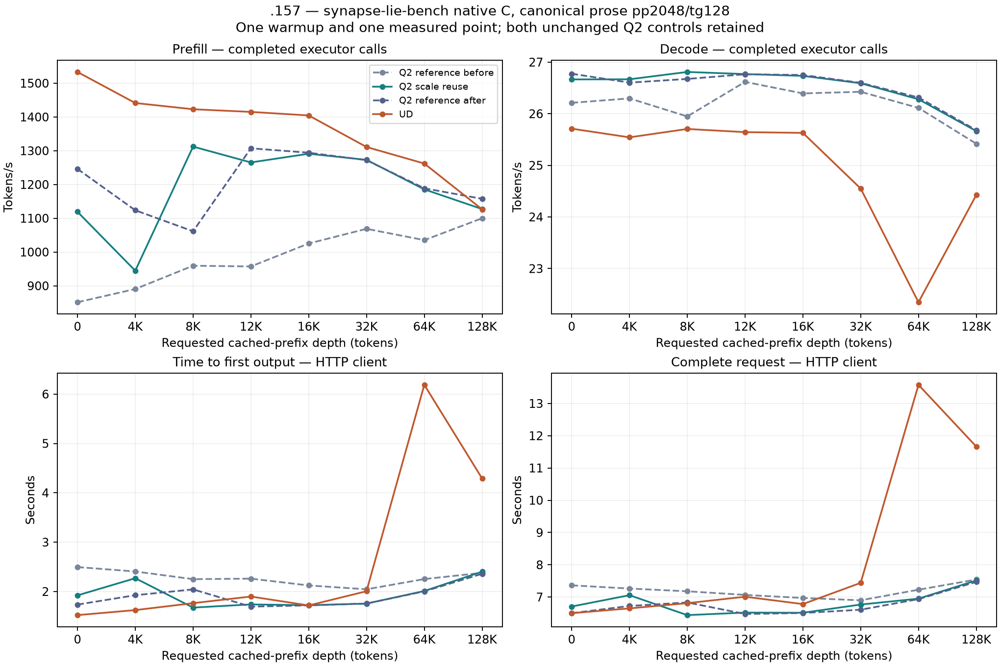

<!-- SPDX-License-Identifier: MIT -->
# Native canonical benchmark for the IQ2 scale candidate

The completed model campaign keeps the measured C17 server, timers and Q2/UD
providers, while the independently qualified native C `synapse-lie-bench`
executes the canonical Gufo workload. The scale candidate retains its
[component evidence](Q2-IQ2-PREFILL-REUSE.md), but the model comparison establishes
no uniform prefill gain and does not promote it.
Whole-curve parity and the broader [acceptance matrix](Q2-CURVE-PARITY.md)
remain open.

## Composition

The server remains the exact `15c6082152c3df0cb1f40d89ba5329692f307d7b`
snapshot in `config/q2-curve-source.json`. The new benchmark is a separate
executable built from a clean, committed core worktree with
`LIE_GUFO_RUNTIME=OFF` and legacy Python tests disabled. It uses HTTP on
loopback port 8000 and does not embed or load the provider.
`prepare-q2-native-bench.py` records the full client source inventory and
copies its core qualification receipt into persistent evidence. No dirty core
source is imported. The source receipt is required before any model staging.

The wrapper's `--native-curve` is restricted to ordered Q2, scale-reuse Q2 and
pristine UD. `q2-curve-scale` requires this flag and a full MMQ rebuild. It
cannot silently select the historical Python curve driver. The C client owns
prompt generation, calibration, prefix requests, measured requests, JSONL,
offline protocol reconstruction and graphs. Python retains only the existing
remote process/lease supervision and evidence auditing role.

The session checks the actual C1 backend identity, prefix cache and idle
scheduler before and after the client. The server and native client binaries
must remain unchanged. Both children inherit the supervised process group;
timeout and thermal handling remain in the existing owned-process supervisor.
No persistent server is deployed and no foreign process is terminated.

## Frozen workload and order

[Campaign plan](../config/q2-native-scale-curve-plan.json):

1. Ordered Q2 reference, `q2-native-scale-before-r1`.
2. Scale-reuse Q2, `q2-native-scale-candidate-r1`.
3. Repeated ordered Q2, `q2-native-scale-after-r1`.
4. Pristine UD, `q2-native-scale-ud-r1`.

Each arm uses C1 AR, greedy prose, pp2048/tg128, one warmup and one sample at
each cached-prefix depth 0/4/8/12/16/32/64/128K. Capacity 133760, chunk 2048,
eight-token prefix reply, tolerance, retry history and the 16 GiB RAM prefix
budget remain unchanged. MTP, thinking, vision and SSD are off.
No file-cache drop or cold-cache claim. PP/TG use completed executor calls;
HTTP wall time and first output are additional client observations.

The entire Q2 request/reply history must match across controls and candidate,
including calibration, warmup, prefix replies and physical token counts.
Every curve must complete all 128 output tokens at all eight accepted points.
All mismatches and actual command exits are retained. UD prefix replies may
differ; its workload recipe and timers must match. Independent quality remains
a separate requirement.

## Host qualification and current gate

The new Q2 wrapper and admission guards pass 22/22 Debug and 22/22 ASan/UBSan
on .157. All three host cohorts each have six zero command exits
and seven verified artifacts. The final cohort also covers the isolated
`native-curve-cpu` mode, which builds only the frozen C client and its three
native contracts, without acquiring GPU leases or loading models. The host capsule
binds eleven harness files. Tests cover native-only scale admission, wrong
provider rejection, source inventory tampering and busy/mismatched backend
rejection. [Initial host receipt](../config/q2-native-curve-host-results.json),
[current host receipt](../config/q2-native-curve-host-r3-results.json).

The prepared analyzer checks source inventories, qualified harness bytes,
model/lease identities, completed child exits, the C report against its raw
JSONL and all Q2 request/reply histories. Tracked reports retain semantic
payload hashes; the complete prompts/replies remain in the verified raw
artifacts. Every PP/TG value is checked against actual counts and completed
executor durations. The fresh-admission script includes all three wrapper cohorts
and the native client conformance cohort in process retirement.

The native C client is frozen from clean core commit
`b598e4c1e6aba26b0bacd6ad243503009360c869`: all 1287 source files and the
separate core qualification receipt are preserved. On .157 its three native
contracts pass in Debug and ASan/UBSan, six commands exit zero and seven
artifacts verify. [Conformance receipt](../config/q2-native-bench-conformance-results.json).
The native client and model server have independent frozen source inventories.

Fresh coordinated admission at 12:01:24 UTC records original lease, KFD,
process retirement, model-stat and thermal checks. The four-arm model campaign
is complete, with checkpoint `b5413ca` and the same original server.
[Admission receipt](../config/q2-native-scale-window-admission.json).
No changes to core ABI, persistent state or metrics contracts occur.

The first native reference completes all eight points and twenty requests,
with eight zero command exits and seventeen verified artifacts. A separate
read-only comparison against the retained previous canonical reference verifies
all twenty semantic request payloads, assistant replies, finish reasons and
physical token counts are identical. This includes calibration, warmup and
prefix construction, not only the measured prompts.
[Real-workload equivalence receipt](../config/q2-native-legacy-curve-equivalence.json).
This validates the client transition; it does not establish an optimization
gain or independent numerical quality.

## Complete model comparison — 2026-10-04

All four curves complete all eight depths and twenty requests each. Every Q2
request/reply/count history matches. All 32 model commands exit zero and all
68 model artifacts verify. The complete graph and CSV retain both unchanged
controls, every point, actual token counts, prefill/decode durations, HTTP
TTFT/wall and separate state-cache capture/restore times.

**Scale reuse is not promoted.** Six of eight prefill points are below the
repeated unchanged reference. The isolated 8K increase and 0.076% at 32K do
not establish a uniform or repeatable benefit. There is one measured sample
per depth in each process run; no confidence interval is claimed.

### Prefill — token/s, higher is faster

| Cached depth | Q2 before | Q2 scale | Q2 after | UD | Scale vs Q2 after |
| ---: | ---: | ---: | ---: | ---: | ---: |
| 0 | 851.328 | 1119.251 | 1246.179 | 1533.293 | -10.185% |
| 4K | 890.407 | 944.641 | 1123.681 | 1441.284 | -15.933% |
| 8K | 959.488 | 1312.221 | 1061.401 | 1422.874 | +23.631% |
| 12K | 957.318 | 1265.352 | 1307.240 | 1414.988 | -3.204% |
| 16K | 1025.278 | 1291.069 | 1294.157 | 1404.517 | -0.239% |
| 32K | 1068.754 | 1273.057 | 1272.090 | 1311.093 | +0.076% |
| 64K | 1035.295 | 1185.571 | 1188.756 | 1262.079 | -0.268% |
| 128K | 1100.032 | 1127.232 | 1157.600 | 1126.386 | -2.623% |

### Decode — token/s, higher is faster

| Cached depth | Q2 before | Q2 scale | Q2 after | UD |
| ---: | ---: | ---: | ---: | ---: |
| 0 | 26.211 | 26.664 | 26.775 | 25.711 |
| 4K | 26.297 | 26.667 | 26.602 | 25.542 |
| 8K | 25.947 | 26.809 | 26.674 | 25.704 |
| 12K | 26.617 | 26.768 | 26.764 | 25.643 |
| 16K | 26.394 | 26.733 | 26.750 | 25.629 |
| 32K | 26.425 | 26.590 | 26.598 | 24.550 |
| 64K | 26.113 | 26.280 | 26.315 | 22.348 |
| 128K | 25.418 | 25.664 | 25.682 | 24.425 |

### What explains the apparent increase

The unchanged Q2 reference moves from 851.328 to 1246.179 token/s at d0
(+46.381%). The scale candidate's 1119.251 is above the first control but
10.185% below the repeated control. Its large first-to-second increase cannot
be credited to the patch. Workload and responses remain identical, including
all calibration and prefix preparation requests.

Linux's preflight `Cached` is 6.135 GiB before the first run, 42.928 before the
candidate and 40.379 before the repeated reference. These are system file-cache
observations, not KV cache sizes or proof of which model pages are resident.
Cache warming/order state is a plausible contributor, not a separately isolated
causal measurement. No file cache is dropped, no run is labelled cold and no
thermal policy is changed.

UD's 128K prefill (1126.386) and 64K decode (22.348) are lower than earlier
retained UD observations. These values stay in the graph and table; they do
not establish stable Q2/UD parity at 128K or a new decode optimization. The
reference's lower point cannot replace the full acceptance target. At 64K,
UD state-cache capture is 5708.513 ms versus Q2-after 236.919 ms; at 128K it is
4383.857 versus 574.788 ms. Restore is 23.368/22.817 ms at 64K and
55.057/42.571 ms at 128K. Capture is accounted separately from the completed
executor PP/TG timers and contributes to request wall time. The cause of this
capture-cost difference is not isolated by this unprofiled campaign.
[Separate cache durations](../config/q2-native-scale-cache-timings.json).

[Full 32-row CSV](figures/q2-native-scale-curve/points.csv),
[vector graph](figures/q2-native-scale-curve/curve.svg),
[audited results](../config/q2-native-scale-curve-results.json),
[decision](../config/q2-native-scale-curve-decision.json).

### Validation, resource scope and closure

The final wrapper passes 22/22 Debug and 22/22 ASan/UBSan on .157; the frozen
native client passes its three contracts in each configuration. Source
inventories, qualified harness bytes, model stats, both executable hashes,
original lease identities and completed child exits all verify. Across the
four CPU cohorts and four model arms, all 56 commands exit zero and 96 artifacts
verify. Native C produces its own per-arm JSON/CSV/SVG/PNG; the combined plot is
a read-only rendering of collected evidence. No Python inference requests run.

CPU peaks in arm order are 94.750/96.500/97.250/96.375 C; GPU peaks are
97/99/100/99 C. No configured thermal, timeout or lifecycle stop occurs.
GPU temperatures are observations under the existing exposed-threshold policy;
they are not measured throttle attribution. Independent model numerical quality,
concurrency and the broader context/resource acceptance remain open.

Release at 2026-10-04T12:38:45.012717+00:00 verifies 201 process identities and
153 groups retired, KFD empty, all four original leases free and six original
model stat tuples unchanged. Remote/main receipts and the shared registry
record closure; core is notified. No Q2 job, reservation, waiter, restart or
.157 cleanup remains. [Release receipt](../config/q2-native-scale-window-release.json),
SHA256 `e54cadce7133189886dc0d07808f644a16ee1a2c70b84058e16b4cf6a0f62c35`.

The separate [scaled-row input reuse](Q2-SCALED-ROW-REUSE.md) probe has local
source and device-assembly evidence only. It is excluded from these model
results and requires a new GPU qualification window before promotion.
