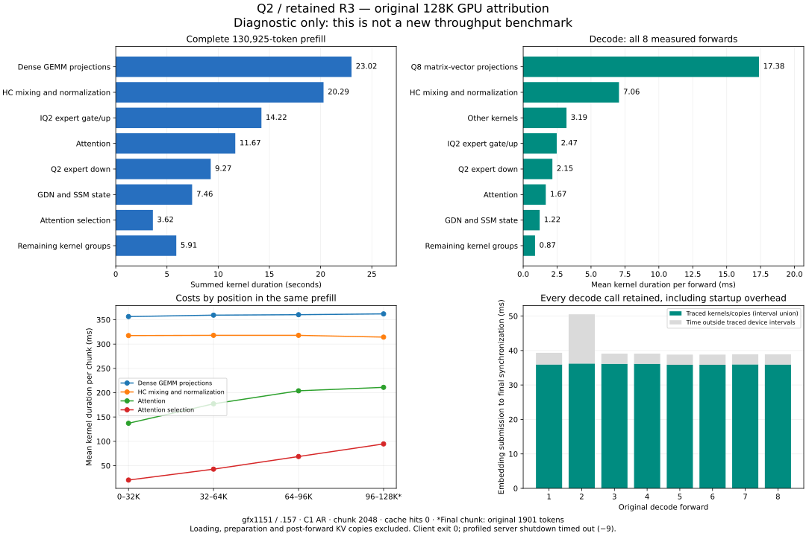

<!-- SPDX-License-Identifier: MIT -->
# Original 128K GPU attribution — 7 October 2026

The retained R3 server now has a usable complete GPU trace on `.157`.
This is diagnostic progress, not a new performance improvement. The saved
unprofiled reference remains **1337.972303 prefill / 26.101627 decode token/s**.
The later IQ2-LDS observation, 1338.152114 / 26.087829, changes these rates by
+0.013439% / -0.052859%; it establishes no incremental gain. No reference
executable is rebuilt and no new throughput control is run.

## Same input and completed-call boundaries

Server `f8a5210c`, client `87d856cf` and requests `fcee51ef` are reused.
The identical three preparation requests precede the original 130925-token
input and eight decode calls: capacity 133760, chunk 2048, C1 AR, no MTP,
zero cached tokens and port 8000. All 95 embedding geometries match the
original sequence, including 63 full chunks and the original 1901-token tail.
All four responses and streamed token pieces match original Q2 and saved R3.
This is not sustained TG128 or independent task-quality qualification.

All 176014 kernel, 4187 copy and 481972 HIP API records have positive
durations and nonzero correlation IDs. CSV and ROCPD match on every kernel
dispatch ID/timestamp tuple and every copy/API timestamp pair. SQLite
`quick_check` returns `ok`. These checks resolve timestamp usability for this
run; they do not establish why the earlier boot's trace contained zero times.

Each embedding is matched to its CPU launch or graph replay. The analysis
ends each forward at its completing stream synchronization, after the 48
expert-count waits in prefill. Loading, preparatory requests, between-call
gaps, graph preparation after prefill and post-forward KV-cache copies are
excluded from kernel attribution. The latter copies exist despite zero cache
hits, because the frozen server still captures state at request completion.
No cache policy is changed to obtain these measurements.

The resulting 125289 prefill and 11807 decode dispatches belong to completed
inference calls. Kernel sums and interval unions are recorded separately;
uncovered time is not a hardware idle counter. Groups follow kernel families,
not a claim that each family uniquely identifies a model layer. In particular,
`DenseF16GEMMKernel` includes specialized projections and does not mean that
the original Q8 weight representation was changed.

## Measured costs under instrumentation

| Kernel group | Complete prefill, seconds | Decode, mean ms/forward |
| --- | ---: | ---: |
| Dense GEMM projections | 23.017440 | — |
| HC mixing and normalization | 20.285346 | 7.061018 |
| IQ2 expert gate/up | 14.221888 | 2.471594 |
| Attention | 11.668108 | 1.665352 |
| Q2 expert down | 9.273746 | 2.153039 |
| GDN and SSM state | 7.455972 | 1.215874 |
| Attention selection | 3.624662 | 0.872772 |
| Other quantized GEMM projections | 2.985180 | — |
| Other kernels | 2.728123 | 3.192910 |
| Q8 matrix-vector projections | 0.196188 | 17.380082 |

The kernel totals are 95.456653 seconds for prefill and 288.101120 ms over
all eight decode calls. Q8 matrix-vector work accounts for 48.261% of decode
kernel duration. Its 16384-row geometry contributes 7.104664 ms/forward;
the 2560-row geometries together add 4.180175 ms, and the 248320-row vocabulary
projection adds 2.995441 ms. These are measured grid identities; equal row
counts alone do not identify a tensor or its input width.

| Original chunk range | Mean complete interval, ms | Dense GEMM, ms | HC, ms | Attention, ms | Selection, ms |
| --- | ---: | ---: | ---: | ---: | ---: |
| 0–15 | 1434.799 | 356.566 | 317.518 | 137.166 | 20.372 |
| 16–31 | 1514.412 | 359.488 | 317.999 | 177.158 | 42.754 |
| 32–47 | 1570.530 | 360.441 | 317.974 | 203.914 | 68.753 |
| 48–63 | 1604.845 | 362.096 | 314.343 | 211.019 | 94.662 |

The final range retains its real 1901-token tail; there is no padding or
normalization to invent another 2048-token chunk. Attention plus selection
increase by 148.143 ms between the first and last ranges, compared with a
170.046 ms increase in the completed interval. This locates most of the
context-dependent growth; it does not prove a particular replacement faster.

## Reactive implications and next work

Every decode call remains in the raw report and graph. The second call has
a 50.521 ms interval versus 38.815–39.107 ms for calls 3–8. Do not discard it
or replace the saved benchmark with a warm-only rate. For the separate
steady-path diagnostic, calls 3–8 average 2.950 ms outside traced device
intervals; the five observed submission gaps after calls 3–7 average 0.125 ms.
Those small external gaps cannot account for the saved target's required
4.978455 ms reduction per measured decode call. Internal launch/dependency
costs remain distinct from an external reactive worker or request batching.

Next implementation selection should prioritize the measured larger costs:

- Decode: screen a lossless compact Q8 operand layout/loading change on the
  dominant dense shapes, preserving encoded scales/codes and the reduction.
  This is distinct from the already measured four-row grouping and expanded
  F16 mirrors. Neither fewer bytes nor a speedup is assumed; conversion cost,
  memory ownership and all extra buffers must be included if it reaches a
  model implementation. No Q5 or other lossy overlay is admitted.
- Long prefill: inspect the attention path and selector's growing costs using
  the actual complete-chunk dispatches, while retaining the failed query-LDS
  and key-tile results. Repeating those variants is not a new optimization.
- Absolute prefill: dense GEMM and HC still exceed 43 seconds together; use
  the kernel/shape census to select a genuinely different complete-operation
  change after checking the retained negative experiments.
- Keep the exact small Q2-down padding patch for composition. Its component
  saving is not a route to the whole-model target by itself.

No numerical executor change, new model build or model speedup follows from
this trace. The 1500 PP / 30 TG objective remains open.

## Lifecycle and reproducibility

Source checkpoint `655dddf3`, plan `db0f9cfe`. The `.157` CPU runner fixtures,
verify, admit, run and release commands exit 0. The inference client exits 0,
but **the profiled server exits -9**: after producing both exports it fails
to finish within the 30-second shutdown grace. The log records profiler
finalization followed by chained SIGTERM handling. This remains a shutdown
defect; complete client output and valid exported data are not a clean-exit
claim. Future profiling should resolve this path before another model run.

All 44 artifacts / 412463859 bytes hash-verify locally at 20:03:27.619431 UTC,
before release at 20:04:00.680062, SHA
`0a924578de5bff0f32994045dfa7af118743576ec1b28fdd7bd2309cc2e2714e`.
Independent closure at 20:04:35.761148 verifies registry, 16 retired process
identities/groups, empty KFD, five unchanged free leases and seven model stats.
Core and GLM receive closure; no Q2 GPU window or reservation remains.
Power/fans are read-only and unchanged. No remote build, installation, tuning,
cleanup or model conversion occurs.

The first read-only status command fails before execution because the remote
fish shell rejects a Bash heredoc (exit 127). The corrected quoted `python -c`
read succeeds without restarting inference. The first local analyzer fails
on a textual CSV `Agent_Id`; explicit integer-column conversion fixes it.
Both failures and actual exits remain in the preparation evidence. These
are distinct from inference and server shutdown outcomes.

Reproduce the local attribution with `python3 tools/analyze-q2-native128-profile.py`;
the tool verifies raw hashes, requests, output equality, trace representations
and all forward boundaries. Plot with `tools/plot-q2-native128-profile.py`.
No core lifetime/parser/metrics contract changes require a new CTest cohort.

[Machine-readable attribution](../config/q2-native128-profile-results.json),
[all kernel costs](figures/q2-native128-profile-kernels.csv),
[diagnostic image](figures/q2-native128-profile.png).

