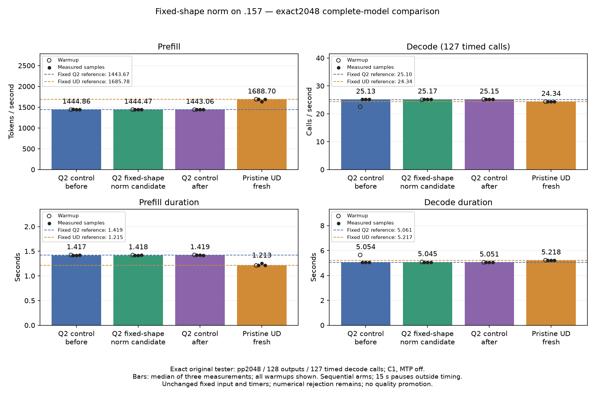

<!-- SPDX-License-Identifier: MIT -->
# Fixed-shape norm: exact2048 complete-model comparison

The owner explicitly requests the full model now after the component rejection.
This admits an exploratory performance measurement; it does not change the
failed component gate or numerical thresholds. The candidate remains exactly
the source already measured in [the component](Q2-NORM-FIXED-SHAPE.md).

Four sequential original-weight arms on `.157` compare the fixed mixed-map Q2
provider, fixed-shape norm candidate, original Q2 again and pristine UD. Every
arm rebuilds all MMQ sources. The [frozen plan](../config/q2-norm-fixed-model-plan.json)
binds sources, fixtures, host qualification and the existing reference.

The original direct-executor tester is unchanged: exact2048 physical input,
context capacity9216, chunk2048, C1 greedy, MTP off,128 outputs and127 timed
decode calls, one warmup and three identical-input measurements, with15-second
pauses outside timers. Input SHA256 remains
`75343e606f5b815fe01f69ddc6ce50a997e2de96d8a20304a82a7f24f1180b35`.
The historical measured reference remains1443.672867 Q2/1685.777092 UD token/s;
fresh controls will be shown alongside it. No new context curve is admitted.

Host launcher checks pass22/22 Debug and22/22 ASan/UBSan on `.157`, with six
zero command exits and seven verified artifacts. The scoped candidate mode
requires its exact provider and full MMQ rebuild; native-curve, point-only,
detach and unrelated provider combinations are rejected before staging.
[Host receipt](../config/q2-norm-fixed-model-host-results.json).

Saved input/output tokens and complete logits will distinguish exact replay
from arithmetic differences. KL at later decode frontiers is meaningful only
when token histories match. Greedy agreement alone does not qualify quality.
The existing independent numerical rejection remains. Sources and evidence
are persistent; `.157` cleanup, tuning and deployment are outside this run.

## Complete original-weight result

All four arms complete on `.157`, with16 zero model command exits,104 verified
model artifacts and4085 verified provider-file instances. Host qualification
brings the campaign totals to22 zero command exits and111 verified artifacts.
Input, tester, options and timers match the frozen comparison.

| Arm | Prefill token/s | Decode calls/s | Prefill seconds | Decode seconds |
|---|---:|---:|---:|---:|
| Fixed historical Q2 | 1443.672867 | 25.095955 | 1.418603928 | 5.060576497 |
| Fresh Q2 before | 1444.862522 | 25.128867 | 1.417435894 | 5.053948528 |
| Fixed-shape candidate | 1444.466530 | 25.171357 | 1.417824475 | 5.045417371 |
| Fresh Q2 after | 1443.056567 | 25.145708 | 1.419209785 | 5.050563686 |
| Fresh pristine UD | 1688.699263 | 24.338199 | 1.212767747 | 5.218134651 |
| Fixed historical UD | 1685.777092 | 24.341743 | 1.214869991 | 5.217375049 |

Each row is the median of three measurements of the identical physical input,
not a median of different prose prompts. All three fresh measured samples:

| Arm | Prefill token/s, chronological | Decode calls/s, chronological |
|---|---|---|
| Q2 before | 1446.945410;1444.862522;1443.613324 | 25.12886692;25.14469068;25.11338869 |
| Candidate | 1445.513238;1444.466530;1442.835355 | 25.17135663;25.16073258;25.18179226 |
| Q2 after | 1443.056567;1442.886366;1444.052812 | 25.15872293;25.13252172;25.14570806 |
| UD | 1688.815124;1632.524440;1688.699263 | 24.32657022;24.34579666;24.33819909 |

UD's second prefill sample is visibly lower and remains in the report/CSV.
No samples are discarded or rerun. Candidate PP differs−0.0274% from the
first control and+0.0977% from the repeated control; the unchanged control
itself drifts−0.1250%. Candidate PP is+0.0550% over the fixed Q2 reference,
14.3145% below fixed UD and14.4628% below fresh UD. This campaign does not
establish a repeatable prefill gain. Candidate TG differs+0.1691%/+0.1020%
against the two controls, and is3.4233% above fresh UD.

Both Q2 controls exactly reproduce all21 historical Q2 files, and fresh UD
exactly reproduces all21 historical UD files. Candidate tokens remain exact,
including all128 outputs per session, and its own9/9 replay checks pass.
Eight prefill/last-logit files change. Maximum matched-history KL to the Q2
control is0.004092912681; maximum absolute logit change is2.693255663.
These are comparisons to the experimental control, not an independent teacher
or a task-quality score. Existing numerical gates remain unresolved.

The owner explicitly requests retaining this marginal candidate. Its patch,
source and negative results stay intact for a future targeted composition.
It is not adopted; the frozen component rejection and numerical differences
remain. [Retention decision](../config/q2-norm-fixed-model-decision.json).

[Full audited result](../config/q2-norm-fixed-model-results.json),
[all samples and durations](figures/q2-norm-fixed-model/comparison.csv),
[SVG](figures/q2-norm-fixed-model/comparison.svg).

Compilation is excluded from PP/TG. It costs153.265/152.770/153.243/111.184s
in arm order. This four-arm plan required fresh MMQ builds. The next comparison
should replay qualified unchanged Q2/UD binaries with verified source, binary
and library identities, rebuilding only changed candidates. The current
launcher does not yet implement that replay-only scope; no archive reuse was
silently substituted in this campaign.

Release at2026-10-04T16:39:20.111498Z checks395identities/302groups retired,
KFD empty, original four lease inodes free and six model stat tuples unchanged.
CPU/GPU peaks across all model arms are87.750/78C. No Q2 job, reservation,
waiter, restart or remote cleanup remains. Core acknowledges release.
[Release receipt](../config/q2-norm-fixed-model-window-release.json).

## Next steps

Keep the exact2048 reference fixed. First enable verified control-binary replay,
then select a single relevant prefill hypothesis using existing trace evidence.
The [renewed official DeepSeek audit](Q2-DEEPSEEK-SHARED-PREFILL.md) includes
Q8 shared experts and separates new gaps from mechanisms already present or
rejected. A useful complete-cycle component may select this same full-model
comparison. Full context curves remain deferred until fixed-point UD parity;
task quality and whole-curve PP/TG/resource acceptance remain required.
