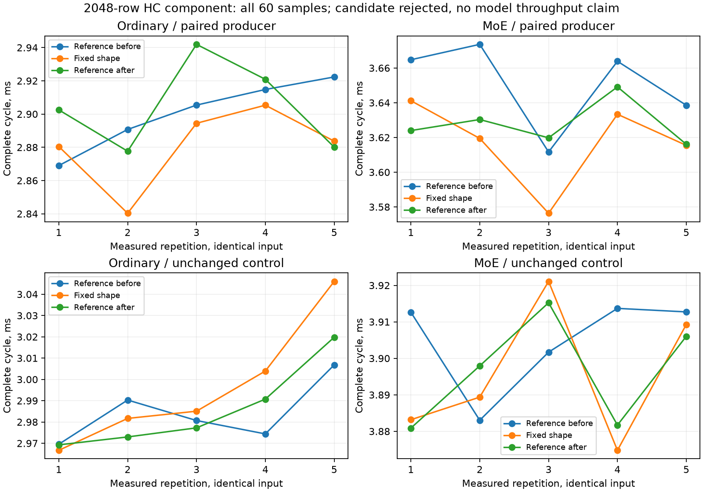

<!-- SPDX-License-Identifier: MIT -->
# Constant integer geometry in the paired HC norm

The fixed performance reference remains **1443.672867 Q2 / 1685.777092 UD**
on the exact-2048 counting input. This experiment starts from that exact
mixed-map Q2 provider. It changes integer indexing inside two paired norm
producers that already run on the fixed input; it does not extend dispatch
to a different prompt size or change the model comparison.

Both public launchers already reject hidden widths other than 2560 and stream
counts other than four. The GPU bodies nevertheless receive a variable hidden
width and repeat divisions, bounds checks and index selection over ten chunks.
The candidate makes that integer width constant inside those two bodies.
The original runtime floating-point normalization divisor remains separate,
preserving its arithmetic expression. Expert FMAs, square sums, reduction tree,
F32 rounding anchors and F16 output conversion remain in source order.

Only `kernels.hip.cpp` changes; 1021 other provider files remain exact. No
buffer, allocator, public signature, executor, library algorithm, expert map,
accepted decode path, PLE policy or C17 contract changes. Official source pin
and licenses remain those of the independently fetched Gufo baseline.
This differs from the rejected HC160 projection specialization and deferred
F32 norm experiments; neither is being repeated or relabeled.

| Static compiler observation | Reference | Candidate |
|---|---:|---:|
| Ordinary paired norm instructions | 1634 | 1028 |
| MoE paired norm instructions | 1716 | 1077 |
| Ordinary VGPR | 84 | 95 |
| MoE VGPR | 84 | 100 |

Both kernels retain zero private scratch and their original LDS sizes.
All 150 unrelated kernel bodies remain exact after local label normalization.
These are device-only compiler observations, not dynamic instruction counts,
GPU performance or numerical evidence. Higher register use may offset fewer
instructions; exact runtime replay remains required.

The [source manifest](../config/q2-norm-fixed-shape-source.json),
[patch](../experiments/q2-norm-fixed-shape.patch),
[generator](../tools/prepare-q2-norm-fixed-shape.py) and
[static receipt](../config/q2-norm-fixed-shape-static.json) retain provenance.

The existing `q2_hc_library_norm` fixture and library algorithm7526 are reused
unchanged. Three sequential arms compare the original paired producer,
candidate and original again. Each retains its unchanged unpaired producer
control. Ordinary and MoE complete cycles include the consuming projection,
2048 tokens, 100MiB rotating original-layout F16 weights, five alternating
samples of sixteen iterations, and allocation-role reversal. Original full
output comparisons and independent limits remain; inherited down failures
and actual exit1 are not suppressed. No model is loaded in this window.

The [frozen plan](../config/q2-norm-fixed-plan.json) requires exact outputs,
no new independent failures, at least1% complete-cycle improvement for both
paths against both controls, and at most2% drift of the unchanged path. Only
a passing component selects the same fixed model point. A full curve remains
deferred until fixed-point parity with UD.

The new component-only launcher scopes pass22/22 Debug and22/22 ASan/UBSan
on `.157`, with six zero command exits and seven verified artifacts.
A local audit initially expected an older CTest summary string and failed;
the corrected audit checks the actual summary and all22 Passed records,
without rerunning the successful remote tests. The failure is retained.
[Host qualification](../config/q2-norm-fixed-host-results.json).

## Completed component: candidate rejected

All three planned component arms finish on `.157`; all120 artifacts verify.
Every arm records actual exits0/0/1. The fixture and model reference remain
unchanged. The component gate admits no full-model run or context curve.

The owner subsequently explicitly requests the unchanged candidate on the full
model despite this component rejection. That separate
[exact2048 campaign](Q2-NORM-FIXED-MODEL.md) retains the rejection and original
thresholds. The candidate is preserved for targeted composition at the owner's
request; neither this gate nor the historical component result is rewritten.

| Complete paired cycle | Reference before, us | Candidate, us | Reference after, us | Candidate vs after |
|---|---:|---:|---:|---:|
| Ordinary | 2905.396 | 2883.692 | 2902.511 | -0.648% |
| MoE | 3663.864 | 3619.453 | 3623.965 | -0.125% |

These are medians of five identical-input component samples, with every raw
sample retained. The unchanged unpaired control spans only0.263% ordinary and
0.598% MoE across the three arms. Against the initial paired control, the
candidate appears0.747%/1.212% faster; the repeated control reduces those
differences to the values above. Both fail the frozen1% gate. The experiment
therefore fails the performance gate independently of numerical acceptance.
The approximately37% static instruction reduction is not a useful measured
complete-cycle speedup under this gate.

Both original controls retain80/80 complete exact output pairs. The candidate
retains34/80: all residuals remain exact, but16 F32 norm,15 F16 norm and15 down
buffers differ. The scalar half check also differs in15 cases. All10 independent
norm checks per arm pass the original2e-5 limits; candidate maximum norm
relative RMS is7.035e-8. All20 independent down cases per arm retain failures,
with the same maximum relative RMS3.33425e-5 and peak-scaled error4.16361e-5.
Passing sampled norm checks does not restore byte identity or qualify model
quality. No threshold is changed and no model harm/quality score is inferred.

The strict candidate audit initially exits1 at the first differing norm
buffer. That failure is retained. The reporting path now records rejected
buffers and timing together, while the selection gate still requires every
complete output to match. The patch remains isolated and is not promoted.

[Every sample CSV](figures/q2-norm-fixed-samples.csv),
[vector figure](figures/q2-norm-fixed.svg),
[full results](../config/q2-norm-fixed-results.json),
[audit tool](../tools/analyze-q2-norm-fixed.py).

Peak CPU readings are64.625/69.000/70.375C and GPU50/41/43C. No thermal stop
occurs. Release at15:58:30.649805UTC verifies368 retired identities/280groups,
empty KFD, four original lease inodes free and six unchanged model stat tuples.
Local/remote release, active and ready receipts plus the registry mark closure;
core is notified. No Q2 job, reservation, waiter, restart or .157 cleanup remains.
[Release receipt](../config/q2-norm-fixed-window-release.json), SHA256
`9eb49b9a17da57ec2d5681debfb925c2bc9efad80ed84519c56bb3a3e1733a5b`.

**The fixed1443.672867 Q2 /1685.777092 UD result is unchanged.** This component
does not supply a new model throughput value or progress toward its parity.
