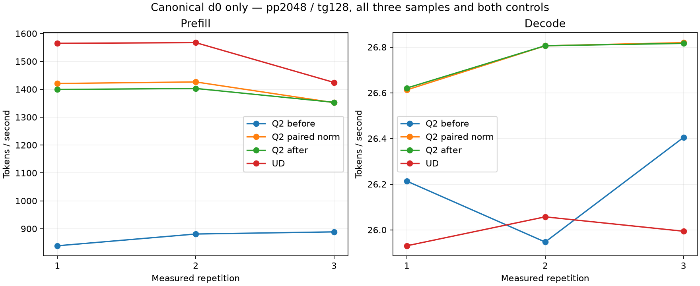

<!-- SPDX-License-Identifier: MIT -->
# One canonical model point for the paired HC norm

**Reporting correction — 2026-10-04:** this is a separate prose-input
diagnostic, not an update to the owner-confirmed **1443.672867 Q2 /
1685.777092 UD** exact-2048 reference. The latest candidate has not been
measured on that frozen comparison. Presenting 1399.289 to 1420.724 as the
new overall baseline/progress was incorrect. The three prose inputs differ
in text, physical count and, for 2053 tokens, number of prefill calls; their
median is not three repeated measurements of one input. Preserve the raw
observations, but treat the small paired differences as exploratory evidence.
[Fixed reference and comparison rules](Q2-VALIDATION.md#comparators-and-preparation).

The patch broadens eligibility below 2048 rows; the aligned 2048-row producer
was already active. That dispatch change therefore does not supply a mechanism
for improving the fixed exact-2048 input. Its ragged-input observations cannot
be added to the historical 1443.672867 result.

The [ragged component](Q2-NORM-RAGGED.md) selects a focused model comparison,
not another full context curve. The candidate only extends paired F32/F16
norm production to the already supported HC library row interval. Ordered
IQ2 decode, all arithmetic kernels and original PLE remain unchanged.

The frozen native C `synapse-lie-bench` now receives `--depths 0` and three
measured repetitions after one warmup. The existing prose generator changes
the text by repetition, exactly as the native benchmark already implements;
each Q2 arm must preserve the complete corresponding request/reply/count
history. Repetition zero is the original canonical depth-zero workload.
There is no counting-prompt substitution or deep-prefix construction.

All other settings remain: pp2048/tg128, AR greedy, thinking/MTP/vision/SSD
off, capacity133760, chunk2048, C1, HTTP port8000, RAM prefix budget16GiB,
and completed-executor-call PP/TG timers. Client wall/TTFT and cache work
remain separate. The source-pinned C client and 333-file server are unchanged;
the existing native-client Debug/ASan conformance is reused after inventory
verification. Three different prompts do not establish repeatability of a
fixed workload or resolve the earlier large control variation.

[Frozen four-arm plan](../config/q2-norm-point-plan.json): unchanged ordered
Q2, paired-norm Q2, unchanged ordered Q2 again, then pristine UD. Retain all
samples and both controls. A useful change must preserve request/output/count
history and improve against both controls; initial warming is not a patch
gain. A focused win still does not establish full-curve parity or independent
quality. The component's shared numerical failures remain open.

The candidate model mode requires `--native-curve --point-only --rebuild-mmq`;
it cannot silently launch a full sweep or use the older Python request driver.
Build identity and complete provider inventory are checked. The host wrapper
checks on `.157` pass 22/22 Debug and 22/22 ASan/UBSan, with six zero command
exits and seven verified artifacts. [Host receipt](../config/q2-norm-point-host-results.json).
GPU admission and actual model results remain separate from preparation.

## Completed model comparison — 2026-10-04

All four arms complete three measured samples each, 24 total requests, 32
zero command exits and 68 verified artifacts. Every Q2 calibration, warmup
and measured request/reply/count history matches both unchanged controls.
Repetition zero also reproduces the original native canonical d0 history in
all four arms, including UD. No model, client or server binary changes during
an arm. The original model stat identities remain unchanged.

Against the repeated Q2 control, the observed prefill difference is **+1.532%**
at 2040 physical tokens and **1.664%** at 2032. Each uses one prefill call.
The 2053-token sample uses two calls: the frozen worker's chunk policy implies
2048+5, whose producer eligibility is unchanged. Its prefill varies **-0.088%**.
This is consistent with the intended dispatch mechanism; the component and
source audit, not this uninstrumented model run alone, identify the kernel.

All measured prefill observations, in token/s, are retained below. Columns
represent different prompts, not identical-input repetitions:

| Arm | 2040 tokens, one call | 2032 tokens, one call | 2053 tokens, two calls |
|---|---:|---:|---:|
| Ordered Q2 before | 838.716 | 880.932 | 888.609 |
| Paired norm Q2 | 1420.724 | 1426.309 | 1351.998 |
| Ordered Q2 after | 1399.289 | 1402.963 | 1353.187 |
| Pristine UD | 1564.867 | 1567.283 | 1424.439 |

Descriptive medians across those different prompts, retained for audit only:

| Arm | Prefill tok/s | Decode tok/s | HTTP TTFT, s | Request wall, s |
|---|---:|---:|---:|---:|
| Ordered Q2 before | 880.932 | 26.213 | 2.40839 | 7.32340 |
| Paired norm Q2 | 1420.724 | 26.806 | 1.53552 | 6.32943 |
| Ordered Q2 after | 1399.289 | 26.806 | 1.55608 | 6.34922 |
| Pristine UD | 1564.867 | 25.994 | 1.60486 | 6.60176 |

The candidate's median prefill difference versus the repeated control is **+1.532%**;
median decode changes **-0.001%**, with individual changes -0.0305%, -0.0010%
and +0.0125%. These are exploratory observations from one sequential campaign,
not a demonstrated improvement of the fixed reference, a zero-margin
statistical certificate or production promotion. Within this diagnostic only,
the candidate median is **9.211% below UD prefill**;
decode is 3.123% above this UD median due to the already retained IQ2 decode
path. The new norm patch is not a decode optimization.

The first unchanged Q2 control is much slower. Its apparent 61.275% gap to
the candidate is not the patch gain: the unchanged repeat also reaches about
1400 tok/s. Linux Cached before the four arms is 3.890/14.038/14.394/14.742 GiB,
a machine-wide file-cache observation rather than a KV size or causal proof.
Every measured sample has zero reused prefix tokens. No system cache is
flushed, no model file modified and no new PLE policy introduced.

[SVG](figures/q2-norm-point/point.svg),
[all twelve samples with PP/TG, counts, cache times and latency](figures/q2-norm-point/samples.csv),
[audited raw comparison](../config/q2-norm-point-results.json),
[medians, per-sample deltas and attribution](../config/q2-norm-point-comparison.json).
Cache capture/restore remains outside the PP/TG executor timers; client TTFT
and wall time include additional serving work. Three prompts within a process
are not independent process repeats. Independent model quality and the entire
Q2/UD context-curve acceptance remain open. **No full curve follows this run.**

Peak CPU temperatures are 80.625/85.125/83/80.125 C; GPU peaks are 80/75/84/81 C.
No thermal or process-lifetime stop occurs. Fresh release at 15:11:53 UTC
verifies 349 identities and 265 groups retired, KFD empty, four original lease
inodes free and six unchanged model stat tuples. Main/remote active/release/
ready records and registry retain closure; core acknowledges receipt.
No Q2 GPU job, reservation, waiter, restart or remote cleanup remains.
[Release](../config/q2-norm-point-window-release.json), SHA256
`46467517d11ba4819f98ba7d8560a0ef99676924bcfc0b8d1b7e74beedbdf300`.
