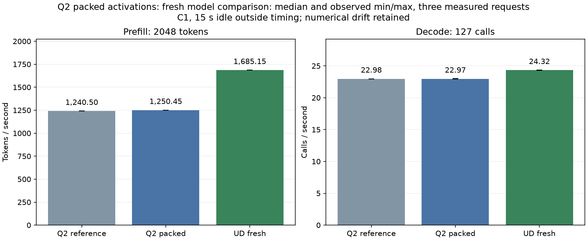

<!-- SPDX-License-Identifier: MIT -->
# IQ2 → Q2 compensated activation layout

This candidate moves an existing activation conversion to its producer. It is
GPU-tested and measured against a fresh baseline: prefill improves **0.80%**,
from 1240.50 to 1250.45 tok/s at 2K, with decode unchanged near 22.97 calls/s.
All saved model logits and tokens are byte-exact against the baseline.
Parity with UD remains unmet. The candidate is isolated from the qualified
Q2 runtime patch.

## Mechanism and numerical contract

The compensated Q2 down kernel currently reads an F32 activation and produces
two F16 operands: a rounded high value and a residual scaled by 4096. Each
output-row block repeats this conversion. At 2560 output rows and 128 rows/block,
the same routed activation is processed by 20 blocks.

The experimental IQ2 SwiGLU epilogue instead writes the high/residual pair
directly into its existing four-byte slot. Bits 0–15 hold `RN_F16(value)`;
bits 16–31 hold `RN_F16((value - F32(high)) * 4096)`. Q2 down loads two contiguous
16-byte vectors for eight slots and extracts the halves into its existing LDS
planes. It keeps the original WMMA accumulations and final residual addition.
This removes repeated conversions; it does not reduce activation buffer bytes.

Only the paired IQ2/Q2 branch interprets `gate_e` as packed words. Its producer
finishes on the same stream before the consumer reads it, and the consumer
writes the existing F32 `down_e` result for the unchanged expert epilogue.
There is no extra allocation, launch, weight transformation or concurrency
policy change. Unpacked entry points remain available for direct experimental
replay. They are not a second user-selected serving mode.

Moving arithmetic under fast-math can change contraction, so equality is a
test requirement, not an assumption. The checks reuse the existing 12
independent Q2 and 18 independent IQ2 cases, then compare every packed word
against independent packing of the original F32 result. Q2 outputs must match
bit for bit on all 12 direct cases and two full IQ2→Q2 chains at width 640.
Direct/chain consumers receive exact-sized input allocations. Prefix/suffix
guards, finite/written outputs and retained full buffers accompany these checks.
The original independent FP64 tests retain their existing 0.002 limits.

The full model must reproduce saved logits and tokens from the paired-IQ2
checkpoint exactly for this proposed arithmetic-preserving move. That does
not resolve the checkpoint's earlier drift from qualified Q2. Any new failure
will be retained; no tolerance or expected value is replaced.

## Static observations

The source and fixture/executor syntax checks pass. Official formatting passes
across 486 files; all 1019 files reconstruct exactly after applying
`experiments/q2-packed-activations.patch` to the paired-IQ2 source.
The [source receipt](../config/q2-packed-source.json) retains identities and
the initial device syntax/missing-include failures followed by corrected checks.

The gfx1151 assembly has no private segment for any of the 14 relevant packed
and reference templates. IQ2 VGPR/SGPR/LDS counts are unchanged. Q2 VGPR and LDS
counts are also unchanged; SGPR counts fall 26→24, 32→30 and 32→31 for tile widths
16/48/64. These are compiler metadata, not measured occupancy or throughput.
See [the static resource record](../config/q2-packed-static.json).

## Current baseline profile and operator evidence

After Point returned the copy window, the retained IQ2 checkpoint was rebuilt
and profiled at marked pp2048/tg16. All 14 baseline replay checks are exact.
The trace has 15 decode calls and excludes model loading and warmup. These are
summed kernel times, not unprofiled request throughput. UD is the historical
profile; [the machine-readable report](../config/q2-iq2-current-profile.json)
retains every group and trace hash.

| Prefill kernel group | Current Q2, ms | Historical UD, ms |
|---|---:|---:|
| Routed down | 311.965 | 179.954 |
| Routed gate/up | 264.890 | 241.965 |
| HC down | 131.793 | 41.909 |
| HC up | 87.345 | 56.129 |
| Explicit activation packing | 84.847 | 6.869 |
| All remaining kernels | 808.424 | 719.525 |
| Total | 1689.264 | 1246.350 |

Packed activations target work inside routed down. The separate narrowing
kernels and HC projections are not removed by this experiment. In the current
Q2 trace, F32 HC combine costs 120.930 ms, HC mix epilogue 98.278 ms and half
narrowing 74.496 ms. The executor's F32 HC branch emits no cached half copy of
`mixed`, unlike the existing Q8 wide route. Fusing that already-required
conversion is a concrete follow-up hypothesis, not a measured speedup. Merely
switching Q2 HC to the UD branch would change its arithmetic contract.

At decode, the current Q2 kernel sum is 604.331 ms versus historical UD
549.378 ms. Q2 F16 HC down alone costs 69.759 ms versus 25.206 ms for UD's Q8
HC down. The packed producer/consumer changes only the wide prefill branch;
no decode gain is assumed.

`q2-packed-operators-r1` completes with all three command exits zero.
All 12 independent down and 18 independent IQ2 cases pass the unchanged 0.002
limits. The 18 packed-word checks, 12 exact down-output checks and two exact
IQ2→Q2 chains pass. All 30 original operator buffers match their retained
pre-experiment references byte for byte. The 66 artifacts are collected and
hash verified in [the operator report](../config/q2-packed-operators.json).
This is GPU operator evidence, separate from full-model qualification.

## Model measurement protocol

The [protocol](../config/q2-packed-protocol.json) uses current unprofiled C1
pp2048/tg128 baseline and candidate arms: one warmup plus three measured fresh
sessions, 15-second idle outside PP/TG timing, MTP disabled, 2048-token prefill
chunk, 9216-token session capacity. Output contains 128 emitted tokens and
127 timed decode calls. Each source is fully rebuilt, including MMQ.

```sh
python3 tools/q2-remote.py q2-profile q2-iq2-current-profile-r1 --source-variant iq2-pair
python3 tools/q2-remote.py packed-operators q2-packed-operators-r1 --source-variant packed
python3 tools/q2-remote.py q2-bench2k q2-packed-reference-r1 --source-variant iq2-pair --rebuild-mmq
python3 tools/q2-remote.py q2-bench2k q2-packed-model-r1 --source-variant packed --rebuild-mmq
python3 tools/q2-remote.py ud-bench2k q2-packed-ud-r1 --rebuild-mmq
python3 tools/q2-remote.py q2-profile q2-packed-profile-r1 --source-variant packed
```

Labels are immutable; use new labels for any rerun. Every GPU/build arm acquires
four fresh nonblocking leases under the coordinated Q2 window and uses the
owner-approved 98 C inclusive guard, retaining lower exposed hardware thresholds.
No model conversion, device tuning or foreign process termination is used.

Debug and ASan/UBSan host fixtures previously passed 9/9 each on `.157`, recorded
in [the host receipt](../config/q2-packed-host.json). PP/TG parity remains unmet;
broader context/concurrency coverage is still required.

## Exact model replay

Both Q2 arms complete all four commands successfully. All 21 saved files
(12 complete logit buffers and nine token files) match candidate versus fresh
reference exactly. The fresh reference also reproduces all 21 retained IQ2
checkpoint files exactly. The [replay report](../config/q2-packed-replay.json)
includes these 42 checks and the 30 retained synthetic-buffer comparisons.
Each model arm reproduces its own warmup logits/output on all nine checks.

This isolates the arithmetic-preserving packing move. It does not remove the
paired-IQ2 checkpoint's previous differences from qualified Q2: maximum saved
KL remains 0.00274255, above the historical diagnostic limit of 0.002. Greedy
tokens match. The saved probability audit rules out a pure constant-offset
explanation, but these differences alone do not establish a task-quality loss.
All performance measurements proceed under the owner's explicit authorization;
no tolerance is relaxed or failure relabeled as a false positive.

## Fresh complete-model performance

All three arms were rebuilt and run sequentially on `.157` in the same Q2
window. UD uses independently fetched unmodified official Gufo at the recorded
pin and the original UD model. All 21 UD saved buffers also replay the retained
UD control exactly. No historical throughput is substituted in this table.

| Arm | PP tok/s median | PP seconds median | TG calls/s median | TG seconds median |
|---|---:|---:|---:|---:|
| Q2 paired-IQ2 reference | 1240.504954 | 1.650941 | 22.975480 | 5.527632 |
| Q2 packed activations | 1250.450924 | 1.637809 | 22.969486 | 5.529075 |
| UD fresh | 1685.149895 | 1.215322 | 24.322920 | 5.221413 |

Packed prefill improves 0.802% over the fresh Q2 reference; all three candidate
samples exceed the reference's observed range. Median prefill time falls
13.131 ms. Decode changes -0.026%, with overlapping observed ranges: no decode
gain is established. Three sequential requests are a focused screen, not a
statistical or sustained-serving qualification. The candidate still trails
fresh UD **25.796% in PP and 5.564% in TG**. The no-regression goal is not met.

| Arm | Repetition | PP tok/s | PP seconds | TG calls/s | TG seconds |
|---|---:|---:|---:|---:|---:|
| Q2 reference | 1 | 1243.235421 | 1.647315 | 22.942069 | 5.535682 |
| Q2 reference | 2 | 1240.504954 | 1.650941 | 22.975939 | 5.527522 |
| Q2 reference | 3 | 1240.388448 | 1.651096 | 22.975480 | 5.527632 |
| Q2 packed | 1 | 1251.281116 | 1.636723 | 22.969486 | 5.529075 |
| Q2 packed | 2 | 1250.450924 | 1.637809 | 22.959037 | 5.531591 |
| Q2 packed | 3 | 1248.952391 | 1.639774 | 22.987938 | 5.524636 |
| UD fresh | 1 | 1687.181677 | 1.213859 | 24.345545 | 5.216560 |
| UD fresh | 2 | 1684.846093 | 1.215541 | 24.307612 | 5.224701 |
| UD fresh | 3 | 1685.149895 | 1.215322 | 24.322920 | 5.221413 |

The [JSON report](../config/q2-packed-results.json) preserves full precision,
per-arm temperatures, command exits, model identities and the unchanged earlier
qualified-Q2 numerical drift. The [CSV](figures/q2-packed.csv) exports all three
samples, rates and durations. The [SVG](figures/q2-packed.svg) and
[PNG](figures/q2-packed.png) plot rate medians and observed min/max. Warmup is
excluded from these statistics.



## Candidate profile and disposition

The separate candidate profile replays its model baseline on all 14 checks;
all 15 saved profile buffers also match the current reference trace exactly.
Its prefill Q2 down sum falls **311.965→286.173 ms (-8.27%)**, while IQ2 gate/up
is essentially unchanged at 264.890→265.508 ms. Kernel counts and persistent
buffer sizes are unchanged. Total profiled prefill kernel time falls
1689.264→1663.496 ms. This supports the intended conversion-removal mechanism,
but profiled durations must not be substituted for the measured 13.131 ms
unprofiled median request saving.

The unchanged decode path has differing trace timings, including its IQ2
GEMV group. That trace variation is not credited to the prefill-only change:
the unprofiled decode samples show no gain. Full group timings and exact replay
are retained in [the profile delta](../config/q2-packed-profile-delta.json).

**Retain as an isolated experimental improvement; do not promote the runtime.**
The next measured hypotheses should target the remaining HC projections,
F32 combine/mix passes and redundant narrowing, with separate PP and TG gates.
No further GPU experiment is queued. Long-context, concurrency and diverse
unsaturated quality coverage remain unqualified by these 2K measurements.

The [campaign manifest](../config/q2-packed-campaign.json) records six completed
arms, 29 successful commands and 196 collected/hash-verified artifacts.
All six runners and 29 command identities/process groups/sessions are verified
retired; KFD is empty and all four expected leases are freshly acquired EX|NB
and released at 10:29:49 UTC. No Q2 waiter or background work remains.
An early local replay analysis read before collection completed; that failure
is retained in `evidence/q2-packed-analysis-early-read.json`, with the actual
shell exit and uncaptured per-process exit explicitly distinguished. The
subsequent complete replay analysis exits zero; no GPU run was retried or hidden.
