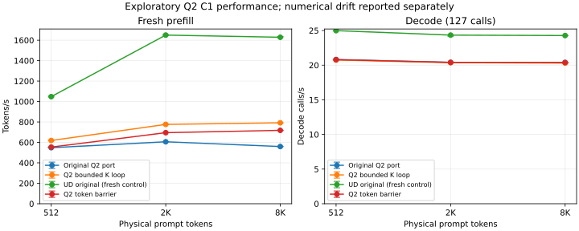

<!-- SPDX-License-Identifier: MIT -->
# Q2 scheduling performance exploration

The owner explicitly authorized measuring performance before resolving the
small numerical differences found by the previous exact replay checks.
The earlier failures and their original protocol remain unchanged. This new
campaign treats speed and numerical behavior as separate observations; it does
not promote either candidate into the qualified runtime.

## Measured results

Four arms completed on `.157`: all 16 commands and all 4 transports exit 0; 208
artifacts collected and SHA256 verified. Each row has one warmup followed by
three measured fresh sessions, 128 emitted tokens and 127 timed decode calls.
Values below are min / median / max. Loading and profiling are excluded.

| Arm | Prompt | Prefill tok/s | Decode calls/s | Median PP seconds | Median TG seconds |
| --- | ---: | ---: | ---: | ---: | ---: |
| Q2 reference | 512 | 547.61 / 548.15 / 548.37 | 20.81 / 20.82 / 20.82 | 0.9340 | 6.1013 |
| Q2 reference | 2048 | 605.79 / 606.16 / 606.93 | 20.39 / 20.40 / 20.40 | 3.3786 | 6.2257 |
| Q2 reference | 8192 | 559.09 / 559.55 / 559.72 | 20.38 / 20.38 / 20.39 | 14.6402 | 6.2305 |
| Q2 bounded K | 512 | 618.02 / 618.72 / 623.95 | 20.72 / 20.74 / 20.74 | 0.8275 | 6.1244 |
| Q2 bounded K | 2048 | 775.60 / 776.24 / 778.45 | 20.35 / 20.36 / 20.37 | 2.6384 | 6.2374 |
| Q2 bounded K | 8192 | 789.78 / 791.88 / 792.98 | 20.25 / 20.30 / 20.31 | 10.3450 | 6.2565 |
| Q2 barrier | 512 | 553.53 / 554.15 / 554.17 | 20.77 / 20.79 / 20.82 | 0.9239 | 6.1082 |
| Q2 barrier | 2048 | 694.95 / 695.27 / 697.34 | 20.39 / 20.40 / 20.40 | 2.9456 | 6.2264 |
| Q2 barrier | 8192 | 717.40 / 718.09 / 718.71 | 20.38 / 20.38 / 20.39 | 11.4081 | 6.2322 |
| UD original | 512 | 1044.36 / 1047.70 / 1054.05 | 24.93 / 24.98 / 24.99 | 0.4887 | 5.0838 |
| UD original | 2048 | 1646.07 / 1650.06 / 1654.47 | 24.18 / 24.34 / 24.36 | 1.2412 | 5.2184 |
| UD original | 8192 | 1626.74 / 1628.67 / 1635.56 | 24.26 / 24.28 / 24.28 | 5.0299 | 5.2317 |



Full-precision rates and durations: [CSV](figures/q2-scheduling-exploration.csv).
Machine-readable results, identities, drift and retirement receipt:
`config/q2-performance-exploration-results.json`.

Bounded K improves median PP by 12.87/28.06/41.52% versus fresh Q2 at 512/2K/8K;
the barrier improves it by 1.09/14.70/28.33%. Bounded K median TG is 0.19–0.42%
lower; barrier TG is 0.01–0.11% lower. These small TG differences are observations,
not proven causal regressions in a sequential four-arm screen. Both candidates
remain slower than UD in every measured PP/TG profile. No zero-regression target
or final numerical acceptance is claimed.

## Numerical observations

| Variant | Exact input/output files | Exact logit frontiers | Maximum KL versus original Q2 | Maximum absolute logit delta | Maximum relative L2 |
| --- | --- | --- | ---: | ---: | ---: |
| Q2 bounded K | 19/19 | 0/28 | 0.00249421787555 | 3.02991796 | 0.276741897 |
| Q2 barrier | 19/19 | 4/28 | 0.00186669841501 | 3.19006872 | 0.248922797 |

All saved logits are finite. Token trajectories match the Q2 reference, so
frontiers here have the same conditioning. Both candidates reproduce all 27
within-arm logit/output comparisons exactly across repeated runs. The fresh
Q2 and UD controls each match 47 historical input/output/logit files exactly;
their median PP/TG timings remain within 0.3% of their historical values.

The barrier maximum KL of 0.001866698415 is below the earlier WMMA experiment's
0.002 diagnostic limit; bounded K reaches 0.002494217876 and exceeds it. This
comparison does not replace the exact replay protocol: both still fail that
criterion. Small synthetic-operator differences alone did not predict the
magnitude of model-frontier drift. No independent full-model teacher or broad
quality score is established by unchanged generated text in these short samples.

## Interpretation and limits

The speed evidence justifies continued optimization. Of these two candidates,
bounded K has the best prefill throughput; the barrier has the lower maximum
KL. Correcting numerical behavior and then remeasuring is still necessary.
The previous compensated WMMA experiment remains faster in PP but was rejected
with maximum KL 0.002809; that historical timing is not a fresh fifth arm here.
Dense F16 HC projection remains a separate decode bottleneck from the retained
phase profile. This campaign measures direct executor C1, not HTTP throughput,
reactive concurrency or 128K/256K inference.

Observed sensor temperature maxima during the model processes (including
loading/warmup) were 92/95/97/98°C for reference/bounded/barrier/UD, sampled every
2 seconds at `card1/device/hwmon/hwmon2/temp1_input`. The arms are sequential and
not interleaved; rising observed temperatures limit attribution of small timing
differences. No hardware thermal limit or throttling diagnosis is inferred.
The gains do not establish a formal zero-margin confidence bound.

The original runtime patch remains SHA256
`3029cd490bc75d045e9dcf696ac6c1b23092684ad25641c93d500cb9f2727473`.
The experimental source trees are retained separately; neither candidate is
promoted, deployed or merged. GPU work finished at 06:13:54.007 UTC. Fresh closure
at 06:14:39.647 UTC verifies four runners and 16 command PID/start identities/groups
retired, KFD empty and all four expected leases acquired EX|NB and released.
Core received explicit handover; no Q2 job or retry remains.

## Method and reproduction

Two isolated source trees reproduce all 1019 files of the previously tested
operator capsules exactly: bounded K unrolling and the token-tile barrier for
widths 32 and above. `--source-variant bounded-k|wide-barrier` selects only those
experimental trees for `q2-bench`; the default source and runtime patch remain
qualified original Q2. The fixed remote runner, leases and process ownership
rules are unchanged.

`config/q2-performance-exploration.json` fixes the workload before execution:
C1, physical prompts 512/2048/8192, prefill chunk 2048, session capacity 9216,
MTP off, one warmup and three measured repetitions per size, 128 emitted tokens
with 127 timed decode calls. Sessions are fresh; loading is excluded. The
campaign includes fresh qualified-Q2 and pristine-UD controls on `.157`.

For every arm, retain command exits, telemetry, full final and prefill logits,
input/output token IDs and artifact hashes. Report exact replay, token agreement,
finite-logit KL/error and observed timing ranges separately. Numerical acceptance
is not inferred from speed. GPU/resource faults and incomparable workloads still
stop or invalidate an arm. No deployment, merge or publication is authorized.

Status: all four arms completed; GPU window released and results retained.

The candidate trees can be reproduced without fetching new source: prepare two
copies of the qualified Q2 patch from the recorded official archive, then apply
`experiments/q2-bounded-k.patch` to `.deps/gufo-q2-bench-bounded-k` and
`experiments/q2-wide-token-barrier.patch` to `.deps/gufo-q2-bench-wide-barrier`,
both with `patch --batch --fuzz=0 -p1`. Source identity checks against the earlier
operator capsules are recorded in the exploration configuration.

The four model arms use the existing fixed remote tool:

```sh
python3 tools/q2-remote.py q2-bench q2-explore-reference-r1
python3 tools/q2-remote.py q2-bench q2-explore-bounded-r1 --source-variant bounded-k
python3 tools/q2-remote.py q2-bench q2-explore-barrier-r1 --source-variant wide-barrier
python3 tools/q2-remote.py ud-base q2-explore-ud-r1
```

Labels are exclusive. These commands require a current coordinated window;
retained completed labels must not be reused. Collect and verify each arm's
results before deriving comparisons.
